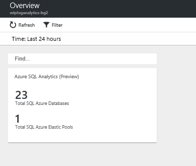
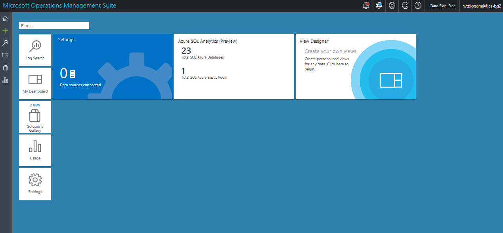

# Setup and use Log Analytics (OMS) with the WTP sample SaaS app

In this tutorial, you set up and use *Log Analytics([OMS](https://www.microsoft.com/cloud-platform/operations-management-suite))* with the WTP app for monitoring elastic pools and databases. It builds on the [Performance Monitoring and Management tutorial](sql-database-saas-tutorial-performance-monitoring.md), and shows how to use *Log Analytics* to augment the monitoring and alerting provided in the Azure portal. Log Analytics is particularly suitable for monitoring and alerting at scale because it supports hundreds of pools and hundreds of thousands of databases. It also provides a single monitoring solution, which can integrate monitoring of different applications and Azure services, across multiple Azure subscriptions.

In this tutorial you learn how to:

> [!div class="checklist"]
> * Install and configure Log Analytics (OMS)
> * Use Log Analytics to monitor pools and databases

To complete this tutorial, make sure the following prerequisites are completed:

* The WTP app is deployed. To deploy in less than five minutes, see [Deploy and explore the WTP SaaS application](sql-database-saas-tutorial.md)
* Azure PowerShell is installed. For details, see [Getting started with Azure PowerShell](https://docs.microsoft.com/powershell/azure/get-started-azureps)

See the [Performance Monitoring and Management tutorial](sql-database-saas-tutorial-performance-monitoring.md) for a discussion of the SaaS scenarios and patterns, and how they affect the requirements on a monitoring solution.

## Monitoring and managing performance with Log Analytics (OMS)

For SQL Database, monitoring and alerting is available on databases and pools. This built-in monitoring and alerting is resource-specific and convenient for small numbers of resources, but is less well suited to monitoring large installations or for providing a unified view across different resources and subscriptions.

For high-volume scenarios Log Analytics can be used. This is a separate Azure service that provides analytics over emitted diagnostic logs and telemetry gathered in a log analytics workspace, which can collect telemetry from many services and be used to query and set alerts. Log Analytics provides a built-in query language and data visualization tools allowing operational data analytics and visualization. The SQL Analytics solution provides several pre-defined elastic pool and database monitoring and alerting views and queries, and lets you add your own ad-hoc queries and save these as needed. OMS also provides a custom view designer.

Log Analytics workspaces and analytics solutions can be opened both in the Azure portal and in OMS. The Azure portal is the newer access point but may be behind the OMS portal in some areas.

### Start the load generator to create data to analyze

1. Open **Demo-PerformanceMonitoringAndManagement.ps1** in the **PowerShell ISE**. Keep this script open as you may want to run several of the load generation scenarios during this tutorial.
1. If you have less than five tenants, provision a batch of tenants to provide a more interesting monitoring context:
   1. Set **$DemoScenario = 1,** **Provision a batch of tenants**
   1. Press **F5** to run the script.

1. Set **$DemoScenario** = 2, **Generate normal intensity load (approx 40 DTU)**.
1. Press **F5** to run the script.

## Get the Wingtip application scripts

The Wingtip Tickets scripts and application source code are available in the [WingtipSaaS](https://github.com/Microsoft/WingtipSaaS) github repo. Script files are located in the [Learning Modules folder](https://github.com/Microsoft/WingtipSaaS/tree/master/Learning%20Modules). Download the **Learning Modules** folder to your local computer, maintaining its folder structure.

## Installing and configuring Log Analytics and the Azure SQL Analytics solution

Log Analytics is a separate service that needs to be configured. Log Analytics collects log data and telemetry and metrics in a log analytics workspace. A workspace is a resource, just like other resources in Azure, and must be created. While the workspace doesn’t need to be created in the same resource group as the application(s) it is monitoring, this often makes the most sense. In the case of the WTP app, this enables the workspace to be easily deleted with the application by simply deleting the resource group.

1. Open ...\\Learning Modules\\Performance Monitoring and Management\\Log Analytics\\*Demo-LogAnalytics.ps1* in the **PowerShell ISE**.
1. Press **F5** to run the script.

At this point you should be able open Log Analytics in the Azure portal (or the OMS portal). It will take a few minutes for telemetry to be collected in the Log Analytics workspace and to become visible. The longer you leave the system gathering data the more interesting the experience will be. Now's a good time to grab a beverage - just make sure the load generator is still running!

## Use Log Analytics and the SQL Analytics solution to monitor pools and databases

In this exercise, open Log Analytics and the OMS portal to look at the telemetry being gathered for the WTP databases and pools.

1. Browse to the [Azure portal](https://portal.azure.com) and open Log Analytics by clicking More services, then search for Log Analytics:

   

1. Select the workspace named *wtploganalytics-&lt;USER&gt;*.

1. Select **Overview** to open the Log Analytics solution in the Azure portal.
   

    **IMPORTANT**: It may take a couple of minutes before the solution is active. Be patient!

1. Click on the Azure SQL Analytics tile to open it.

    

    

1. The view in the solution blade scrolls sideways, with its own scroll bar at the bottom (refresh the blade if needed).

1. Explore the various views by clicking on them or on individual resources to open a drill-down explorer, where you can use the time-slider in the top left or click on a vertical bar to focus in on a narrower time slice. With this view, you can select individual databases or pools to focus on specific resources:

    

1. Back on the solution blade, if you scroll to the far right you will see some saved queries that you can click on to open and explore. You can experiment with modifying these, and save any interesting queries you produce, which you can then re-open and use with other resources.

1. Back on the Log Analytics workspace blade, select OMS Portal to open the solution there.

    

1. In the OMS portal, you can configure alerts. Click on the alert portion of the database DTU view.

1. In the Log Search view that appears you will see a bar graph of the metrics being represented.

    

1. If you click on Alert in the toolbar you will be able to see the alert configuration and can change it.

    

The monitoring and alerting in Log Analytics and OMS is based on queries over the data in the workspace, unlike the alerting on each resource blade, which is resource-specific. Thus, you can define an alert that looks over all databases, say, rather than defining one per database. Or write an alert that uses a composite query over multiple resource types. Queries are only limited by the data available in the workspace.

Log Analytics for SQL Database is charged for based on the data volume in the workspace. In this tutorial, you created a Free workspace, which is limited to 500MB per day. Once that limit is reached data is no longer added to the workspace.

## Next steps

In this tutorial you learned how to:

> [!div class="checklist"]
> * Install and configure Log Analytics (OMS)
> * Use Log Analytics to monitor pools and databases

[Tenant analytics tutorial](sql-database-saas-tutorial-tenant-analytics.md)

## Additional resources

* [Additional tutorials that build upon the initial Wingtip Tickets Platform (WTP) application deployment](sql-database-wtp-overview.md#sql-database-wingtip-saas-tutorials)
* [Azure Log Analytics](../log-analytics/log-analytics-azure-sql.md)
* [OMS](https://blogs.technet.microsoft.com/msoms/2017/02/21/azure-sql-analytics-solution-public-preview/)
