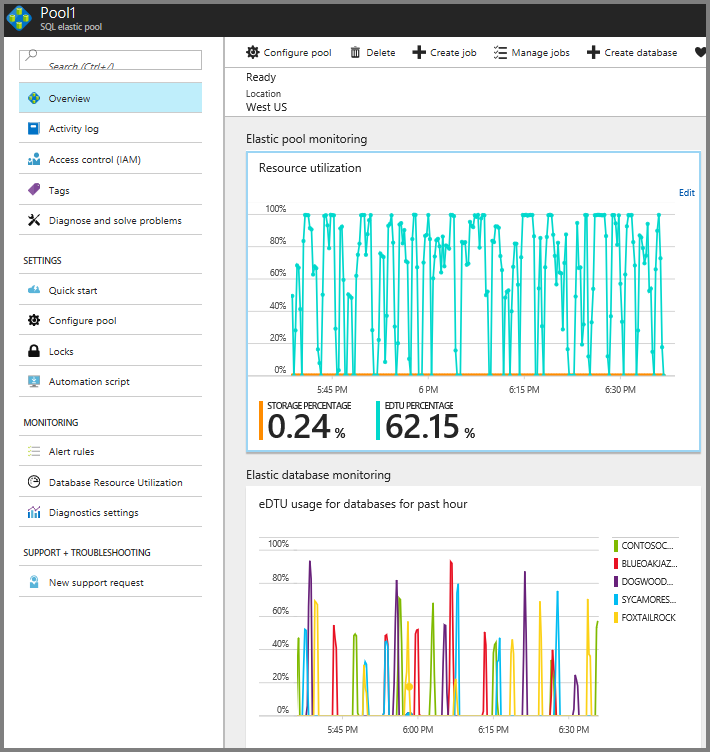
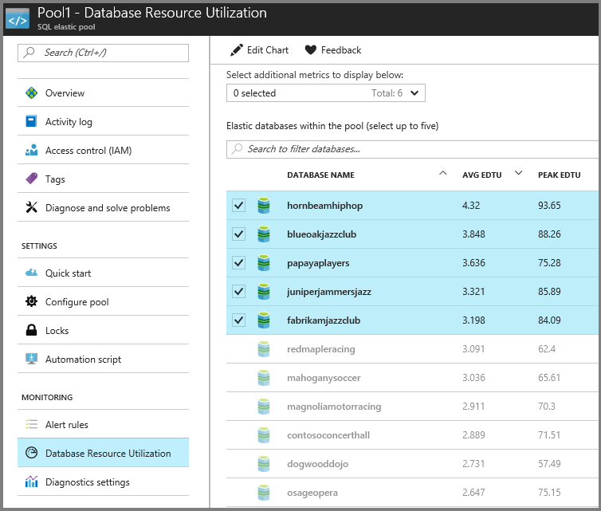

# Monitor performance of the Wingtip SaaS application

In this tutorial, built-in monitoring and alerting features of SQL Database and elastic pools are demonstrated, and then several key performance management scenarios used in SaaS applications are explored.

The Wingtip SaaS app uses a single-tenant data model, where each venue (tenant) has their own database. Like many SaaS applications, the anticipated tenant workload pattern is unpredictable and sporadic. In other words, ticket sales may occur at any time. To take advantage of this typical database usage pattern, tenant databases are deployed into elastic database pools. Elastic pools optimize the cost of a solution by sharing resources across many databases. With this type of pattern, it's important to monitor database and pool resource usage to ensure that loads are reasonably balanced across pools. You also need to ensure that individual databases have adequate resources, and that pools are not hitting their [eDTU](sql-database-what-is-a-dtu.md) limits. This tutorial explores ways to monitor and manage databases and pools, and how to take corrective action in response to variations in workload.

In this tutorial you learn how to:

> [!div class="checklist"]

> * Simulate usage on the tenant databases by running a provided load generator
> * Monitor the tenant databases as they respond to the increase in load
> * Scale up the Elastic pool in response to the increased database load
> * Provision a second Elastic pool to load balance database activity

To complete this tutorial, make sure the following prerequisites are completed:

* The Wingtip SaaS app is deployed. To deploy in less than five minutes, see [Deploy and explore the Wingtip SaaS application](sql-database-saas-tutorial.md)
* Azure PowerShell is installed. For details, see [Getting started with Azure PowerShell](https://docs.microsoft.com/powershell/azure/get-started-azureps)

## Introduction to SaaS performance management patterns

Managing database performance consists of compiling and analyzing performance data, and then reacting to this data by adjusting parameters to maintain an acceptable response time for your application. When hosting multiple tenants, Elastic database pools are a cost-effective way to provide and manage resources for a group of databases with unpredictable workloads. With certain workload patterns, as few as two S3 databases can benefit from being managed in a pool. Not only does a pool share the cost of resources, it can also eliminate the need to constantly monitor and track individual databases.

Pools, and the databases in pools, still need to be monitored to ensure they stay within acceptable ranges of performance. Tune the pool configuration to meet the needs of the aggregate workload, ensuring that the pool eDTUs are appropriate for the overall workload. Adjust the per-database min and per-database max eDTU values to appropriate values for your specific application requirements.

### Performance management strategies

* To avoid having to manually monitor performance, it’s most effective to **set alerts that fire if databases or pools stray out of normal ranges**.
* To respond to short-term fluctuations in the aggregate performance level of a pool, the **pool eDTU level can be scaled up or down**. If this fluctuation occurs on a regular or predictable basis, **scaling the pool can be scheduled to occur automatically**. For example, scale down when you know your workload is light, maybe overnight, or during weekends.
* To respond to longer-term fluctuations, or changes in the number of databases, **individual databases can be moved into other pools**.
* To respond to short term increases in *individual* database load **individual databases can be taken out of a pool and assigned an individual performance level** for a period. Once the load is reduced, the database can then be returned to the pool. Where this is known in advance, databases can be moved pre-emptively to ensure the database always has the resources it needs, and to avoid impact on other databases in the pool. If this requirement is predictable, such as a venue experiencing a rush of ticket sales for a popular event, then this management behavior can be integrated into the application.

The [Azure portal](https://portal.azure.com) provides built-in monitoring and alerting on most resources. For SQL Database, monitoring and alerting is available on databases and pools. This built-in monitoring and alerting is resource-specific so it's convenient to use for small numbers of resources, but is not very convenient when working with many resources.

For high-volume scenarios, Log Analytics (also known as OMS) can be used. This is a separate Azure service that provides analytics over emitted diagnostic logs and telemetry gathered in a log analytics workspace, which can collect telemetry from many services and be used to query and set alerts.

## Get the Wingtip application scripts

The Wingtip SaaS scripts and application source code are available in the [WingtipSaaS](https://github.com/Microsoft/WingtipSaaS) github repo. [Steps to download the Wingtip SaaS scripts](sql-database-wtp-overview.md#download-the-wingtip-saas-scripts).

## Provision additional tenants

While pools can be cost-effective with just two S3 databases, the more databases that are in the pool the more cost-effective the averaging effect becomes. For a good understanding of how performance monitoring and management works at scale, this tutorial requires you have at least 20 databases deployed.

If you already provisioned a batch of tenants in a prior tutorial, you can skip to the [Simulate usage on all tenant databases](#simulate-usage-on-all-tenant-databases) section.

1. Open …\\Learning Modules\\Provision and Catalog\\*Demo-PerformanceMonitoringAndManagement.ps1* in the **PowerShell ISE**. Keep this script open as you'll run several scenarios during this tutorial.
1. Set **$DemoScenario** = **1**, **Provision a batch of tenants**
1. Press **F5** to run the script.

The script will deploy 17 tenants in less than five minutes.

The *New-TenantBatch* script uses a nested or linked set of [Resource Manager](../azure-resource-manager/index.md) templates that create a batch of tenants, which by default copies the database **baseTenantDb** on the catalog server to create the new tenant databases, then registers these in the catalog, and finally initializes them with the tenant name and venue type. This is consistent with the way the app provisions a new tenant. Any changes made to *baseTenantDB* are applied to any new tenants provisioned thereafter. See the [Schema Management tutorial](sql-database-saas-tutorial-schema-management.md) to see how to make schema changes to *existing* tenant databases (including the *golden* database).

## Simulate different usage patterns by generating different load types

The *Demo-PerformanceMonitoringAndManagement.ps1* script starts the load generator using one of the available *load types*:

| Demo | Scenario |
|:--|:--|
| 2 | Generate normal intensity load (approx. 40 DTU) |
| 3 | Generate load with longer and more frequent bursts per database|
| 4 | Generate load with higher DTU bursts per database (approx. 80 DTU)|
| 5 | Generate a normal load plus a high load on a single tenant (approx. 95 DTU)|
| 6 | Generate unbalanced load across multiple pools|

## Simulate usage on all tenant databases

The load generator applies a *synthetic* CPU-only load to every tenant database. The generator starts a job for each tenant database, which calls a stored procedure periodically that generates the load. The load levels (in eDTUs), duration, and intervals are varied across all databases, simulating unpredictable tenant activity.

1. Set **$DemoScenario** = **2**, *Generate a normal intensity load*.
1. Press **F5** to apply a load to all your tenant databases.

Because of the sporadic nature of the load, let the generator run for 10-20 minutes so the activity can achieve a steady state and settle into a nice pattern.

> [!IMPORTANT]
> The load generator is running as a series of jobs in your local PowerShell session. Keep the *Demo-PerformanceMonitoringAndManagement.ps1* tab open! If you close the tab, or suspend your machine, the load generator stops.

## Monitor resource usage using the portal

To monitor the resource usage that results from the load being applied, open the portal to the pool containing the tenant databases.

1. Open the [Azure portal](https://portal.azure.com) and browse to the tenants1-&lt;USER&gt; server.
1. You should see the list of tenant databases including the new batch of databases.
1. Scroll down and locate elastic pools and click **Pool1**. This pool contains all the tenant databases created so far.
1. Expand the pool blade that opens and observe the pool utilization chart and top database utilization chart.

The pool utilization is essentially the aggregate of the database utilization for all databases in the pool. The database utilization chart shows the hottest 5 databases:

Because there are other databases in the pool beyond the top 5, the pool utilization shows activity that is not reflected in the top five databases chart. To see some additional details, click **Database Resource Utilization**:

## Set performance alerts on the pool

Set an alert on the pool that triggers on \>75% utilization sustained for 5 minutes as follows:

1. Open *Pool1* (on the *tenants1-\<user\>* server) in the [Azure portal](https://portal.azure.com).
1. Click **Alert Rules**, and then click **+ Add alert**:

   

1. Provide a name, such as **High DTU**, 
1. Set the following values:
   * **Metric = eDTU percentage**
   * **Condition = greater than**.
   * **Threshold = 75**.
   * **Period = Over the last 30 minutes**.

   

You can have notifications sent to your Azure account email, and optionally other additional emails (recommend not to set this, unless you own the subscription being used).

> [!NOTE]
> As the alert only fires if the threshold is exceeded for the last 30 minutes, the load generator needs to be running for over 30 minutes to test the alert.

## Scale up a busy pool

If the aggregate load level increases on a pool to the point that it maxes out the pool and reaches 100% eDTU usage, then individual database performance is affected, potentially slowing query response times for all databases in the pool.

Short term, consider scaling up the pool to provide additional resources, or removing databases from the pool (moving them to other pools, or out of the pool to a stand-alone service tier).

Longer term, consider optimizing queries or index usage to improve database performance. Depending on the application's sensitivity to performance issues its best practice to scale a pool up before it reaches 100% eDTU usage. Use an alert to warn you in advance.

You can simulate a busy pool by increasing the load produced by the generator. Causing the databases to burst more frequently, and for longer, increases the aggregate load on the pool without changing the requirements of the individual databases. Scaling up the pool is easily done in the portal or from PowerShell. This exercise uses the portal.

1. Set *$DemoScenario* = **3**, _Generate load with longer and more frequent bursts per database_ to increase the intensity of the aggregate load on the pool without changing the peak load required by each database.
1. Press **F5** to apply a load to all your tenant databases.

1. **Open the pool blade** **for tenants1/Pool1**.

1. Monitor the increased pool DTU usage on the upper chart. It takes a few minutes for the new higher load to kick in, but you should quickly see the pool start to hit 100% utilization, and as the load steadies into the new pattern, it rapidly overloads the pool.

1. To scale up the pool, click **Configure pool**
1. Adjust the **Pool eDTU** slider to 100 (recommend you go no higher to limit costs). Note how the aggregate storage available for all databases in the pool, indicated by **Pool GB**, is linked to the eDTU setting and increases also. Changing the pool eDTU does not change the per-database settings (which is still 50 eDTU max per database). You can see the per-database settings on the right side of the **Configure pool** blade.
1. Click **Save** to submit the request. The change will typically take 3-5 minutes for a Standard pool.

Go back to the **Pool1** > **Overview** to view the monitoring charts. Monitor the effect of providing the pool with more resources (although with few databases and a randomized load it’s not always easy to see conclusively). While you are looking at the charts bear in mind that 100% on the upper chart now represents 100 eDTUs, while on the lower chart 100% is still 50 eDTUs as the per-database max is still 50 eDTUs.

Databases remain online and fully available throughout the process. At the last moment as each database is ready to be enabled with the new pool eDTU, any active connections are broken. Application code should always be written to retry dropped connections, and so will reconnect to the database in the scaled-up pool.

## Create a second pool and load-balance databases to handle increased aggregate load

As an alternative to scaling up the pool, create a second pool and move databases into it to balance the load between the two pools. To do this the new pool must be created on the same server as the first.

1. Open the **server blade for the customers1-&lt;USER&gt; server**. If you are on a database or pool blade, you can drop down the essentials control and select the server name as a shortcut.
1. Click **+ New pool** to create a pool on the current server
1. On the New Elastic database pool template:

    1. set **Name = Pool2**.
    1. Leave the pricing tier as **Standard Pool**.
    1. Click **Configure pool**,
    1. On the Configure Pool blade that opens, set **Pool eDTU = 50 DTU**.
    1. Click the **Add databases** command to see a list of databases on this server that are not in the current pool.
    1. On the list, **check** half of the databases (10 out of 20) to move these to the new pool, and then click **Select**.
    1. Click **Select** again to accept the configuration changes. Note the cost estimate for one month of usage with the selected options.
    1. Select **OK** to create the new pool with the new configuration and to move the databases.

Creating the pool and moving the databases into it takes a few minutes. Each of the databases being moved remains online and fully accessible until the last moment, at which point any open connections are closed. When a client retries the connection, it will connect to the database in the new pool.

Once the pool has been created it will appear on the customers1 server blade. Click on the pool name to open the pool blade and monitor its performance.

You should see that resource usage on Pool1 has dropped and that Pool2 is similarly loaded.

## Manage an increased load on a single database

If a single database in a pool experiences a sustained high load, depending on the pool configuration, it may tend to dominate the resources in the pool and impact other databases. If the activity is likely to continue for some time, the database can be moved out of the pool temporarily. This both allows the database to be given more resources than the others in the pool, and isolates it from the other databases. This exercise simulates the effect of Contoso Concert Hall experiencing a high load when tickets go on sale for a popular concert.

1. In the …\\**Demo-PerformanceManagementAndMonitoring**.ps1 script
1. Set **$DemoScenario = 5, Generate a normal load plus a high load on a single tenant (approx. 95 DTU).**
1. Set **$SingleTenantDatabaseName = contosoconcerthall**
1. Execute the script using **F5**.
1. **Open the pool blade** **for Customers1/Pool1**.
1. Look at the **Elastic pool monitoring** display at the top of the blade and look for the increased pool DTU usage. After a minute or two, the higher load should start to kick in, and you should quickly see that the pool hits 100% utilization.
1. Also monitor the **Elastic database monitoring** display which shows the hottest databases in the past hour. The contosoconcerthall database should soon appear as one of the 5 hottest databases.
1. **Click on the Elastic database monitoring** **chart** and it will open a **Database Resource Utilization** blade on which you can selectively monitor any of the databases. This lets you isolate the display for the contosoconcerthall database.
1. From the list of databases, **click on contosoconcerthall** and its database blade will open.
1. Click on **Pricing Tier (scale DTUs)** in the context menu to open the **Configure performance** blade on which you can set an isolated performance level for the database.
1. Click on the **Standard** tab to open the scale options in the Standard tier.
1. Slide the **DTU slider** to right to select 100 DTUs. Note this corresponds to the service objective, **S3,** shown in brackets between the DTU and Storage size meters.
1. Click **Apply** to move the database out of the pool and make it a Standard S3 database.
1. Once the deployment is complete, monitor the effect on the contosoconcert hall database and the pool it was removed from on the elastic pool and database blades.

Once the higher than normal load on the contosoconcerthall database subsides you should promptly return it to the pool to reduce its cost. If it’s unclear when that will happen you could set an alert on the database that will fire when its DTU usage drops below the per-database max on the pool. Moving a database into a pool is described in exercise 5.

## Other Performance Management Patterns

**Pre-emptive scaling**
In exercise 6 where you explored how to scale an isolated database you knew which database to look for. If the management of Contoso Concert Hall had informed Wingtips of the impending ticket sale, the database could have been moved out of the pool pre-emptively. Otherwise, it would likely have required an alert on the pool or the database to spot what was happening. You wouldn’t want to learn about this from the other tenants in the pool complaining of degraded performance. And if the tenant can predict how long they will need additional resources you can set up an Azure Automation runbook to move the database out of the pool and then back in again on a defined schedule.

**Tenant self-service scaling**
Because scaling is a task easily called via the management API, you can easily build the ability to scale tenant databases into your tenant-facing application, and offer it as a feature of your SaaS service. For example, let tenants self-administer scaling up and down, perhaps linked directly to their billing!

### Scaling a pool up and down on a schedule to match usage patterns

Where aggregate tenant usage follows predictable usage patterns, you can use Azure Automation to scale a pool up and down on a schedule. For example, scale a pool down after 6pm and up again before 6am on weekdays when you know there is a drop in resource requirements.

## Next steps

In this tutorial you learn how to:

> [!div class="checklist"]
> * Simulate usage on the tenant databases by running a provided load generator
> * Monitor the tenant databases as they respond to the increase in load
> * Scale up the Elastic pool in response to the increased database load
> * Provision a second Elastic pool to load balance the database activity

[Restore a single tenant tutorial](sql-database-saas-tutorial-restore-single-tenant.md)

## Additional resources

* Additional [tutorials that build upon the Wingtip SaaS application deployment](sql-database-wtp-overview.md#sql-database-wingtip-saas-tutorials)
* [SQL Elastic pools](sql-database-elastic-pool.md)
* [Azure automation](../automation/automation-intro.md)
* [Log Analytics](sql-database-saas-tutorial-log-analytics.md) - Setting up and using Log Analytics tutorial