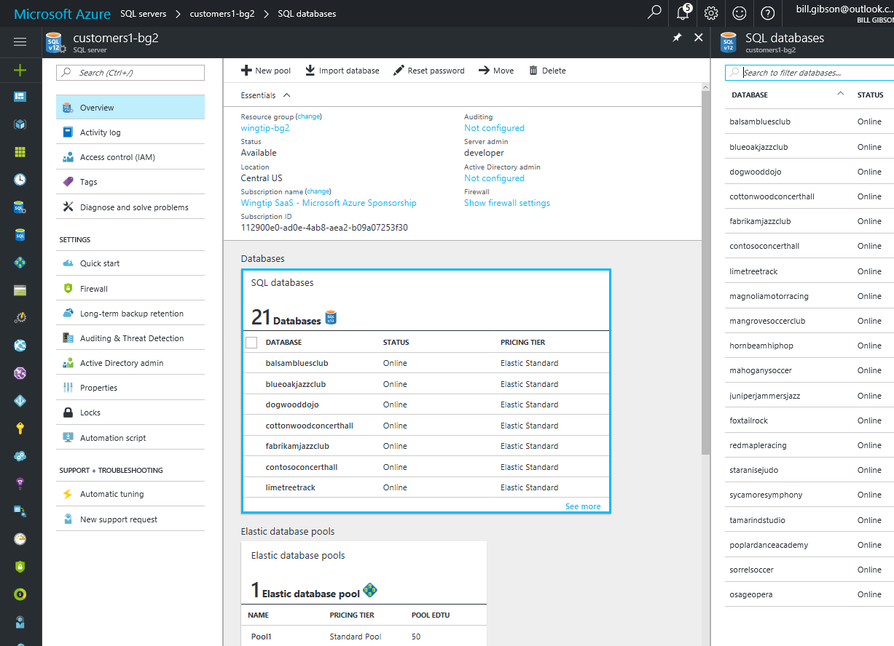
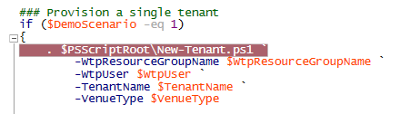
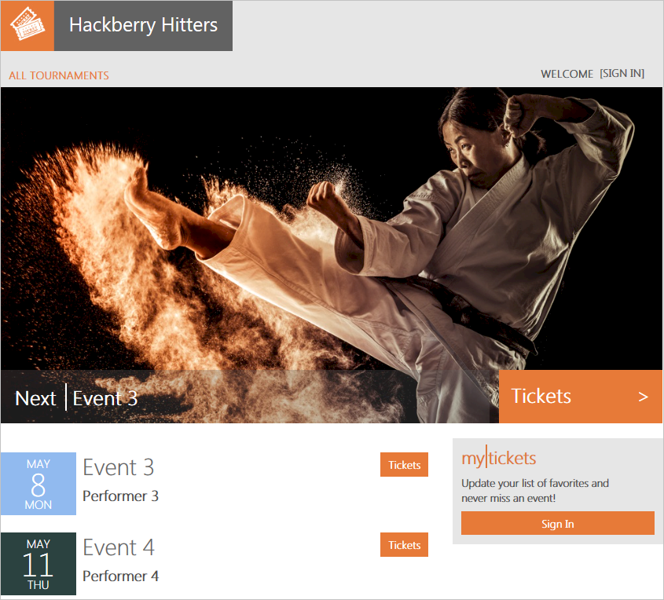

# Provision new tenants and register them in the catalog

In this tutorial, you provision new tenants in the Wingtip SaaS application. You create tenants by provisioning tenant databases, and registering them in the catalog. The *catalog* is a database that maintains the mapping between a SaaS application's tenants and their data.

Use these scripts to explore the provision and catalog patterns used, and how registering new tenants in the catalog is implemented. The catalog plays an important role directing application requests to the correct database.

In this tutorial, you learn how to:

> [!div class="checklist"]

> * Provision a single new tenant
> * Provision a batch of additional tenants
> * Step into the details of provisioning tenants, and registering them into the catalog

To complete this tutorial, make sure the following prerequisites are completed:

* The Wingtip SaaS app is deployed. To deploy in less than five minutes, see [Deploy and explore the Wingtip SaaS application](sql-database-saas-tutorial.md)
* Azure PowerShell is installed. For details, see [Getting started with Azure PowerShell](https://docs.microsoft.com/powershell/azure/get-started-azureps)

## Introduction to the SaaS Catalog pattern

In a database-backed multi-tenant SaaS application, it's important to know where information for each tenant is stored. In the SaaS catalog pattern, a catalog database is used to hold the mapping between tenants and where their data is stored. The Wingtip SaaS app uses a single-tenant per database architecture, but the basic pattern of storing tenant-to-database mapping in a catalog applies whether a multi-tenant or single-tenant database is used.

Each tenant is assigned a key that distinguishes their data in the catalog. In the Wingtip SaaS application, the key is formed from a hash of the tenant’s name. This pattern allows the tenant name portion of the application URL to be used to construct the key and retrieve a specific tenant's connection. Other id schemes could be used without impacting the overall pattern.

The catalog in the app is implemented using Shard Management technology in the [Elastic Database Client Library (EDCL)](sql-database-elastic-database-client-library.md). EDCL is responsible for creating and managing a database-backed *catalog* where a *shard map* is maintained. The catalog contains the mapping between keys (tenants) and their shards (databases).

> [!IMPORTANT]
> The mapping data is accessible in the catalog database, but *don't edit it*! Edit mapping data using Elastic Database Client Library APIs only. Directly manipulating the mapping data risks corrupting the catalog and is not supported.

## Get the Wingtip application scripts

The Wingtip SaaS scripts and application source code are available in the [WingtipSaaS](https://github.com/Microsoft/WingtipSaaS) github repo. [Steps to download the Wingtip SaaS scripts](sql-database-wtp-overview.md#download-and-unblock-the-wingtip-saas-scripts).

## Provision one new tenant

If you already created a tenant in the [first Wingtip SaaS tutorial](sql-database-saas-tutorial.md), feel free to skip to the next section where you [provision a batch of tenants](#provision-a-batch-of-tenants).

Run the *Demo-ProvisionAndCatalog* script to quickly create a tenant and register it in the catalog:

1. Open **Demo-ProvisionAndCatalog.ps1** in the PowerShell ISE and set the following values:
   * **$TenantName** = the name of the new venue (for example, *Bushwillow Blues*).
   * **$VenueType** = one of the pre-defined venue types: blues, classicalmusic, dance, jazz, judo, motorracing, multipurpose, opera, rockmusic, soccer.
   * **$DemoScenario** = 1, Leave this set to _1_ to **Provision a single tenant**.

1. Press **F5** and run the script.

After the script completes, the new tenant is provisioned, and their *Events* app opens in the browser:

## Provision a batch of tenants

This exercise provisions a batch of additional tenants. It’s recommended you provision a batch of tenants before completing other Wingtip SaaS tutorials so there's more than just a few databases to work with.

1. Open ...\\Learning Modules\\Utilities\\*Demo-ProvisionAndCatalog.ps1* in the *PowerShell ISE* and set the following value:
   * **$DemoScenario** = **3**, Set to **3** to **Provision a batch of tenants**.
1. Press **F5** and run the script.

The script deploys a batch of additional tenants. It uses an [Azure Resource Manager template](../azure-resource-manager/resource-manager-template-walkthrough.md) that controls the batch and then delegates provisioning of each database to a linked template. Using templates in this way allows Azure Resource Manager to broker the provisioning process for your script. Templates provision databases in parallel where it can, and handles retries if needed, optimizing the overall process. The script is idempotent so if it fails or stops for any reason, run it again.

### Verify the batch of tenants successfully deployed

* Open the *tenants1* server in the [Azure portal](https://portal.azure.com) and click **SQL databases**:

   

## Provision and catalog details

For a better understanding of how the Wingtip application implements new tenant provisioning, run the *Demo-ProvisionAndCatalog* script again and provision yet another tenant. This time, add a breakpoint and step through the workflow:

1. Open ...\\Learning Modules\Utilities\_Demo-ProvisionAndCatalog.ps1_ and set the following parameters:
   * **$TenantName** = tenant names must be unique, so set to a different name than any existing tenants (for example, *Hackberry Hitters*).
   * **$VenueType** = use one of the pre-defined venue types (for example, *judo*).
   * **$DemoScenario** = 1, Set to **1** to **Provision a single tenant**.

1. Add a breakpoint by putting your cursor anywhere on the following line: *New-Tenant `*, and press **F9**.

   

1. To run the script press **F5**. When the breakpoint is hit, press **F11** to step in. Trace the script's execution using **F10** and **F11** to step over or into the called functions. [Tips on working with and debugging PowerShell scripts](https://msdn.microsoft.com/powershell/scripting/core-powershell/ise/how-to-debug-scripts-in-windows-powershell-ise)

### Examine the provision and catalog implementation in detail by stepping through the script

The script provisions and catalogs new tenants by doing the following steps:

1. **Import the SubscriptionManagement.psm1** module that contains functions for signing in to Azure and selecting the Azure subscription you are working with.
1. **Import the CatalogAndDatabaseManagement.psm1** module that provides a catalog and tenant-level abstraction over the [Shard Management](sql-database-elastic-scale-shard-map-management.md) functions. This is an important module that encapsulates much of the catalog pattern and is worth exploring.
1. **Get configuration details**. Step into *Get-Configuration* (with **F11**) and see how the app config is specified. Resource names and other app-specific values are defined here, but do not change any of these values until you are familiar with the scripts.
1. **Get the catalog object**. Step into *Get-Catalog* to see how the catalog is initialized using the Shard Management functions that are imported from **AzureShardManagement.psm1**. The catalog is composed of the following objects:
   * $catalogServerFullyQualifiedName is constructed using the standard stem plus your User name: _catalog-\<user\>.database.windows.net_.
   * $catalogDatabaseName is retrieved from the config: *tenantcatalog*.
   * $shardMapManager object is initialized from the catalog database.
   * $shardMap object is initialized from the *tenantcatalog* shard map in the catalog database.
   A catalog object is composed and returned, and used in the higher-level script.
1. **Calculate the new tenant key**. A hash function is used to create the tenant key from the tenant name.
1. **Check if the tenant key already exists**. The catalog is checked to ensure the key is available.
1. **The tenant database is provisioned with New-TenantDatabase.** Use **F11** to step in and see how the database is provisioned using a Resource Manager template.

The database name is constructed from the tenant name to make it clear which shard belongs to which tenant. (Other strategies for database naming could easily be used.)

A Resource Manager template is used to create a tenant database by copying a *golden* database (basetenantdb) on the catalog server.  An alternative approach could be to create an empty database and then initialize it by importing a bacpac.

The Resource Manager template is in the …\\Learning Modules\\Common\\ folder:  *tenantdatabasecopytemplate.json*

After the tenant database is created, it is then further initialized with the venue (tenant) name and the venue type. Other initialization could also be done here.

The tenant database is registered in the catalog with *Add-TenantDatabaseToCatalog* using the tenant key. Use **F11** to step into the details:

* The catalog database is added to the shard map (the list of known databases).
* The mapping that links the key value (tenant) to the shard (database) is created.
* Additional meta data about the tenant is added.

After provisioning completes, execution returns to the original *Demo-ProvisionAndCatalog* script, and the **Events** page for the new tenant opens in the browser:

   

## Other provisioning patterns

Other provisioning patterns not included in this tutorial include:

**Pre-provisioning databases.** The pre-provisioning pattern exploits the fact that databases in an elastic pool do not add extra cost. Billing is for the elastic pool, not the databases, and idle databases consume no resources. By pre-provisioning databases in a pool and allocating them when needed, tenant onboarding time can be significantly reduced. The number of databases pre-provisioned could be adjusted as needed to keep a buffer suitable for the anticipated provisioning rate.

**Auto-provisioning.** In the auto-provisioning pattern, a dedicated provisioning service is used to provision servers, pools, and databases automatically as needed – including pre-provisioning databases in elastic pools if desired. And if databases are de-commissioned and deleted, gaps in elastic pools can be filled by the provisioning service as desired. Such a service could be simple or complex – for example, handling provisioning across multiple geographies, and could set up geo-replication automatically if that strategy is being used for disaster recovery. With the auto-provisioning pattern, a client application or script would submit a provisioning request to a queue to be processed by the provisioning service, and would then poll the service to determine completion. If pre-provisioning is used, requests would be handled quickly with the service managing provisioning of a replacement database running in the background.

## Next steps

In this tutorial you learned how to:

> [!div class="checklist"]

> * Provision a single new tenant
> * Provision a batch of additional tenants
> * Step into the details of provisioning tenants, and registering them into the catalog

Try the [Performance monitoring tutorial](sql-database-saas-tutorial-performance-monitoring.md).

## Additional Resources

* Additional [tutorials that build upon the Wingtip SaaS application](sql-database-wtp-overview.md#sql-database-wingtip-saas-tutorials)
* [Elastic database client library](https://docs.microsoft.com/azure/sql-database/sql-database-elastic-database-client-library)
* [How to Debug Scripts in Windows PowerShell ISE](https://msdn.microsoft.com/powershell/scripting/core-powershell/ise/how-to-debug-scripts-in-windows-powershell-ise)
