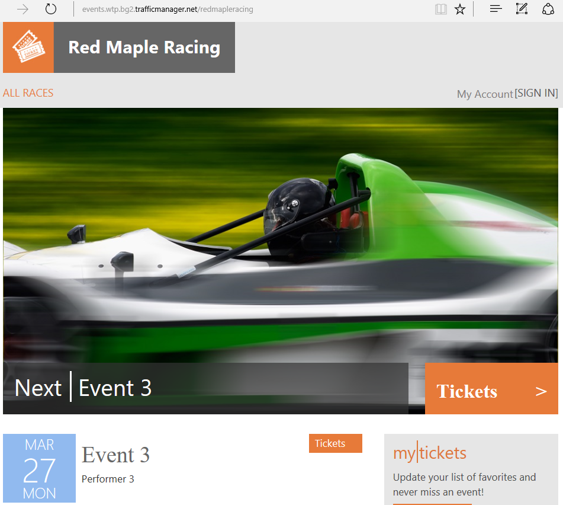

# Provision new tenants and register them in the catalog

In this tutorial, you provision new tenants in the Wingtip SaaS application. PowerShell scripts are provided that create new tenants, new tenant databases, and registers the tenants in the catalog. The *catalog* is a database that maintains the mapping between the SaaS applications many tenants and their data. Use these scripts to explore the provision and catalog patterns used, and how they are implemented.

To complete this tutorial, make sure of the following:

* The WTP app is deployed. To deploy in less than five minutes, see [Deploy and explore the WTP SaaS application](sql-database-saas-tutorial.md).
* Azure PowerShell is installed. For details, see [Getting started with Azure PowerShell](https://docs.microsoft.com/powershell/azure/get-started-azureps).

## Introduction to the SaaS Catalog pattern

In a database-backed multi-tenant SaaS application, it’s important to know where information for each tenant is stored. In the SaaS catalog pattern, a catalog database is used to hold the mapping between tenants and where their data is stored. The WTP app uses single-tenant database architecture, but the basic pattern of storing tenant-to-database mapping in a catalog applies whether a multi-tenant or single-tenant database is used. In the WTP application, the key is formed from a hash of the tenant’s name. This allows the tenant name portion of the application URL to be used to construct the key and retrieve the connection. Other id schemes could be used without impacting the overall pattern.

The catalog in the WTP app is implemented using Shard Management technology in the [Elastic Database Client Library (EDCL)](sql-database-elastic-database-client-library.md). EDCL is responsible for creating and managing a database-backed _catalog_ where a _shard map_ is maintained. The catalog contains the mapping between keys (tenants) and their databases (shards).

> [!IMPORTANT]
> The mapping data is accessible in the catalog database, but *don't edit it*! Edit mapping data using Elastic Database Client Library APIs only. Directly manipulating the mapping data risks corrupting the catalog and is not supported.

## Create new tenants

The Wingtip SaaS app provisions new tenants by copying a *golden* database. (Another option is to import a bacpac file using a Resource Manager template.)

### Load the provision and catalog scripts

* Open the following scripts and modules in the **PowerShell ISE**:
    * …\\Learning Modules\\Provision and Catalog\\_Demo-ProvisionAndCatalog.ps1_
    * …\\Learning Modules\\Provision and Catalog\\New-Tenant.ps1,
    * …\\Learning Modules\\Provision and Catalog\\New-TenantBatch.ps1
    * …\\Learning Modules\\Common\\CatalogAndDatabaseManagement.psm1
    * …\\Learning Modules\\Common\\AzureShardManagement.psm1

## Provision a new tenant

This exercise provisions a single tenant. If you already created a new tenant with the *Demo-ProvisionAndCatalog* script (in the first WTP tutorial) this is the same, so feel free to skip to the next section; [provision a batch of tenants](#provision-a-batch-of-tenants).

Run the _Demo-ProvisionAndCatalog_ script to quickly create a new tenant and register it in the catalog:

1. Open **Demo-ProvisionAndCatalog.ps1** in the PowerShell ISE and set the following values:
   * **$TenantName** = the name of the new venue (for example, _Bushwillow Blues_).
   * **$VenueType** = one of the pre-defined venue types: blues, classicalmusic, dance, jazz, judo, motorracing, multipurpose, opera, rockmusic, soccer.
   * **$DemoScenario** = 1, Leave this set to _1_ to **Provision a single tenant**.

1. Press **F5** to run the script. Click **OK** to save the script, and sign in to Azure if prompted.
1. For users with multiple Azure subscriptions, select the subscription where you deployed the Wingtip SaaS app.

After the script completes, the new tenant is provisioned, and their Events app opens in the browser:

## Provision a batch of Tenants

This exercise provisions a batch of multiple tenants. It’s recommended you do this prior to completing other Wingtip SaaS tutorials.

1. Open ...\\Learning Modules\Utilities\_Demo-ProvisionAndCatalog.ps1_ in the **PowerShell ISE** and set the following value:
   * **$DemoScenario** = **3**, Set this to **3** to **Provision a batch of tenants**.
1. Press **F5** to run the script. Click **OK** to save the script. Sign in to Azure if prompted.
1. For users with multiple Azure subscriptions, if prompted, select the subscription where you deployed the Wingtip SaaS app.

The script will deploy a batch of 17 additional tenants. It uses an Azure Resource Manager template that controls the batch and then delegates provisioning of each database to a linked template. Using templates like this allows Azure Resource Manager to broker the provisioning process for your script, provisioning databases in parallel where it can, and handling retries if needed, optimizing the overall process. The script is idempotent, if it's interrupted just run it again.

After the batch has deployed the script will open the server blade in the Azure portal. Click the SQL Databases list part:

## Provision and catalog detailed walkthrough

For a better understanding of how the wingtip application implements new tenant provisioning, run the _Demo-ProvisionAndCatalog_ script and provision yet another tenant, but this time add a breakpoint to step through the workflow:

1. Open ...\\Learning Modules\Utilities\_Demo-ProvisionAndCatalog.ps1_ and set the following to new tenant values that do not exist in the current catalog:
   * **$TenantName** = set to a new name (for example, _Red Maple Racing East_).
   * **$VenueType** = use one of the pre-defined venue types (for example, _motorracing_).
   * **$DemoScenario** = 1, Set to **1** to **Provision a single tenant**.

1. Add a breakpoint by putting your cursor anywhere on the following line: _$PSScriptRoot\\New-Tenant.ps1_, and pressing **F9**.
1. Press **F5** to run the script. When the breakpoint is hit, press **F11** to step into the **New-Tenant.ps1** script. Trace its execution using **F10** and **F11** to step over or into the functions it calls. [Tips on working with and debugging PowerShell scripts](https://msdn.microsoft.com/powershell/scripting/core-powershell/ise/how-to-debug-scripts-in-windows-powershell-ise)

### Examine the workflow in detail by stepping through the script

1. Import the **SubscriptionManagement.psm1** module that contains functions for signing in to Azure and selecting the Azure subscription you are working with.
1. Import the **CatalogAndDatabaseManagement.psm1** module that provides a catalog and tenant-level abstraction over the Shard Management functions. This is an important module that encapsulates much of the catalog pattern and is worth exploring.
1. Get configuration details. Step into _Get-Configuration_ (with **F11**) and see how the app config is specified. Resource names and other app specific values are defined here, but do not change any of these values until you are familiar with the scripts.
1. Get the catalog object. Step into _Get-Catalog_ to see how the catalog is initialized using the Shard Management functions that are imported from **AzureShardManagement.psm1**.
   * $catalogServerFullyQualifiedName is constructed using the standard stem plus your User name: _catalog-\<user\>.database.windows.net_.
   * $catalogDatabaseName is retrieved from the config: _tenantcatalog_.
   * $shardMapManager object is initialized from the catalog database.
   * $shardMap object is initialized from the _tenantcatalog_ shard map in the catalog database.
   A catalog object is composed and returned, and used in the higher-level script.
1. **Calculate the new tenant key**. A hash function is used to create the tenant key from the tenant name.
1. **Check if the tenant key already exists**. The catalog is checked to ensure the key is available.
1. **The tenant database is provisioned with New-TenantDatabase.** Use **F11** to step into it to see how the database is provisioned using an Resource Manager template.
    * The database name is constructed from the tenant name to make it clear which shard belongs to which tenant. (Other strategies for database naming could easily be used.)
    * A Resource Manager template is used to **create a new database by copying a _golden_ database** (baseTenantDB) on the catalog server.  (An alternative approach would be to create an empty database and then initialize it by importing a bacpac).
    * The Resource Manager template is in the …\\Learning Modules\\Common\\ folder:
        * tenantdatabasecopytemplate.json
    * Once the Resource Manager template is configured, it is submitted to Azure Resource Manager, which manages its deployment with the resource providers – in this case, the SQL Database service.
    * The **tenant database once created is further initialized** with the venue (tenant) name and the venue type. Other initialization could also be done here.

1. **The tenant database is registered in the catalog** **with Add-TenantDatabaseToCatalog** using the tenant key. Use **F11** to step into the details:

    * The catalog database is added to the shard map (the list of known databases).
    * The mapping that links the key value to the shard is created.
    * Additional meta data (the venue's name) about the tenant is added.

1. Execution returns to the original _Demo-ProvisionAndCatalog_ script, and the **events** page for the new tenant opens in the browser:

    

## Other provisioning patterns

Other provisioning patterns not included in this tutorial include:

**Pre-provisioning databases.** This pattern exploits the fact that databases in an elastic pool do not add extra cost (billing is for the elastic pool, not the databases), and that idle databases consume no resources. By pre-provisioning databases in a pool and then allocating them when needed, tenant onboarding time can be cut significantly. The number of databases pre-provisioned could be adjusted as needed to keep a buffer suitable for the anticipated provisioning rate.

**Auto-provisioning.** In this pattern, a dedicated provisioning service is used to provision servers, pools and databases automatically as needed – including pre-provisioning databases in elastic pools if desired. And if databases are de-commissioned and deleted, gaps in elastic pools can be filled by the provisioning service as desired. Such a service could be simple or complex – for example, handling provisioning across multiple geographies, and could set up geo-replication automatically if that strategy is being used for DR. With the auto-provisioning pattern, a client application or script would submit a provisioning request to a queue to be processed by the provisioning service, and would then poll the service to determine completion. If pre-provisioning is used requests would be handled very quickly with the service managing provisioning of a replacement database running in the background.

## Stopping Wingtip SaaS application related billing

If you don’t plan to continue with another tutorial, it’s recommended you delete all the resources to suspend billing. Simply delete the resource group the WTP application was deployed to, and all it's resources will be deleted.

* Browse to the application's resource group in the portal and delete it to stop all billing related to this WTP deployment.

## Tips

* EDCL also provides important features that enable client applications to connect to and manipulate the catalog. You can also use EDCL to retrieve an ADO.NET connection for a given key value, enabling the application to connect to the correct database. The client caches this connection information to minimize the traffic to the catalog database and speed up the application.

## Next steps

[Schema management tutorial](sql-database-saas-tutorial-schema-management.md)

[Performance management and monitoring tutorial](sql-database-saas-tutorial-performance-monitoring.md)

[Restore a tenant database tutorial](sql-database-saas-tutorial-restore-single-tenant.md)

## Additional Resources

[Elastic database client library](https://docs.microsoft.com/azure/sql-database/sql-database-elastic-database-client-library)

[How to Debug Scripts in Windows PowerShell ISE](https://msdn.microsoft.com/powershell/scripting/core-powershell/ise/how-to-debug-scripts-in-windows-powershell-ise)
