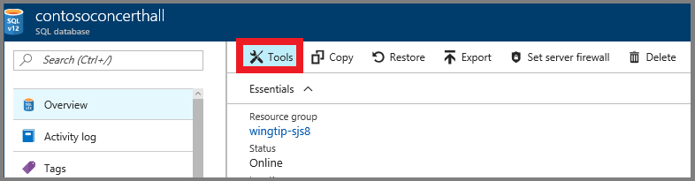
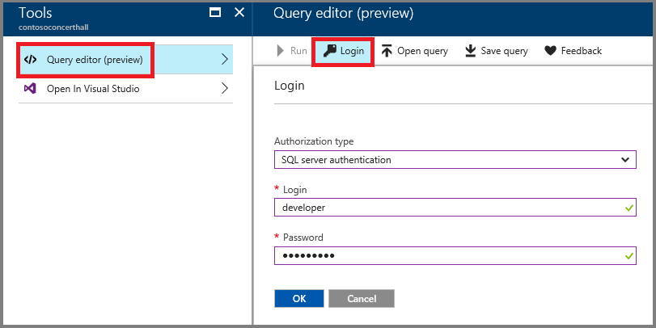
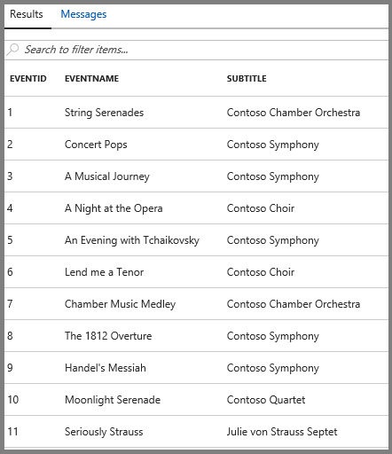

# Restore a single tenant database

The Wingtip SaaS app is built using a single-tenant data model, where each venue (tenant) has their own database. One of the benefits of this model is that it is easy to restore a single tenant’s data in isolation without impacting other tenants.

This tutorial presents two data recovery patterns:

1. Restoring to a prior point of time into a parallel database (side-by-side), which can be used by the tenant for review, auditing, compliance, etc... The original database remains online and unchanged.
1. Restoring data in-place, to recover a tenant to a prior point in time if the tenant has accidentally corrupted their data in some way. The original database is taken offline, and replaced with the new database, restored to a point in time before the data was compromised.

To complete this tutorial, make sure of the following:

* The WTP app is deployed. To deploy in less than five minutes, see [Deploy and explore the WTP SaaS application](sql-database-saas-tutorial.md).
* Azure PowerShell is installed. For details, see [Getting started with Azure PowerShell](https://docs.microsoft.com/powershell/azure/get-started-azureps).

## Introduction to the SaaS tenant restore pattern

Planning for business continuity and disaster recovery is essential for a robust SaaS business, and may also be required for compliance reasons. A simple, repeatable, data restore and recovery process is a key element of such a plan. Databases can become corrupted for many reasons – a recovery process that leaves customers offline without access to their data for extended periods of time, or worse with no option to recover from corrupted data, could be disastrous. In this tutorial, you’ll explore two simple patterns for restoring an individual tenant's data. Because tenant databases are isolated from each other, restoring one tenant has no impact on any other tenant's data.

In the first pattern, data is restored from a previous point in time into a new, parallel database, and the tenant is then given access to the data alongside their production data. This pattern allows a tenant admin to review the restored data and potentially use it to selectively overwrite current data values. It’s up to the SaaS app designer to determine just how sophisticated the data recovery options should be. Simply being able to review data in the state it was in at a given point in time may be all that is required in some scenarios. If the database uses [Geo-Replication](sql-database-geo-replication-overview.md), we recommend copying the required data from the restored copy into the original database. If you replace the original database with the restored database, you will need to reconfigure and resynchronize Geo-Replication (which can take a long time for a large database).

In the second pattern, which assumes that the tenant has suffered a serious, possibly self-inflicted, loss or corruption of data, the tenant’s production database is restored to a prior point in time. In this pattern, the tenant is taken offline briefly, while the database is restored and then brought back online. The prior copy of the database is deleted but can be restored from again if the database needs to be restored again to an even earlier point. A variation of this pattern could rename the database instead of deleting it, although renaming the database offers no additional advantage in terms of data security.


## Simulate a user accidently deleting data

To demonstrate these recovery scenarios we need to 'accidently' delete some data in one of the tenant databases. While we can use any tool that can run a query, lets delete one of the Contoso Concert Hall events using the new **Query editor** in the Azure portal.


1. Open the [Azure portal](https://portal.azure.com) and browse to the **contosoconcerthall** database, then click **Tools**:

   

1. Click **Query editor**, then click **Login**. The *contosoconcerthall* database is on the *tenants1-\<User\>* server so you're logging on with the server credentials; Login = *developer*, Password = *P@ssword1*.

   

1. Run the following query: ```SELECT * FROM dbo.Events``` to see the current list of events.

   

3. Run the following two delete queries to simulate a tenant admin mistakenly deleting this event from their database:

   You can delete any event, but delete the *Seriously Strauss* event because we set this event to easily get past referential integrity constraints.

   ```SQL
   DELETE FROM dbo.EventSections WHERE EventId = '11'
   DELETE FROM dbo.Events WHERE EventId = '11'
   ```
1. Query the list of events again: ```SELECT * FROM dbo.Events``` and verify the event is gone.

Now lets restore the database to a point in time before the event was accidently deleted.

## Restore a tenant database in parallel with the production database

This exercise will restore the Contoso Concert Hall data to a point in time before the event was deleted above. The _Restore-TenantInParallel.ps1_ script creates a parallel tenant database, and a parallel catalog entry both named *ContosoConcertHall\_old*. This pattern of restore is best suited for recovering from a minor data loss or for compliance and auditing recovery scenarios. It is also the recommended approach if you are using [Geo-Replication](sql-database-geo-replication-overview.md).

1. Complete the steps in the [simulate a user accidently deleting data](#simulate-a-user-accidently-deleting-data) section above.
1. Open ...\Learning Modules\Business Continuity and Disaster Recovery\RestoreTenant\_Demo-RestoreTenant.ps1_ in the **PowerShell ISE**.
2. Set **$DemoScenario** = **3**: 'restore tenant in parallel'.
3. 
4. Press **F5** to run the script.

The script restores the tenant database to a parallel database 5 minutes before you deleted the event in the previous section. It creates a new database, removes any existing catalog metadata that exists in this database, and adds the database to the catalog under the *ContosoConcertHall\_old* entry.

The demo script opens the events page in your browser. Inspect the event listing in the browser to confirm that the deleted event has been restored.

Note that exposing the restored tenant as a separately accessible tenant entry is unlikely to be how you would provide a tenant access to restored data, but serves to illustrate the restore pattern.

In reality, you would probably only retain this restored database for a defined period. You can delete the restored tenant entry once you are finished by calling the Remove-RestoredTenant.ps1 script.

1. **Modify** **$DemoScenario** to **4** to select the ‘remove restored tenant scenario’.
1. **Execute** **using** **F5**
1. The *ContosoConcertHall\_old* entry is now deleted from the catalog. You can close the events page for this tenant in your browser.


## Restore a tenant in place, replacing the existing tenant database

This exercise will restore the Contoso Concert Hall tenant to a point in time before the event was deleted. The *Restore-TenantInPlace* script restores the current tenant database to a new database pointing to a previous point in time, and deletes the original database. This pattern of restore is best suited for recovering from serious data corruption as there may be significant data loss that the tenant would have to accommodate.

1. Complete the steps in the ‘Getting Started’ section before starting this exercise.
1. **Navigate to** **Demo-RestoreTenant.ps1** file in PowerShell ISE
1. **Modify** **$DemoScenario** to **5** to select the ‘restore tenant in place scenario’.
1. Execute using **F5**.

The script restores the tenant database to a point 5 minutes before the event deletion that occurred in the 'Getting started' section. It does this by first taking the tenant Contoso Concert Hall offline so there are no further updates to the data. Then, a parallel database is created by restoring from the restore point and named with a timestamp to ensure the database name does not conflict with the existing tenant database name. Next, the old tenant database is deleted, and the newly-restored database is renamed to the original database name. Finally, Contoso Concert Hall is brought online to allow the app access to the restored database.

At this point you have restored the database prior to the point the event was deleted. The demo script will open the events page for Contoso Concert Hall in your browser, where you can scroll the event listing to the end to confirm that the event has been restored.

SCREEN SHOT


## Next steps

[Provision and catalog tutorial](sql-database-saas-tutorial-provision-and-catalog.md)

## Additional resources

[Overview of business continuity with Azure SQL Database](sql-database-business-continuity.md)
[Learn about SQL Database backups](sql-database-automated-backups.md)