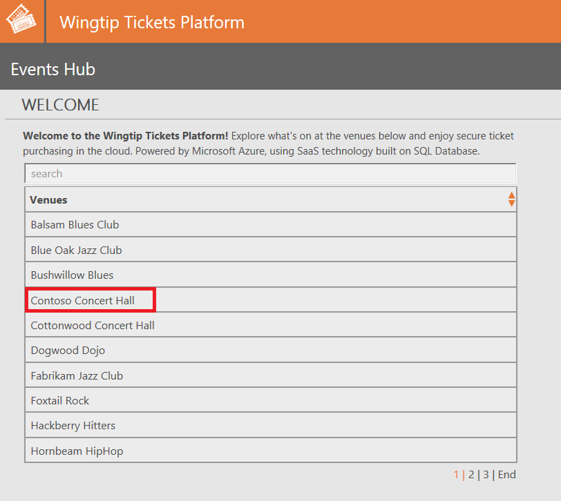
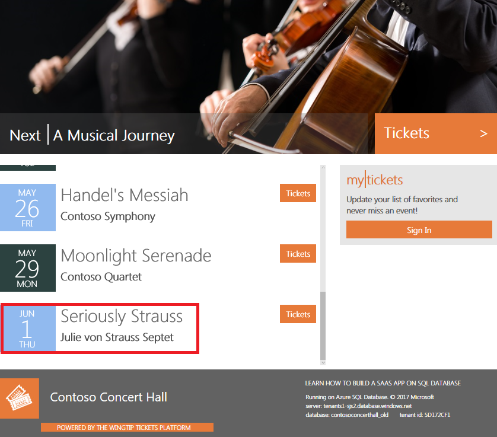

# Restore a Wingtip SaaS tenants SQL database

The Wingtip SaaS app is built using a database-per-tenant model, where each tenant has their own database. One of the benefits of this model is that it is easy to restore a single tenant’s data in isolation without impacting other tenants.

In this tutorial you learn two data recovery patterns:

> [!div class="checklist"]

> * Restore a database into a parallel database (side-by-side)
> * Restore a database in place


|||
|:--|:--|
| **Restore tenant to a prior point in time, into a parallel database** | This pattern can be used by the tenant for review, auditing, compliance, etc. The original database remains online and unchanged. |
| **Restore tenant in-place** | This pattern is typically used to recover a tenant to a prior point in time, after a tenant accidentally deletes data. The original database is taken offline, and replaced with the restored database. |
|||

To complete this tutorial, make sure the following prerequisites are completed:

* The Wingtip SaaS app is deployed. To deploy in less than five minutes, see [Deploy and explore the Wingtip SaaS application](sql-database-saas-tutorial.md)
* Azure PowerShell is installed. For details, see [Getting started with Azure PowerShell](https://docs.microsoft.com/powershell/azure/get-started-azureps)

## Introduction to the SaaS tenant restore pattern

For the tenant restore pattern, there are two simple patterns for restoring an individual tenant's data. Because tenant databases are isolated from each other, restoring one tenant has no impact on any other tenant's data.

In the first pattern, data is restored into a new database. The tenant is then given access to this database alongside their production data. This pattern allows a tenant admin to review the restored data and potentially use it to selectively overwrite current data values. It's up to the SaaS app designer to determine just how sophisticated the data recovery options should be. Simply being able to review data in the state it was in at a given point in time may be all that is required in some scenarios. If the database uses [geo-replication](sql-database-geo-replication-overview.md), we recommend copying the required data from the restored copy into the original database. If you replace the original database with the restored database, you need to reconfigure and resynchronize geo-replication.

In the second pattern, which assumes that the tenant has suffered a loss or corruption of data, the tenant’s production database is restored to a prior point in time. In the restore in place pattern, the tenant is taken offline for a brief time while the database is restored and brought back online. The original database is deleted, but can still be restored from if you need to go back to an even earlier point in time. A variation of this pattern could rename the database instead of deleting it, although renaming the database offers no additional advantage in terms of data security.

## Get the Wingtip application scripts

The Wingtip SaaS scripts and application source code are available in the [WingtipSaaS](https://github.com/Microsoft/WingtipSaaS) github repo. [Steps to download the Wingtip SaaS scripts](sql-database-wtp-overview.md#download-and-unblock-the-wingtip-saas-scripts).

## Simulate a tenant accidentally deleting data

To demonstrate these recovery scenarios, we need to *accidentally* delete some data in one of the tenant databases. While you can delete any record, the next step sets up the demo to not get blocked by referential integrity violations! It also adds some ticket purchase data you can use later in the *Wingtip SaaS Analytics tutorials*.

Run the ticket generator script and create additional data. The ticket generator intentionally does not purchase tickets for each tenants last event.

1. Open ...\\Learning Modules\\Utilities\\*Demo-TicketGenerator.ps1* in the *PowerShell ISE*
1. Press **F5** to run the script and generate customers and ticket sales data.


### Open the Events app to review the current events

1. Open the *Events Hub* (http://events.wtp.&lt;user&gt;.trafficmanager.net) and click **Contoso Concert Hall**:

   

1. Scroll the list of events and make a note of the last event in the list:

   


### Run the demo scenario to accidentally delete the last event

1. Open ...\\Learning Modules\\Business Continuity and Disaster Recovery\\RestoreTenant\\*Demo-RestoreTenant.ps1* in the *PowerShell ISE*, and set the following value:
   * **$DemoScenario** = **1**, Set to **1** - Delete events with no ticket sales.
1. Press **F5** to run the script and delete the last event. You should see a confirmation message similar to the following:

   ```Console
   Deleting unsold events from Contoso Concert Hall ...
   Deleted event 'Seriously Strauss' from Contoso Concert Hall venue.
   ```

1. The Contoso events page opens. Scroll down and verify the event is gone. If the event is still in the list, click refresh and verify it is gone.

   


## Restore a tenant database in parallel with the production database

This exercise restores the Contoso Concert Hall database to a point in time before the event was deleted. After the event is deleted in the previous steps, you want to recover and see the deleted data. You don't need to restore your production database with the deleted record, but you need to recover the old database to access the old data for other business reasons.

 The *Restore-TenantInParallel.ps1* script creates a parallel tenant database, and a parallel catalog entry both named *ContosoConcertHall\_old*. This pattern of restore is best suited for recovering from a minor data loss or for compliance and auditing recovery scenarios. It is also the recommended approach when you are using [geo-replication](sql-database-geo-replication-overview.md).

1. Complete the [simulate a user accidentally deleting data](#simulate-a-tenant-accidentally-deleting-data) section.
1. Open ...\\Learning Modules\\Business Continuity and Disaster Recovery\\RestoreTenant\\_Demo-RestoreTenant.ps1_ in the *PowerShell ISE*.
1. Set **$DemoScenario** = **2**, Set this to **2** to *Restore tenant in parallel*.
1. Press **F5** to run the script.

The script restores the tenant database (to a parallel database) to a point in time before you deleted the event in the previous section. It creates a second database, removes any existing catalog metadata that exists in this database, and adds the database to the catalog under the *ContosoConcertHall\_old* entry.

The demo script opens the events page in your browser. Note from the URL: ```http://events.wtp.&lt;user&gt;.trafficmanager.net/contosoconcerthall_old``` that this is showing data from the restored database where *_old* is added to the name.

Scroll the events listed in the browser to confirm that the event deleted in the previous section has been restored.

Note that exposing the restored tenant as an additional tenant, with its own Events app to browse tickets, is unlikely to be how you would provide a tenant access to restored data, but serves to easily illustrate the restore pattern.

In reality, you would probably only retain this restored database for a defined period. You can delete the restored tenant entry once you are finished by calling the *Remove-RestoredTenant.ps1* script.

1. Set **$DemoScenario** to **4** to select the *remove restored tenant* scenario.
1. **Execute** **using** **F5**
1. The *ContosoConcertHall\_old* entry is now deleted from the catalog. Go ahead and close the events page for this tenant in your browser.


## Restore a tenant in place, replacing the existing tenant database

This exercise restores the Contoso Concert Hall tenant to a point in time before the event was deleted. The *Restore-TenantInPlace* script restores the current tenant database to a new database pointing to a previous point in time, and deletes the original database. This pattern of restore is best suited for recovering from serious data corruption as there may be significant data loss that the tenant would have to accommodate.

1. Open **Demo-RestoreTenant.ps1** file in PowerShell ISE
1. Set **$DemoScenario** to **5** to select the *restore tenant in place scenario*.
1. Execute using **F5**.

The script restores the tenant database to a point five minutes before the event was deleted. It does this by first taking the Contoso Concert Hall tenant offline so there are no further updates to the data. Then, a parallel database is created by restoring from the restore point and named with a timestamp to ensure the database name does not conflict with the existing tenant database name. Next, the old tenant database is deleted, and the restored database is renamed to the original database name. Finally, Contoso Concert Hall is brought online to allow the app access to the restored database.

You successfully restored the database to a point in time before the event was deleted. The Events page opens, so confirm the last event has been restored.


## Next steps

In this tutorial, you learned how to:

> [!div class="checklist"]

> * Restore a database into a parallel database (side-by-side)
> * Restore a database in place

[Manage tenant database schema](sql-database-saas-tutorial-schema-management.md)

## Additional resources

* Additional [tutorials that build upon the Wingtip SaaS application](sql-database-wtp-overview.md#sql-database-wingtip-saas-tutorials)
* [Overview of business continuity with Azure SQL Database](sql-database-business-continuity.md)
* [Learn about SQL Database backups](sql-database-automated-backups.md)
