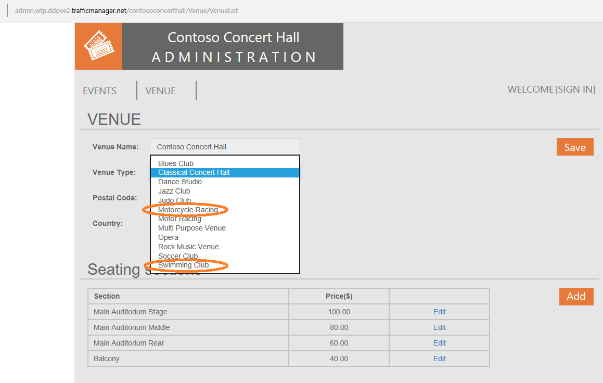

# Manage schema for multiple tenants in a SaaS application that uses Azure SQL Database

The Introduction to the WTP Application tutorial shows how the WTP app can provision a tenant database with its initial schema and register it in the catalog, making it available to the rest of the application. Like any application, the WTP app will evolve over time, and will at times require changes to the database. This may include new or changed schema, new or changed reference data, as well as routine database maintenance tasks to ensure optimal app performance. With a SaaS application, these changes need to be deployed in a coordinated manner across a potentially massive fleet of tenant databases and must be incorporated into the provisioning process for new tenant databases. This tutorial explores two scenarios, deploying reference data updates which must be shared by all tenants, and retuning an index on the table containing the reference data. The Elastic jobs feature is used to execute these operations across all the tenants and a ‘golden’ tenant database that is used as a template for new databases.

To complete this tutorial, make sure of the following:

* The WTP app is deployed. To deploy in less than five minutes, see [Deploy and explore the WTP SaaS application](sql-database-saas-tutorial.md).
* Azure PowerShell is installed. For details, see [Getting started with Azure PowerShell](https://docs.microsoft.com/powershell/azure/get-started-azureps).

## Introduction to SaaS Schema Management patterns

The single tenant per database SaaS pattern benefits in many ways from the data isolation that results, but at the same time introduces additional management complexity of maintaining and managing many databases. [Elastic Jobs](sql-database-elastic-jobs-overview.md) facilitates administration and management of the SQL data tier. Jobs enables you to securely and reliably, run tasks (T-SQL scripts) independent of user interaction or input, against a group of databases. This method can be used to deploy schema and common reference data changes across all tenants in an application. Elastic Jobs can also be used to maintain a _golden_ copy of the database used to create new tenants, ensuring it always has the latest schema and reference data.

## Elastic Jobs private preview

There is a new version of Elastic Jobs that is now an integrated feature of Azure SQL Database (that requires no additional services or components). This new version of Elastic Jobs is currently in private preview. This private preview currently supports PowerShell to create job accounts, and T-SQL to create and manage jobs.

The tutorial walks how the job account is created and used to create jobs for deploying new reference data and manage indexes.

## Create a new job account database and new job account

This tutorial requires you use PowerShell to create the job account database and job account. Like MSDB and SQL Agent, Elastic Jobs uses an Azure SQL Database to store job definitions and job status and history. Once, the job account is created, you can start to create and monitor jobs immediately.

1. Open …\\Learning Modules\\Schema Management\\**Demo-SchemaManagement.ps1** in PowerShell ISE.
1. Execute the script using **F5**.

The _Demo-SchemaManagement.ps1_ script calls the _Deploy-SchemaManagement.ps1_ script to create an _S2_ database named **jobaccount** on the catalog server. It then creates the job account, passing the jobaccount database as a parameter to the job account creation call.

## Create a job to deploy new reference data to all tenants

The WTP database includes a set of venue types that define the kind of events that are hosted at a venue. The set of supported venue types is held in the VenueTypes table which is present in every tenant database. These venue types correspond to the background image you see in the WTP events and admin apps. In this exercise, you will deploy an update to all the tenant databases to add two additional venue types, ‘Motorcycle Racing’ and ‘Swimming Club’.

When prior provisioning step completed it opened the WTP admin page in the browser for the tenant ‘Contoso Concert Hall’. Click the **Sign in** button, and again click the **Sign in** button to sign in to the admin site using the default password. Click the Venue Type drop down menu and validate that only 10 venue type options are available, and specifically that ‘Motorcycle Racing’ and ‘Swimming Club’ are not included in the list.

Now let’s create a job to update venue types table in all the tenant database and add ‘Motorcycle Racing’ and ‘Swimming Club’.

To create a new job, we use a set of jobs ‘system’ stored procedures created in the jobaccount database when the job account was created.

1. Open SSMS and connect to the catalog-&lt;WtpUser&gt;.database.windows.net server
2. Open the file …\\Learning Modules\\Schema Management\\DeployReferenceData.sql
3. Modify &lt;WtpUser&gt;, use the user name used when you deployed the WTP app, in all 3 locations in the script
4. Right click, select **Connection**, and connect to the catalog-&lt;WtpUser&gt;.database.windows.net server, if not already connected
5. Ensure you are connected to the jobaccount database and press **F5** to run the script

* **sp\_add\_target\_group** creates the target group name DemoServerGroup, now we need to add target members.
* **sp\_add\_target\_group\_member** adds a *server* target member type which deems all databases within that server (note this is the customer1-&lt;WtpUser&gt; server containing the tenant databases) at time of job execution should be included in the job, the second is adding a *database* target member type, specifically the ‘golden’ database, baseTenantDB which resides on catalog-&lt;WtpUser&gt; server, and lastly another *database* target group member type to include the adhocanalytics database that will be used in a later tutorial.
* **sp\_add\_job** creates a new job called “Reference Data Deployment”
* **sp\_add\_jobstep** creates the job step containing T-SQL command text to update to the reference table, VenueTypes
* The remaining views in the script display the existence of the objects and monitor job execution. Review the status value from the **lifecycle** column to monitor the status. Once, Succeeded, the job has successfully finished on all tenant databases and the two additional databases containing the reference table.

Go back to the browser with the admin site opened, Refresh the browser and select the Venue Types drop-down list again to see the two new types added to the tenant database

## Create a job to manage the reference table index

Similar to the previous exercise, this exercise creates a job to rebuild the index on the reference table primary key, a typical database management operation an administrator might perform after a large data load into a table.

Create a new job using the same jobs 'system' stored procedures.

1. Open SSMS and connect to the catalog-&lt;WtpUser&gt;.database.windows.net server
1. Open the file …\\Learning Modules\\Schema Management\\OnlineReindex.sql
1. Right click, select Connection, and connect to the catalog-&lt;WtpUser&gt;.database.windows.net server, if not already connected
1. Ensure you are connected to the jobaccount database and press F5 to run the script

* sp\_add\_job creates a new job called “Online Reindex PK\_\_VenueTyp\_\_265E44FD7FD4C885”
* sp\_add\_jobstep creates the job step containing T-SQL command text to update the index

## Additional resources

[Managing scaled-out cloud databases](sql-database-elastic-jobs-overview.md)