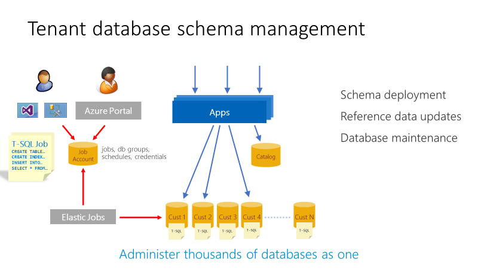

# Manage schema for multiple tenants in the Wingtip SaaS application

The [first Wingtip SaaS tutorial](sql-database-saas-tutorial.md) shows how the app can provision a tenant database and register it in the catalog. Like any application, the Wingtip SaaS app will evolve over time, and at times will require changes to the database. Changes may include new or changed schema, new or changed reference data, and routine database maintenance tasks to ensure optimal app performance. With a SaaS application, these changes need to be deployed in a coordinated manner across a potentially massive fleet of tenant databases. Changes also need to be incorporated into the provisioning process for future tenant databases.

This tutorial explores two scenarios - deploying reference data updates for all tenants, and retuning an index on the table containing the reference data. The [Elastic jobs](sql-database-elastic-jobs-overview.md) feature is used to execute these operations across all tenants, and the *golden* tenant database that is used as a template for new databases.

In this tutorial you learn how to:

> [!div class="checklist"]

> * Create a job account to query across multiple tenants
> * Update data in all tenant databases
> * Create an index on a table in all tenant databases

To complete this tutorial, make sure the following prerequisites are met:

* The Wingtip SaaS app is deployed. To deploy in less than five minutes, see [Deploy and explore the Wingtip SaaS application](sql-database-saas-tutorial.md)
* Azure PowerShell is installed. For details, see [Getting started with Azure PowerShell](https://docs.microsoft.com/powershell/azure/get-started-azureps)
* The latest version of SQL Server Management Studio (SSMS) is installed. [Download and Install SSMS](https://docs.microsoft.com/sql/ssms/download-sql-server-management-studio-ssms)

*This tutorial uses features of the SQL Database service that are in a limited preview (Elastic Database jobs). If you wish to do this tutorial, provide your subscription id to SaaSFeedback@microsoft.com with subject=Elastic Jobs Preview. After you receive confirmation that your subscription has been enabled, [download and install the latest pre-release jobs cmdlets](https://github.com/jaredmoo/azure-powershell/releases). As this is a limited preview, you should contact SaaSFeedback@microsoft.com for related questions or support.*

## Introduction to SaaS Schema Management patterns

The single tenant per database SaaS pattern benefits in many ways from the data isolation that results, but at the same time introduces the additional complexity of maintaining and managing many databases. [Elastic Jobs](sql-database-elastic-jobs-overview.md) facilitates administration and management of the SQL data tier. Jobs enable you to securely and reliably, run tasks (T-SQL scripts) independent of user interaction or input, against a group of databases. This method can be used to deploy schema and common reference data changes across all tenants in an application. Elastic Jobs can also be used to maintain a *golden* copy of the database used to create new tenants, ensuring it always has the latest schema and reference data.

## Elastic Jobs limited preview

There is a new version of Elastic Jobs that is now an integrated feature of Azure SQL Database (that requires no additional services or components). This new version of Elastic Jobs is currently in limited preview. This limited preview currently supports PowerShell to create job accounts, and T-SQL to create and manage jobs.

> [!NOTE]
> *This tutorial uses features of the SQL Database service that are in a limited preview (Elastic Database jobs). If you wish to do this tutorial, provide your subscription id to SaaSFeedback@microsoft.com with subject=Elastic Jobs Preview. After you receive confirmation that your subscription has been enabled, [download and install the latest pre-release jobs cmdlets](https://github.com/jaredmoo/azure-powershell/releases). As this is a limited preview, you should contact SaaSFeedback@microsoft.com for related questions or support.*

## Get the Wingtip application scripts

The Wingtip SaaS scripts and application source code are available in the [WingtipSaaS](https://github.com/Microsoft/WingtipSaaS) github repo. [Steps to download the Wingtip SaaS scripts](sql-database-wtp-overview.md#download-and-unblock-the-wingtip-saas-scripts).

## Create a job account database and new job account

This tutorial requires you use PowerShell to create the job account database and job account. Like MSDB and SQL Agent, Elastic Jobs uses an Azure SQL database to store job definitions, job status, and history. Once the job account is created, you can create and monitor jobs immediately.

1. Open …\\Learning Modules\\Schema Management\\*Demo-SchemaManagement.ps1* in the **PowerShell ISE**.
1. Press **F5** to run the script.

The *Demo-SchemaManagement.ps1* script calls the *Deploy-SchemaManagement.ps1* script to create an *S2* database named **jobaccount** on the catalog server. It then creates the job account, passing the jobaccount database as a parameter to the job account creation call.

## Create a job to deploy new reference data to all tenants

Each tenant database includes a set of venue types that define the kind of events that are hosted at a venue. In this exercise, you deploy an update to all the tenant databases to add two additional venue types: *Motorcycle Racing* and *Swimming Club*. These venue types correspond to the background image you see in the tenant events app.

Click the Venue Type drop down menu and validate that only 10 venue type options are available, and specifically that ‘Motorcycle Racing’ and ‘Swimming Club’ are not included in the list.

Now let’s create a job to update the *VenueTypes* table in all the tenant databases and add the new venue types.

To create a new job, we use a set of jobs system stored procedures created in the jobaccount database when the job account was created.

1. Open SSMS and connect to the catalog server: catalog-\<user\>.database.windows.net server
1. Also connect to the tenant server: tenants1-\<user\>.database.windows.net
1. Browse to the *contosoconcerthall* database on the *tenants1* server and query the *VenueTypes* table to confirm that *Motorcycle Racing* and *Swimming Club* **are not** in the results list.
1. Open the file …\\Learning Modules\\Schema Management\\DeployReferenceData.sql
1. Modify \<user\>, use the user name used when you deployed the Wingtip app, in all 3 locations in the script
1. Ensure you are connected to the jobaccount database and press **F5** to run the script

* **sp\_add\_target\_group** creates the target group name DemoServerGroup, now we need to add target members.
* **sp\_add\_target\_group\_member** adds a *server* target member type, which deems all databases within that server (note this is the customer1-&lt;User&gt; server containing the tenant databases) at time of job execution should be included in the job, the second is adding a *database* target member type, specifically the ‘golden’ database, baseTenantDB which resides on catalog-&lt;User&gt; server, and lastly another *database* target group member type to include the adhocanalytics database that is used in a later tutorial.
* **sp\_add\_job** creates a job called “Reference Data Deployment”
* **sp\_add\_jobstep** creates the job step containing T-SQL command text to update to the reference table, VenueTypes
* The remaining views in the script display the existence of the objects and monitor job execution. Review the status value from the **lifecycle** column. The job has successfully finished on all tenant databases and the two additional databases containing the reference table.

1. In SSMS, browse to the *contosoconcerthall* database on the *tenants1* server and query the *VenueTypes* table to confirm that *Motorcycle Racing* and *Swimming Club* **are** now in the results list.

## Create a job to manage the reference table index

Similar to the previous exercise, this exercise creates a job to rebuild the index on the reference table primary key, a typical database management operation an administrator might perform after a large data load into a table.

Create a job using the same jobs 'system' stored procedures.

1. Open SSMS and connect to the catalog-&lt;User&gt;.database.windows.net server
1. Open the file …\\Learning Modules\\Schema Management\\OnlineReindex.sql
1. Right click, select Connection, and connect to the catalog-&lt;User&gt;.database.windows.net server, if not already connected
1. Ensure you are connected to the jobaccount database and press F5 to run the script

* sp\_add\_job creates a new job called “Online Reindex PK\_\_VenueTyp\_\_265E44FD7FD4C885”
* sp\_add\_jobstep creates the job step containing T-SQL command text to update the index

## Next steps

In this tutorial you learned how to:

> [!div class="checklist"]

> * Create a job account to query across multiple tenants
> * Update data in all tenant databases
> * Create an index on a table in all tenant databases

[Ad-hoc analytics tutorial](sql-database-saas-tutorial-adhoc-analytics.md)

## Additional resources

* [Additional tutorials that build upon the Wingtip SaaS application deployment](sql-database-wtp-overview.md#sql-database-wingtip-saas-tutorials)
* [Managing scaled-out cloud databases](sql-database-elastic-jobs-overview.md)
* [Create and manage scaled-out cloud databases](sql-database-elastic-jobs-create-and-manage.md)
