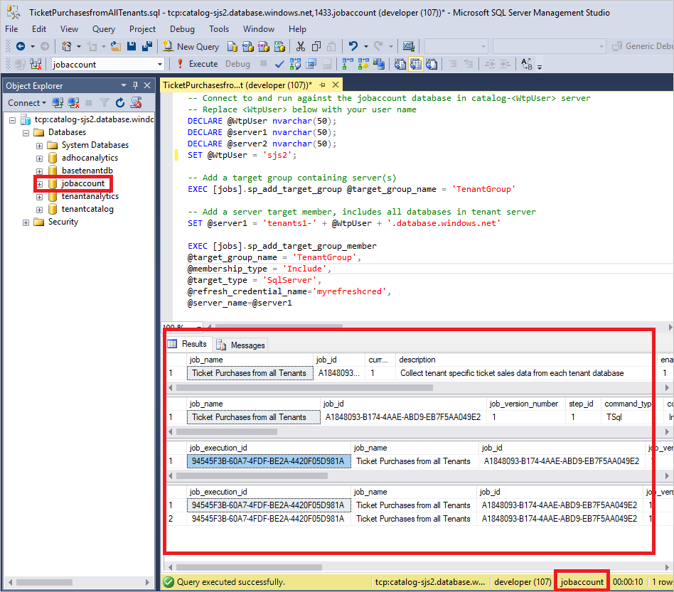
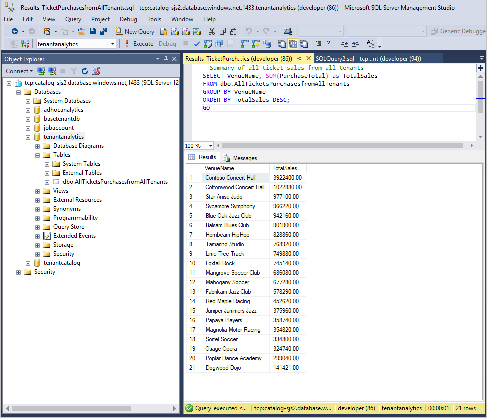

# Run distributed queries across multiple Azure SQL databases

In this tutorial, you run analytics queries against each tenant in the catalog. An elastic job is created that runs the queries. The job retrieves data and loads it into a separate analytics database created on the catalog server. This database can be queried to extract insights that are buried in the day-to-day operational data of all tenants. As an output of the job, a table is created from the result-returning queries inside the tenant analytics database.

In this tutorial you learn how to:

> [!div class="checklist"]
> * Create the tenant analytics database
> * Create a scheduled job to retrieve data and populate the analytics database

To complete this tutorial, make sure the following prerequisites are met:

* The Wingtip SaaS app is deployed. To deploy in less than five minutes, see [Deploy and explore the Wingtip SaaS application](sql-database-saas-tutorial.md)
* Azure PowerShell is installed. For details, see [Getting started with Azure PowerShell](https://docs.microsoft.com/powershell/azure/get-started-azureps)
* The latest version of SQL Server Management Studio (SSMS) is installed. [Download and Install SSMS](https://docs.microsoft.com/sql/ssms/download-sql-server-management-studio-ssms)

## Tenant Operational Analytics pattern

One of the great opportunities with SaaS applications is to use the rich tenant data that is stored in the cloud. Use this data to gain insights into the operation and usage of your application, and your tenants. This data can guide feature development, usability improvements, and other investments in the app and platform. Accessing this data when it's in a single multi-tenant database is easy, but not so easy when distributed at scale across potentially thousands of databases. One approach to accessing this data is to use Elastic jobs, which enable result-returning query results from job execution to be captured in an output database and table.

## Get the Wingtip application scripts

The Wingtip SaaS scripts and application source code are available in the [WingtipSaaS](https://github.com/Microsoft/WingtipSaaS) github repo. [Steps to download the Wingtip SaaS scripts](sql-database-wtp-overview.md#download-and-unblock-the-wingtip-saas-scripts).

## Deploy a database for tenant analytics results

This tutorial requires you to have a database deployed to capture the results from job execution of scripts, which contain results-returning queries. Let's create a database called tenantanalytics for this purpose.

1. Open …\\Learning Modules\\Operational Analytics\\Tenant Analytics\\*Demo-TenantAnalyticsDB.ps1* in the *PowerShell ISE* and set the following value:
   * **$DemoScenario** = **2** *Deploy operational analytics database*
1. Press **F5** to run the demo script (that calls the *Deploy-TenantAnalyticsDB.ps1* script) which creates the tenant analytics database.

## Create some data for the demo

1. Open …\\Learning Modules\\Operational Analytics\\Tenant Analytics\\*Demo-TenantAnalyticsDB.ps1* in the *PowerShell ISE* and set the following value:
   * **$DemoScenario** = **1** *Purchase tickets for events at all venues*
1. Press **F5** to run the script and create ticket purchasing history.

## Create a scheduled job to retrieve tenant analytics about ticket purchases

This script creates a job to retrieve ticket purchase information from all tenants. Once aggregated into a single table, you can gain rich insightful metrics about ticket purchasing patterns across the tenants.

1. Open SSMS and connect to the catalog-&lt;user&gt;.database.windows.net server
1. Open ...\\Learning Modules\\Operational Analytics\\Tenant Analytics\\*TicketPurchasesfromAllTenants.sql*
1. Modify &lt;User&gt;, use the user name used when you deployed the Wingtip SaaS app at the top of the script, **sp\_add\_target\_group\_member** and **sp\_add\_jobstep**
1. Right click, select **Connection**, and connect to the catalog-&lt;User&gt;.database.windows.net server, if not already connected
1. Ensure you are connected to the **jobaccount** database and press **F5** to run the script

* **sp\_add\_target\_group** creates the target group name *TenantGroup*, now we need to add target members.
* **sp\_add\_target\_group\_member** adds a *server* target member type, which deems all databases within that server (note this is the customer1-&lt;User&gt; server containing the tenant databases) at time of job execution should be included in the job.
* **sp\_add\_job** creates a new weekly scheduled job called “Ticket Purchases from all Tenants”
* **sp\_add\_jobstep** creates the job step containing T-SQL command text to retrieve all the ticket purchase information from all tenants and copy the returning result set into a table called *AllTicketsPurchasesfromAllTenants*
* The remaining views in the script display the existence of the objects and monitor job execution. Review the status value from the **lifecycle** column to monitor the status. Once, Succeeded, the job has successfully finished on all tenant databases and the two additional databases containing the reference table.

Successfully running the script should result in similar results:

## Create a job to retrieve a summary count of ticket purchases from all tenants

This script creates a job to retrieve sum of all ticket purchases from all tenants.

1. Open SSMS and connect to the *catalog-&lt;User&gt;.database.windows.net* server
1. Open the file …\\Learning Modules\\Provision and Catalog\\Operational Analytics\\Tenant Analytics\\*Results-TicketPurchasesfromAllTenants.sql*
1. Modify &lt;User&gt;, use the user name used when you deployed the Wingtip SaaS app in the script, in the **sp\_add\_jobstep** stored procedure
1. Right click, select **Connection**, and connect to the catalog-&lt;User&gt;.database.windows.net server, if not already connected
1. Ensure you are connected to the **tenantanalytics** database and press **F5** to run the script

Successfully running the script should result in similar results:

* **sp\_add\_job** creates a new weekly scheduled job called “ResultsTicketsOrders”

* **sp\_add\_jobstep** creates the job step containing T-SQL command text to retrieve all the ticket purchase information from all tenants and copy the returning result set into a table called CountofTicketOrders

* The remaining views in the script display the existence of the objects and monitor job execution. Review the status value from the **lifecycle** column to monitor the status. Once, Succeeded, the job has successfully finished on all tenant databases and the two additional databases containing the reference table.

## Next steps

In this tutorial you learned how to:

> [!div class="checklist"]
> * Deploy a tenant analytics database
> * Create a scheduled job to retrieve analytical data across tenants

Congratulations!

## Additional resources

* Additional [tutorials that build upon the Wingtip SaaS application](sql-database-wtp-overview.md#sql-database-wingtip-saas-tutorials)
* [Elastic Jobs](sql-database-elastic-jobs-overview.md)
