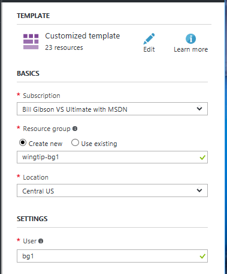

# Deploy and explore a multi-tenant SaaS application that uses Azure SQL Database

In this tutorial, you deploy and explore the Wingtip Tickets Platform (WTP) SaaS application. The application uses a database-per-tenant, SaaS application pattern, to service multiple tenants. The application is designed to showcase features of Azure SQL Database that enable SaaS scenarios, and SaaS design and management patterns.

Five minutes after clicking the *Deploy to Azure* button below, you have a multi-tenant SaaS application, using SQL Database, up and running in the cloud. The application is deployed with three sample tenants, each with their own database, all deployed into a SQL Elastic pool. The app is deployed to your Azure subscription, giving you full access to inspect and work with the individual application components.

Scripts and application source code are available in the [WingtipSaaS](https://github.com/Microsoft/WingtipSaaS) github repo.

In this tutorial you learn:

> [!div class="checklist"]

> * How to deploy the WTP application
> * About the servers, pools, and databases that make up the app
> * Tenants are mapped to their data with the *catalog*
> * How to provision new tenants
> * How to view pool utilization to monitor tenant activity
> * How to delete sample resources to stop related billing

To explore various SaaS design and management patterns, a [series of related tutorials](sql-database-wtp-overview.md) is available that build upon this initial deployment. While going through the tutorials, dive into the provided scripts, and examine how the different SaaS patterns are implemented. Step through the scripts in each tutorial to gain a deeper understanding how to implement the many SQL Database features that simplify developing SaaS applications.

To complete this tutorial, make sure the following prerequisites are completed:

* Azure PowerShell is installed. For details, see [Getting started with Azure PowerShell](https://docs.microsoft.com/powershell/azure/get-started-azureps)

## Deploy the Wingtip tickets (WTP) SaaS Application

Deploy the Wingtip tickets platform in less than five minutes:

1. Click to deploy:

   

1. Enter required parameter values for the deployment:

    > [!IMPORTANT]
    > Some authentication, and server firewalls are intentionally unsecured for demonstration purposes. **Create a new resource group**, and do not use existing resource groups, servers, or pools, and do not use this application, or any resources it creates, for production. Delete this resource group when you are finished with the application to stop related billing.

    * **Resource group** - Select **Create new** and provide a **Name** and **Location**.
    * **User** - Some resources require names that are unique across all Azure subscriptions. To ensure uniqueness, provide a value to differentiate resources you create, from resources created by other users deploying the Wingtip application. It’s recommended to use a short **User** name, such as your initials plus a number (for example, *bg1*), and then use that in the resource group name (for example, *wingtip-bg1*). The **User** parameter can only contain letters, numbers, and hyphens. The first and last character must be a letter or a number (all lowercase is recommended).

     

1. **Deploy the application**.

    * Click if you agree to the terms and conditions.
    * Select **Pin to dashboard**.
    * Click **Purchase**.

1. Monitor deployment status by clicking **Notifications** (the bell icon right of the search box). Deploying the WTP app takes approximately four minutes.

   

## Explore the application

The app showcases venues, such as concert halls, jazz clubs, sports clubs, that host events. Venues register as customers (or tenants) of the Wingtip Tickets Platform (WTP), for an easy way to list events and sell tickets. Each venue gets a personalized web app to manage and list their events and sell tickets, independent and isolated from other tenants. Under the covers, each tenant gets a SQL database deployed into a SQL Elastic pool.

A central **Events Hub** provides a list of tenant URLs specific to your deployment. All the tenant URLs include your specific *User* value and follow this format: http://events.wtp.&lt;USER&gt;.trafficmanager.net/*fabrikamjazzclub*. 

1. Open the _Events Hub_: http://events.wtp.&lt;USER&gt;.trafficmanager.net (replace with your User name):

    

1. Click **Fabrikam Jazz Club** in the *Events Hub*.

   

1. Click **Tickets** and explore ticket purchasing for an event.

The WTP application uses [*Azure Traffic Manager*](https://docs.microsoft.com/azure/traffic-manager/traffic-manager-overview) to control the distribution of incoming traffic. The events pages, which are tenant-specific, require that tenant names are included in the URLs. The events app parses the tenant name from the URL and uses it to create a key to access a catalog using [*shard map management*](https://docs.microsoft.com/azure/sql-database/sql-database-elastic-scale-shard-map-management). The catalog maps the key to the tenant’s database location. The **Events Hub** uses extended metadata in the catalog to retrieve the tenant’s name associated with each database.

In a production environment, you would typically create a CNAME DNS record to [*point a company internet domain*](https://docs.microsoft.com/azure/traffic-manager/traffic-manager-point-internet-domain) to the traffic manager profile.

## Get the Wingtip application scripts

The Wingtip Tickets scripts and application source code are available in the [WingtipSaaS](https://github.com/Microsoft/WingtipSaaS) github repo. Script files are located in the [Learning Modules folder](https://github.com/Microsoft/WingtipSaaS/tree/master/Learning%20Modules). Download the **Learning Modules** folder to your local computer, maintaining its folder structure.

## Provision a new tenant

The initial deployment creates three sample tenants, but we need to create more tenants for the best tutorial experience. In this step you quickly create a new tenant. Later you should dive deeper into the details of provisioning new tenants in the [Provision and catalog tutorial](sql-database-saas-tutorial-provision-and-catalog.md) where you can see how simple it would be to implement a registration component into the application, and automatically provision tenants as customers sign up.

### Initialize the user config file for your deployment

Because this is the first script you are going to run after the initial WTP application deployment, you must update the user configuration file. Update the variables with the specific values from your deployment.

   1. Open ...\\Learning Modules\\*UserConfig.psm1* in the *PowerShell ISE*
   1. Modify _$userConfig.ResourceGroupName_ to the _resource group_ you set when you deployed the app.
   1. Modify _$userConfig.Name_ to the _User_ name you set when you deployed app.

### Provision the new tenant

1. Open ...\\Learning Modules\Provision and Catalog\\*Demo-ProvisionAndCatalog.ps1* in the *PowerShell ISE*.
1. Press **F5** to run the script (leave the script's default values for now).

The new tenant is registered into the catalog. Their database is created and added to a SQL elastic pool. After successful provisioning, the new tenant's ticket selling site appears in your browser:

Refresh the Events Hub and verify the new tenant is in the list.

## Start generating load on the tenant databases

Now that we have several tenant databases, let’s put them to work! A PowerShell script is provided that simulates a workload running against all tenant databases. The load runs for 60 minutes by default. Wingtip Tickets is a SaaS app, and the real-world load on a SaaS app is typically sporadic and unpredictable. To simulate this, the load generator produces a randomized load distributed across all tenants. Several minutes are needed for the pattern to emerge, so let the load generator run for about 5-10 minutes before attempting to monitor the load in the following sections.

1. Open ...\\Learning Modules\\Utilities\\*Demo-LoadGenerator.psm1* in the **PowerShell ISE**
1. Press **F5** to run the script and start the load generator (leave the default parameter values for now).

> [!IMPORTANT]
> The load generator runs as a series of jobs in your local PowerShell session so keep the PowerShell session open! If you close PowerShell, or the tab the load generator was started in, or suspend your machine, the jobs will stop.

## Explore the servers, pools, and tenant databases

Now that you have explored the application, provisioned a new tenant, and started running a load against the collection of tenants, let’s look at some of the resources that were deployed.

1. In the [Azure portal](http://portal.azure.com), open the **catalog-&lt;USER&gt;** server. The catalog server contains two databases. The **tenantcatalog**, and the **basetenantdb** (an empty *golden* db that is copied to create new tenants).

   

1. Open the **tenants1-&lt;USER&gt;** server that holds the tenant databases. Note that each tenant database is an _Elastic Standard_ database in a 50 eDTU standard pool. Also notice there is a _Red Maple Racing_ database, the tenant that you provisioned previously.

   

## Monitor the pool

If the load generator has been running for several minutes, enough data should be available to start looking at some of the monitoring capabilities built into pools and databases.

1. Browse to server *tenants1-&lt;USER&gt;*, and click **Pool1** to view resource utilization for the pool:

   

What these two charts nicely illustrate, is how well suited elastic pools and SQL Database are for SaaS application workloads. Four databases that are each bursting to as much as 40 eDTUs are easily being supported in a 50 eDTU pool. If each was provisioned as a standalone database, they would each need to be an S2 (50 DTU) to support the bursts, but the cost of 4 standalone S2 databases would be nearly 3 times the price of the pool. And the pool still has plenty of headroom for many more databases. In real-world situations, customers are currently running up to 500 databases in 200 eDTU pools. For more information, see the [performance monitoring tutorial](sql-database-saas-tutorial-performance-monitoring.md).

## Deleting the resources created with this tutorial

When you are finished exploring and working with the WTP app, browse to the application's resource group in the portal and delete it to stop all billing related to this deployment. If you have used any of the accompanying tutorials, any resources they created will also be deleted with the application.

## Next steps

In this tutorial you learned:

> [!div class="checklist"]

> * How to deploy the WTP application
> * About the servers, pools, and databases that make up the app
> * Tenants are mapped to their data with the *catalog*
> * How to provision new tenants
> * How to view pool utilization to monitor tenant activity
> * How to delete sample resources to stop related billing

Now try the [Provision and catalog tutorial](sql-database-saas-tutorial-provision-and-catalog.md)

## Additional resources

* [Additional tutorials that build upon the initial Wingtip Tickets Platform (WTP) application deployment](sql-database-wtp-overview.md#sql-database-wtp-saas-tutorials)
* To learn about elastic pools, see [*What is an Azure SQL elastic pool*](https://docs.microsoft.com/azure/sql-database/sql-database-elastic-pool)
* To learn about elastic jobs, see [*Managing scaled-out cloud databases*](https://docs.microsoft.com/azure/sql-database/sql-database-elastic-jobs-overview)
* To learn about multi-tenant SaaS applications, see [*Design patterns for multi-tenant SaaS applications*](https://docs.microsoft.com/azure/sql-database/sql-database-design-patterns-multi-tenancy-saas-applications)
