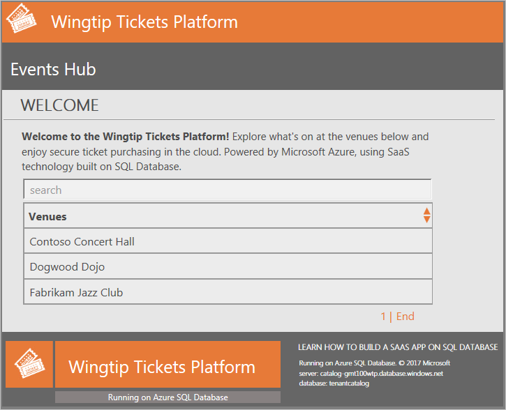
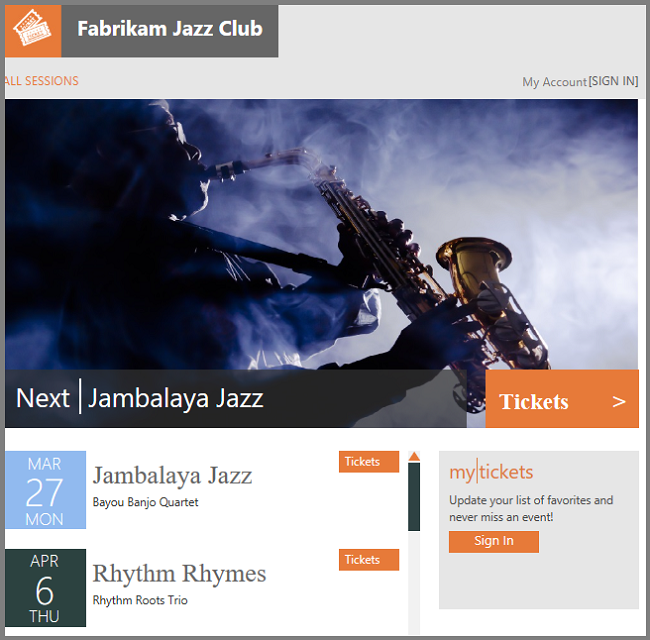
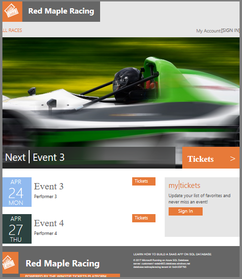
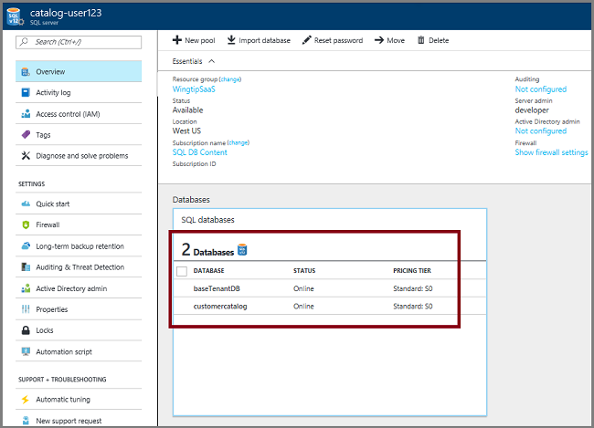
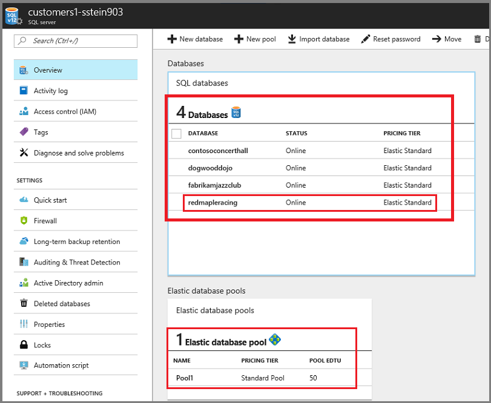
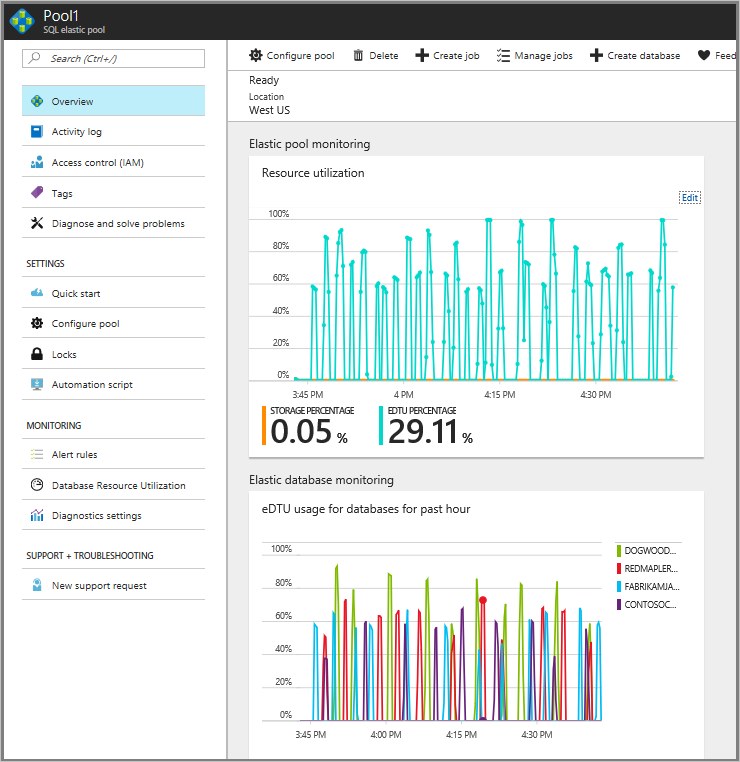

# Deploy and explore a multi-tenant application that uses Azure SQL Database - Wingtip SaaS

In this tutorial, you deploy and explore the Wingtip SaaS application. The application uses a database-per-tenant, SaaS application pattern, to service multiple tenants. The application is designed to showcase features of Azure SQL Database that simplify enabling SaaS scenarios.

Five minutes after clicking the *Deploy to Azure* button below, you have a multi-tenant SaaS application, using SQL Database, up and running in the cloud. The application is deployed with three sample tenants, each with its own database, all deployed into a SQL elastic pool. The app is deployed to your Azure subscription, giving you full access to explore and work with the individual application components. The application source code and management scripts are available in the WingtipSaaS GitHub repo.

In this tutorial you learn:

> [!div class="checklist"]

> * How to deploy the Wingtip SaaS application
> * Where to get the application source code, and management scripts
> * About the servers, pools, and databases that make up the app
> * How tenants are mapped to their data with the *catalog*
> * How to provision a new tenant
> * How to monitor tenant activity in the app

To explore various SaaS design and management patterns, a [series of related tutorials](sql-database-wtp-overview.md#sql-database-wingtip-saas-tutorials) is available that build upon this initial deployment. While going through the tutorials, dive into the provided scripts, and examine how the different SaaS patterns are implemented. Step through the scripts in each tutorial to gain a deeper understanding how to implement the many SQL Database features that simplify developing SaaS applications.

To complete this tutorial, make sure the following prerequisites are completed:

* Azure PowerShell is installed. For details, see [Getting started with Azure PowerShell](https://docs.microsoft.com/powershell/azure/get-started-azureps)

## Deploy the Wingtip SaaS application

Deploy the Wingtip SaaS app:

1. Clicking the **Deploy to Azure** button opens the Azure portal to the Wingtip SaaS deployment template. The template requires two parameter values; a name for a new resource group, and a user name that distinguishes this deployment from other deployments of the Wingtip SaaS app. The next step provides details for setting these values. Make sure to note the exact values that you use, because you will need to enter them into a configuration file later.

   

1. Enter required parameter values for the deployment:

    > [!IMPORTANT]
    > Some authentication, and server firewalls are intentionally unsecured for demonstration purposes. **Create a new resource group**, and do not use existing resource groups, servers, or pools. Do not use this application, or any resources it creates, for production. Delete this resource group when you are finished with the application to stop related billing.

    * **Resource group** - Select **Create new** and provide a **Name** and **Location**.
    * **User** - Some resources require names that are globally unique. To ensure uniqueness, each time you deploy the application provide a value to differentiate resources you create, from resources created by any other deployment of the Wingtip application. It’s recommended to use a short **User** name, such as your initials plus a number (for example, *bg1*), and then use that in the resource group name (for example, *wingtip-bg1*). The **User** parameter can only contain letters, numbers, and hyphens (no spaces). The first and last character must be a letter or a number (all lowercase is recommended).

1. **Deploy the application**.

    * Click to agree to the terms and conditions.
    * Click **Purchase**.

1. Monitor deployment status by clicking **Notifications** (the bell icon right of the search box). Deploying the Wingtip SaaS app takes approximately five minutes.

   

## Download and unblock the Wingtip SaaS scripts

While the application is deploying, download the source code and management scripts.

> [!IMPORTANT]
> Executable contents (scripts, dlls) may be blocked by Windows when zip files are downloaded from an external source and extracted. When extracting the scripts from a zip file, follow the steps below to unblock the .zip file before extracting. This ensures the scripts are allowed to run.

1. Browse to [the Wingtip SaaS github repo](https://github.com/Microsoft/WingtipSaaS).
1. Click **Clone or download**.
1. Click **Download ZIP** and save the file.
1. Right-click the **WingtipSaaS-master.zip** file, and select **Properties**.
1. On the **General** tab, select **Unblock**, and click **Apply**.
1. Click **OK**.
1. Extract the files.

Scripts are located in the *..\\WingtipSaaS-master\\Learning Modules* folder.

## Update the configuration file for this deployment

Before running any scripts, set the *resource group* and *user* values in **UserConfig.psm1**. Set these variables to the values you set during deployment.

1. Open ...\\Learning Modules\\*UserConfig.psm1* in the *PowerShell ISE*
1. Update *ResourceGroupName* and *Name* with the specific values for your deployment (on lines 10 and 11 only).
1. Save the changes!

Setting this here simply keeps you from having to update these deployment-specific values in every script.

## Run the application

The app showcases venues, such as concert halls, jazz clubs, sports clubs, that host events. Venues register as customers (or tenants) of the Wingtip platform, for an easy way to list events and sell tickets. Each venue gets a personalized web app to manage and list their events and sell tickets, independent and isolated from other tenants. Under the covers, each tenant gets a SQL database deployed into a SQL elastic pool.

A central **Events Hub** provides a list of tenant URLs specific to your deployment.

1. Open the _Events Hub_: http://events.wtp.&lt;USER&gt;.trafficmanager.net (replace with your deployment's user name):

    

1. Click **Fabrikam Jazz Club** in the *Events Hub*.

   

To control the distribution of incoming requests, the app uses [*Azure Traffic Manager*](https://docs.microsoft.com/azure/traffic-manager/traffic-manager-overview). The events pages, which are tenant-specific, require that tenant names are included in the URLs. All the tenant URLs include your specific *User* value and follow this format: http://events.wtp.&lt;USER&gt;.trafficmanager.net/*fabrikamjazzclub*. The events app parses the tenant name from the URL and uses it to create a key to access a catalog using [*shard map management*](https://docs.microsoft.com/azure/sql-database/sql-database-elastic-scale-shard-map-management). The catalog maps the key to the tenant's database location. The **Events Hub** uses extended metadata in the catalog to retrieve the tenant’s name associated with each database to provide the list of URLs.

In a production environment, you would typically create a CNAME DNS record to [*point a company internet domain*](https://docs.microsoft.com/azure/traffic-manager/traffic-manager-point-internet-domain) to the traffic manager profile.

## Start generating load on the tenant databases

Now that the app is deployed, let’s put it to work! The *Demo-LoadGenerator* PowerShell script starts a workload running against all tenant databases. The real-world load on many SaaS apps is typically sporadic and unpredictable. To simulate this type of load, the generator produces a load distributed across all tenants, with randomized bursts on each tenant occurring at randomized intervals. Because of this it takes several minutes for the load pattern to emerge, so it’s best to let the generator run for at least three or four minutes before monitoring the load.

1. In the *PowerShell ISE*, open the ...\\Learning Modules\\Utilities\\*Demo-LoadGenerator.ps1* script.
1. Press **F5** to run the script and start the load generator (leave the default parameter values for now).

> [!IMPORTANT]
> The load generator is running as a series of jobs in your local PowerShell session. The *Demo-LoadGenerator.ps1* script kicks off the actual load generator script, which runs as a foreground task plus a series of background load-generation jobs. A load-generator job is invoked for each database registered in the catalog. The jobs are running in your local PowerShell session, so closing the PowerShell session stops all jobs. If you suspend your machine, load generation is paused and will resume when you wake up your machine.

Once the load generator invokes load-generation jobs for each tenant, the foreground task remains in a job-invoking state, where it starts additional background jobs for any new tenants that are subsequently provisioned. You can use *Ctrl-C* or press the *Stop* button to stop the foreground task, but existing background jobs will continue generating load on each database. If you need to monitor and control the background jobs, use *Get-Job*, *Receive-Job* and *Stop-Job*. While the foreground task is running you cannot use the same PowerShell session to execute other scripts. To run other scripts, open a new PowerShell ISE window.

If you want to restart the load generator session, for example with different parameters, you can stop the foreground task and then re-run the *Demo-LoadGenerator.ps1* script. Re-running *Demo-LoadGenerator.ps1* first stops any currently running jobs, and then restarts the generator, which kicks off a new set of jobs using the current parameters.

For now, leave the load generator running in the job-invoking state.

## Provision a new tenant

The initial deployment creates three sample tenants, but let’s create another tenant to see how this impacts the deployed application. The Wingtip SaaS provisioning-tenants workflow is detailed in the [Provision and catalog tutorial](sql-database-saas-tutorial-provision-and-catalog.md). In this step, you quickly create a new tenant.

1. Open ...\\Learning Modules\Provision and Catalog\\*Demo-ProvisionAndCatalog.ps1* in the *PowerShell ISE*.
1. Press **F5** to run the script (leave the default values for now).

   > [!NOTE]
   > Many Wingtip SaaS scripts use *$PSScriptRoot* to allow navigating folders to call functions in other scripts. This variable is only evaluated when the script is executed by pressing **F5**.  Highlighting and running a selection (**F8**) can result in errors, so press **F5** when running scripts.

The new tenant database is created in a SQL elastic pool, initialized and registered in the catalog. After successful provisioning, the new tenant's ticket-selling *Events* site appears in your browser:

Refresh the *Events Hub* and the new tenant now appears in the list.

## Explore the servers, pools, and tenant databases

Now that you've started running a load against the collection of tenants, let’s look at some of the resources that were deployed:

1. In the [Azure portal](http://portal.azure.com), open the **catalog-&lt;USER&gt;** server. The catalog server contains two databases. The **tenantcatalog**, and the **basetenantdb** (an empty *golden* or template database that is copied to create new tenants).

   

1. Open the **tenants1-&lt;USER&gt;** server that holds the tenant databases. Each tenant database is an _Elastic Standard_ database in a 50 eDTU standard pool. Also notice there is a _Red Maple Racing_ database, the tenant database you provisioned previously.

   

## Monitor the pool

If the load generator has been running for several minutes, enough data should be available to start looking at some of the monitoring capabilities built into pools and databases.

1. Browse to the server **tenants1-&lt;USER&gt;**, and click **Pool1** to view resource utilization for the pool (the load generator ran for an hour in the following charts):

   

What these two charts nicely illustrate, is how well suited elastic pools and SQL Database are for SaaS application workloads. Four databases that are each bursting to as much as 40 eDTUs are easily being supported in a 50 eDTU pool. If they were provisioned as standalone databases, they would each need to be an S2 (50 DTU) to support the bursts. The cost of 4 standalone S2 databases would be nearly 3 times the price of the pool, and the pool still has plenty of headroom for many more databases. In real-world situations, SQL Database customers are currently running up to 500 databases in 200 eDTU pools. For more information, see the [performance monitoring tutorial](sql-database-saas-tutorial-performance-monitoring.md).

## Next steps

In this tutorial you learned:

> [!div class="checklist"]

> * How to deploy the Wingtip SaaS application
> * About the servers, pools, and databases that make up the app
> * Tenants are mapped to their data with the *catalog*
> * How to provision new tenants
> * How to view pool utilization to monitor tenant activity
> * How to delete sample resources to stop related billing

Now try the [Provision and catalog tutorial](sql-database-saas-tutorial-provision-and-catalog.md)

## Additional resources

* Additional [tutorials that build on the Wingtip SaaS application](sql-database-wtp-overview.md#sql-database-wingtip-saas-tutorials)
* To learn about elastic pools, see [*What is an Azure SQL elastic pool*](https://docs.microsoft.com/azure/sql-database/sql-database-elastic-pool)
* To learn about elastic jobs, see [*Managing scaled-out cloud databases*](https://docs.microsoft.com/azure/sql-database/sql-database-elastic-jobs-overview)
* To learn about multi-tenant SaaS applications, see [*Design patterns for multi-tenant SaaS applications*](https://docs.microsoft.com/azure/sql-database/sql-database-design-patterns-multi-tenancy-saas-applications)
