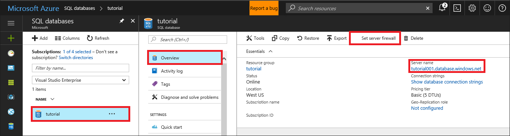
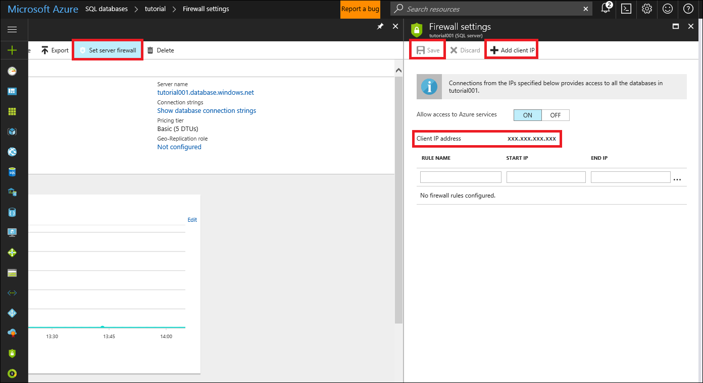
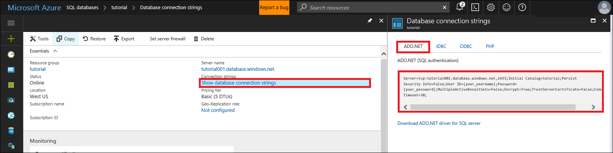
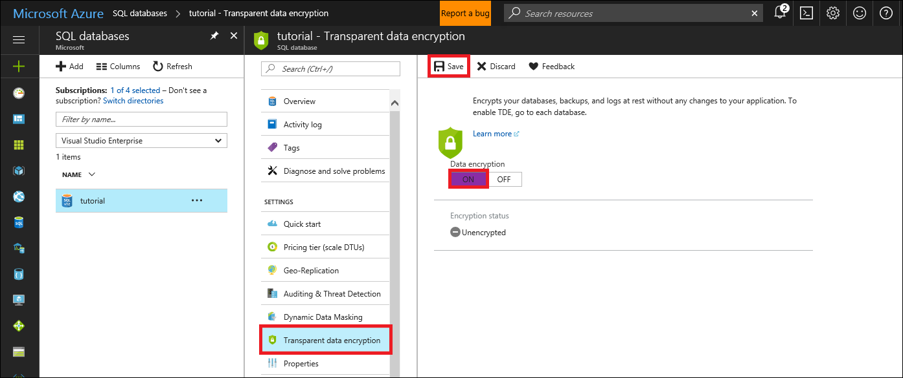
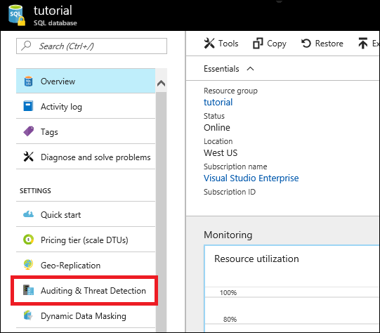
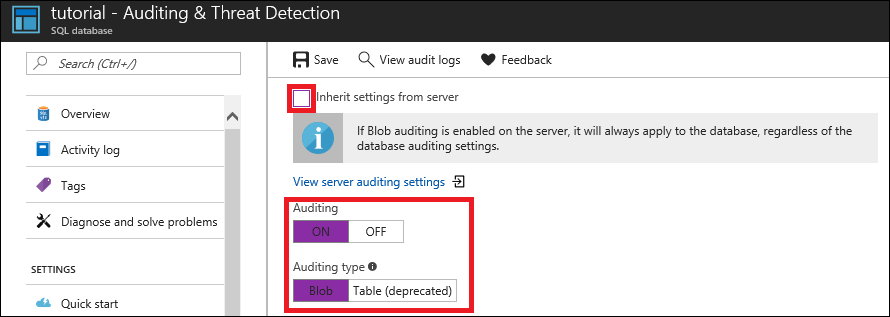
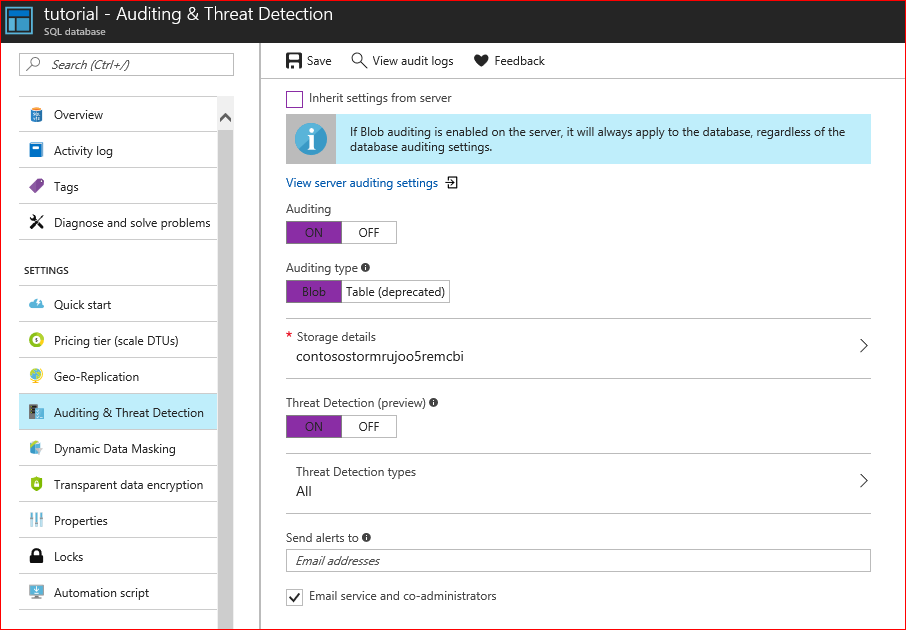
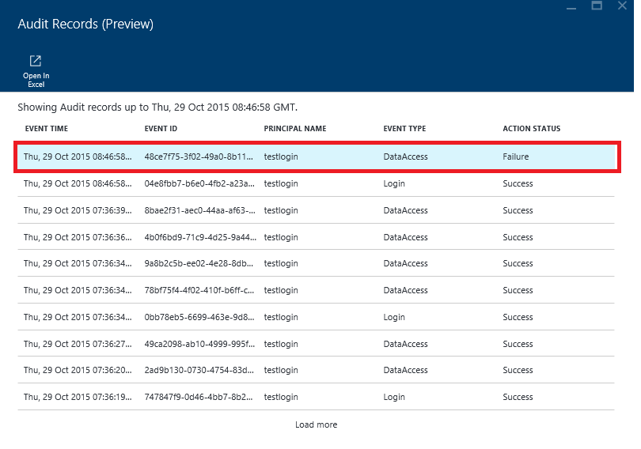
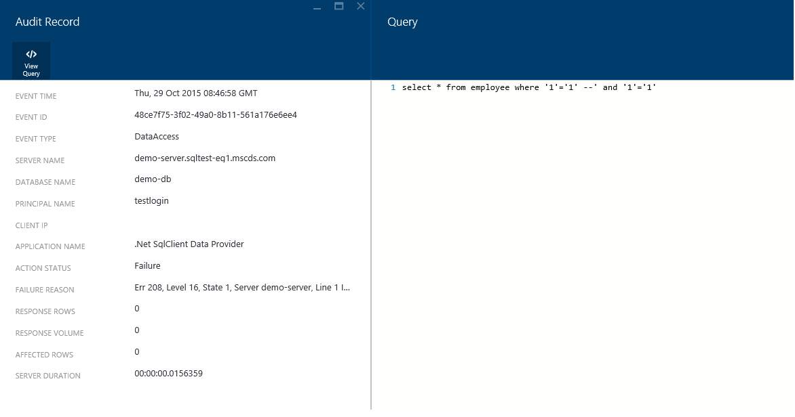

# Secure your Azure SQL Database

SQL Database secures your data by: 
- Limiting access to your database using firewall rules 
- Using authentication mechanisms that require their identity
- Authorization to data through role-based memberships and permissions, 
- Row-level security
- Dynamic data masking

SQL Database also has sophisticated monitoring, auditing, and threat detection. 

You can improve the protection of your database against malicious users or unauthorized access with just a few simple steps. In this tutorial you learn to: 

> [!div class="checklist"]
> * Set up server-level firewall rules for your server in the Azure portal
> * Set up database-level firewall rules for your database using SSMS
> * Connect to your database using a secure connection string
> * Manage user access
> * Protect your data with encryption
> * Enable SQL Database auditing
> * Enable SQL Database threat detection

If you don't have an Azure subscription, [create a free account](https://azure.microsoft.com/free/) before you begin.

## Prerequisites

To complete this tutorial, make sure you have the following:

- Installed the newest version of [SQL Server Management Studio](https://docs.microsoft.com/sql/ssms/download-sql-server-management-studio-ssms) (SSMS). 
- Installed Microsoft Excel
- Created an Azure SQL server and database - See [Create an Azure SQL database in the Azure portal](sql-database-get-started-portal.md), [Create a single Azure SQL database using the Azure CLI](sql-database-cli-samples.md), and [Create a single Azure SQL database using PowerShell](sql-database-powershell-samples.md). 

## Log in to the Azure portal

Sign in to the [Azure portal](https://portal.azure.com/).

## Create a server-level firewall rule in the Azure portal

SQL databases are protected by a firewall in Azure. By default, all connections to the server and the databases inside the server are rejected except for connections from other Azure services. For more information, see [Azure SQL Database server-level and database-level firewall rules](sql-database-firewall-configure.md).

The most secure configuration is to set 'Allow access to Azure services' to OFF. If you need to connect to the database from an Azure VM or cloud service, you should create a [Reserved IP](../virtual-network/virtual-networks-reserved-public-ip.md) and allow only the reserved IP address access through the firewall. 

Follow these steps to create a [SQL Database server-level firewall rule](sql-database-firewall-configure.md) for your server to allow connections from a specific IP address. 

> [!NOTE]
> If you have created a sample database in Azure using one of the previous tutorials or quickstarts and are performing this tutorial on a computer with the same IP address that it had when you walked through those tutorials, you can skip this step as you will have already created a server-level firewall rule.
>

1. Click **SQL databases** from the left-hand menu and click the database you would like to configure the firewall rule for on the **SQL databases** page. The overview page for your database opens, showing you the fully qualified server name (such as **mynewserver-20170313.database.windows.net**) and provides options for further configuration.

       

2. Click **Set server firewall** on the toolbar as shown in the previous image. The **Firewall settings** page for the SQL Database server opens. 

3. Click **Add client IP** on the toolbar to add the public IP address of the computer connected to the portal with or enter the firewall rule manually and then click **Save**.

       

4. Click **OK** and then click the **X** to close the **Firewall settings** page.

You can now connect to any database in the server with the specified IP address or IP address range.

> [!NOTE]
> SQL Database communicates over port 1433. If you are trying to connect from within a corporate network, outbound traffic over port 1433 may not be allowed by your network's firewall. If so, you will not be able to connect to your Azure SQL Database server unless your IT department opens port 1433.
>

## Create a database-level firewall rule using SSMS

Database-level firewall rules enable you to create different firewall settings for different databases within the same logical server and to create firewall rules that are portable - meaning that they follow the database during a [failover](sql-database-geo-replication-overview.md) rather than being stored on the SQL server. Database-level firewall rules can only be configured by using Transact-SQL statements and only after you have configured the first server-level firewall rule. For more information, see [Azure SQL Database server-level and database-level firewall rules](sql-database-firewall-configure.md).

Follows these steps to create a database-specific firewall rule.

1. Connect to your database, for example using [SQL Server Management Studio](./sql-database-connect-query-ssms.md).

2. In Object Explorer, right-click on the database you want to add a firewall rule for and click **New Query**. A blank query window opens that is connected to your database.

3. In the query window, modify the IP address to your public IP address and then execute the following query:

    ```sql
    EXECUTE sp_set_database_firewall_rule N'Example DB Rule','0.0.0.4','0.0.0.4';
    ```

4. On the toolbar, click **Execute** to create the firewall rule.

## View how to connect an application to your database using a secure connection string

To ensure a secure, encrypted connection between a client application and SQL Database, the connection string has to be configured to:

- Request an encrypted connection, and
- To not trust the server certificate. 

This establishes a connection using Transport Layer Security (TLS) and reduces the risk of man-in-the-middle attacks. You can obtain correctly configured connection strings for your SQL Database for supported client drivers from the Azure portal as shown for ADO.net in this screenshot. For information about TLS and connectivity, see [TLS considerations](sql-database-connect-query.md#tls-considerations-for-sql-database-connectivity).

1. Select **SQL databases** from the left-hand menu, and click your database on the **SQL databases** page.

2. On the **Overview** page for your database, click **Show database connection strings**.

3. Review the complete **ADO.NET** connection string.

    

## Creating database users

Before creating any users, you must first choose from one of two authentication types supported by Azure SQL Database: 

**SQL Authentication**, which uses username and password for logins and users that are valid only in the context of a specific database within a logical server. 

**Azure Active Directory Authentication**, which uses identities managed by Azure Active Directory. 

If you want to use [Azure Active Directory](./sql-database-aad-authentication.md) to authenticate against SQL Database, a populated Azure Active Directory must exist before you can proceed.

Follow these steps to create a user using SQL Authentication:

1. Connect to your database, for example using [SQL Server Management Studio](./sql-database-connect-query-ssms.md) using your server admin credentials.

2. In Object Explorer, right-click on the database you want to add a new user on and click **New Query**. A blank query window opens that is connected to the selected database.

3. In the query window, enter the following query:

    ```sql
    CREATE USER ApplicationUser WITH PASSWORD = 'YourStrongPassword1';
    ```

4. On the toolbar, click **Execute** to create the user.

5. By default, the user can connect to the database, but has no permissions to read or write data. To grant these permissions to the newly created user, execute the following two commands in a new query window

    ```sql
    ALTER ROLE db_datareader ADD MEMBER ApplicationUser;
    ALTER ROLE db_datawriter ADD MEMBER ApplicationUser;
    ```

It is best practice to create these non-administrator accounts at the database level to connect to your database unless you need to execute administrator tasks like creating new users. Please review the [Azure Active Directory tutorial](./sql-database-aad-authentication-configure.md) on how to authenticate using Azure Active Directory.


## Protect your data with encryption

Azure SQL Database transparent data encryption (TDE) automatically encrypts your data at rest, without requiring any changes to the application accessing the encrypted database. For newly created databases, TDE is on by default. To enable TDE for your database or to verify that TDE is on, follow these steps:

1. Select **SQL databases** from the left-hand menu, and click your database on the **SQL databases** page. 

2. Click on **Transparent data encryption** to open the configuration page for TDE.

    

3. If necessary, set **Data encryption** to ON and click **Save**.

The encryption process starts in the background. You can monitor the progress by connecting to SQL Database using [SQL Server Management Studio](./sql-database-connect-query-ssms.md) and querying the encryption_state column of the [sys.dm_database_encryption_keys](https://docs.microsoft.com/sql/relational-databases/system-dynamic-management-views/sys-dm-database-encryption-keys-transact-sql?view=sql-server-2017) view. A state of 3 indicates that the database is encrypted. 

## Enable SQL Database auditing, if necessary

Azure SQL Database Auditing tracks database events and writes them to an audit log in your Azure Storage account. Auditing can help you maintain regulatory compliance, understand database activity, and gain insight into discrepancies and anomalies that could indicate potential security violations. Follow these steps to create a default auditing policy for your SQL database:

1. Select **SQL databases** from the left-hand menu, and click your database on the **SQL databases** page. 

2. In the Settings blade, select **Auditing & Threat Detection**. Notice that server-level auditing is disabled and that there is a **View server settings** link that allows you to view or modify the server auditing settings from this context.

    

3. If you prefer to enable an Audit type (or location?) different from the one specified at the server level, turn **ON** Auditing, and choose the **Blob** Auditing Type. If server Blob auditing is enabled, the database-configured audit will exist side-by-side with the server Blob audit.

    

4. Select **Storage Details** to open the Audit Logs Storage Blade. Select the Azure storage account where logs will be saved, and the retention period, after which the old logs will be deleted, then click **OK** at the bottom. 

   > [!TIP]
   > Use the same storage account for all audited databases to get the most out of the auditing reports templates.
   > 

5. Click **Save**.

> [!IMPORTANT]
> If you want to customize the audited events, you can do this via PowerShell or REST API - see [SQL database auditing](sql-database-auditing.md) for more information.
>

## Enable SQL Database threat detection

Threat Detection provides a new layer of security, which enables customers to detect and respond to potential threats as they occur by providing security alerts on anomalous activities. Users can explore the suspicious events using SQL Database Auditing to determine if they result from an attempt to access, breach or exploit data in the database. Threat Detection makes it simple to address potential threats to the database without the need to be a security expert or manage advanced security monitoring systems.
For example, Threat Detection detects certain anomalous database activities indicating potential SQL injection attempts. SQL injection is one of the common Web application security issues on the Internet, used to attack data-driven applications. Attackers take advantage of application vulnerabilities to inject malicious SQL statements into application entry fields, for breaching or modifying data in the database.

1. Navigate to the configuration blade of the SQL database you want to monitor. In the Settings blade, select **Auditing & Threat Detection**.

    
2. In the **Auditing & Threat Detection** configuration blade turn **ON** auditing, which will display the threat detection settings.

3. Turn **ON** threat detection.

4. Configure the list of emails that will receive security alerts upon detection of anomalous database activities.

5. Click **Save** in the **Auditing & Threat detection** blade to save the new or updated auditing and threat detection policy.

    

    If anomalous database activities are detected, you will receive an email notification upon detection of anomalous database activities. The email will provide information on the suspicious security event including the nature of the anomalous activities, database name, server name and the event time. In addition, it will provide information on possible causes and recommended actions to investigate and mitigate the potential threat to the database. The next steps walk you through what to do should you receive such an email:

    

6. In the email, click on the **Azure SQL Auditing Log** link, which will launch the Azure portal and show the relevant auditing records around the time of the suspicious event.

    

7. Click on the audit records to view more information on the suspicious database activities such as SQL statement, failure reason and client IP.

    

8. In the Auditing Records blade, click  **Open in Excel** to open a pre-configured excel template to import and run deeper analysis of the audit log around the time of the suspicious event.

    > [!NOTE]
    > In Excel 2010 or later, Power Query and the **Fast Combine** setting is required.

    

9. To configure the **Fast Combine** setting - In the **POWER QUERY** ribbon tab, select **Options** to display the Options dialog. Select the Privacy section and choose the second option - 'Ignore the Privacy Levels and potentially improve performance':

    

10. To load SQL audit logs, ensure that the parameters in the settings tab are set correctly and then select the 'Data' ribbon and click the 'Refresh All' button.

    

11. The results appear in the **SQL Audit Logs** sheet which enables you to run deeper analysis of the anomalous activities that were detected, and mitigate the impact of the security event in your application.


## Next steps
In this tutorial, you learned to improve the protection of your database against malicious users or unauthorized access with just a few simple steps.  You learned how to: 

> [!div class="checklist"]
> * Set up firewall rules for your server and or database
> * Connect to your database using a secure connection string
> * Manage user access
> * Protect your data with encryption
> * Enable SQL Database auditing
> * Enable SQL Database threat detection

Advance to the next tutorial to learn how to implement a geo-distributed database.

> [!div class="nextstepaction"]
>[Implement a geo-distributed database](sql-database-implement-geo-distributed-database.md)

