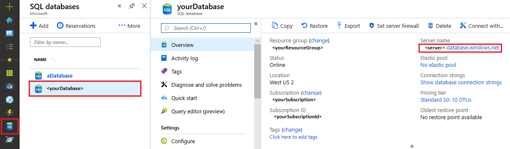
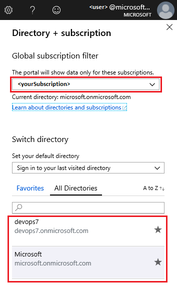
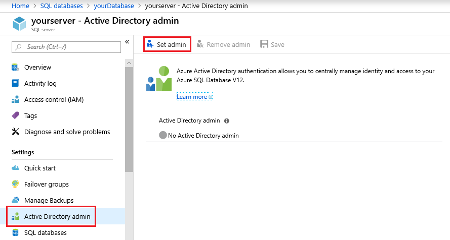
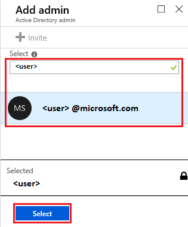
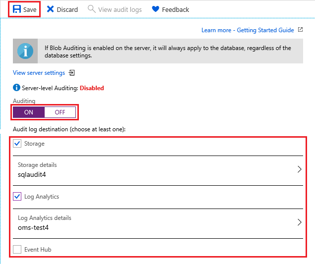
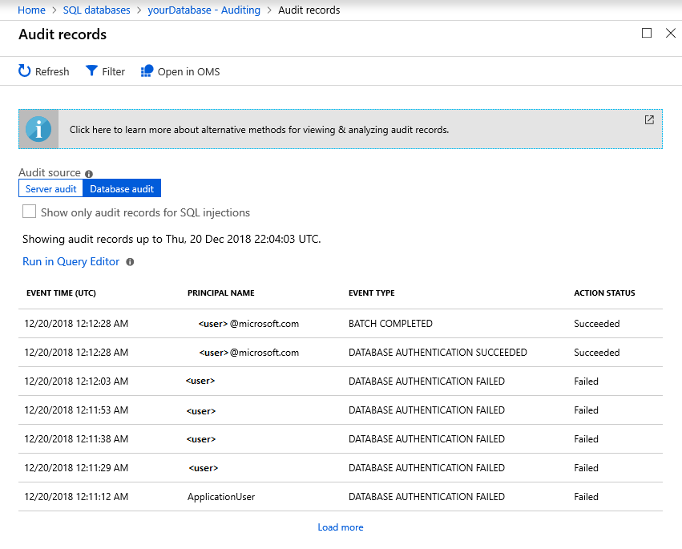
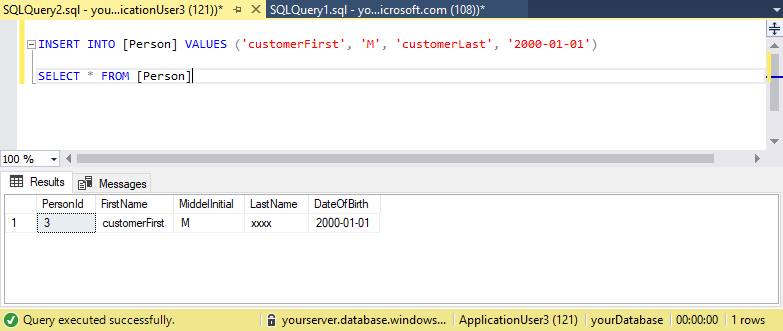

# Tutorial: Secure a single database in Azure SQL database

SQL database secures data in a single Azure SQL database by allowing you to:

- Limit access using firewall rules
- Use authentication mechanisms that require identity
- Use authorization with role-based memberships and permissions
- Enable security features

To learn more, see Azure SQL database security [overview](sql-database-security-index.md) and [capabilities](sql-database-security-overview.md).

> [!IMPORTANT]
> An Azure SQL database on a managed instance is secured using network security rules and private endpoints, see Azure SQL [database managed instance](sql-database-managed-instance-index.yml) and [connectivity architecture](sql-database-managed-instance-connectivity-architecture.md).

You can improve your database security with just a few simple steps. In this tutorial you learn how to:

> [!div class="checklist"]
> - Create server-level and database-level firewall rules
> - Configure an Azure Active Directory (AD) administrator
> - Manage user access with SQL and Azure AD authentication and secure connection strings
> - Enable **Security** features, such as threat protection, auditing, data masking, and encryption

If you don't have an Azure subscription, [create a free account](https://azure.microsoft.com/free/) before you begin.

## Prerequisites

To complete this tutorial, make sure you have the following prerequisites:

- [SQL Server Management Studio](/sql/ssms/download-sql-server-management-studio-ssms)
- An Azure SQL server and database (to create use [Azure portal](sql-database-get-started-portal.md), [CLI](sql-database-cli-samples.md), or [PowerShell](sql-database-powershell-samples.md))

## Sign in to the Azure portal

Sign in to the [Azure portal](https://portal.azure.com/).

## Create firewall rules

SQL databases are protected by firewalls in Azure. By default, all connections to the server and databases are rejected, except for connections from other Azure services. To learn more, see [Azure SQL database server-level and database-level firewall rules](sql-database-firewall-configure.md).

You can set **Allow access to Azure services** to **OFF** if you want the most secure configuration. Then, to connect from an Azure VM or cloud service, create a [reserved IP (classic deployment)](../virtual-network/virtual-networks-reserved-public-ip.md) and only allow that reserved IP address access through the firewall. If you're using the [resource manager](/azure/virtual-network/virtual-network-ip-addresses-overview-arm) deployment model, a dedicated public IP address is assigned to each resource that needs access.

> [!NOTE]
> SQL database communicates over port 1433. If you're trying to connect from within a corporate network, outbound traffic over port 1433 may not be allowed by your network's firewall. If so, you can't connect to the Azure SQL database server unless your administrator opens port 1433.

### Setup server-level firewall rules

Server-level firewall rules apply to all databases within the same logical server.

To setup a server-level firewall rule:

1. Select **SQL databases** from the left-hand menu. On the **SQL databases** page, select the database you'd like to configure. The **Overview** page opens, showing you the fully qualified server name (such as *yourserver.database.windows.net*) and provides options for further configuration.

    

1. Select **Set server firewall** on the toolbar. The **Firewall settings** page for the database server opens.

    1. Select **Add client IP** on the toolbar to add your current IP address to a new firewall rule. A firewall rule can open port 1433 for a single IP address or a range of IP addresses. Choose **Save**.

    

    1. Select **OK** and close the **Firewall settings** page.

You can now connect to any database in the server with the specified IP address or IP address range.

> [!IMPORTANT]
> By default, access through the SQL database firewall is enabled for all Azure services. Choose **OFF** on this page to disable for all Azure services.

### Setup database-level firewall rules

Database-level firewall rules apply only to individual databases. These rules are portable and follow the database during a server failover. Database-level firewall rules can only be configured using Transact-SQL (T-SQL) statements, and only after you've configured a server-level firewall rule.

To setup a database-level firewall rule:

1. Connect to your database, for example using [SQL Server Management Studio](./sql-database-connect-query-ssms.md).

1. In **Object Explorer**, right-click the database and select **New Query**. A blank query window opens that's connected to your selected database.

1. In the query window, add this statement and modify the IP address to your public IP address:

    ```sql
    EXECUTE sp_set_database_firewall_rule N'Example DB Rule','0.0.0.4','0.0.0.4';
    ```

1. On the toolbar, select **Execute** to create the firewall rule.

> [!NOTE]
> You can also create a server-level firewall rule in SSMS by using the [sp-set-firewall-rule](/sql/relational-databases/system-stored-procedures/sp-set-firewall-rule-azure-sql-database?view=azuresqldb-current) command, though you must be connected to the *master* database.

## Create an Azure AD admin

Make sure you've either configured Azure Active Directory (AD) or are using an initial Azure AD managed domain. To select the AD domain, use the upper-right corner of the Azure portal. This process confirms the same subscription is used for both Azure AD and the SQL Server hosting your Azure SQL database or data warehouse.



For information about configuring Azure AD, see:

- [Integrate your on-premises identities with Azure AD](../active-directory/hybrid/whatis-hybrid-identity.md)
- [Add your own domain name to Azure AD](../active-directory/active-directory-domains-add-azure-portal.md)
- [Microsoft Azure now supports federation with Windows Server AD](https://azure.microsoft.com/blog/2012/11/28/windows-azure-now-supports-federation-with-windows-server-active-directory/)
- [Administer your Azure AD directory](../active-directory/fundamentals/active-directory-administer.md)
- [Manage Azure AD using PowerShell](/powershell/azure/overview?view=azureadps-2.0)
- [Hybrid identity required ports and protocols](../active-directory/hybrid/reference-connect-ports.md)

To set the Azure AD administrator:

1. In the Azure portal, on the **SQL server** page, select **Active Directory admin**. Next select **Set admin**.

      

    > [!IMPORTANT]
    > You need to be either a "Company Administrator" or "Global Administrator" to perform this task.

1. On the **Add admin** page, search and select the AD user or group and choose **Select**. All members and groups of your Active Directory are listed and any entries grayed out are not supported as Azure AD administrators. See the **Azure AD features and limitations** section of [Use Azure AD authentication with SQL database or SQL data warehouse](sql-database-aad-authentication.md).

    

    > [!IMPORTANT]
    > Role-based access control (RBAC) only applies to the portal and isn't propagated to SQL Server.

1. At the top of the **Active Directory admin** page, select **Save**.

    The process of changing an administrator may take several minutes. The new administrator will appear in the **Active Directory admin** box.

    > [!NOTE]
    > When setting an Azure AD admin, the new admin name (user or group) cannot be present as a SQL Server authentication user in the virtual master database. If present, the Azure AD admin setup will fail and rollback, indicating that such an admin name already exists. Since such a SQL Server authentication user is not part of Azure AD, any effort to connect to the server using Azure AD authentication fails.

## Manage database access

Manage database access by adding users to the database, or by allowing user access with secure connection strings. Connection strings are useful for external applications. To learn more, see Azure SQL [access control](sql-database-control-access.md) and [AD authentication](sql-database-aad-authentication.md).

To add users, first choose the Azure SQL database authentication type:

- **SQL Authentication**, users have a username and password for logins, and are only valid in the context of a specific database within the server

- **Azure AD Authentication**, users have identities managed by Azure AD

### Add user with SQL authentication

1. Connect to the database, for example using [SQL Server Management Studio](./sql-database-connect-query-ssms.md).

1. In **Object Explorer**, right-click the database and choose **New Query**. A blank query window opens that's connected to your selected database.

1. In the query window, enter the following command:

    ```sql
    CREATE USER ApplicationUser WITH PASSWORD = 'YourStrongPassword1';
    ```

1. On the toolbar, select **Execute** to create the user.

1. By default, the user can connect to the database, but has no permissions to read or write data. To grant these permissions, execute the following commands in a new query window:

    ```sql
    ALTER ROLE db_datareader ADD MEMBER ApplicationUser;
    ALTER ROLE db_datawriter ADD MEMBER ApplicationUser;
    ```

> [!NOTE]
> Create non-administrator accounts at the database level, unless they need to execute administrator tasks like creating new users.

### Add user with Azure AD authentication

Azure Active Directory authentication requires that database users are created as *contained*. A *contained* database user based on an Azure AD identity, has no login in the master database, and maps to an identity in the Azure AD directory associated with the database. The Azure AD identity can either be an individual user or a group. For more information about contained database users, see [Contained database users, make your database portable](https://msdn.microsoft.com/library/ff929188.aspx).

Review the [Azure AD tutorial](./sql-database-aad-authentication-configure.md) on how to authenticate using Azure AD.

> [!NOTE]
> Database users (excluding administrators) cannot be created using the Azure portal. Azure RBAC roles are not propagated to SQL Server, database, or data warehouse, are only used to manage Azure resources, and don't apply to database permissions. For example, the *SQL Server Contributor* role does not grant access to connect to the SQL database or data warehouse. This access permission must be granted directly in the database using T-SQL statements.

> [!WARNING]
> Special characters like  colon `:` or ampersand `&` when included as user names in the T-SQL `CREATE LOGIN` and `CREATE USER` statements are not supported.

1. Connect to your Azure SQL Server using an Azure AD account with at least the **ALTER ANY USER** permission.

1. In **Object Explorer**, right-click the database and select **New Query**. A blank query window opens that's connected to your selected database.

1. In the query window, enter the following command. Modify `<Azure_AD_principal_name>` to the principal name of the Azure AD user or the display name of the Azure AD group.

   ```sql
   CREATE USER <Azure_AD_principal_name> FROM EXTERNAL PROVIDER;
   ```

   > [!NOTE]
   > Azure AD users are marked in the database metadata with type *E (EXTERNAL_USER)*, and for groups with type *X (EXTERNAL_GROUPS)*. For more information, see [sys.database_principals](/sql/relational-databases/system-catalog-views/sys-database-principals-transact-sql).

### Allow access using a secure connection string

To ensure a secure, encrypted connection between a client application and SQL database, the connection string has to be configured to:

- Request an encrypted connection
- Not trust the server certificate

This establishes a connection using Transport Layer Security (TLS) and reduces the risk of man-in-the-middle attacks. You can copy pre-configured connection strings for your SQL database to support client drivers such as ADO.NET, JDBC, ODBC, and PHP. For information about TLS and connectivity, see [TLS considerations](sql-database-connect-query.md#tls-considerations-for-sql-database-connectivity).

Follow these steps in the Azure portal to copy a connection string:

1. Select **SQL databases** from the left-hand menu, and select your database on the **SQL databases** page.

1. On the **Overview** page, select **Show database connection strings**.

1. Review the complete **ADO.NET** connection string.

    

## Enable security features

Azure SQL database provides security features that can be accessed using the Azure portal. All features are available at both the database and server level, except data masking, which is only available on the databases. To learn more, see [Advanced threat detection](sql-advanced-threat-protection.md), [Auditing](sql-database-auditing.md), [Dynamic data masking](sql-database-dynamic-data-masking-get-started.md), and [Transparent data encryption](transparent-data-encryption-azure-sql.md).

### Advanced Threat Protection

The advanced threat detection feature detects potential threats as they occur and provides security alerts on anomalous activities. Users can explore suspicious events using the auditing feature, and determine if the event was to access, breach, or exploit data in the database. Users are also provided a security overview that includes the a vulnerability assessment and the data discovery and classification tool.

> [!NOTE]
> An example threat is SQL injection, a common security issue on the web, where attackers attempt to exploit application vulnerabilities by injecting malicious SQL statements into input fields, allowing them access to breach or modify data in the database.

1. Select **SQL databases** from the left-hand menu, and select your database on the **SQL databases** page. On the **Overview** page, select the **Server name** link.

1. On the **SQL server** page, find the **Security** blade and select **Advanced Threat Detection**.

1. Choose **ON** under **Advanced Threat Detection** to enable the feature. You can also configure which emails to receive security alerts, set storage details, and select threat detection types.

1. Choose **Save**.

    

To fully utilize the threat detection features, return to the **SQL databases** page of your database and select **Advanced Threat Detection** under the **Security** section. Here you'll find various security indicators available for your database.


If anomalous activities are detected, you'll receive an email notification with information on the security event. This will include the nature of the anomalous activities, database name, server name, event time, and possible causes and recommended actions to investigate and mitigate the potential threat. If such an email is received, choose the **Azure SQL Auditing Log** link to launch the Azure portal and show relevant auditing records at the time of the event.


### Enable Auditing

The auditing feature tracks database events and writes events to an audit log in either Azure Storage, log analytics, or to an event hub. Auditing helps maintain regulatory compliance, understand database activity, and gain insight into discrepancies and anomalies that could indicate potential security violations.

Use these steps to create a default auditing policy for your SQL database:

1. Select **SQL databases** from the left-hand menu, and select your database on the **SQL databases** page. In the **Security** blade, select **Auditing**.

1. Under **Auditing** settings, set the following values:

    1. Set **Auditing** to **ON**.

    1. Choose the **Audit log destination** as any of the following:

        - **Storage**, an Azure storage account where the logs can be saved and downloaded as *.xel* files

           > [!TIP]
           > Use the same storage account for all audited databases to get the most out of the auditing reports templates.

        - **Log Analytics**, automatically stores events for query or further analysis

            > [!NOTE]
            > A **Log analytics workspace** is required to support advanced features such as analytics, custom alert rules, and Excel or Power BI exports. Without a workspace, only the query editor is available.

        - **Event Hub**, allows events to be routed for use in other applications

    When finished, choose **Save**.

    

1. Once enabled, select **View audit logs** to see your database events data.

    

> [!IMPORTANT]
> See [SQL database auditing](sql-database-auditing.md) for information on how to further customize audit events using PowerShell or REST API.

### Enable Dynamic Data Masking

Azure SQL database dynamic data masking will automatically hide sensitive data in your database.

To enable dynamic data masking, use the following steps:

1. Select **SQL databases** from the left-hand menu, and select your database on the **SQL databases** page.

1. Under **Security**, select **Dynamic Data Masking** to open the configuration page.

1. Under **Dynamic data masking** settings, select **Add mask** to add a masking rule. Azure will automatically populate available database schemas, tables, and columns to choose from.

    

1. Select **Save**. All information selected is now masked for privacy.

    

### Enable Transparent Data Encryption

Azure SQL database Transparent Data Encryption (TDE) automatically encrypts your data at rest, and requires no changes to the applications accessing the encrypted database. For new databases, TDE is on by default. To encrypt your data using SSMS and the **Always encrypted** feature, see [Always encrypted](sql-database-always-encrypted.md).

To enable or verify TDE for your database, use the following steps:

1. Select **SQL databases** from the left-hand menu, and select your database on the **SQL databases** page.

1. Under **Security**, select **Transparent data encryption** to open the configuration page.

1. If necessary, set **Data encryption** to **ON** and choose **Save**.

    

> [!NOTE]
> You can view encryption status by connecting to database using [SSMS](./sql-database-connect-query-ssms.md) and querying the `encryption_state` column of the [sys.dm_database_encryption_keys](/sql/relational-databases/system-dynamic-management-views/sys-dm-database-encryption-keys-transact-sql?view=sql-server-2017) view. A state of `3` indicates the database is encrypted.

## Next steps

In this tutorial, you've learned to improve the security of your database with just a few simple steps. You learned how to:

> [!div class="checklist"]
> - Create server-level and database-level firewall rules
> - Configure an Azure Active Directory (AD) administrator
> - Manage user access with SQL and Azure AD authentication and secure connection strings
> - Enable **Security** features, such as threat protection, auditing, data masking, and encryption

Advance to the next tutorial to learn how to implement geo-distribution.

> [!div class="nextstepaction"]
>[Implement a geo-distributed database](sql-database-implement-geo-distributed-database.md)
