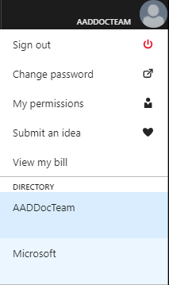

# Tutorial: Secure a single database in Azure SQL database

SQL database secures data in a single Azure SQL database by:

- Limiting access using firewall rules
- Using authentication mechanisms that require identity
- Using authorization with role-based memberships and permissions

Azure SQL database also offers **Security** features, such as Advanced Threat Protection, Auditing (monitoring), Dynamic Data Masking, and Transparent Data Encryption, to help secure your database.

> [!IMPORTANT]
> An Azure SQL database in a managed instance is secured with network security rules and private endpoints. For more information, see [Azure SQL database managed instance](sql-database-managed-instance-index.yml) and [Azure SQL database managed instance connectivity architecture](sql-database-managed-instance-connectivity-architecture.md).

You can improve your database security with just a few simple steps. In this tutorial you learn how to:

> [!div class="checklist"]
> - Create server-level and database-level firewall rules
> - Configure an Azure Active Directory administrator for Azure SQL
> - Manage user access with SQL and Azure AD authentication
> - Enable Azure SQL **Security** features, such as Advanced Threat Protection, Auditing, Dynamic Data Masking, and Transparent Data Encryption

If you don't have an Azure subscription, [create a free account](https://azure.microsoft.com/free/) before you begin.

## Prerequisites

To complete this tutorial, make sure you have the following:

- [SQL Server Management Studio](/sql/ssms/download-sql-server-management-studio-ssms) (SSMS)
- An Azure SQL server and database, see how to create an Azure SQL database in the [Azure portal](sql-database-get-started-portal.md), [CLI](sql-database-cli-samples.md), and [PowerShell](sql-database-powershell-samples.md)

> [!NOTE]
> This tutorial assumes you have either configured Azure Active Directory or that you're using the initial Azure Active Directory managed domain. For information about configuring Azure Active Directory, see [Integrating your on-premises identities with Azure AD](../active-directory/hybrid/whatis-hybrid-identity.md), [Add your own domain name to Azure AD](../active-directory/active-directory-domains-add-azure-portal.md), [Microsoft Azure now supports federation with Windows Server Active Directory](https://azure.microsoft.com/blog/2012/11/28/windows-azure-now-supports-federation-with-windows-server-active-directory/), [Administering your Azure AD directory](../active-directory/fundamentals/active-directory-administer.md), [Manage Azure AD using Windows PowerShell](/powershell/azure/overview?view=azureadps-2.0), and [Hybrid identity required ports and protocols](../active-directory/hybrid/reference-connect-ports.md).

## Log in to the Azure portal

Sign in to the [Azure portal](https://portal.azure.com/).

## Create a firewall rule

SQL databases are protected by a firewall in Azure. By default, all connections to the server and the databases inside the server are rejected except for connections from other Azure services. For more information, see [Azure SQL database server-level and database-level firewall rules](sql-database-firewall-configure.md).

The most secure configuration is to set **Allow access to Azure services** to **OFF**. To connect to the database from an Azure VM or cloud service, you should create a [Reserved IP (classic deployment)](../virtual-network/virtual-networks-reserved-public-ip.md) and only allow the reserved IP address access through the firewall. If you're using the [Resource Manager](/azure/virtual-network/virtual-network-ip-addresses-overview-arm) deployment model, a dedicated public IP address is assigned to the resource, and you should allow this IP address through the firewall.

### Setup server-level firewall rules

Follow these steps to create a [SQL database server-level firewall rule](sql-database-firewall-configure.md) for your server to allow connections from a specific IP address.

1. Click **SQL databases** from the left-hand menu and click the database you would like to configure the firewall rule for on the **SQL databases** page. The overview page for your database opens, showing you the fully qualified server name (such as *yourserver.database.windows.net*) and provides options for further configuration.

   

1. Click **Set server firewall** on the toolbar as shown in the previous image. The **Firewall settings** page for the SQL Database server opens.

1. Click **Add client IP** on the toolbar to add the public IP address of the computer connected to the portal with or enter the firewall rule manually and then click **Save**.

   

1. Click **OK** and then click the **X** to close the **Firewall settings** page.

You can now connect to any database in the server with the specified IP address or IP address range.

> [!NOTE]
> SQL database communicates over port 1433. If you are trying to connect from within a corporate network, outbound traffic over port 1433 may not be allowed by your network's firewall. If so, you will not be able to connect to your Azure SQL database server unless your administrator opens port 1433.

### Setup database-level firewall rules

Database-level firewall rules enable you to create different firewall settings for different databases within the same logical server and to create firewall rules that are portable - they follow the database during a server failover. Database-level firewall rules can only be configured using T-SQL statements and only after you have configured the first server-level firewall rule.

Follows these steps to create a database-specific firewall rule.

1. Connect to your database, for example using [SQL Server Management Studio](./sql-database-connect-query-ssms.md).

1. In **Object Explorer**, right-click on the database you want to add a firewall rule for and click **New Query**. A blank query window opens that is connected to your database.

1. In the query window, modify the IP address to your public IP address and then execute the following query:

    ```sql
    EXECUTE sp_set_database_firewall_rule N'Example DB Rule','0.0.0.4','0.0.0.4';
    ```

1. On the toolbar, click **Execute** to create the firewall rule.

## Create an Azure Active Directory administrator

Provision an Azure Active Directory administrator for your Azure SQL server in the Azure portal.

1. In the [Azure portal](https://portal.azure.com/), in the upper-right corner, select your connection to drop down a list of possible Active Directories. Choose the correct Active Directory as the default Azure AD. This step links the subscription-associated Active Directory with Azure SQL server making sure that the same subscription is used for both Azure AD and SQL Server. (The Azure SQL server can be hosting either Azure SQL Database or Azure SQL Data Warehouse.)

    

1. On **SQL Server** page, select **Active Directory admin**, and on the **Active Directory admin** page, select **Set admin**.
      

   > [!IMPORTANT]
   > You need to be a "Company Administrator" or a "Global Administrator" to perform this task.

1. In the **Add admin** page, search for a user, select the user or group to be an administrator, and then select **Select**. (The Active Directory admin page shows all members and groups of your Active Directory. Users or groups that are grayed out cannot be selected because they are not supported as Azure AD administrators. (See the list of supported admins in the **Azure AD Features and Limitations** section of [Use Azure Active Directory Authentication for authentication with SQL Database or SQL Data Warehouse](sql-database-aad-authentication.md).) Role-based access control (RBAC) applies only to the portal and is not propagated to SQL Server.
      

1. At the top of the **Active Directory admin** page, select **SAVE**.
    

The process of changing the administrator may take several minutes. Then the new administrator appears in the **Active Directory admin** box.

   > [!NOTE]
   > When setting up the Azure AD admin, the new admin name (user or group) cannot already be present in the virtual master database as a SQL Server authentication user. If present, the Azure AD admin setup will fail; rolling back its creation and indicating that such an admin (name) already exists. Since such a SQL Server authentication user is not part of the Azure AD, any effort to connect to the server using Azure AD authentication fails.

## Manage database users

Before managing users, choose the Azure SQL database authentication type:

- *SQL Authentication*, uses username and password for logins. Users are only valid in the context of a specific database within the server.

- *Azure Active Directory Authentication*, uses identities managed by Azure Active Directory/

## View how to connect an application to your database using a secure connection string

To ensure a secure, encrypted connection between a client application and SQL database, the connection string has to be configured to:

- Request an encrypted connection, and
- To not trust the server certificate.

This establishes a connection using Transport Layer Security (TLS) and reduces the risk of man-in-the-middle attacks. You can obtain correctly configured connection strings for your SQL Database for supported client drivers from the Azure portal as shown for ADO.net in this screenshot. For information about TLS and connectivity, see [TLS considerations](sql-database-connect-query.md#tls-considerations-for-sql-database-connectivity).

1. Select **SQL databases** from the left-hand menu, and click your database on the **SQL databases** page.

2. On the **Overview** page for your database, click **Show database connection strings**.

3. Review the complete **ADO.NET** connection string.

    

### Create a user with SQL authentication

Follow these steps to create a user using SQL authentication:

1. Connect to your database, for example using [SQL Server Management Studio](./sql-database-connect-query-ssms.md) using your server admin credentials.

1. In **Object Explorer**, right-click on the database you want to add a new user on and click **New Query**. A blank query window opens that is connected to the selected database.

1. In the query window, enter the following query:

    ```sql
    CREATE USER ApplicationUser WITH PASSWORD = 'YourStrongPassword1';
    ```

1. On the toolbar, click **Execute** to create the user.

1. By default, the user can connect to the database, but has no permissions to read or write data. To grant these permissions to the newly created user, execute the following two commands in a new query window

    ```sql
    ALTER ROLE db_datareader ADD MEMBER ApplicationUser;
    ALTER ROLE db_datawriter ADD MEMBER ApplicationUser;
    ```

It is best practice to create these non-administrator accounts at the database level to connect to your database unless you need to execute administrator tasks like creating new users. Please review the [Azure Active Directory tutorial](./sql-database-aad-authentication-configure.md) on how to authenticate using Azure Active Directory.

### Create a user using Azure Active Directory authentication

Azure Active Directory authentication requires database users to be created as contained database users. A contained database user based on an Azure AD identity, is a database user that does not have a login in the master database, and which maps to an identity in the Azure AD directory that is associated with the database. The Azure AD identity can be either an individual user account or a group. For more information about contained database users, see [Contained Database Users- Making Your Database Portable](https://msdn.microsoft.com/library/ff929188.aspx).

> [!NOTE]
> Database users (with the exception of administrators) cannot be created using the Azure portal. RBAC roles are not propagated to SQL Server, SQL Database, or SQL Data Warehouse. Azure RBAC roles are used for managing Azure Resources, and do not apply to database permissions. For example, the **SQL Server Contributor** role does not grant access to connect to the SQL Database or SQL Data Warehouse. The access permission must be granted directly in the database using Transact-SQL statements.
> [!WARNING]
> Special characters like  colon `:` or ampersand `&` when included as user names in the T-SQL CREATE LOGIN and CREATE USER statements are not supported.

1. Connect to your Azure SQL Server using an Azure Active Directory account with at least the **ALTER ANY USER** permission.

1. In **Object Explorer**, right-click on the database you want to add a new user on and click **New Query**. A blank query window opens that is connected to the selected database.

1. In the query window, enter the following query and modify `<Azure_AD_principal_name>` to the desired user principal name of an Azure AD user or the display name for an Azure AD group:

   ```sql
   CREATE USER <Azure_AD_principal_name> FROM EXTERNAL PROVIDER;
   ```

   > [!NOTE]
   > Azure AD users are marked in the database metadata with type E (EXTERNAL_USER) and for groups with type X (EXTERNAL_GROUPS). For more information, see [sys.database_principals](/sql/relational-databases/system-catalog-views/sys-database-principals-transact-sql).

## Enable security features

Azure SQL database provides easy to implement **Security** features, accessed through the Azure portal. All security features, excluding **Dynamic Data Masking**, are available for either single Azure SQL databases, or the server itself. The tutorial is geared towards individual database setup.

### Setup Advanced Threat Protection

Advanced Threat Detection enables customers to detect potential threats as they occur and provide security alerts on anomalous activities. Users can explore the suspicious events with the **Auditing** feature, to determine if it was an attempt to access, breach, or exploit data in the database. Users are also provided a security overview that includes a **Vulnerability Assessment** and **Data Discovery and Classification**.

> [!TIP]
> A current threat is SQL injection attempts. SQL injection is a common security issue on the web, where attackers try to take advantage of application vulnerabilities and inject malicious SQL statements into application entry fields, for breaching or modifying data in the database.

1. Navigate to the configuration blade of the SQL database you want to monitor. In the Settings blade, select **Auditing & Threat Detection**.

    

1. In the **Auditing & Threat Detection** configuration blade turn **ON** auditing, which will display the threat detection settings.

1. Turn **ON** threat detection.

1. Configure the list of emails that will receive security alerts upon detection of anomalous database activities.

1. Click **Save** in the **Auditing & Threat detection** blade to save the new or updated auditing and threat detection policy.

    

    If anomalous database activities are detected, you will receive an email notification upon detection of anomalous database activities. The email will provide information on the suspicious security event including the nature of the anomalous activities, database name, server name and the event time. In addition, it will provide information on possible causes and recommended actions to investigate and mitigate the potential threat to the database. The next steps walk you through what to do should you receive such an email:

    

1. In the email, click on the **Azure SQL Auditing Log** link, which will launch the Azure portal and show the relevant auditing records around the time of the suspicious event.

    

1. Click on the audit records to view more information on the suspicious database activities such as SQL statement, failure reason and client IP.

    

1. In the Auditing Records blade, click  **Open in Excel** to open a pre-configured excel template to import and run deeper analysis of the audit log around the time of the suspicious event.
...add Excel replacement?

### Setup Auditing

Azure SQL database auditing tracks database events and writes them to an audit log in either an Azure Storage account or for use in Log Analytics or an Event Hub. Auditing helps you maintain regulatory compliance, understand database activity, and gain insight into discrepancies and anomalies that could indicate potential security violations. Follow these steps to create a default auditing policy for your SQL database:

1. Select **SQL databases** from the left-hand menu, and click your database on the **SQL databases** page.

1. In the **Settings** blade, select **Auditing & Threat Detection**. Notice that server-level auditing is disabled and that there is a **View server settings** link that allows you to view or modify the server auditing settings from this context.

    

1. If you prefer to enable an Audit type (or location?) different from the one specified at the server level, turn **ON** Auditing, and choose the **Blob** Auditing Type. If server Blob auditing is enabled, the database-configured audit will exist side-by-side with the server Blob audit.

    

1. Select **Storage Details** to open the Audit Logs Storage Blade. Select the Azure storage account where logs will be saved, and the retention period, after which the old logs will be deleted, then click **OK** at the bottom.

   > [!TIP]
   > Use the same storage account for all audited databases to get the most out of the auditing reports templates.

1. Click **Save**.

> [!IMPORTANT]
> If you want to customize the audited events, you can do this via PowerShell or REST API - see [SQL database auditing](sql-database-auditing.md) for more information.

### Setup Dynamic Data Masking

### Setup Transparent Data Encryption

Azure SQL database Transparent Data Encryption (TDE) automatically encrypts your data at rest, without requiring changes to the application accessing the encrypted database. For newly created databases, TDE is on by default. To enable or verify TDE for your database, follow these steps:

1. In Azure portal, select **SQL databases** from the left-hand menu, then select your database.

1. Under **Security**, select **Transparent data encryption** to open the configuration page for TDE.

    

1. If necessary, set **Data encryption** to **ON** and select **Save**.

> [!NOTE]
> You can also view encryption status by connecting to database using [SQL Server Management Studio](./sql-database-connect-query-ssms.md) and querying the `encryption_state` column of the [sys.dm_database_encryption_keys](/sql/relational-databases/system-dynamic-management-views/sys-dm-database-encryption-keys-transact-sql?view=sql-server-2017) view. A state of `3` indicates the database is encrypted.

## Next steps

In this tutorial, you learned to improve the security of your database with just a few simple steps. You learned how to:

> [!div class="checklist"]
> - Create server-level and database-level firewall rules
> - Configure an Azure Active Directory administrator for Azure SQL
> - Manage user access
> - Enable **Security** features: Advanced Threat Protection, Auditing, Dynamic Data Masking, Transparent data encryption

Advance to the next tutorial to learn how to implement a geo-distributed database.

> [!div class="nextstepaction"]
>[Implement a geo-distributed database](sql-database-implement-geo-distributed-database.md)
