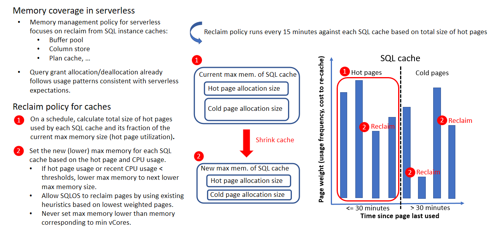
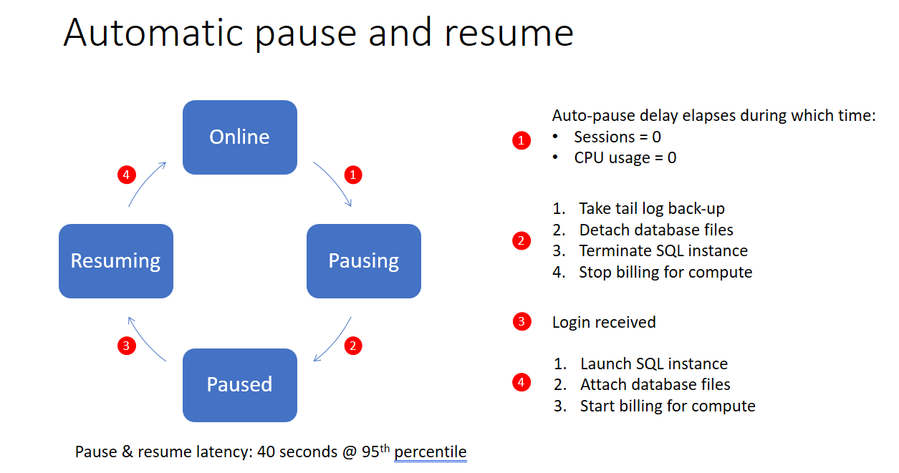
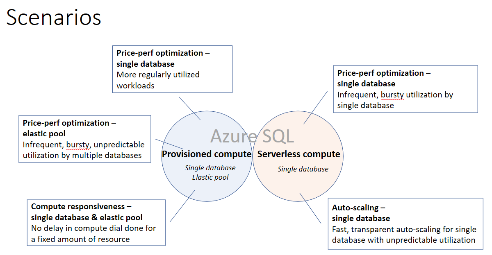
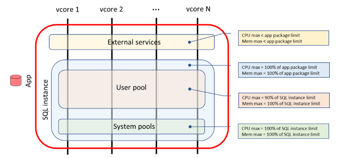

# SQL Database serverless (preview) provides compute and memory resources only as needed

Application development unburdened by resource management is a cornerstone of serverless computing in the cloud.  In this paradigm, the provisioning of a fixed amount of compute resources is unnecessary. When a single database is deployed using the serverless provisioning option, the SQL Database service automatically and transparently scales resources to satisfy workload demand and only charges for the amount of compute resources actually consumed. This enables very high resolution price optimization without management complexity and without impacting application performance or availability.

The serverless provisioning option within SQL Database is a new deployment option for single databases that bills for the amount of compute and memory used on a per second basis, plus the amount of storage provisioned. In contrast, the provisioned deployment option bills for the amount of compute and memory provisioned on an hourly basis, plus the amount of storage provisioned.

## How does serverless work

When you deploy a single database using the serverless provisioning option, you configure the following parameters:

- Max vCores (max compute level)
- Min vCores (min compute level)
- Auto-pause delay (inactivity period)

Memory and IO limits are proportional to the vCore range specified.

Based on the configuration values of these parameters, the SQL Database service provides resources to your workload as follows:

- Provides the maximum compute capacity when your workload requires it
- Provides the minimum computer capacity when your workload does not require it
- Automatically pauses your database when your workload has been inactive for the period specified

> [!NOTE]
> Serverless is only available with the vCore-based purchasing model.

### How quickly are resources provided to a serverless database when online

In general, databases are run on a machine with sufficient capacity to satisfy resource demand without interruption for any amount of compute requested within limits set by max vCores.  Occasionally, load balancing automatically occurs if the machine is unable to satisfy resource demand within a few minutes. The database remains online during load balancing except for a brief period at the end of the operation when connections are dropped.

### How is memory managed in serverless

Memory for serverless databases is reclaimed more frequently than for provisioned compute databases. This is important to control costs in serverless. The following table illustrates the memory management policy for serverless.



#### Cache reclaiming

Unlike provisioned compute, memory from the SQL cache is reclaimed from a serverless database when CPU or cache utilization is low. In both serverless and provisioned compute, cache entries can be evicted if all available memory is used.

Cache utilization is considered low when the total size of the most recently used cache entries falls below a threshold for a period of time.

When cache reclamation is triggered, the target cache size is reduced incrementally to a fraction of its previous size and reclaiming only continues if usage remains low.

When cache reclamation occurs, the policy for selecting cache entries to evict is the same selection policy as for provisioned compute databases when memory pressure is high.

The cache size is never reduced below the minimum memory as defined by minimum vCores.

#### Cache hydration

The SQL cache grows as data is fetched from disk in the same way and with the same speed as for provisioned compute databases. The cache is allowed to grow unconstrained up to the max memory limit when the database is busy.

### How does auto-pause and auto-resume work in serverless

#### Auto-pause

Auto-pause is triggered if all of the following conditions are true for the duration of the auto-pause delay:

- Number sessions = 0
- CPU = 0 (for user workload running in the user pool)

An option is provided to disable auto-pause if desired.



#### Auto-resume

Auto-resume is triggered if any of the following conditions are true at any time:

|Feature|Auto-resume trigger|
|---|---|
|Authentication and authorization|Login|
|Threat detection|Enabling/disabling threat detection settings at the database or server level.<br>Modifying threat detection settings at the database or server level.|
|Data discovery and classification|Adding, modifying, deleting, or viewing sensitivity labels.|
|Auditing|Viewing auditing records.<br>Updating or viewing auditing policy.|
|Data masking|Adding, modifying, deleting, or viewing data masking rules.|
|Transparent data encryption|View state or status of transparent data encryption.|
|Query (performance) data store|Modifying or viewing query store settings; automatic tuning.|
|Auto-tuning|Application and verification of auto-tuning recommendations such as auto-indexing.|
|Database copying|Create database as copy.<br>Export BACPAC|
|SQL data sync|Synchronization between hub and member databases which can run on a configurable schedule or be performed manually.|
|

### Latency

The latency to auto-pause or auto-resume a serverless database is generally on the order of 1 minute.

### Feature support

The following features do not support auto-pausing and auto-resuming.  That is, if any of the following features are used, then the database remains online regardless of duration of database inactivity:

- Geo-replication
- Long term backup retention (LTR)
- The sync database used in SQL data sync.

## How is serverless billed

With serverless, your bill is the summation of the compute bill and storage bill:

- Billing for compute is based on the amount of maximum number of vCores used each second.
- The minimum compute billed is based on min vCores.
- While the database is paused, only storage is billed.

If the amount of CPU used and memory used is less than the minimum amount provisioned for each, then the provisioned amount is billed. In order to compare CPU with memory for billing purposes, memory is normalized into units of vcores by rescaling the amount of memory in GB by 3 GB per vcore.


> [!IMPORTANT]
> There is no Azure Hybrid Benefit (AHB) or Reserved Instance (RI) discount.

## Who should use serverless

Serverless is price-performance optimized for single databases with bursty usage patterns that can afford some delay in compute warm-up after idle usage periods. The provisioned compute tier is price-performance optimized for single or pooled databases with higher average usage that cannot afford any delay in compute warm-up.



The following table compares serverless compute with provisioned compute:

||Serverless compute|Provisioned compute|
|---|---|
|Typical usage scenario|Databases with bursty, unpredictable usage interspersed with inactive periods|Databases or elastic pools with more regular usage|
|Performance management effort|Lower|Higher|
|Compute scaling|Automatic|Manual|
Compute responsiveness|Lower after inactive periods|Immediate|
|Billing granularity|Per second|Per hour|
|

## What SKUs are supported and what are their resource limits

The SKUs and resources available for each SKU are shown in the following table:

|SKU|GP_5_Gen5_1|GP_5_Gen5_2|GP_5_Gen5_4|
|---|---:|---:|---:|
|Hardware generation|5|5|5|
|Min / max vCores|0.5 - 1|0.5 - 2|0.5 - 4|
|Min / max memory (GB)|2.02 - 3|2.05 - 6|2.10 - 12|
|Min auto-pause delay (hours)|6|6|6|
|Max requests (workers)|75|150|300|
|Max sessions (connections)|30K|30K|30K|
|Tempdb data max size (GB)|32|64|128|
|Tempdb log max size (GB)|12|24|48|
|Database data max size (GB)|512|1024|1024|
|Database log max size (GB)|154|307|307|
|SQL instance max data IO (IOPS)|250|500|1000|
|Database max data IO (IOPS)|160|320|640|
|Database max log IO (MB/s)|2.5|5.0|10.0|
|

> [!NOTE]
> Only the general purpose service tier is supported.

## Available regions

Serverless is available in the following regions:

## How do a create or move a database into serverless

Creating a new database or moving an existing database into a serverless SKU (service tier and compute size) follows the same pattern as creating a new database in provisioned compute SKUs and involves the following two steps:

1. Specify the service objective name. The following table shows the available service tier and compute sizes currently available in the public preview.

   |Service tier|Compute size|
   |---|---|
   |General Purpose|GP_S_Gen5_1|
   |General Purpose|GP_S_Gen5_2|
   |General Purpose|GP_S_Gen5_4|

2. Optionally, specify the minimum vCores and auto-pause delay to change their default values. The following table shows the available values for these parameters.

   |Parameter|Value choices|Default value|
   |---|---|---|---|
   |Minimum vCores|Any of {0.5, 1, 2, 4} not exceeding max vCores|0.5 vCores|
   |Auto-pause delay|Min: 360 minutes (6 hours)<br>Max: 10080 minutes (7 days)<br>Increments: 60 minutes<br>Disable auto-pause: -1|360 minutes|

## Creating and moving databases

### Create new database using PowerShell

The following example creates a new database in the serverless SKU defined by service objective named GP_S_Gen5_4 with default values for the min vCores and auto-pause delay.

```Powershell
  New-AzSqlDatabase `
    -ResourceGroupName $resourcegroupname `
    -ServerName $servername `
    -DatabaseName $databasename `
    -RequestedServiceObjectiveName "GP_S_Gen5_4"
```

### Move existing database from provisioned into serverless

The following example moves an existing database in SQL DB into the serverless SKU defined by service objective named GP_S_Gen5_4 with default values for the min vCores and auto-pause delay.

```powershell
Set-AzSqlDatabase  
    -ResourceGroupName $resourcegroupname `
    -ServerName $servername `
    -DatabaseName $databasename `
    -Edition "GeneralPurpose" `
    -ComputeModel "Serverless" `
    -ComputeGeneration "Gen5" `
    -MaxVcore "4" `
    -MinVcore "1" `
    -AutoPauseDelay "1440"
```

### Move a database in a serverless SKU into a provisioned SKU

A serverless database can be moved into a provisioned compute SKU in the same way as moving a provisioned compute database into a serverless SKU.

### Modifying serverless configuration parameters

### Maximum vCores

Modifying the maximum vCores is performed by using the `Set-AzSqlDatabase` command in PowerShell using the `MaxVcore` argument.

### Minimum vCores

Modifying the maximum vCores is performed by using the `Set-AzSqlDatabase` command in PowerShell using the `MinVcore` argument.

### Auto-pause delay

Modifying the maximum vCores is performed by using the `Set-AzSqlDatabase` command in PowerShell using the `AutoPauseDelay` argument.

## Monitoring

### Resources used and billed

The resources of a serverless database are encapsulated by the following entities:

#### App package

The app package is the outer most resource management boundary for a database.  This is the case regardless of whether the database is in a serverless or provisioned compute SKU.  The app package contains the SQL instance and external services which together scope all user and system resources used by a database in SQL DB.  Examples of external services include R and full-text search.  The SQL instance generally dominates the overall resource utilization across the app package.

#### SQL instance

The SQL instance is the resource management boundary in between the app and the user pool database.  This is the case regardless of whether the database is in a serverless or provisioned compute SKU.  The SQL instance contains the user resource pool and scopes most of the memory used by user workload and by the system.  It also contains the system resource pools which scope CPU and IO used by the system on behalf of user workload.  Some examples of usage within system resource pools include overhead from logins, backups, failovers, and telemetry.

#### User resource pool

The user resource pool is the inner most resource management boundary for a database.  This is the case regardless of whether the database is in a serverless or provisioned compute SKU.  The user resource pool scopes CPU and IO for user workload generated by DDL queries (e.g., CREATE, ALTER, etc.) and DML queries (e.g., SELECT, INSERT, UPDATE, DELETE, etc.).  These queries generally represent the most substantial proportion of utilization within the app package.



### Metrics

|Entity|Metric|Description|Units|
|---|---|---|---|
|App package|app_cpu_percent|Percentage of vcores used by the app relative to max vcores allowed for the app.|Percentage|
|App package|app_cpu_billed|The amount of compute billed for the app during the reporting period.  The amount paid during this period is the product of this metric and the vcore unit price.<br>Values of this metric are determined by aggregating over time the maximum of CPU used and memory used each second.<br>If the amount used is less than the minimum amount provisioned as set by the min vcores and min memory, then the minimum amount provisioned is billed.  In order to compare CPU with memory for billing purposes, memory is normalized into units of vcores by rescaling the amount of memory in GB by 3 GB per vcore.|Vcore seconds|
|App package|app_memory_percent|Percentage of memory used by the app relative to max memory allowed for the app.|Percentage|
|User pool|cpu_percent|Percentage of vcores used by user workload relative to max vcores allowed for user workload.|Percentage|
|User pool|data_IO_percent|Percentage of data IOPS used by user workload relative to max data IOPS allowed for user workload.|Percentage|
|User pool|log_IO_percent|Percentage of log MB/s used by user workload relative to max log MB/s allowed for user workload.|Percentage|
|User pool|workers_percent|Percentage of workers used by user workload relative to max workers allowed for user workload.|Percentage|
|User pool|sessions_percent|Percentage of sessions used by user workload relative to max sessions allowed for user workload.|Percentage|
____

> [!NOTE]
> Metrics in the Azure portal are available in the database pane indow for a single database under **Monitoring**.

### Pause and resume status

In the Azure portal, the database status is displayed in the overview pane of the server which lists the databases it contains. The database status is also displayed in the overview pane for the database.

Using the following PowerShell command to query the pause and resume status of a database:

```powershell
Get-AzSqlDatabase `
  -ResourceGroupName $resourcegroupname `
  -ServerName $servername `
  -DatabaseName $databasename `
  | Select -ExpandProperty "Status"
```

## Next steps
