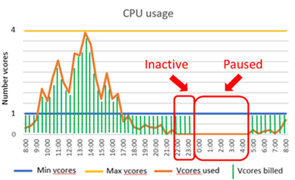

# SQL Database serverless (preview)

## Serverless compute tier

SQL Database serverless (preview) is a compute tier that bills for the amount of compute used by a single database on a per second basis. Serverless is price-performance optimized for single databases with intermittent, unpredictable usage patterns that can afford some delay in compute warm-up after idle usage periods.

A database in the serverless compute tier is parameterized by the compute range it can use and an autopause delay.



### Performance

- `MinVcore` and `MaxVcore` are configurable parameters that define the range of compute capacity available for the database. Memory and IO limits are proportional to the vCore range specified.  
- The autopause delay is a configurable parameter that defines the period of time the database must be inactive before it is automatically paused. The database is automatically resumed when the next login occurs.

### Pricing

- The total bill for a serverless database is the summation of the compute bill and storage bill.
Billing for compute is based on the amount of vCores used and memory used per second.
- The minimum compute billed is based on min vCores and min memory.
- While the database is paused, only storage is billed.

## Scenarios

Serverless is price-performance optimized for single databases with intermittent, unpredictable usage patterns that can afford some delay in compute warm-up after idle usage periods. In contrast, the provisioned compute tier is price-performance optimized for single or pooled databases with higher average usage that cannot afford any delay in compute warm-up.

### Scenarios well-suited for serverless compute

- Single databases with intermittent, unpredictable usage patterns interspersed with periods of inactivity can benefit from price savings based on billing per second for the amount of compute used.
- Single databases with resource demand that is difficult to predict and customers who prefer to delegate compute sizing to the service.
- Single databases in the provisioned compute tier that frequently change performance levels.

### Scenarios well-suited for provisioned compute

- Single databases with more regular and more substantial compute utilization over time.
- Databases that cannot tolerate performance trade-offs resulting from more frequent memory trimming or delay in autoresuming from a paused state.
- Multiple databases with intermittent, unpredictable usage patterns that can be consolidated into a single server and use elastic pools for better price optimization.

## Comparison with provisioned compute tier

The following table summarizes distinctions between the serverless compute tier and the provisioned compute tier:

| | **Serverless compute** | **Provisioned compute** |
|:---|:---|:---|
|**Typical usage scenario**| Databases with intermittent, unpredictable usage interspersed with inactive periods. |	Databases or elastic pools with more regular usage.|
| **Performance management effort** |Lower|Higher|
|**Compute scaling**|Automatic|Manual|
|**Compute responsiveness**|Lower after inactive periods|Immediate|
|**Billing granularity**|Per second|Per hour|

## Purchasing model and service tier

SQL Database serverless is currently only supported in the General Purpose tier on Generation 5 hardware in the vCore purchasing model.

## Autoscale

### Scaling responsiveness

In general, databases are run on a machine with sufficient capacity to satisfy resource demand without interruption for any amount of compute requested within limits set by the `maxVcores` value. Occasionally, load balancing automatically occurs if the machine is unable to satisfy resource demand within a few minutes. The database remains online during load balancing except for a brief period at the end of the operation when connections are dropped.

### Memory management

Memory for serverless databases is reclaimed more frequently than for provisioned compute databases. This behavior is important to control costs in serverless and can impact performance.

#### Cache reclamation

Unlike provisioned compute databases, memory from the SQL cache is reclaimed from a serverless database when CPU or cache utilization is low.

- Cache utilization is considered low when the total size of the most recently used cache entries falls below a threshold for a period of time.
- When cache reclamation is triggered, the target cache size is reduced incrementally to a fraction of its previous size and reclaiming only continues if usage remains low.
- When cache reclamation occurs, the policy for selecting cache entries to evict is the same selection policy as for provisioned compute databases when memory pressure is high.
- The cache size is never reduced below the minimum memory as defined by minimum vCores, which can be configured.

In both serverless and provisioned compute databases, cache entries may be evicted if all available memory is used.

#### Cache hydration

The SQL cache grows as data is fetched from disk in the same way and with the same speed as for provisioned databases. When the database is busy, the cache is allowed to grow unconstrained up to the max memory limit.

## Autopause and autoresume

### Autopause

Autopause is triggered if all of the following conditions are true for the duration of the autopause delay:

- Number sessions = 0
- CPU = 0 (for user workload running in the user pool)

An option is provided to disable autopause if desired.

### Autoresume

Autoresume is triggered if any of the following conditions are true at any time:

|Feature|Autoresume trigger|
|---|---|
|Authentication and authorization|Login|
|Threat detection|Enabling/disabling threat detection settings at the database or server level<br>Modifying threat detection settings at the database or server level|
|Data discovery and classification|Adding, modifying, deleting, or viewing sensitivity labels|
|Auditing|Viewing auditing records.<br>Updating or viewing auditing policy|
|Data masking|Adding, modifying, deleting, or viewing data masking rules|
|Transparent data encryption|View state or status of transparent data encryption|
|Query (performance) data store|Modifying or viewing query store settings; automatic tuning|
|Autotuning|Application and verification of autotuning recommendations such as auto-indexing|
|Database copying|Create database as copy<br>Export to a BACPAC file|
|SQL data sync|Synchronization between hub and member databases that run on a configurable schedule or are performed manually|
|Modifying certain database metadata|Adding new database tags<br>Changing max vCores, min vCores, autopause delay|
|SQL Server Management Studio (SSMS)|Using SSMS version 18 and opening a new query window for any database in the server will resume any auto-paused database in the same server. This behavior does not occur if using SSMS version 17.9.1 with IntelliSense turned-off.|

### Connectivity

If a serverless database is paused, then the first login will resume the database and return an error stating that the database is unavailable with error code 40613. Once the database is resumed, the login must be retried to establish connectivity. Database clients with connection retry logic should not need to be modified.

### Latency

The latency to autopause or autoresume a serverless database is generally on the order of 1 minute.

### Feature support

The following features do not support autopausing and autoresuming. That is, if any of the following features are used, then the database remains online regardless of duration of database inactivity:

- Geo-replication (active geo-replication and auto failover groups)
- Long-term backup retention (LTR)
- The sync database used in SQL data sync.


## Onboarding into serverless compute tier

Creating a new database or moving an existing database into a serverless compute tier follows the same pattern as creating a new database in provisioned compute tier and involves the following two steps:

1. Specify the service objective name. The service objective prescribes the service tier, hardware generation, and maximum vCores. The following table shows the service objective options:

   |Service objective name|Service tier|Hardware generation|Max vCores|
   |---|---|---|---|
   |GP_S_Gen5_1|General Purpose|Gen5|1|
   |GP_S_Gen5_2|General Purpose|Gen5|2|
   |GP_S_Gen5_4|General Purpose|Gen5|4|

2. Optionally, specify the minimum vCores and autopause delay to change their default values. The following table shows the available values for these parameters.

   |Parameter|Value choices|Default value|
   |---|---|---|---|
   |Minimum vCores|Any of {0.5, 1, 2, 4} not exceeding max vCores|0.5 vCores|
   |Autopause delay|Min: 360 minutes (6 hours)<br>Max: 10080 minutes (7 days)<br>Increments: 60 minutes<br>Disable autopause: -1|360 minutes|

> [!NOTE]
> Using T-SQL to move an existing database into serverless or change its compute size is not currently supported but can be done via the Azure portal or PowerShell.

### Create new serverless database using Azure portal

See [Quickstart: Create a single database in Azure SQL Database using the Azure portal](sql-database-single-database-get-started.md).

### Create new serverless database using PowerShell

The following example creates a new database in the serverless compute tier defined by service objective named GP_S_Gen5_4 with default values for the min vCores and autopause delay.

Serverless requires a newer version of PowerShell than is currently in the gallery, so run `Update-Module Az.Sql` to get the latest serverless-enabled cmdlets.

```powershell
New-AzSqlDatabase `
  -ResourceGroupName $resourceGroupName `
  -ServerName $serverName `
  -DatabaseName $databaseName `
  -ComputeModel Serverless `
  -Edition GeneralPurpose `
  -ComputeGeneration Gen5 `
  -MinVcore 0.5 `
  -MaxVcore 2 `
  -AutoPauseDelay 720
```

### Move provisioned compute database into serverless compute tier

The following example moves an existing single database from the provisioned compute tier into the serverless compute tier. This example explicitly specifies the min vCores, max vCores, and autopause delay.

```powershell
Set-AzSqlDatabase
  -ResourceGroupName $resourceGroupName `
  -ServerName $serverName `
  -DatabaseName $databaseName `
  -Edition GeneralPurpose `
  -ComputeModel Serverless `
  -ComputeGeneration Gen5 `
  -MinVcore 1 `
  -MaxVcore 4 `
  -AutoPauseDelay 1440
```

### Move serverless database into provisioned compute tier

A serverless database can be moved into a provisioned compute tier in the same way as moving a provisioned compute database into a serverless compute tier.

## Modify serverless configuration

### Maximum vCores

Modifying the maximum vCores is performed by using the [Set-AzSqlDatabase](https://docs.microsoft.com/powershell/module/az.sql/set-azsqldatabase) command in PowerShell using the `MaxVcore` argument.

### Minimum vCores

Modifying the minimum vCores is performed by using the [Set-AzSqlDatabase](https://docs.microsoft.com/powershell/module/az.sql/set-azsqldatabase) command in PowerShell using the `MinVcore` argument.

### Autopause delay

Modifying the autopause delay is performed by using the [Set-AzSqlDatabase](https://docs.microsoft.com/powershell/module/az.sql/set-azsqldatabase) command in PowerShell using the `AutoPauseDelay` argument.

## Monitoring

### Resources used and billed

The resources of a serverless database are encapsulated by the following entities:

#### App package

The app package is the outer most resource management boundary for a database, regardless of whether the database is in a serverless or provisioned compute tier. The app package contains the SQL instance and external services that together scope all user and system resources used by a database in SQL Database. Examples of external services include R and full-text search. The SQL instance generally dominates the overall resource utilization across the app package.

#### User resource pool

The user resource pool is the inner most resource management boundary for a database, regardless of whether the database is in a serverless or provisioned compute tier. The user resource pool scopes CPU and IO for user workload generated by DDL queries such as CREATE and ALTER and DML queries such as SELECT, INSERT, UPDATE, and DELETE. These queries generally represent the most substantial proportion of utilization within the app package.

### Metrics

|Entity|Metric|Description|Units|
|---|---|---|---|
|App package|app_cpu_percent|Percentage of vCores used by the app relative to max vCores allowed for the app.|Percentage|
|App package|app_cpu_billed|The amount of compute billed for the app during the reporting period. The amount paid during this period is the product of this metric and the vCore unit price. <br><br>Values of this metric are determined by aggregating over time the maximum of CPU used and memory used each second. If the amount used is less than the minimum amount provisioned as set by the min vCores and min memory, then the minimum amount provisioned is billed. In order to compare CPU with memory for billing purposes, memory is normalized into units of vCores by rescaling the amount of memory in GB by 3 GB per vCore.|vCore seconds|
|App package|app_memory_percent|Percentage of memory used by the app relative to max memory allowed for the app.|Percentage|
|User pool|cpu_percent|Percentage of vCores used by user workload relative to max vCores allowed for user workload.|Percentage|
|User pool|data_IO_percent|Percentage of data IOPS used by user workload relative to max data IOPS allowed for user workload.|Percentage|
|User pool|log_IO_percent|Percentage of log MB/s used by user workload relative to max log MB/s allowed for user workload.|Percentage|
|User pool|workers_percent|Percentage of workers used by user workload relative to max workers allowed for user workload.|Percentage|
|User pool|sessions_percent|Percentage of sessions used by user workload relative to max sessions allowed for user workload.|Percentage|
____

> [!NOTE]
> Metrics in the Azure portal are available in the database pane for a single database under **Monitoring**.

### Pause and resume status

In the Azure portal, the database status is displayed in the overview pane of the server that lists the databases it contains. The database status is also displayed in the overview pane for the database.

Using the following PowerShell command to query the pause and resume status of a database:

```powershell
Get-AzSqlDatabase `
  -ResourceGroupName $resourcegroupname `
  -ServerName $servername `
  -DatabaseName $databasename `
  | Select -ExpandProperty "Status"
```

## Resource limits

For resource limits, see [Serverless compute tier](sql-database-vCore-resource-limits-single-databases.md#serverless-compute-tier)

## Billing

The amount of compute billed is the maximum of CPU used and memory used each second. If the amount of CPU used and memory used is less than the minimum amount provisioned for each, then the provisioned amount is billed. In order to compare CPU with memory for billing purposes, memory is normalized into units of vCores by rescaling the amount of memory in GB by 3 GB per vCore.

- **Resource billed**: CPU and memory
- **Amount billed ($)**: vCore unit price * max (min vCores, vCores used, min memory GB * 1/3, memory GB used * 1/3) 
- **Billing frequency**: Per second

The vCore unit price in the cost per vCore per second. Refer to the [Azure SQL Database pricing page](https://azure.microsoft.com/pricing/details/sql-database/single/) for specific unit prices in a given region.

The amount of compute billed is exposed by the following metric:

- **Metric**: app_cpu_billed (vCore seconds)
- **Definition**: max (min vCores, vCores used, min memory GB * 1/3, memory GB used * 1/3)
- **Reporting frequency**: Per minute

This quantity is calculated each second and aggregated over 1 minute.

Consider a serverless database configured with 1 min vCore and 4 max vCores.  This corresponds to around 3 GB min memory and 12-GB max memory.  Suppose the auto-pause delay is set to 6 hours and the database workload is active during the first 2 hours of a 24-hour period and otherwise inactive.    

In this case, the database is billed for compute and storage during the first 8 hours.  Even though the database is inactive starting after the second hour, it is still billed for compute in the subsequent 6 hours based on the minimum compute provisioned while the database is online.  Only storage is billed during the remainder of the 24-hour period while the database is paused.

More precisely, the compute bill in this example is calculated as follows:

|Time Interval|vCores used each second|GB used each second|Compute dimension billed|vCore seconds billed over time interval|
|---|---|---|---|---|
|0:00-1:00|4|9|vCores used|4 vCores * 3600 seconds = 14400 vCore seconds|
|1:00-2:00|1|12|Memory used|12 Gb * 1/3 * 3600 seconds = 14400 vCore seconds|
|2:00-8:00|0|0|Min memory provisioned|3 Gb * 1/3 * 21600 seconds = 21600 vCore seconds|
|8:00-24:00|0|0|No compute billed while paused|0 vCore seconds|
|Total vCore seconds billed over 24 hours||||50400 vCore seconds|

Suppose the compute unit price is $0.000073/vCore/second.  Then the compute billed for this 24-hour period is the product of the compute unit price and vCore seconds billed: $0.000073/vCore/second * 50400 vCore seconds = $3.68

## Available regions

The serverless compute tier is available in all regions except the following regions: Australia Central, China East, China North, France South, Germany Central, Germany Northeast, India West, Korea South, South Africa West, UK North, UK South, UK West, and West Central US.

## Next steps

- To get started, see [Quickstart: Create a single database in Azure SQL Database using the Azure portal](sql-database-single-database-get-started.md).
- For resource limits, see [Serverless compute tier resource limits](sql-database-vCore-resource-limits-single-databases.md#serverless-compute-tier).
