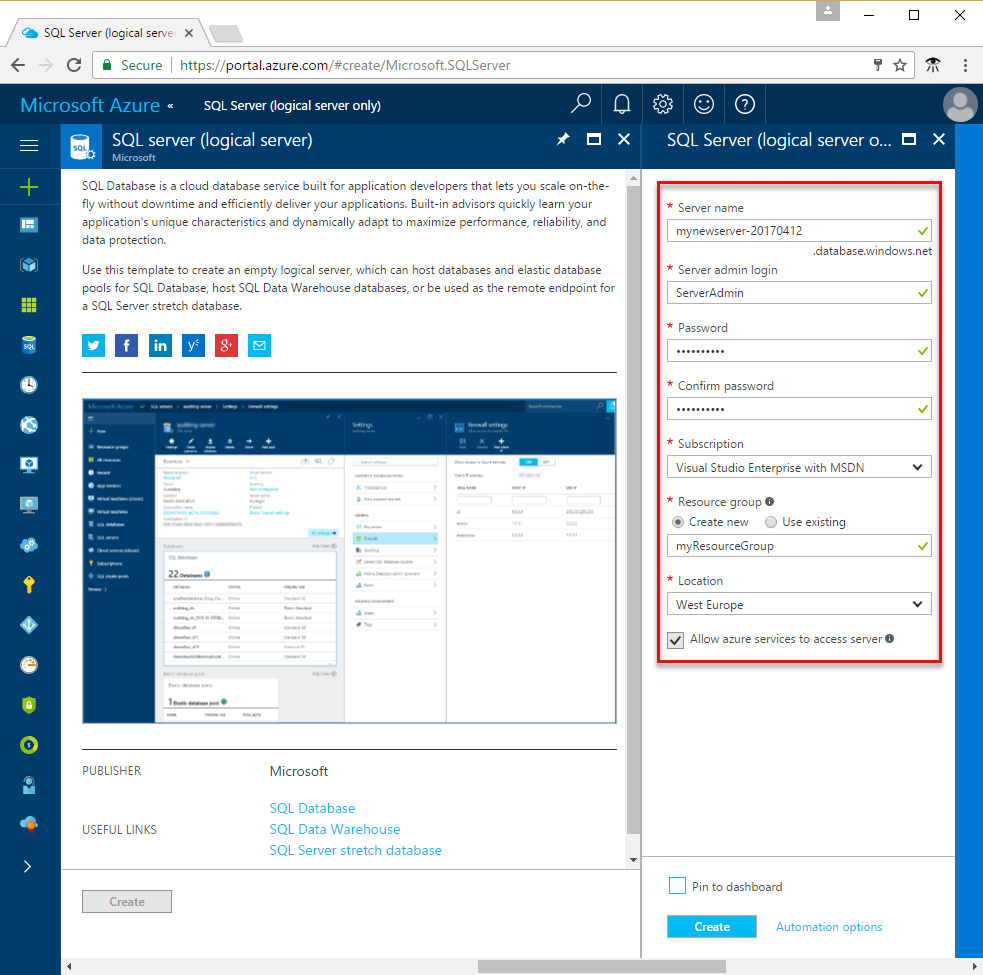

# Learn about Azure SQL Database servers and databases

[Azure SQL Database](sql-database-technical-overview.md) is a fully managed, relational Database-As-A-Service (DBaaS) in the Microsoft cloud ("Azure"). With this platform-as-a-service offering, Microsoft handles all patching and updating of the SQL code base seamlessly and abstracts away all management of the underlying infrastructure. SQL Database shares its code base with the [Microsoft SQL Server database engine](https://docs.microsoft.com/sql/sql-server/sql-server-technical-documentation). You can create Azure SQL Database servers and databases using the Azure portal, PowerShell, the Azure CLI, Transact-SQL, and the REST API.

## Create an Azure SQL Database in a resource group and in a logical server

An Azure SQL database is created with a defined set of compute and storage resources, called [Database Transaction Units (DTUs)](sql-database-service-tiers.md), within an [Azure resource group](../azure-resource-manager/resource-group-overview.md). An Azure SQL database is associated with an Azure SQL Database logical server, which is created within a specific Azure region. A logical server acts as a central administrative point for multiple databases, including [SQL elastic pools](sql-database-elastic-pool.md) [logins](sql-database-manage-logins.md), [firewall rules](sql-database-firewall-configure.md), [auditing rules](sql-database-auditing.md), [threat detection policies](sql-database-threat-detection.md), and [failover groups](sql-database-geo-replication-overview.md). A logical server can be in a different region than its resource group. The logical server must exist before you can create the Azure SQL database. All databases on a server are created within the same region as the logical server. 

> [!IMPORTANT]
> In SQL Database, a server is a logical construct that is distinct from a SQL Server instance that you may be familiar with in the on-premises world. Specifically, the SQL Database service makes no guarantees regarding location of the databases in relation to their logical servers, and exposes no instance-level access or features.
> 

When you create a logical server, you provide a server login account and password that has administrative rights to the master database on that server and all databases created on that server. This initial account is a SQL login account. Azure SQL Database supports SQL authentication and Azure Active Directory Authentication for authentication. For information about logins and authentication, see [Managing Databases and Logins in Azure SQL Database](sql-database-manage-logins.md). Windows Authentication is not supported. 

> [!TIP]
> For valid resource group and server names, see [Naming rules and restrictions](https://docs.microsoft.com/azure/architecture/best-practices/naming-conventions).
>

An Azure Database logical server:

- Is created within an Azure subscription, but can be moved with its contained resources to another subscription
- Is the parent resource for databases, elastic pools, and data warehouses
- Provides a namespace for databases, elastic pools, and data warehouses
- Is a logical container with strong lifetime semantics - delete a server and it deletes the contained databases, elastic pools, and data warehouses
- Participates in [Azure role-based access control (RBAC)](/active-directory/role-based-access-control-configure.md) - databases, elastic pools, and data warehouses within a server inherit access rights from the server
- Is a high-order element of the identity of databases, elastic pools, and data warehouses for Azure resource management purposes (see the URL scheme for databases and pools)
- Collocates resources in a region
- Provides a connection endpoint for database access (<serverName>.database.windows.net)
- Provides access to metadata regarding contained resources via DMVs by connecting to a master database 
- Provides the scope for management policies that apply to its databases - logins, firewall, audit, threat detection, etc. 
- Is restricted by a quota within the parent subscription (six servers per subscription by default - [see Subscription limits here](../azure-subscription-service-limits.md))
- Provides the scope for database quota and DTU quota for the resources it contains (such as 45,000 DTU)
- Is the versioning scope for capabilities enabled on contained resources 
- Server-level principal logins can manage all databases on a server
- Can contain logins similar to those in instances of SQL Server on your premises that are granted access to one or more databases on the server, and can be granted limited administrative rights. For more information, see [Logins](sql-database-manage-logins.md).

## Create an Azure SQL database as a single, pooled, or partitioned database

An Azure SQL database can be:

- A single database with its [own set of resources](sql-database-what-is-a-dtu.md#what-are-database-transaction-units-dtus) (DTUs)
- Part of a [SQL elastic pool](sql-database-elastic-pool.md) that [shares a set of resources](sql-database-what-is-a-dtu.md#what-are-elastic-database-transaction-units-edtus) (eDTUs)
- Part of a [scaled-out set of sharded databases](sql-database-elastic-scale-introduction.md#horizontal-and-vertical-scaling), which can be either single or pooled databases
- Part of a set of databases participating in a [multitenant SaaS design pattern](sql-database-design-patterns-multi-tenancy-saas-applications.md), and whose databases can either be single or pooled databases (or both) 

> [!TIP]
> For valid database names, see [Database Identifiers](https://docs.microsoft.com/en-us/sql/relational-databases/databases/database-identifiers). 
>
 
- The default database collation used by Microsoft Azure SQL Database is **SQL_LATIN1_GENERAL_CP1_CI_AS**, where **LATIN1_GENERAL** is English (United States), **CP1** is code page 1252, **CI** is case-insensitive, and **AS** is accent-sensitive. For more information about how to set the collation, see [COLLATE (Transact-SQL)](https://msdn.microsoft.com/library/ms184391.aspx).
- Microsoft Azure SQL Database supports tabular data stream (TDS) protocol client version 7.3 or later.
- Only TCP/IP connections are allowed.

## Azure SQL databases protected by SQL Database firewall

To help protect your data, a [SQL Database firewall](sql-database-firewall-configure.md) prevents all access to your database server or any of its databases from outside of your connection to the server directly through your Azure subscription connection. To enable additional connectivity, you must [create one or more firewall rules](sql-database-firewall-configure.md#creating-and-managing-firewall-rules) . For creating and managing SQL elastic pools, see [Elastic pools](sql-database-elastic-pools.md).

## Create and manage Azure SQL servers, databases, and firewalls using the Azure portal

To create an Azure SQL Database server (without a database) using the [Azure portal](https://portal.azure.com), navigate to a blank SQL server (logical server) form to begin creating a server. You can create the Azure SQL database's resource group ahead of time or while creating the server itself. There are multiple methods for getting to a new SQL server form - this image shows one.

   

To create an Azure SQL database using the [Azure portal](https://portal.azure.com), navigate to a blank SQL Database form to begin creating a database. You can create the Azure SQL database's resource group and logical server ahead of time or while creating the server itself. There are multiple methods for getting to a new SQL Database form.

  

To manage an existing server, navigate to the server using a number of methods - such as from specific SQL database page, the **SQL servers** page, or the **All resources** page. The following screenshot shows how to begin setting a server-level firewall from the **Overview** page for a server. 

   

To manage an existing database, navigate to the **SQL databases** page and click the database you wish to manage. The following screenshot shows how to begin setting a server-level firewall for a database from the **Overview** page for a database. 

    

> [!TIP]
> For an Azure portal quick start tutorial, see [Create an Azure SQL database in the Azure portal](sql-database-get-started-portal.md).
>

## Create and manage Azure SQL servers, databases, and firewalls using PowerShell

To create and manage Azure SQL server, databases, and firewalls with Azure PowerShell, use the following PowerShell cmdlets. If you need to install or upgrade PowerShell, see [Install Azure PowerShell module](/powershell/azure/install-azurerm-ps). For creating and managing SQL elastic pools, see [Elastic pools](sql-database-elastic-pools.md).

| Cmdlet | Description |
| --- | --- |
|[New-AzureRmResourceGroup](/powershell/module/azurerm.resources/new-azurermresourcegroup)|Creates a resource group]
|[New-AzureRmSqlServer](/powershell/module/azurerm.sql/new-azurermsqlserver)|Creates a  server|
|[Get-AzureRmSqlServer](/powershell/module/azurerm.sql/get-azurermsqlserver)|Returns information about servers|
|[Set-AzureRmSqlServer](https://docs.microsoft.com/en-us/powershell/module/azurerm.sql/set-azurermsqlserver)|Modifies properties of a server|
|[Remove-AzureRmSqlServer](/powershell/module/azurerm.sql/remove-azurermsqlserver)|Removes a server|
|[New-AzureRmSqlServerFirewallRule](/powershell/module/azurerm.sql/new-azurermsqlserverfirewallrule)|Creates a server-level firewall rule |
|[Get-​Azure​Rm​Sql​Server​Firewall​Rule](/powershell/module/azurerm.sql/get-azurermsqlserverfirewallrule)|Gets firewall rules for a server|
|[Set-​Azure​Rm​Sql​Server​Firewall​Rule](/powershell/module/azurerm.sql/set-azurermsqlserverfirewallrule)|Modifies a firewall rule in a server|
|[Remove-​Azure​Rm​Sql​Server​Firewall​Rule](/powershell/module/azurerm.sql/remove-azurermsqlserverfirewallrule)|Deletes a firewall rule from a server.|
|[New-AzureRmSqlDatabase](/powershell/module/azurerm.sql/new-azurermsqldatabase)|Creates a database |
|[Get-AzureRmSqlDatabase](/powershell/module/azurerm.sql/get-azurermsqldatabase)|Gets one or more databases|
|[Set-​Azure​Rm​Sql​Database](/powershell/module/azurerm.sql/set-azurermsqldatabase)|Sets properties for a database, or moves an existing database into an elastic pool|
|[Remove-​Azure​Rm​Sql​Database](/powershell/module/azurerm.sql/remove-azurermsqldatabase)|Removes a database|

> [!TIP]
> For a PowerShell quick start tutorial, see [Create a single Azure SQL database using PowerShell](sql-database-get-started-portal.md).
>

## Create and manage Azure SQL servers, databases, and firewalls using the Azure CLI

To create and manage Azure SQL server, databases, and firewalls with the [Azure CLI](/cli/azure/overview), use the following [Azure CLI SQL Database](/cli/azure/sql/db) commands. Use the [Cloud Shell](/azure/cloud-shell/overview) to run the CLI in your browser, or [install](/cli/azure/install-azure-cli) it on macOS, Linux, or Windows. For creating and managing SQL elastic pools, see [Elastic pools](sql-database-elastic-pools.md).

| Cmdlet | Description |
| --- | --- |
|[az group create](/cli/azure/group#create)|Creates a resource group|
|[az sql server create](/cli/azure/sql/server#create)|Creates a server|
|[az sql server list](/cli/azure/sql/server#list)|Lists servers|
|[az sql server list-usages](/cli/azure/sql/server#list-usages)|Returns  server usages|
|[az sql server show](/cli/azure/sql/server#show)|Gets a server|
|[az sql server update](/cli/azure/sql/server#update)|Updates a server|
|[az sql server delete](/cli/azure/sql/server#delete)|Deletes a server|
|[az sql server firewall-rule create](/cli/azure/sql/server/firewall-rule#create)|Creates a server firewall rule|
|[az sql server firewall-rule list](/cli/azure/sql/server/firewall-rule#list)|Lists the firewall rules on a server|
|[az sql server firewall-rule show](/cli/azure/sql/server/firewall-rule#show)|Shows the detail of a firewall rule|
|[az sql server firewall-rule update](/cli/azure/sql/server/firewall-rule#update)|Updates a firewall rule|
|[az sql server firewall-rule delete](/cli/azure/sql/server/firewall-rule#delete)|Deletes a firewall rule|
|[az sql db create](/cli/azure/sql/db#create) |Creates a database|
|[az sql db list](/cli/azure/sql/db#list)|Lists all databases and data warehouses in a server, or all databases in an elastic pool|
|[az sql db list-editions](/cli/azure/sql/db#list-editions)|Lists available service objectives and storage limits|
|[az sql db list-usages](/cli/azure/sql/db#list-usages)|Returns database usages|
|[az sql db show](/cli/azure/sql/db#show)|Gets a database or data warehouse|
|[az sql db update](/cli/azure/sql/db#update)|Updates a database|
|[az sql db delete](/cli/azure/sql/db#delete)|Removes a database|

> [!TIP]
> For an Azure CLI quick start tutorial, see [Create a single Azure SQL database using the Azure CLI](sql-database-get-started-cli.md).
>

## Create and manage Azure SQL servers, databases, and firewalls using Transact-SQL

To create and manage Azure SQL server, databases, and firewalls with Transact-SQL, use the following T-SQL commands. You can issue these commands using the Azure portal, [SQL Server Management Studio](/sql/ssms/use-sql-server-management-studio), [Visual Studio Code](https://code.visualstudio.com/docs), or any other program that can connect to an Azure SQL Database server and pass Transact-SQL commands. For managing SQL elastic pools, see [Elastic pools](sql-database-elastic-pools.md).

> [!IMPORTANT]
> You cannot create, update, or delete a server using Transact-SQL.
>

| Command | Description |
| --- | --- |
|[sp_set_firewall_rule (Azure SQL Database)](/sql/relational-databases/system-stored-procedures/sp-set-firewall-rule-azure-sql-database)|Creates or updates the server-level firewall settings for your SQL Database server. This stored procedure is only available in the master database to the server-level principal login. A server-level firewall rule can only be created using Transact-SQL after the first server-level firewall rule has been created by a user with Azure-level permissions|
|[sys.firewall_rules (Azure SQL Database)](/sql/relational-databases/system-catalog-views/sys-firewall-rules-azure-sql-database)|Returns information about the server-level firewall settings associated with your Microsoft Azure SQL Database.|
|[sp_delete_firewall_rule (Azure SQL Database)](/sql/relational-databases/system-stored-procedures/sp-delete-firewall-rule-azure-sql-database)|Removes server-level firewall settings from your SQL Database server. This stored procedure is only available in the master database to the server-level principal login.|
|[CREATE DATABASE (Azure SQL Database)](/sql/t-sql/statements/create-database-azure-sql-database)|Creates a new database. You must be connected to the master database to create a new database.|
| [ALTER DATABASE (Azure SQL Database)](/sql/t-sql/statements/alter-database-azure-sql-database) |Modifies an Azure SQL database. |
|[ALTER DATABASE (Azure SQL Data Warehouse)](/sql/t-sql/statements/alter-database-azure-sql-data-warehouse)|Modifies an Azure SQL Data Warehouse.|
|[DROP DATABASE (Transact-SQL)](/sql/t-sql/statements/drop-database-transact-sql)|Removes a database.|
|[sp_set_database_firewall_rule (Azure SQL Database)](/sql/relational-databases/system-stored-procedures/sp-set-database-firewall-rule-azure-sql-database)|Creates or updates the database-level firewall rules for your Azure SQL Database or SQL Data Warehouse. Database firewall rules can be configured for the master database, and for user databases on SQL Database. Database firewall rules are particularly useful when using contained database users. |
|[sys.database_firewall_rules (Azure SQL Database)](/sql/relational-databases/system-catalog-views/sys-database-firewall-rules-azure-sql-database)|Returns information about the database-level firewall settings associated with your Microsoft Azure SQL Database. |
|[sp_delete_database_firewall_rule (Azure SQL Database)](/sql/relational-databases/system-stored-procedures/sp-delete-database-firewall-rule-azure-sql-database)|Removes database-level firewall setting from your Azure SQL Database or SQL Data Warehouse. |
|[sys.database_service_objectives (Azure SQL Database)](/sql/relational-databases/system-catalog-views/sys-database-service-objectives-azure-sql-database)|Returns the edition (service tier), service objective (pricing tier), and elastic pool name, if any, for an Azure SQL database or an Azure SQL Data Warehouse. If logged on to the master database in an Azure SQL Database server, returns information on all databases. For Azure SQL Data Warehouse, you must be connected to the master database.|
|[sys.database_usage (Azure SQL Database)](/sql/relational-databases/system-catalog-views/sys-database-usage-azure-sql-database)|Lists the number, type, and duration of databases on an Azure SQL Database server.|

> [!TIP]
> For quick start tutorial using SQL Server Management Studio on Microsoft Windows, see [Azure SQL Database: Use SQL Server Management Studio to connect and query data](sql-database-connect-query-ssms.md). For a quick start tutorial using Visual Studio Code on the macOS, Linux, or Windows, see [Azure SQL Database: Use Visual Studio Code to connect and query data](sql-database-connect-query-vscode.md).

## Create and manage Azure SQL servers, databases, and firewalls using the REST API

To create and manage Azure SQL server, databases, and firewalls using the REST API, see [Azure SQL Database REST API](/rest/api/sql/).

## Next steps

- To learn about pooling databases using SQL elastic pools, see [Elastic pools](sql-database-elastic-pool.md)For information about the Azure SQL Database service, see [What is SQL Database?](sql-database-technical-overview.md)
- To learn about migrating a SQL Server database to Azure, see [Migrate to Azure SQL Database](sql-database-cloud-migrate.md).
- For information about supported features, see [Features](sql-database-features.md)