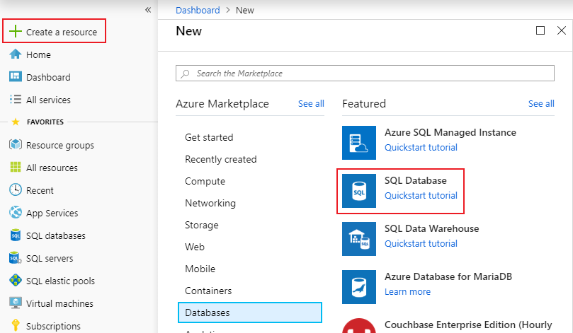

# Azure SQL Database servers and their management

## What is an Azure SQL Database server

A SQL Database server is a logical construct that acts as a central administrative point for multiple single or [pooled](sql-database-elastic-pool.md) databases, [logins](sql-database-manage-logins.md), [firewall rules](sql-database-firewall-configure.md), [auditing rules](sql-database-auditing.md), [threat detection policies](sql-database-threat-detection.md), and [failover groups](sql-database-auto-failover-group.md) A SQL Database server can be in a different region than its resource group. The SQL Database server must exist before you can create the Azure SQL database. All databases managed by a SQL Database server are created within the same region as the SQL Database server.

A SQL Database server is distinct from a SQL Server instance that you may be familiar with in the on-premises world. Specifically, the SQL Database service makes no guarantees regarding location of the databases in relation to the SQL Database server that manages them, and exposes no instance-level access or features. In contrast, the instance databases in a managed instance are all co-located - in the same way that you are familiar with SQL Server in the on-premises world.

When you create a SQL Database server, you provide a server login account and password that has administrative rights to the master database on that server and all databases created on that server. This initial account is a SQL login account. Azure SQL Database supports SQL authentication and Azure Active Directory Authentication for authentication. For information about logins and authentication, see [Managing Databases and Logins in Azure SQL Database](sql-database-manage-logins.md). Windows Authentication is not supported.

A SQL Database server:

- Is created within an Azure subscription, but can be moved with its contained resources to another subscription
- Is the parent resource for databases, elastic pools, and data warehouses
- Provides a namespace for databases, elastic pools, and data warehouses
- Is a logical container with strong lifetime semantics - delete a server and it deletes the contained databases, elastic pools, and data warehouses
- Participates in [Azure role-based access control (RBAC)](/azure/role-based-access-control/overview) - databases, elastic pools, and data warehouses within a server inherit access rights from the server
- Is a high-order element of the identity of databases, elastic pools, and data warehouses for Azure resource management purposes (see the URL scheme for databases and pools)
- Collocates resources in a region
- Provides a connection endpoint for database access (`<serverName>`.database.windows.net)
- Provides access to metadata regarding contained resources via DMVs by connecting to a master database
- Provides the scope for management policies that apply to its databases - logins, firewall, audit, threat detection, and such
- Is restricted by a quota within the parent subscription (six servers per subscription by default - [see Subscription limits here](../azure-subscription-service-limits.md))
- Provides the scope for database quota and DTU or vCore quota for the resources it contains (such as 45,000 DTU)
- Is the versioning scope for capabilities enabled on contained resources
- Server-level principal logins can manage all databases on a server
- Can contain logins similar to those in instances of SQL Server on your premises that are granted access to one or more databases on the server, and can be granted limited administrative rights. For more information, see [Logins](sql-database-manage-logins.md).
- The default collation for all databases created on a SQL Database server is `SQL_LATIN1_GENERAL_CP1_CI_AS`, where `LATIN1_GENERAL` is English (United States), `CP1` is code page 1252, `CI` is case-insensitive, and `AS` is accent-sensitive.

## Manage Azure SQL servers, databases, and firewalls using the Azure portal

You can create the Azure SQL database's resource group ahead of time or while creating the server itself. There are multiple methods for getting to a new SQL server form, either by creating a new SQL server or as part of creating a new database.

### Create a blank SQL Database server

To create an Azure SQL Database server (without a database) using the [Azure portal](https://portal.azure.com), navigate to a blank SQL server (logical server) form.  

### Create a blank or sample SQL database

To create an Azure SQL database using the [Azure portal](https://portal.azure.com), navigate to a blank SQL Database form and provide the requested information. You can create the Azure SQL database's resource group and SQL Database server ahead of time or while creating the database itself. You can create a blank database or create a sample database based on Adventure Works LT.

  

> [!IMPORTANT]
> For information on selecting the pricing tier for your database, see [DTU-based purchasing model](sql-database-service-tiers-dtu.md) and [vCore-based purchasing model](sql-database-service-tiers-vcore.md).

To create a managed instance, see [Create a managed instance](sql-database-managed-instance-get-started.md)

### Manage an existing SQL server

To manage an existing server, navigate to the server using a number of methods - such as from specific SQL database page, the **SQL servers** page, or the **All resources** page.

To manage an existing database, navigate to the **SQL databases** page and click the database you wish to manage. The following screenshot shows how to begin setting a server-level firewall for a database from the **Overview** page for a database.

   

> [!IMPORTANT]
> To configure performance properties for a database, see [DTU-based purchasing model](sql-database-service-tiers-dtu.md) and [vCore-based purchasing model](sql-database-service-tiers-vcore.md).
> [!TIP]
> For an Azure portal quickstart, see [Create an Azure SQL database in the Azure portal](sql-database-single-database-get-started.md).

## Manage Azure SQL servers, databases, and firewalls using PowerShell

[!INCLUDE [updated-for-az](../../includes/updated-for-az.md)]
> [!IMPORTANT]
> The PowerShell Azure Resource Manager module is still supported by Azure SQL Database, but all future development is for the Az.Sql module. For these cmdlets, see [AzureRM.Sql](https://docs.microsoft.com/powershell/module/AzureRM.Sql/). The arguments for the commands in the Az module and in the AzureRm modules are substantially identical.

To create and manage Azure SQL server, databases, and firewalls with Azure PowerShell, use the following PowerShell cmdlets. If you need to install or upgrade PowerShell, see [Install Azure PowerShell module](/powershell/azure/install-az-ps). For creating and managing elastic pools, see [Elastic pools](sql-database-elastic-pool.md).

| Cmdlet | Description |
| --- | --- |
|[New-AzSqlDatabase](/powershell/module/az.sql/new-azsqldatabase)|Creates a database |
|[Get-AzSqlDatabase](/powershell/module/az.sql/get-azsqldatabase)|Gets one or more databases|
|[Set-AzSqlDatabase](/powershell/module/az.sql/set-azsqldatabase)|Sets properties for a database, or moves an existing database into an elastic pool|
|[Remove-AzSqlDatabase](/powershell/module/az.sql/remove-azsqldatabase)|Removes a database|
|[New-AzResourceGroup](/powershell/module/az.resources/new-azresourcegroup)|Creates a resource group|
|[New-AzSqlServer](/powershell/module/az.sql/new-azsqlserver)|Creates a  server|
|[Get-AzSqlServer](/powershell/module/az.sql/get-azsqlserver)|Returns information about servers|
|[Set-AzSqlServer](https://docs.microsoft.com/powershell/module/az.sql/set-azsqlserver)|Modifies properties of a server|
|[Remove-AzSqlServer](/powershell/module/az.sql/remove-azsqlserver)|Removes a server|
|[New-AzSqlServerFirewallRule](/powershell/module/az.sql/new-azsqlserverfirewallrule)|Creates a server-level firewall rule |
|[Get-AzSqlServerFirewallRule](/powershell/module/az.sql/get-azsqlserverfirewallrule)|Gets firewall rules for a server|
|[Set-AzSqlServerFirewallRule](/powershell/module/az.sql/set-azsqlserverfirewallrule)|Modifies a firewall rule in a server|
|[Remove-AzSqlServerFirewallRule](/powershell/module/az.sql/remove-azsqlserverfirewallrule)|Deletes a firewall rule from a server.|
| New-AzSqlServerVirtualNetworkRule | Creates a [*virtual network rule*](sql-database-vnet-service-endpoint-rule-overview.md), based on a subnet that is a Virtual Network service endpoint. |

> [!TIP]
> For a PowerShell quickstart, see [Create an Azure SQL single database using PowerShell](sql-database-single-database-get-started.md). For PowerShell example scripts, see [Use PowerShell to create an Azure SQL single database and configure a firewall rule](scripts/sql-database-create-and-configure-database-powershell.md) and [Monitor and scale an Azure SQL single database using PowerShell](scripts/sql-database-monitor-and-scale-database-powershell.md).
>

## Manage Azure SQL servers, databases, and firewalls using the Azure CLI

To create and manage Azure SQL server, databases, and firewalls with the [Azure CLI](/cli/azure), use the following [Azure CLI SQL Database](/cli/azure/sql/db) commands. Use the [Cloud Shell](/azure/cloud-shell/overview) to run the CLI in your browser, or [install](/cli/azure/install-azure-cli) it on macOS, Linux, or Windows. For creating and managing elastic pools, see [Elastic pools](sql-database-elastic-pool.md).

| Cmdlet | Description |
| --- | --- |
|[az sql db create](/cli/azure/sql/db#az-sql-db-create) |Creates a database|
|[az sql db list](/cli/azure/sql/db#az-sql-db-list)|Lists all databases and data warehouses in a server, or all databases in an elastic pool|
|[az sql db list-editions](/cli/azure/sql/db#az-sql-db-list-editions)|Lists available service objectives and storage limits|
|[az sql db list-usages](/cli/azure/sql/db#az-sql-db-list-usages)|Returns database usages|
|[az sql db show](/cli/azure/sql/db#az-sql-db-show)|Gets a database or data warehouse|
|[az sql db update](/cli/azure/sql/db#az-sql-db-update)|Updates a database|
|[az sql db delete](/cli/azure/sql/db#az-sql-db-delete)|Removes a database|
|[az group create](/cli/azure/group#az-group-create)|Creates a resource group|
|[az sql server create](/cli/azure/sql/server#az-sql-server-create)|Creates a server|
|[az sql server list](/cli/azure/sql/server#az-sql-server-list)|Lists servers|
|[az sql server list-usages](/cli/azure/sql/server#az-sql-server-list-usages)|Returns  server usages|
|[az sql server show](/cli/azure/sql/server#az-sql-server-show)|Gets a server|
|[az sql server update](/cli/azure/sql/server#az-sql-server-update)|Updates a server|
|[az sql server delete](/cli/azure/sql/server#az-sql-server-delete)|Deletes a server|
|[az sql server firewall-rule create](/cli/azure/sql/server/firewall-rule#az-sql-server-firewall-rule-create)|Creates a server firewall rule|
|[az sql server firewall-rule list](/cli/azure/sql/server/firewall-rule#az-sql-server-firewall-rule-list)|Lists the firewall rules on a server|
|[az sql server firewall-rule show](/cli/azure/sql/server/firewall-rule#az-sql-server-firewall-rule-show)|Shows the detail of a firewall rule|
|[az sql server firewall-rule update](/cli/azure/sql/server/firewall-rule##az-sql-server-firewall-rule-update)|Updates a firewall rule|
|[az sql server firewall-rule delete](/cli/azure/sql/server/firewall-rule#az-sql-server-firewall-rule-delete)|Deletes a firewall rule|

> [!TIP]
> For an Azure CLI quickstart, see [Create an Azure SQL single database using the Azure CLI](sql-database-cli-samples.md). For Azure CLI example scripts, see [Use CLI to create an Azure SQL single database and configure a firewall rule](scripts/sql-database-create-and-configure-database-cli.md) and [Use CLI to monitor and scale an Azure SQL single database](scripts/sql-database-monitor-and-scale-database-cli.md).
>

## Manage Azure SQL servers, databases, and firewalls using Transact-SQL

To create and manage Azure SQL server, databases, and firewalls with Transact-SQL, use the following T-SQL commands. You can issue these commands using the Azure portal, [SQL Server Management Studio](/sql/ssms/use-sql-server-management-studio), [Visual Studio Code](https://code.visualstudio.com/docs), or any other program that can connect to an Azure SQL Database server and pass Transact-SQL commands. For managing elastic pools, see [Elastic pools](sql-database-elastic-pool.md).

> [!IMPORTANT]
> You cannot create or delete a server using Transact-SQL.
>

| Command | Description |
| --- | --- |
|[CREATE DATABASE (Azure SQL Database)](/sql/t-sql/statements/create-database-azure-sql-database)|Creates a new database. You must be connected to the master database to create a new database.|
| [ALTER DATABASE (Azure SQL Database)](/sql/t-sql/statements/alter-database-azure-sql-database) |Modifies an Azure SQL database. |
|[ALTER DATABASE (Azure SQL Data Warehouse)](/sql/t-sql/statements/alter-database-azure-sql-data-warehouse)|Modifies an Azure SQL Data Warehouse.|
|[DROP DATABASE (Transact-SQL)](/sql/t-sql/statements/drop-database-transact-sql)|Deletes a database.|
|[sys.database_service_objectives (Azure SQL Database)](/sql/relational-databases/system-catalog-views/sys-database-service-objectives-azure-sql-database)|Returns the edition (service tier), service objective (pricing tier), and elastic pool name, if any, for an Azure SQL database or an Azure SQL Data Warehouse. If logged on to the master database in an Azure SQL Database server, returns information on all databases. For Azure SQL Data Warehouse, you must be connected to the master database.|
|[sys.dm_db_resource_stats (Azure SQL Database)](/sql/relational-databases/system-dynamic-management-views/sys-dm-db-resource-stats-azure-sql-database)| Returns CPU, IO, and memory consumption for an Azure SQL Database database. One row exists for every 15 seconds, even if there is no activity in the database.|
|[sys.resource_stats (Azure SQL Database)](/sql/relational-databases/system-catalog-views/sys-resource-stats-azure-sql-database)|Returns CPU usage and storage data for an Azure SQL Database. The data is collected and aggregated within five-minute intervals.|
|[sys.database_connection_stats (Azure SQL Database)](/sql/relational-databases/system-catalog-views/sys-database-connection-stats-azure-sql-database)|Contains statistics for SQL Database database connectivity events, providing an overview of database connection successes and failures. |
|[sys.event_log (Azure SQL Database)](/sql/relational-databases/system-catalog-views/sys-event-log-azure-sql-database)|Returns successful Azure SQL Database database connections, connection failures, and deadlocks. You can use this information to track or troubleshoot your database activity with SQL Database.|
|[sp_set_firewall_rule (Azure SQL Database)](/sql/relational-databases/system-stored-procedures/sp-set-firewall-rule-azure-sql-database)|Creates or updates the server-level firewall settings for your SQL Database server. This stored procedure is only available in the master database to the server-level principal login. A server-level firewall rule can only be created using Transact-SQL after the first server-level firewall rule has been created by a user with Azure-level permissions|
|[sys.firewall_rules (Azure SQL Database)](/sql/relational-databases/system-catalog-views/sys-firewall-rules-azure-sql-database)|Returns information about the server-level firewall settings associated with your Microsoft Azure SQL Database.|
|[sp_delete_firewall_rule (Azure SQL Database)](/sql/relational-databases/system-stored-procedures/sp-delete-firewall-rule-azure-sql-database)|Removes server-level firewall settings from your SQL Database server. This stored procedure is only available in the master database to the server-level principal login.|
|[sp_set_database_firewall_rule (Azure SQL Database)](/sql/relational-databases/system-stored-procedures/sp-set-database-firewall-rule-azure-sql-database)|Creates or updates the database-level firewall rules for your Azure SQL Database or SQL Data Warehouse. Database firewall rules can be configured for the master database, and for user databases on SQL Database. Database firewall rules are useful when using contained database users. |
|[sys.database_firewall_rules (Azure SQL Database)](/sql/relational-databases/system-catalog-views/sys-database-firewall-rules-azure-sql-database)|Returns information about the database-level firewall settings associated with your Microsoft Azure SQL Database. |
|[sp_delete_database_firewall_rule (Azure SQL Database)](/sql/relational-databases/system-stored-procedures/sp-delete-database-firewall-rule-azure-sql-database)|Removes database-level firewall setting from your Azure SQL Database or SQL Data Warehouse. |

> [!TIP]
> For a quickstart using SQL Server Management Studio on Microsoft Windows, see [Azure SQL Database: Use SQL Server Management Studio to connect and query data](sql-database-connect-query-ssms.md). For a quickstart using Visual Studio Code on the macOS, Linux, or Windows, see [Azure SQL Database: Use Visual Studio Code to connect and query data](sql-database-connect-query-vscode.md).

## Manage Azure SQL servers, databases, and firewalls using the REST API

To create and manage Azure SQL server, databases, and firewalls, use these REST API requests.

| Command | Description |
| --- | --- |
|[Servers - Create or update](https://docs.microsoft.com/rest/api/sql/servers/createorupdate)|Creates or updates a new server.|
|[Servers - Delete](https://docs.microsoft.com/rest/api/sql/servers/delete)|Deletes a SQL server.|
|[Servers - Get](https://docs.microsoft.com/rest/api/sql/servers/get)|Gets a server.|
|[Servers - List](https://docs.microsoft.com/rest/api/sql/servers/list)|Returns a list of servers.|
|[Servers - List by resource group](https://docs.microsoft.com/rest/api/sql/servers/listbyresourcegroup)|Returns a list of servers in a resource group.|
|[Servers - Update](https://docs.microsoft.com/rest/api/sql/servers/update)|Updates an existing server.|
|[Databases - Create or update](https://docs.microsoft.com/rest/api/sql/databases/createorupdate)|Creates a new database or updates an existing database.|
|[Databases - Delete](https://docs.microsoft.com/rest/api/sql/databases/delete)|Deletes a database.|
|[Databases - Get](https://docs.microsoft.com/rest/api/sql/databases/get)|Gets a database.|
|[Databases - List by elastic pool](https://docs.microsoft.com/rest/api/sql/databases/listbyelasticpool)|Returns a list of databases in an elastic pool.|
|[Databases - List by server](https://docs.microsoft.com/rest/api/sql/databases/listbyserver)|Returns a list of databases in a server.|
|[Databases - Update](https://docs.microsoft.com/rest/api/sql/databases/update)|Updates an existing database.|
|[Firewall rules - Create or update](https://docs.microsoft.com/rest/api/sql/firewallrules/createorupdate)|Creates or updates a firewall rule.|
|[Firewall rules - Delete](https://docs.microsoft.com/rest/api/sql/firewallrules/delete)|Deletes a firewall rule.|
|[Firewall rules - Get](https://docs.microsoft.com/rest/api/sql/firewallrules/get)|Gets a firewall rule.|
|[Firewall rules - List by server](https://docs.microsoft.com/rest/api/sql/firewallrules/listbyserver)|Returns a list of firewall rules.|

## Next steps

- To learn about migrating a SQL Server database to Azure, see [Migrate to Azure SQL Database](sql-database-single-database-migrate.md).
- For information about supported features, see [Features](sql-database-features.md).
