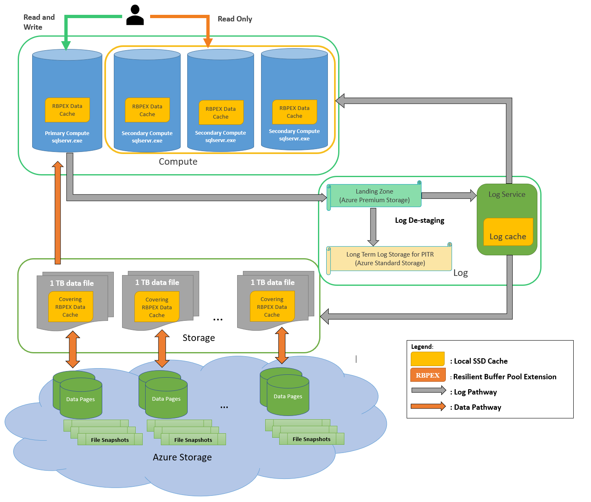
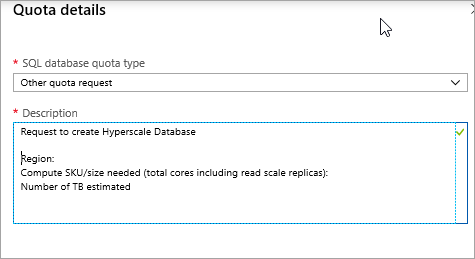

# Hyperscale service tier for up to 100 TB

Azure SQL Database is based on SQL Server Database Engine architecture that is adjusted for the cloud environment in order to ensure 99.99% availability even in the cases of infrastructure failures. There are three architectural models that are used in Azure SQL Database:
- General Purpose/Standard 
-  Hyperscale
-  Business Critical/Premium

The Hyperscale service tier in Azure SQL Database is the newest service tier in the vCore-based purchasing model. This service tier is a highly scalable storage and compute performance tier that leverages the Azure architecture to scale out the storage and compute resources for an Azure SQL Database substantially beyond the limits available for the General Purpose and Business Critical service tiers.

> 
> [!NOTE]
> For details on the General Purpose and Business Critical service tiers in the vCore-based purchasing model, see [General Purpose](sql-database-service-tier-general-purpose.md) and [Business Critical](sql-database-service-tier-business-critical.md) service tiers. For a comparison of the vCore-based purchasing model with the DTU-based purchasing model, see [Azure SQL Database purchasing models and resources](sql-database-service-tiers.md).


## What are the Hyperscale capabilities

The Hyperscale service tier in Azure SQL Database provides the following additional capabilities:

- Support for up to 100 TB of database size
- Nearly instantaneous database backups (based on file snapshots stored in Azure Blob storage) regardless of size with no IO impact on compute resources  
- Fast database restores (based on file snapshots) in minutes rather than hours or days (not a size of data operation)
- Higher overall performance due to higher log throughput and faster transaction commit times regardless of data volumes
- Rapid scale out - you can provision one or more read-only nodes for offloading your read workload and for use as hot-standbys
- Rapid Scale up - you can, in constant time, scale up your compute resources to accommodate heavy workloads as and when needed, and then scale the compute resources back down when not needed.

The Hyperscale service tier removes many of the practical limits traditionally seen in cloud databases. Where most other databases are limited by the resources available in a single node, databases in the Hyperscale service tier have no such limits. With its flexible storage architecture, storage grows as needed. In fact, Hyperscale databases aren’t created with a defined max size. A Hyperscale database grows as needed - and you are billed only for the capacity you use. For read-intensive workloads, the Hyperscale service tier provides rapid scale-out by provisioning additional read replicas as needed for offloading read workloads.

Additionally, the time required to create database backups or to scale up or down is no longer tied to the volume of data in the database. Hyperscale databases can be backed up virtually instantaneously. You can also scale a database in the tens of terabytes up or down in minutes. This capability frees you from concerns about being boxed in by your initial configuration choices.

For more information about the compute sizes for the Hyperscale service tier, see [Service tier characteristics](sql-database-service-tiers-vcore.md#service-tier-characteristics).

## Who should consider the Hyperscale service tier

The Hyperscale service tier is primarily intended for customers who have large databases either on-premises and want to modernize their applications by moving to the cloud or for customers who are already in the cloud and are limited by the maximum database size restrictions (1-4 TB). It is also intended for customers who seek high performance and high scalability for storage and compute.

The Hyperscale service tier supports all SQL Server workloads, but it is primarily optimized for OLTP. The Hyperscale service tier also supports hybrid and analytical (data mart) workloads.

> [!IMPORTANT]
> Elastic pools do not support the Hyperscale service tier.

## Hyperscale pricing model

Hyperscale service tier is only available in [vCore model](sql-database-service-tiers-vcore.md). To align with the new architecture, the pricing model is slightly different from General Purpose or Business Critical service tiers:

- **Compute**:

  The Hyperscale compute unit price is per replica. The [Azure Hybrid Benefit](https://azure.microsoft.com/pricing/hybrid-benefit/) price is applied to read scale replicas automatically. We create a primary replica and one read-only replica per Hyperscale database by default.  Users may adjust the total number of replicas including the primary from 1-5.

- **Storage**:

  You don't need to specify the max data size when configuring a Hyperscale database. In the hyperscale tier, you are charged for storage for your database based on actual usage. Storage is automatically allocated between 10 GB and 100 TB, in increments that are dynamically adjusted between 10 GB and 40 GB.  

For more information about Hyperscale pricing, see [Azure SQL Database Pricing](https://azure.microsoft.com/pricing/details/sql-database/single/)

## Distributed functions architecture

Unlike traditional database engines that have centralized all of the data management functions in one location/process (even so called distributed databases in production today have multiple copies of a monolithic data engine), a Hyperscale database separates the query processing engine, where the semantics of various data engines diverge, from the components that provide long-term storage and durability for the data. In this way, the storage capacity can be smoothly scaled out as far as needed (initial target is 100 TB). Read-only replicas share the same storage components so no data copy is required to spin up a new readable replica. 

The following diagram illustrates the different types of nodes in a Hyperscale database:



A Hyperscale database contains the following different types of nodes:

### Compute node

The compute node is where the relational engine lives, so all the language elements, query processing, and so on, occur. All user interactions with a Hyperscale database happen through these compute nodes. Compute nodes have SSD-based caches (labeled RBPEX - Resilient Buffer Pool Extension in the preceding diagram) to minimize the number of network round trips required to fetch a page of data. There is one primary compute node where all the read-write workloads and transactions are processed. There are one or more secondary compute nodes that act as hot standby nodes for failover purposes, as well as act as read-only compute nodes for offloading read workloads (if this functionality is desired).

### Page server node

Page servers are systems representing a scaled-out storage engine.  Each page server is responsible for a subset of the pages in the database.  Nominally, each page server controls between 128 GB and 1 TB of data. No data is shared on more than one page server (outside of replicas that are kept for redundancy and availability). The job of a page server is to serve database pages out to the compute nodes on demand, and to keep the pages updated as transactions update data. Page servers are kept up-to-date by playing log records from the log service. Page servers also maintain SSD-based caches to enhance performance. Long-term storage of data pages is kept in Azure Storage for additional reliability.

### Log service node

The log service node accepts log records from the primary compute node, persists them in a durable cache, and forwards the log records to the rest of the compute nodes (so they can update their caches) as well as the relevant page server(s), so that the data can be updated there. In this way, all data changes from the primary compute node are propagated through the log service to all the secondary compute nodes and page servers. Finally, the log record(s) are pushed out to long-term storage in Azure Storage, which is an infinite storage repository. This mechanism removes the necessity for frequent log truncation. The log service also has local cache to speed up access.

### Azure storage node

The Azure storage node is the final destination of data from page servers. This storage is used for backup purposes as well as for replication between Azure regions. Backups consist of snapshots of data files. Restore operation are fast from these snapshots and data can be restored to any point in time.

## Backup and restore

Backups are file-snapshot base and hence they are nearly instantaneous. Storage and compute separation enable pushing down the backup/restore operation to the storage layer to reduce the processing burden on the primary compute node. As a result, the backup of a large database does not impact the performance of the primary compute node. Similarly, restores are done by copying the file snapshot and as such are not a size of data operation. For restores within the same storage account, the restore operation is fast.

## Scale and performance advantages

With the ability to rapidly spin up/down additional read-only compute nodes, the Hyperscale architecture allows significant read scale capabilities and can also free up the primary compute node for serving more write requests. Also, the compute nodes can be scaled up/down rapidly due to the shared-storage architecture of the Hyperscale architecture.

## Create a HyperScale database

A HyperScale database can be created using the [Azure portal](https://portal.azure.com), [T-SQL](https://docs.microsoft.com/sql/t-sql/statements/create-database-transact-sql?view=azuresqldb-current), [Powershell](https://docs.microsoft.com/powershell/module/azurerm.sql/new-azurermsqldatabase) or [CLI](https://docs.microsoft.com/cli/azure/sql/db#az-sql-db-create). HyperScale databases are available only using the [vCore-based purchasing model](sql-database-service-tiers-vcore.md).

The following T-SQL command creates a Hyperscale database. You must specify both the edition and service objective in the `CREATE DATABASE` statement. Refer to the [resource limits](https://docs.microsoft.com/azure/sql-database/sql-database-vcore-resource-limits-single-databases#hyperscale-service-tier) for a list of valid service objectives.

```sql
-- Create a HyperScale Database
CREATE DATABASE [HyperScaleDB1] (EDITION = 'HyperScale', SERVICE_OBJECTIVE = 'HS_Gen5_4');
GO
```
This will create a Hyperscale database on Gen5 hardware with 4 cores.

## Migrate an existing Azure SQL Database to the Hyperscale service tier

You can move your existing Azure SQL databases to Hyperscale using the [Azure portal](https://portal.azure.com), [T-SQL](https://docs.microsoft.com/sql/t-sql/statements/alter-database-transact-sql?view=azuresqldb-current), [Powershell](https://docs.microsoft.com/powershell/module/azurerm.sql/set-azurermsqldatabase) or [CLI](https://docs.microsoft.com/cli/azure/sql/db#az-sql-db-update). At this time, this is a one-way migration. You can’t move databases from Hyperscale to another service tier. We recommend you make a copy of your production databases and migrate to Hyperscale for proof of concepts (POCs).

The following T-SQL command moves a database into the Hyperscale service tier. You must specify both the edition and service objective in the `ALTER DATABASE` statement.

```sql
-- Alter a database to make it a HyperScale Database
ALTER DATABASE [DB2] MODIFY (EDITION = 'HyperScale', SERVICE_OBJECTIVE = 'HS_Gen5_4');
GO
```

## Connect to a read-scale replica of a Hyperscale database

In HyperScale databases, the `ApplicationIntent` argument in the connection string provided by the client dictates whether the connection is routed to the write replica or to a read-only secondary replica. If the `ApplicationIntent` set to `READONLY` and the database does not have a secondary replica, connection will be routed to the primary replica and defaults to `ReadWrite` behavior.

```cmd
-- Connection string with application intent
Server=tcp:<myserver>.database.windows.net;Database=<mydatabase>;ApplicationIntent=ReadOnly;User ID=<myLogin>;Password=<myPassword>;Trusted_Connection=False; Encrypt=True;
```
## Disaster Recovery for Hyperscale Databases
### Restoring a Hyperscale database to a different geography
If you need to restore an Azure SQL Database Hyperscale DB to a region other than the one it is currently hosted in, as part of a disaster recovery operation or drill, relocation, or any other reason, the primary method is to do a geo-restore of the database.  This involves exactly the same steps as what you would use to restore any other AZURE SQL DB to a different region:
1. Create a SQL Database server in the target region if you do not already have an appropriate server there.  This server should be owned by the same subscription as the original (source) server.
2. Follow the instructions in the [geo-restore](https://docs.microsoft.com/azure/sql-database/sql-database-recovery-using-backups#geo-restore) topic of the page on restoring Azure SQL Databases from automatic backups.

> [!NOTE]
> Because the source and target are in separate regions, the database cannot share snapshot storage with the source database as in non-geo restores, which complete extremely quickly.  In the case of a geo-restore of a Hyperscale database, it will be a size-of-data operation, even if the target is in the paired region of the geo-replicated storage.  That means that doing a geo-restore will take time proportional to the size of the database being restored.  If the target is in the paired region, the copy will be within a datacenter, which will be significantly faster than a long distance copy over the internet, but it will still copy all of the bits.

## <a name=regions></a>Available regions

The Azure SQL Database Hyperscale tier is currently available in the following regions:

- Australia East
- Australia Southeast
- Brazil South
- Canada Central
- Central US
- China East 2
- China North 2
- East Asia
- East US
- East Us 2
- France Central
- Japan East
- Japan West
- Korea Central
- Korea South
- North Central US
- North Europe
- South Africa North
- South Central US
- Southeast Asia
- UK South
- UK West
- West Europe
- West US
- West US 2

If you want to create Hyperscale database in a region that is not listed as supported, you can send an onboarding request via Azure portal. We are working to expand the list of supported regions so please check back for latest region list.

To request the ability to create Hyperscale databases in regions not listed:

1. Navigate to [Azure Help and Support Blade](https://portal.azure.com/#blade/Microsoft_Azure_Support/HelpAndSupportBlade/overview)

2. Click on [**New support request**](https://ms.portal.azure.com/#blade/Microsoft_Azure_Support/HelpAndSupportBlade/newsupportrequest)

    

3. For **Issue Type**, select **Service and subscription limits (quotas)**

4. Choose the subscription you would use to create the database(s)

5. For **Quota Type**, select **SQL database**

6. Click **Next: Solutions**

1. Click **Provide Details**

    

8. Choose **SQL Database quota type**: **Other quota request**

9. Fill in the following template:

    

    In the template, provide the following information

    > Request to create Azure Hyperscale SQL Database in a new region<br/> 
    > Region: [Fill in your requested region]  <br/>
    > Compute SKU/total cores including readable replicas <br/>
    > Number of TB estimated 
    >

10. Choose **Severity C**

11. Choose the appropriate contact method and fill in details.

12. Click **Save** and **Continue**

## Known limitations
These are the current limitations to the Hyperscale service tier as of GA.  We are actively working to remove as many of these limitations as possible.

| Issue | Description |
| :---- | :--------- |
| The Manage Backups pane for a logical server does not show Hyperscale databases will be filtered from SQL server  | Hyperscale has a separate method for managing backups, and as such the Long-Term Retention and Point in Time backup Retention settings do not apply / are invalidated. Accordingly, Hyperscale databases do not appear in the Manage Backup pane. |
| Point-in-time restore | Once a database is migrated into the Hyperscale service tier, restore to a point-in-time prior to the migration is not supported.|
| Restore of non-Hyperscale DB to Hypserscale and vice-versa | You cannot restore a Hyperscale database into a non-Hyperscale database, nor can you restore a non-Hyperscale database into a Hyperscale database.|
| If a database file grows during migration due to an active workload and crosses the 1 TB per file boundary, the migration fails | Mitigations: <br> - If possible, migrate the database when there is no update workload running.<br> - Re-try the migration, it will succeed as long as the 1 TB boundary is not crossed during the migration.|
| Managed Instance | Azure SQL Database Managed Instance is not currently supported with Hyperscale databases. |
| Elastic Pools |  Elastic Pools are not currently supported with SQL Database Hyperscale.|
| Migration to Hyperscale is currently a one-way operation | Once a database is migrated to Hyperscale, it cannot be migrated directly to a non-Hyperscale service tier. At present, the only way to migrate a database from Hyperscale to non-Hyperscale is to export/import using a BACPAC file.|
| Migration of databases with persistent in-memory objects | Hyperscale only supports non persistent In-Memory objects (table types, native SPs and functions).  Persistent In-Memory tables and other objects must be dropped and recreated as non-In-Memory objects before migrating a database to the Hyperscale service tier.|
| Change Data Tracking | You will not be able to use Change Data Tracking with Hyperscale databases. |
| Geo Replication  | You cannot yet configure geo-replication for Azure SQL Database Hyperscale.  You can perform geo-restores (restoring the database in a different geography, for DR or other purposes) |
| TDE/AKV Integration | Transparent Database Encryption using Azure Key Vault (commonly referred to as Bring-Your-Own-Key or BYOK) is not yet supported for Azure SQL Database Hyperscale, however TDE with Service Managed Keys is fully supported. |
|Intelligent Database Features | 1. Create Index, Drop Index adviser models are not trained for Hyperscale DBs. <br/>2. Schema Issue, DbParameterization - recently added advisers are not supported for Hyperscale Database.|


## Next steps

- For an FAQ on Hyperscale, see [Frequently asked questions about Hyperscale](sql-database-service-tier-hyperscale-faq.md).
- For information about service tiers, see [Service tiers](sql-database-service-tiers.md)
- See [Overview of resource limits on a logical server](sql-database-resource-limits-logical-server.md) for information about limits at the server and subscription levels.
- For purchasing model limits for a single database, see [Azure SQL Database vCore-based purchasing model limits for a single database](sql-database-vcore-resource-limits-single-databases.md).
- For a features and comparison list, see [SQL common features](sql-database-features.md).
