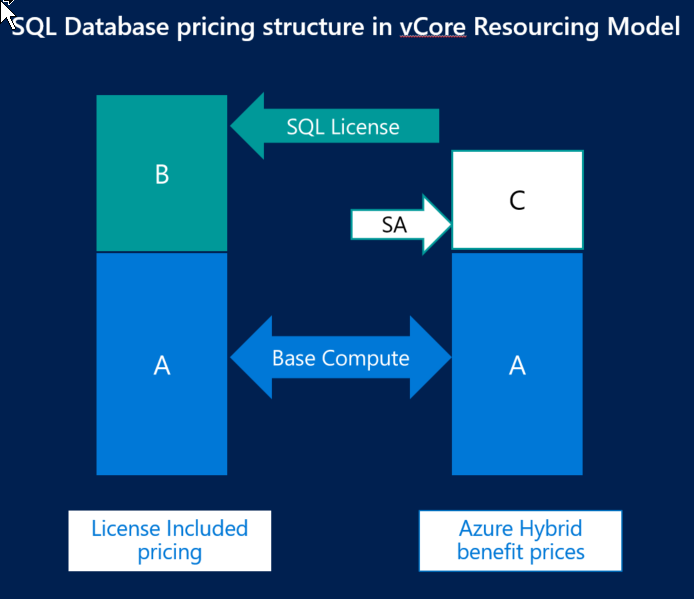

# Choose among the vCore service tiers and migrate from the DTU service tiers

The virtual core (vCore)-based purchasing model lets you independently scale compute and storage resources, match on-premises performance, and optimize price. It also lets you choose the generation of hardware:

- **Gen4**: Up to 24 logical CPUs based on Intel E5-2673 v3 (Haswell) 2.4-GHz processors, vCore = 1 PP (physical core), 7 GB per core, attached SSD
- **Gen5**: Up to 80 logical CPUs based on Intel E5-2673 v4 (Broadwell) 2.3-GHz processors, vCore = 1 LP (hyper-thread), 5.1 GB per core, fast eNVM SSD

Gen4 hardware offers substantially more memory per vCore. However, Gen5 hardware allows you to scale up compute resources much higher.

> [!IMPORTANT]
> New Gen4 databases are no longer supported in the AustraliaEast region.
> [!NOTE]
> For information about the DTU-based service tiers, see [Service tiers for the DTU-based purchasing model](sql-database-service-tiers-dtu.md). For information about the differences between the service tiers for the DTU-based and the vCore-based purchasing models, see [Azure SQL Database purchasing models](sql-database-purchase-models.md).

## Service-tier characteristics

The vCore-based purchasing model provides three service tiers: general purpose, hyperscale, and business critical. These service tiers are differentiated by a range of compute sizes, high-availability designs, fault-isolation methods, types and sizes of storage, and I/O ranges.

You must separately configure the required storage and retention period for backups. To set the backup-retention period, open the Azure portal, go to the server (not the database), and then go to **Manage Backups** > **Configure Policy** > **Point In Time Restore Configuration** > **7 - 35 days**.

The following table explains the differences between the three tiers:

||**General purpose**|**Business critical**|**Hyperscale**|
|---|---|---|---|
|Best for|Most business workloads. Offers budget-oriented, balanced, and scalable compute and storage options.|Business applications with high I/O requirements. Offers highest resilience to failures by using several isolated replicas.|Most business workloads with highly scalable storage and read-scale requirements.|
|Compute|**Provisioned compute**: Gen4: 1 to 24 vCores Gen5: 2 to 80 vCores **Serverless compute**: Gen5: 0.5 - 4 vCores|**Provisioned compute**: Gen4: 1 to 24 vCores Gen5: 2 to 80 vCores|**Provisioned compute**: Gen4: 1 to 24 vCores Gen5: 2 to 80 vCores|
|Memory|**Provisioned compute**: Gen4: 7 GB per vCore Gen5: 5.1 GB per vCore **Serverless compute**: Gen5: 3 GB per vCore|**Provisioned compute**: Gen4: 7 GB per vCore Gen5: 5.1 GB per vCore |**Provisioned compute**: Gen4: 7 GB per vCore Gen5: 5.1 GB per vCore|
|Storage|Uses remote storage. **Single database provisioned compute**: 5 GB – 4 TB **Single database serverless compute**: 5 GB - 1 TB **Managed instance**: 32 GB - 8 TB |Uses local SSD storage. **Single database provisioned compute**: 5 GB – 4 TB **Managed instance**: 32 GB - 4 TB |Flexible autogrow of storage as needed. Supports up to 100 TB of storage. Uses local SSD storage for local buffer-pool cache and local data storage. Uses Azure remote storage as final long-term data store. |
|I/O throughput (approximate)|**Single database**: 500 IOPS per vCore with 7000 maximum IOPS. **Managed instance**: Depends on [size of file](../virtual-machines/windows/premium-storage-performance.md#premium-storage-disk-sizes).|5000 IOPS per core with 200,000 maximum IOPS|Hyperscale is a multi-tiered architecture with caching at multiple levels. Effective IOPs will depend on the workload.|
|Availability|1 replica, no read-scale replicas|3 replicas, 1 [read-scale replica](sql-database-read-scale-out.md), zone-redundant high availability (HA)|1 read-write replica, plus 0-4 [read-scale replicas](sql-database-read-scale-out.md)|
|Backups|[Read-access geo-redundant storage (RA-GRS)](../storage/common/storage-designing-ha-apps-with-ragrs.md), 7-35 days (7 days by default)|[RA-GRS](../storage/common/storage-designing-ha-apps-with-ragrs.md), 7-35 days (7 days by default)|Snapshot-based backups in Azure remote storage. Restores use these snapshots for fast recovery. Backups are instantaneous and don't impact compute I/O performance. Restores are fast and aren't a size-of-data operation (taking minutes rather than hours or days).|
|In-memory|Not supported|Supported|Not supported|
|||

> [!NOTE]
> You can get a free Azure SQL database at the basic service tier in conjunction with an Azure free account. For more information, see [Create a managed cloud database with your Azure free account](https://azure.microsoft.com/free/services/sql-database/).

- For more information about vCore resource limits, see [vCore resource limits in a single database](sql-database-vcore-resource-limits-single-databases.md) and [vCore resource limits in a managed instance](sql-database-managed-instance.md#vcore-based-purchasing-model).
- For more information about the general purpose and business critical service tiers, see [General purpose and business critical service tiers](sql-database-service-tiers-general-purpose-business-critical.md).
- For more information about the hyperscale service tier in the vCore-based purchasing model, see [Hyperscale service tier](sql-database-service-tier-hyperscale.md).  

## Azure Hybrid Benefit

In the provisioned compute tier of the vCore-based purchasing model, you can exchange your existing licenses for discounted rates on SQL Database by using [Azure Hybrid Benefit for SQL Server](https://azure.microsoft.com/pricing/hybrid-benefit/). This Azure benefit allows you to save up to 30 percent on Azure SQL Database by using your on-premises SQL Server licenses with Software Assurance.

With Azure Hybrid Benefit, you can choose to pay only for the underlying Azure infrastructure by using your existing SQL Server license for the SQL database engine itself (Base Compute pricing), or you can pay for both the underlying infrastructure and the SQL Server license (License-Included pricing).

You can choose or change your licensing model by using the Azure portal or by using one of the following APIs:

- To set or update the license type by using PowerShell:

  - [New-AzSqlDatabase](https://docs.microsoft.com/powershell/module/az.sql/new-azsqldatabase)
  - [Set-AzSqlDatabase](https://docs.microsoft.com/powershell/module/az.sql/set-azsqldatabase)
  - [New-AzSqlInstance](https://docs.microsoft.com/powershell/module/az.sql/new-azsqlinstance)
  - [Set-AzSqlInstance](https://docs.microsoft.com/powershell/module/az.sql/set-azsqlinstance)

- To set or update the license type by using the Azure CLI:

  - [az sql db create](https://docs.microsoft.com/cli/azure/sql/db#az-sql-db-create)
  - [az sql db update](https://docs.microsoft.com/cli/azure/sql/db#az-sql-db-update)
  - [az sql mi create](https://docs.microsoft.com/cli/azure/sql/mi#az-sql-mi-create)
  - [az sql mi update](https://docs.microsoft.com/cli/azure/sql/mi#az-sql-mi-update)

- To set or update the license type by using the REST API:

  - [Databases - Create Or Update](https://docs.microsoft.com/rest/api/sql/databases/createorupdate)
  - [Databases - Update](https://docs.microsoft.com/rest/api/sql/databases/update)
  - [Managed Instances - Create Or Update](https://docs.microsoft.com/rest/api/sql/managedinstances/createorupdate)
  - [Managed Instances - Update](https://docs.microsoft.com/rest/api/sql/managedinstances/update)

## Migrate from the DTU-based model to the vCore-based model

### Migrate a database

Migrating a database from the DTU-based purchasing model to the vCore-based purchasing model is similar to upgrading or downgrading between the standard and premium service tiers in the DTU-based purchasing model.

### Migrate databases with geo-replication links

Migrating from the DTU-based model to the vCore-based purchasing model is similar to upgrading or downgrading the geo-replication relationships between databases in the standard and premium service tiers. During migration, you don't have to stop geo-replication, but you must follow these sequencing rules:

- When upgrading, you must upgrade the secondary database first, and then upgrade the primary.
- When downgrading, reverse the order: you must downgrade the primary database first, and then downgrade the secondary.

When you're using geo-replication between two elastic pools, we recommend that you designate one pool as the primary and the other as the secondary. In that case, when you're migrating elastic pools you should use the same sequencing guidance. However, if you have elastic pools that contain both primary and secondary databases, treat the pool with the higher utilization as the primary and follow the sequencing rules accordingly.  

The following table provides guidance for specific migration scenarios:

|Current service tier|Target service tier|Migration type|User actions|
|---|---|---|---|
|Standard|General purpose|Lateral|Can migrate in any order, but need to ensure appropriate vCore sizing*|
|Premium|Business critical|Lateral|Can migrate in any order, but need to ensure appropriate vCore sizing*|
|Standard|Business critical|Upgrade|Must migrate secondary first|
|Business critical|Standard|Downgrade|Must migrate primary first|
|Premium|General purpose|Downgrade|Must migrate primary first|
|General purpose|Premium|Upgrade|Must migrate secondary first|
|Business critical|General purpose|Downgrade|Must migrate primary first|
|General purpose|Business critical|Upgrade|Must migrate secondary first|
||||

\* Every 100 DTUs in the standard tier require at least 1 vCore, and every 125 DTUs in the premium tier require at least 1 vCore.

### Migrate failover groups

Migration of failover groups with multiple databases requires individual migration of the primary and secondary databases. During that process, the same considerations and sequencing rules apply. After the databases are converted to the vCore-based purchasing model, the failover group will remain in effect with the same policy settings.

### Create a geo-replication secondary database

You can create a geo-replication secondary database (a geo-secondary) only by using the same service tier as you used for the primary database. For databases with a high log-generation rate, we recommend creating the geo-secondary with the same compute size as the primary.

If you're creating a geo-secondary in the elastic pool for a single primary database, make sure the `maxVCore` setting for the pool matches the primary database's compute size. If you're creating a geo-secondary for a primary in another elastic pool, we recommend that the pools have the same `maxVCore` settings.

### Use database copy to convert a DTU-based database to a vCore-based database

You can copy any database with a DTU-based compute size to a database with a vCore-based compute size without restrictions or special sequencing as long as the target compute size supports the maximum database size of the source database. The database copy creates a snapshot of the data as of the starting time of the copy operation and doesn't synchronize data between the source and the target.

## Next steps

- For the specific compute sizes and storage size choices available for single databases, see [SQL Database vCore-based resource limits for single databases](sql-database-vcore-resource-limits-single-databases.md).
- For the specific compute sizes and storage size choices available for elastic pools, see [SQL Database vCore-based resource limits for elastic pools](sql-database-vcore-resource-limits-elastic-pools.md#general-purpose-service-tier-storage-sizes-and-compute-sizes).
