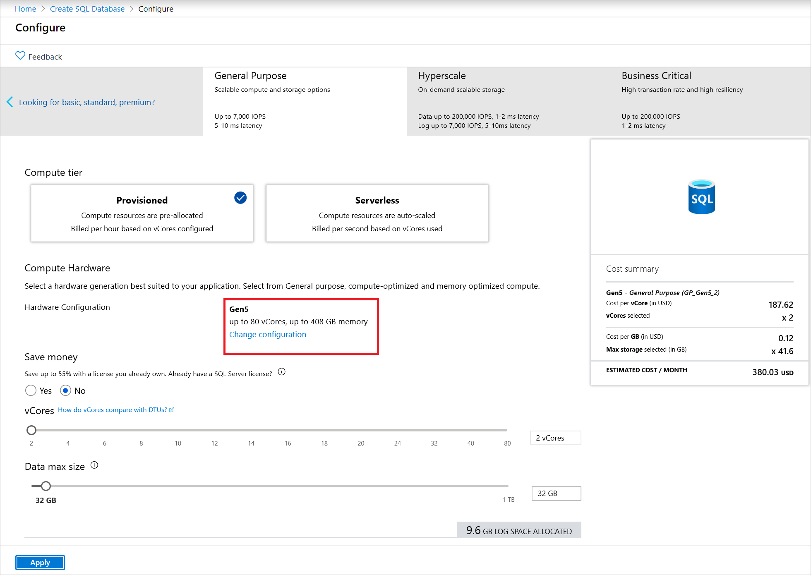
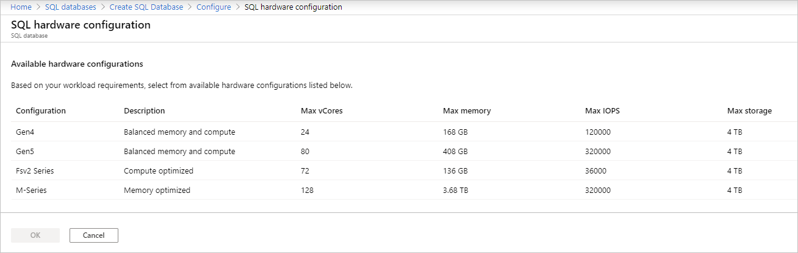

# vCore model overview

The virtual core (vCore) model provides several benefits:

- Higher compute, memory, IO, and storage limits.
- Control over the hardware generation to better match compute and memory requirements of the workload.
- Pricing discounts for [Azure Hybrid Benefit (AHB)](sql-database-azure-hybrid-benefit.md) and [Reserved Instance (RI)](sql-database-reserved-capacity.md).
- Greater transparency in the hardware details that power the compute; facilitates planning for migrations from on-premises deployments.

## Service tiers

Service tier options in the vCore model include General Purpose, Business Critical, and Hyperscale. The service tier generally defines the storage architecture, space and IO limits, and business continuity options related to availability and disaster recovery.

||**General purpose**|**Business critical**|**Hyperscale**|
|---|---|---|---|
|Best for|Most business workloads. Offers budget-oriented, balanced, and scalable compute and storage options. |Offers business applications the highest resilience to failures by using several isolated replicas, and provides the highest I/O performance per database replica.|Most business workloads with highly scalable storage and read-scale requirements.  Offers higher resilience to failures by allowing configuration of more than one isolated database replica. |
|Storage|Uses remote storage.<br/>**Single databases and elastic pools provisioned compute**:<br/>5 GB – 4 TB<br/>**Serverless compute**:<br/>5 GB - 3 TB<br/>**Managed Instance**: 32 GB - 8 TB |Uses local SSD storage.<br/>**Single databases and elastic pools provisioned compute**:<br/>5 GB – 4 TB<br/>**Managed Instance**:<br/>32 GB - 4 TB |Flexible autogrow of storage as needed. Supports up to 100 TB of storage. Uses local SSD storage for local buffer-pool cache and local data storage. Uses Azure remote storage as final long-term data store. |
|IOPS and throughput (approximate)|**Single databases and elastic pools**: See resource limits for [single databases](../sql-database/sql-database-vcore-resource-limits-single-databases.md) and [elastic pools](../sql-database/sql-database-vcore-resource-limits-elastic-pools.md).<br/>**Managed Instance**: See [Overview Azure SQL Database managed instance resource limits](../sql-database/sql-database-managed-instance-resource-limits.md#service-tier-characteristics).|See resource limits for [single databases](../sql-database/sql-database-vcore-resource-limits-single-databases.md) and [elastic pools](../sql-database/sql-database-vcore-resource-limits-elastic-pools.md).|Hyperscale is a multi-tiered architecture with caching at multiple levels. Effective IOPS and throughput will depend on the workload.|
|Availability|1 replica, no read-scale replicas|3 replicas, 1 [read-scale replica](sql-database-read-scale-out.md),<br/>zone-redundant high availability (HA)|1 read-write replica, plus 0-4 [read-scale replicas](sql-database-read-scale-out.md)|
|Backups|[Read-access geo-redundant storage (RA-GRS)](../storage/common/storage-designing-ha-apps-with-ragrs.md), 7-35 days (7 days by default)|[RA-GRS](../storage/common/storage-designing-ha-apps-with-ragrs.md), 7-35 days (7 days by default)|Snapshot-based backups in Azure remote storage. Restores use these snapshots for fast recovery. Backups are instantaneous and don't impact compute I/O performance. Restores are fast and aren't a size-of-data operation (taking minutes rather than hours or days).|
|In-memory|Not supported|Supported|Not supported|
|||


### Choosing a service tier

For information on selecting a service tier for your particular workload, see the following articles:

- [When to choose the General purpose service tier](sql-database-service-tier-general-purpose.md#when-to-choose-this-service-tier)
- [When to choose the Business Critical service tier](sql-database-service-tier-business-critical.md#when-to-choose-this-service-tier)
- [When to choose the Hyperscale service tier](sql-database-service-tier-hyperscale.md#who-should-consider-the-hyperscale-service-tier)


## Compute tiers

Compute tier options in the vCore model include the provisioned and serverless compute tiers.


### Provisioned compute

The provisioned compute tier provides a specific amount of compute resources that are continuously provisioned independent of workload activity, and bills for the amount of compute provisioned at a fixed price per hour.


### Serverless compute

The [serverless compute tier](sql-database-serverless.md) auto-scales compute resources based on workload activity, and bills for the amount of compute used per second.


## Hardware generations

Hardware generation options in the vCore model include Gen 4/5, M-series (preview), and Fsv2-series (preview). The hardware generation generally defines the compute and memory limits and other characteristics that impact the performance of the workload.

### Gen4/Gen5

- Gen4/Gen5 hardware provides balanced compute and memory resources, and is suitable for most database workloads that do not have higher memory, higher vCore, or faster single vCore requirements as provided by Fsv2-series or M-series.

For regions where Gen4/Gen5 is available, see [Gen4/Gen5 availability](#gen4gen5-1).

### Fsv2-series (preview)

- Fsv2-series is a compute optimized hardware option delivering low CPU latency and high clock speed for the most CPU demanding workloads.
- Depending on the workload, Fsv2-series can deliver more CPU performance per vCore than Gen5, and the 72 vCore size can provide more CPU performance for less cost than 80 vCores on Gen5. 
- Fsv2 provides less memory and tempdb per vCore than other hardware so workloads sensitive to those limits may want to consider Gen5 or M-series instead.  

For regions where Fsv2-series is available, see [Fsv2-series availability](#fsv2-series).


### M-series (preview)

- M-series is a memory optimized hardware option for workloads demanding more memory and higher compute limits than provided by Gen5.
- M-series provides 29 GB per vCore and 128 vCores, which increases the memory limit relative to Gen5 by 8x to nearly 4 TB.

To enable M-series hardware for a subscription and region, a support request must be open. If the support request is approved, then the selection and provisioning experience of M-series follows the same pattern as for other hardware generations. For regions where M-series is available, see [M-series availability](#m-series).


### Compute and memory specifications


|Hardware generation  |Compute  |Memory  |
|:---------|:---------|:---------|
|Gen4     |- Intel E5-2673 v3 (Haswell) 2.4 GHz processors<br>- Provision up to 24 vCores (1 vCore = 1 physical core)  |- 7 GB per vCore<br>- Provision up to 168 GB|
|Gen5     |**Provisioned compute**<br>- Intel E5-2673 v4 (Broadwell) 2.3-GHz and Intel SP-8160 (Skylake) processors<br>- Provision up to 80 vCores (1 vCore = 1 hyper-thread)<br><br>**Serverless compute**<br>- Intel E5-2673 v4 (Broadwell) 2.3-GHz and Intel SP-8160 (Skylake) processors<br>- Auto-scale up to 16 vCores (1 vCore = 1 hyper-thread)|**Provisioned compute**<br>- 5.1 GB per vCore<br>- Provision up to 408 GB<br><br>**Serverless compute**<br>- Auto-scale up to 24 GB per vCore<br>- Auto-scale up to 48 GB max|
|Fsv2-series     |- Intel Xeon Platinum 8168 (SkyLake) processors<br>- Featuring a sustained all core turbo clock speed of 3.4 GHz and a maximum single core turbo clock speed of 3.7 GHz.<br>- Provision 72 vCores (1 vCore = 1 hyper-thread)|- 1.9 GB per vCore<br>- Provision 136 GB|
|M-series     |- Intel Xeon E7-8890 v3 2.5 GHz processors<br>- Provision 128 vCores (1 vCore = 1 hyper-thread)|- 29 GB per vCore<br>- Provision 3.7 TB|


For more information on resource limits, see [Resource limits for single databases (vCore)](sql-database-vcore-resource-limits-single-databases.md), or [Resource limits for elastic pools (vCore)](sql-database-vcore-resource-limits-elastic-pools.md).

### Selecting a hardware generation

In the Azure portal, you can select the hardware generation for a SQL database or pool at the time of creation, or you can change the hardware generation of an existing SQL database or pool.

**To select a hardware generation when creating a SQL database or pool**

For detailed information, see [Create a SQL database](sql-database-single-database-get-started.md).

On the **Basics** tab, select the **Configure database** link in the **Compute + storage** section, and then select the **Change configuration** link:

  

Select the desired hardware generation:

  


**To change the hardware generation of an existing SQL database or pool**

For a database, on the Overview page, select the **Pricing tier** link:

  

For a pool, on the Overview page, select **Configure**.

Follow the steps to change configuration, and select the hardware generation as described in the previous steps.

**To select a hardware generation when creating a managed instance**

For detailed information, see [Create a managed instance](sql-database-managed-instance-get-started.md).

On the **Basics** tab, select the **Configure database** link in the **Compute + storage** section, and then select desired hardware generation:

  
  
**To change the hardware generation of an existing managed instance**

# [Portal](#tab/azure-portal)

From the managed instance page, select **Pricing tier** link placed under the Settings section


On the **Pricing tier** page you will be able to change hardware generation as described in the previous steps.

# [PowerShell](#tab/azure-powershell)

Use the following PowerShell script:

```powershell-interactive
$subscriptionId = "**************"
Select-AzSubscription -Subscription $subscriptionId

$instanceName = "********"
$resourceGroup = "****"

# THIS IS IMPORTANT PARAMETER:
$sku = @{name = "GP_Gen5" }

# NOTE: These properties are not necessary, but it would be good to set them to the current values:
# You might want to change vCores or storage with hardware generation
# $admin_login = "******"
# $admin_pass = "******"
# $location = "***** # for example: ""northeurope"
# $vCores = 8
# $maxStorage = 1024
# $license = "BasePrice"
# $subnetId = "/subscriptions/****/subnets/*******"

## NOTE: Uncomment some of the properties below if you have set them.
$properties = New-Object System.Object
# $properties | Add-Member -type NoteProperty -name subnetId -Value $subnetId
# $properties | Add-Member -type NoteProperty -name administratorLogin -Value $admin_login
# $properties | Add-Member -type NoteProperty -name administratorLoginPassword -Value $admin_pass
# $properties | Add-Member -type NoteProperty -name vCores -Value $vCores
# $properties | Add-Member -type NoteProperty -name storageSizeInGB -Value $maxStorage
# $properties | Add-Member -type NoteProperty -name licenseType -Value $license

Set-AzResource -Properties $properties -ResourceName $instanceName -ResourceType "Microsoft.SQL/managedInstances" -Sku $sku -ResourceGroupName $resourceGroup -Force -ApiVersion "2015-05-01-preview"
```

Make sure to enter your subscription ID, name, and resource group of the managed instance.

---

### Hardware availability

#### <a name="gen4gen5-1"></a> Gen4/Gen5

New Gen4 databases are no longer supported in the Australia East or Brazil South regions. 

Gen5 is available in most regions worldwide.

#### Fsv2-series

Fsv2-series is available in the following regions:
Australia Central, Australia Central 2, Australia East, Australia Southeast, Brazil South, Canada Central, East Asia, East Us, France Central, India Central, India West, Korea Central, Korea South, North Europe, South Africa North, Southeast Asia, UK South, UK West, West Europe, West Us 2.


#### M-series

M-series is available in the following regions:
East US, North Europe, West Europe, West US 2.
M-series may also have limited availability in additional regions. You can request a different region than listed here, but fulfillment in a different region may not be possible.

To enable M-series availability in a subscription, access must be requested by [filing a new support request](#create-a-support-request-to-enable-m-series).


##### Create a support request to enable M-series: 

1. Select **Help + support** in the portal.
2. Select **New support request**.

On the **Basics** page, provide the following:

1. For **Issue type**, select **Service and subscription limits (quotas)**.
2. For **Subscription** = select the subscription to enable M-series.
3. For **Quota type**, select **SQL database**.
4. Select **Next** to go to the **Details** page.

On the **Details** page, provide the following:

1. In the **PROBLEM DETAILS** section select the **Provide details** link. 
2. For **SQL Database quota type** select **M-series**.
3. For **Region**, select the region to enable M-series.
    For regions where M-series is available, see [M-series availability](#m-series).

Approved support requests are typically fulfilled within 5 business days.


## Next steps

- To create a SQL database, see [Creating a SQL database using the Azure portal](sql-database-single-database-get-started.md).
- For the specific compute sizes and storage size choices available for single databases, see [SQL Database vCore-based resource limits for single databases](sql-database-vcore-resource-limits-single-databases.md).
- For the specific compute sizes and storage size choices available for elastic pools, see [SQL Database vCore-based resource limits for elastic pools](sql-database-vcore-resource-limits-elastic-pools.md).
- For pricing details, see the [Azure SQL Database pricing page](https://azure.microsoft.com/pricing/details/sql-database/single/).
