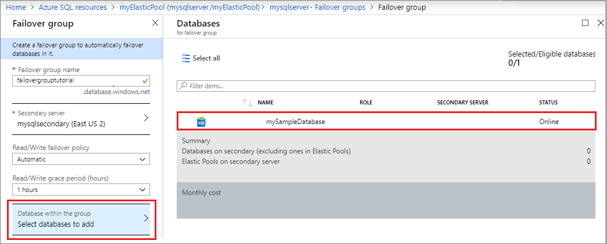

# Tutorial: Add an Azure SQL Database single database to a failover group

Configure a failover group for an Azure SQL Database single database and test failover using either the Azure portal, PowerShell, or Azure CLI.  In this tutorial, you will learn how to:

> [!div class="checklist"]
> - Create an Azure SQL Database single database.
> - Create a [failover group](sql-database-auto-failover-group.md) for a single database between two logical SQL servers.
> - Test failover.

## Prerequisites

# [Portal](#tab/azure-portal)
To complete this tutorial, make sure you have: 

- An Azure subscription. [Create a free account](https://azure.microsoft.com/free/) if you don't already have one.


# [PowerShell](#tab/azure-powershell)
To complete the tutorial, make sure you have the following items:

- An Azure subscription. [Create a free account](https://azure.microsoft.com/free/) if you don't already have one.
- [Azure PowerShell](/powershell/azureps-cmdlets-docs)


# [Azure CLI](#tab/azure-cli)
To complete the tutorial, make sure you have the following items:

- An Azure subscription. [Create a free account](https://azure.microsoft.com/free/) if you don't already have one.
- The latest version of [Azure CLI](/cli/azure/install-azure-cli?view=azure-cli-latest). 

---

## 1 - Create a single database 

[!INCLUDE [sql-database-create-single-database](includes/sql-database-create-single-database.md)]

## 2 - Create the failover group 
In this step, you will create a [failover group](sql-database-auto-failover-group.md) between an existing Azure SQL server and a new Azure SQL server in another region. Then add the sample database to the failover group. 

# [Portal](#tab/azure-portal)
Create your failover group and add your single database to it using the Azure portal. 


1. Select **All Services** on the upper-left hand corner of the [Azure portal](https://portal.azure.com). 
1. Type `sql servers` in the search box. 
1. (Optional) Select the star icon next to SQL Servers to favorite **SQL servers** and add it to your left-hand navigation pane. 
    
    

1. Select **SQL servers** and choose the server you created in section 1, such as `mysqlserver`.
1. Select **Failover groups** under the **Settings** pane, and then select **Add group** to create a new failover group. 

    

1. On the **Failover Group** page, enter or select the following values, and then select **Create**:
    - **Failover group name**: Type in a unique failover group name, such as `failovergrouptutorial`. 
    - **Secondary server**: Select the option to *configure required settings* and then choose to **Create a new server**. Alternatively, you can choose an already-existing server as the secondary server. After entering the following values, select **Select**. 
        - **Server name**: Type in a unique name for the secondary server, such as `mysqlsecondary`. 
        - **Server admin login**: Type `azureuser`
        - **Password**: Type a complex password that meets password requirements.
        - **Location**: Choose a location from the drop-down, such as East US 2. This location cannot be the same location as your primary server.

    > [!NOTE]
    > The server login and firewall settings must match that of your primary server. 
    
      

   - **Databases within the group**: Once a secondary server is selected, this option becomes unlocked. Select it to **Select databases to add** and then choose the database you created in section 1. Adding the database to the failover group will automatically start the geo-replication process. 
        
    
        

# [PowerShell](#tab/azure-powershell)
Create your failover group and add your single database to it using PowerShell. 

   > [!NOTE]
   > The server login and firewall settings must match that of your primary server. 

   ```powershell-interactive
   # $subscriptionId = '<SubscriptionID>'
   # $resourceGroupName = "myResourceGroup-$(Get-Random)"
   # $location = "West US 2"
   # $adminLogin = "azureuser"
   # $password = "PWD27!"+(New-Guid).Guid
   # $serverName = "mysqlserver-$(Get-Random)"
   # $databaseName = "mySampleDatabase"
   $drLocation = "East US 2"
   $drServerName = "mysqlsecondary-$(Get-Random)"
   $failoverGroupName = "failovergrouptutorial-$(Get-Random)"

   # Show randomized variables
   Write-host "DR Server name is" $drServerName 
   Write-host "Failover group name is" $failoverGroupName
   
   # Create a secondary server in the failover region
   Write-host "Creating a secondary logical server in the failover region..."
   $drServer = New-AzSqlServer -ResourceGroupName $resourceGroupName `
      -ServerName $drServerName `
      -Location $drLocation `
      -SqlAdministratorCredentials $(New-Object -TypeName System.Management.Automation.PSCredential `
         -ArgumentList $adminlogin, $(ConvertTo-SecureString -String $password -AsPlainText -Force))
   $drServer
   
   
   # Create a failover group between the servers
   $failovergroup = Write-host "Creating a failover group between the primary and secondary server..."
   New-AzSqlDatabaseFailoverGroup `
      –ResourceGroupName $resourceGroupName `
      -ServerName $serverName `
      -PartnerServerName $drServerName  `
      –FailoverGroupName $failoverGroupName `
      –FailoverPolicy Automatic `
      -GracePeriodWithDataLossHours 2
   $failovergroup
   
   # Add the database to the failover group
   Write-host "Adding the database to the failover group..." 
   Get-AzSqlDatabase `
      -ResourceGroupName $resourceGroupName `
      -ServerName $serverName `
      -DatabaseName $databaseName | `
   Add-AzSqlDatabaseToFailoverGroup `
      -ResourceGroupName $resourceGroupName `
      -ServerName $serverName `
      -FailoverGroupName $failoverGroupName
   Write-host "Successfully added the database to the failover group..." 
   ```

# [Azure CLI](#tab/azure-cli)
Create your failover group and add your single database to it using AZ CLI. 

   > [!NOTE]
   > The server login and firewall settings must match that of your primary server. 

   ```azurecli-interactive
   #!/bin/bash
   # Set variables
   # subscriptionID=<SubscriptionID>
   # resourceGroupName=myResourceGroup-$RANDOM
   # location=SouthCentralUS
   # adminLogin=azureuser
   # password="PWD27!"+`openssl rand -base64 18`
   # serverName=mysqlserver-$RANDOM
   # databaseName=mySampleDatabase
   drLocation=NorthEurope
   drServerName=mysqlsecondary-$RANDOM
   failoverGroupName=failovergrouptutorial-$RANDOM

   # Create a secondary server in the failover region
   echo "Creating a secondary logical server in the DR region..."
   az sql server create \
      --name $drServerName \
      --resource-group $resourceGroupName \
      --location $drLocation  \
      --admin-user $adminLogin\
      --admin-password $password
   
   # Create a failover group between the servers and add the database
   echo "Creating a failover group between the two servers..."
   az sql failover-group create \
      --name $failoverGroupName  \
      --partner-server $drServerName \
      --resource-group $resourceGroupName \
      --server $serverName \
      --add-db $databaseName
      --failover-policy Automatic
   ```

---

## 3 - Test failover 
In this step, you will fail your failover group over to the secondary server, and then fail back using the Azure portal. 

# [Portal](#tab/azure-portal)
Test failover using the Azure portal. 

1. Navigate to your **SQL servers** server within the [Azure portal](https://portal.azure.com). 
1. Select **Failover groups** under the **Settings** pane and then choose the failover group you created in section 2. 
  
   

1. Review which server is primary and which server is secondary. 
1. Select **Failover** from the task pane to failover your failover group containing your sample single database. 
1. Select **Yes** on the warning that notifies you that TDS sessions will be disconnected. 

   

1. Review which server is now primary and which server is secondary. If fail over succeeded, the two servers should have swapped roles. 
1. Select **Failover** again to fail the servers back to their originally roles. 

# [PowerShell](#tab/azure-powershell)
Test failover using PowerShell. 


Check the role of the secondary replica: 

   ```powershell-interactive
   # Set variables
   # $resourceGroupName = "myResourceGroup-$(Get-Random)"
   # $serverName = "mysqlserver-$(Get-Random)"
   # $failoverGroupName = "failovergrouptutorial-$(Get-Random)"
   
   # Check role of secondary replica
   Write-host "Confirming the secondary replica is secondary...." 
   (Get-AzSqlDatabaseFailoverGroup `
      -FailoverGroupName $failoverGroupName `
      -ResourceGroupName $resourceGroupName `
      -ServerName $drServerName).ReplicationRole
   ```


Fail over to the secondary server: 

   ```powershell-interactive
   # Set variables
   # $resourceGroupName = "myResourceGroup-$(Get-Random)"
   # $serverName = "mysqlserver-$(Get-Random)"
   # $failoverGroupName = "failovergrouptutorial-$(Get-Random)"
   
   # Failover to secondary server
   Write-host "Failing over failover group to the secondary..." 
   Switch-AzSqlDatabaseFailoverGroup `
      -ResourceGroupName $resourceGroupName `
      -ServerName $drServerName `
      -FailoverGroupName $failoverGroupName
   Write-host "Failed failover group to sucessfully to" $drServerName 
   ```

Revert failover group back to the primary server:

   ```powershell-interactive
   # Set variables
   # $resourceGroupName = "myResourceGroup-$(Get-Random)"
   # $serverName = "mysqlserver-$(Get-Random)"
   # $failoverGroupName = "failovergrouptutorial-$(Get-Random)"
   
   # Revert failover to primary server
   Write-host "Failing over failover group to the primary...." 
   Switch-AzSqlDatabaseFailoverGroup `
      -ResourceGroupName $resourceGroupName `
      -ServerName $serverName `
      -FailoverGroupName $failoverGroupName
   Write-host "Failed failover group to successfully to back to" $serverName
   ```

# [Azure CLI](#tab/azure-cli)
Test failover using the AZ CLI. 


Verify which server is the secondary:

   
   ```azurecli-interactive
   # Set variables
   # resourceGroupName=myResourceGroup-$RANDOM
   # serverName=mysqlserver-$RANDOM
   
   # Verify which server is secondary
   echo "Verifying which server is in the secondary role..."
   az sql failover-group list \
      --server $serverName \
      --resource-group $resourceGroupName
   ```

Fail over to the secondary server: 

   ```azurecli-interactive
   # Set variables
   # resourceGroupName=myResourceGroup-$RANDOM
   # drServerName=mysqlsecondary-$RANDOM
   # failoverGroupName=failovergrouptutorial-$RANDOM

   
   echo "Failing over group to the secondary server..."
   az sql failover-group set-primary \
      --name $failoverGroupName \
      --resource-group $resourceGroupName \
      --server $drServerName
   echo "Successfully failed failover group over to" $drServerName
   ```

Revert failover group back to the primary server:

   ```azurecli-interactive
   # Set variables
   # resourceGroupName=myResourceGroup-$RANDOM
   # serverName=mysqlserver-$RANDOM
   # failoverGroupName=failovergrouptutorial-$RANDOM
   
   echo "Failing over group back to the primary server..."
   az sql failover-group set-primary \
      --name $failoverGroupName \
      --resource-group $resourceGroupName \
      --server $serverName
   echo "Successfully failed failover group back to" $serverName
   ```

---

## Clean up resources 
Clean up resources by deleting the resource group. 

# [Portal](#tab/azure-portal)
Delete the resource group using the Azure portal. 


1. Navigate to your resource group in the [Azure portal](https://portal.azure.com).
1. Select  **Delete resource group** to delete all the resources in the group, as well as the resource group itself. 
1. Type the name of the resource group, `myResourceGroup`, in the textbox, and then select **Delete** to delete the resource group.  

# [PowerShell](#tab/azure-powershell)
Delete the resource group using PowerShell. 


   ```powershell-interactive
   # Set variables
   # $resourceGroupName = "myResourceGroup-$(Get-Random)"

   # Remove the resource group
   Write-host "Removing resource group..."
   Remove-AzResourceGroup -ResourceGroupName $resourceGroupName
   Write-host "Resource group removed =" $resourceGroupName
   ```

# [Azure CLI](#tab/azure-cli)
Delete the resource group by using AZ CLI. 


   ```azurecli-interactive
   # Set variables
   # resourceGroupName=myResourceGroup-$RANDOM
   
   # Clean up resources by removing the resource group
   echo "Cleaning up resources by removing the resource group..."
   az group delete \
     --name $resourceGroupName
   echo "Successfully removed resource group" $resourceGroupName
   ```

---


## Full scripts

# [PowerShell](#tab/azure-powershell)

[!code-powershell-interactive[main](../../powershell_scripts/sql-database/failover-groups/add-single-db-to-failover-group-az-ps.ps1 "Add single database to a failover group")]

# [Azure CLI](#tab/azure-cli)

[!code-azurecli-interactive[main](../../cli_scripts/sql-database/failover-groups/add-single-db-to-failover-group-az-cli.sh "Create SQL Database")]

# [Portal](#tab/azure-portal)
There are no scripts available for the Azure portal.
 
---

You can find other Azure SQL Database scripts here: [Azure PowerShell](sql-database-powershell-samples.md) and [Azure CLI](sql-database-cli-samples.md). 

## Next steps

In this tutorial, you added an Azure SQL Database single database to a failover group, and tested failover. You learned how to:

> [!div class="checklist"]
> - Create an Azure SQL Database single database. 
> - Create a [failover group](sql-database-auto-failover-group.md) for a single database between two logical SQL servers.
> - Test failover.

Advance to the next tutorial on how to add your elastic pool to a failover group. 

> [!div class="nextstepaction"]
> [Tutorial: Add an Azure SQL Database elastic pool to a failover group](sql-database-elastic-pool-failover-group-tutorial.md)
