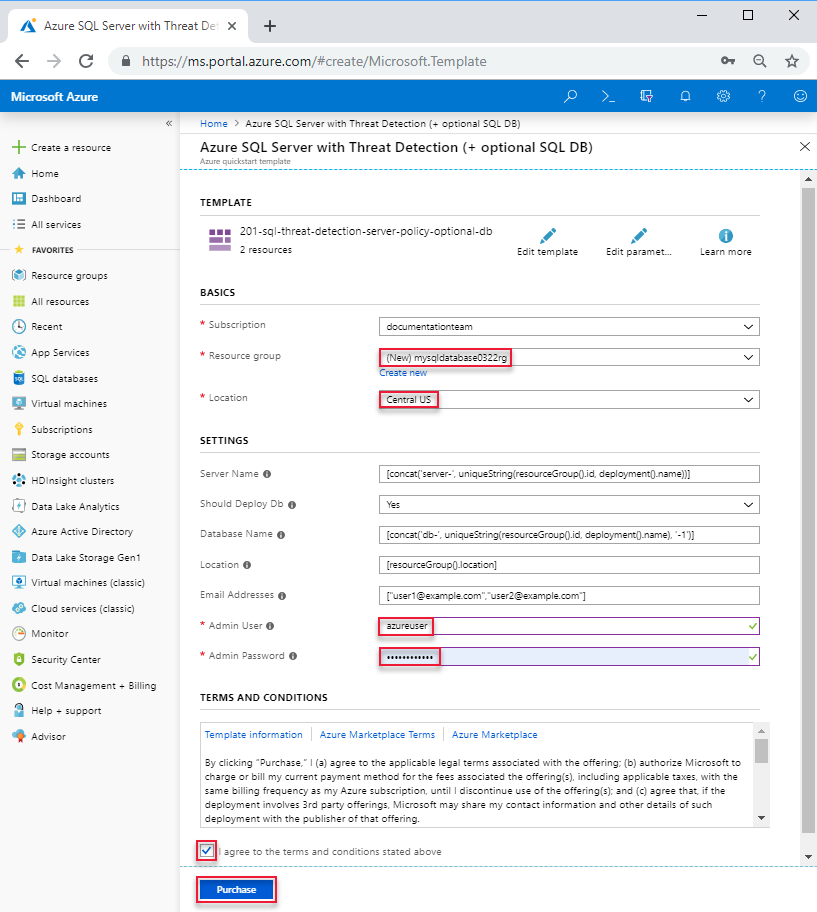

# Quickstart: Create a single database in Azure SQL Database using the Azure Resource Manager template

Creating a [single database](sql-database-single-database.md) is the quickest and simplest deployment option for creating a database in Azure SQL Database. This quickstart shows you how to create a single database using the Azure Resource Manager template. For more information, see [Azure Resource Manager documentation](/azure/azure-resource-manager/).

If you don't have an Azure subscription, [create a free account](https://azure.microsoft.com/free/).

## Create a single database

A single database has a defined set of compute, memory, IO, and storage resources using one of two [purchasing models](sql-database-purchase-models.md). When you create a single database, you also define a [SQL Database server](sql-database-servers.md) to manage it and place it within [Azure resource group](../azure-resource-manager/resource-group-overview.md) in a specified region.

The template used in this quickstart is from [Azure Quickstart templates](https://azure.microsoft.com/resources/templates/201-sql-threat-detection-server-policy-optional-db/). The following JSON file is the template that is used in this article. More Azure SQL database template samples can be found [here](https://azure.microsoft.com/resources/templates/?resourceType=Microsoft.Sql&pageNumber=1&sort=Popular).

[!code-json[create-azure-sql-database](~/quickstart-templates/201-sql-threat-detection-server-policy-optional-db/azuredeploy.json)]

1. Select the following image to sign in to Azure and open a template.

    <a href="https://portal.azure.com/#create/Microsoft.Template/uri/https%3A%2F%2Fraw.githubusercontent.com%2FAzure%2Fazure-quickstart-templates%2Fmaster%2F201-sql-threat-detection-server-policy-optional-db%2Fazuredeploy.json"></a>

2. Select or enter the following values.  

    

    Unless it is specified, use the default values.

    * **Subscription**: select an Azure subscription.
    * **Resource group**: select **Create new**, enter a unique name for the resource group, and then click **OK**. 
    * **Location**: select a location.  For example, **Central US**.
    * **Admin User**: specify a SQL database server administrator username.
    * **Admin Password**: specify an administrator password. 
    * **I agree to the terms and conditions state above**: Select.
3. Select **Purchase**.

## Query the database

To query the database, see [Query the database](./sql-database-single-database-get-started.md#query-the-database).

## Clean up resources

Keep this resource group, database server, and single database if you want to go to the [Next steps](#next-steps). The next steps show you how to connect and query your database using different methods.

To delete the resource group by using Azure CLI or Azure Powershell:

```azurecli-interactive
echo "Enter the Resource Group name:" &&
read resourceGroupName &&
az group delete --name $resourceGroupName 
```

```azurepowershell-interactive
$resourceGroupName = Read-Host -Prompt "Enter the Resource Group name"
Remove-AzResourceGroup -Name $resourceGroupName 
```

## Next steps

- Create a server-level firewall rule to connect to the single database from on-premises or remote tools. For more information, see [Create a server-level firewall rule](sql-database-server-level-firewall-rule.md).
- After you create a server-level firewall rule, [connect and query](sql-database-connect-query.md) your database using several different tools and languages.
  - [Connect and query using SQL Server Management Studio](sql-database-connect-query-ssms.md)
  - [Connect and query using Azure Data Studio](https://docs.microsoft.com/sql/azure-data-studio/quickstart-sql-database?toc=/azure/sql-database/toc.json)
- To create a single databases using Azure CLI, see [Azure CLI samples](sql-database-cli-samples.md).
- To create a single databases using Azure PowerShell, see [Azure PowerShell samples](sql-database-powershell-samples.md).
