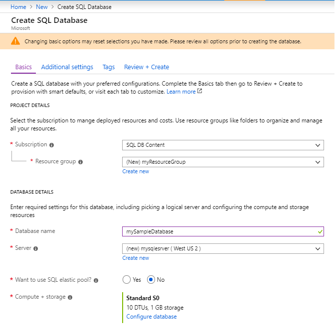
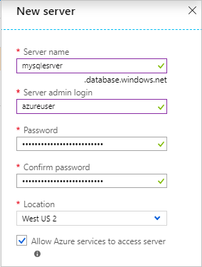
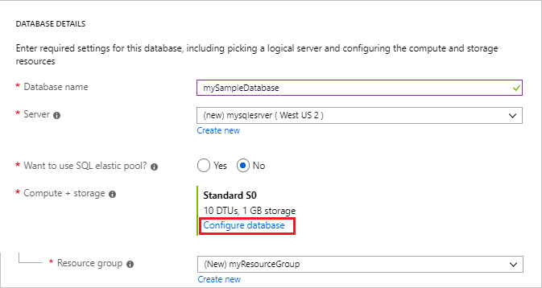
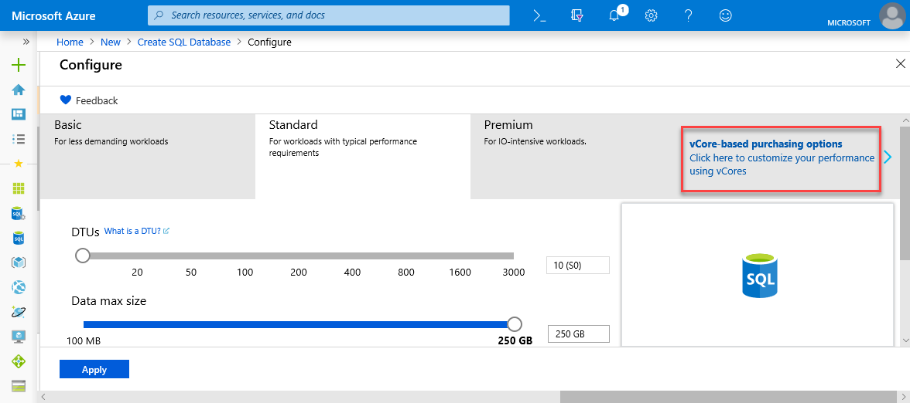
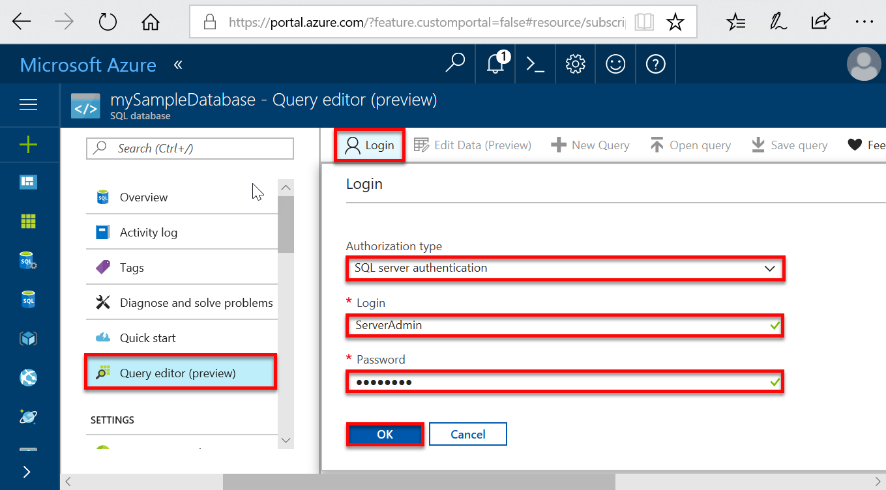
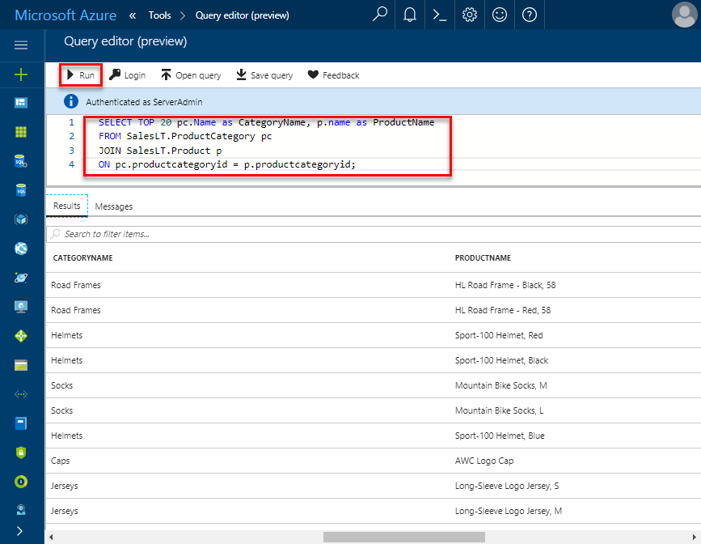

# Quickstart: Create a single database in Azure SQL Database using the Azure portal

Creating a [single database](sql-database-single-database.md) is the quickest and simplest deployment option for creating a database in Azure SQL Database. This quickstart shows you how to create and then query a single database using the Azure portal.

If you don't have an Azure subscription, [create a free account](https://azure.microsoft.com/free/).

For all steps in this quickstart, sign in to the [Azure portal](https://portal.azure.com/).

## Create a single database

A single database can either be created in the provisioned or serverless (preview) compute tier.

- A single database in the provisioned compute tier has a defined amount of pre-allocated compute resources plus a set of memory and storage resources using one of two [purchasing models](sql-database-purchase-models.md).
- A single database in the serverless compute tier has a range of compute resources that are auto-scaled plus a specified amount of memory per core, and a specified amount of storage resources and is only available in the [vCore-based purchasing models](sql-database-service-tiers-vcore.md).

When you create a single database, you also define a [SQL Database server](sql-database-servers.md) to manage it and place it within [Azure resource group](../azure-resource-manager/resource-group-overview.md) in a specified region.

> [!NOTE]
> This quickstart uses the [vCore-based purchasing model](sql-database-service-tiers-vcore.md) and the [serverless](sql-database-serverless.md) compute tier, but the [DTU-based purchasing model](sql-database-service-tiers-DTU.md) is also available.

To create a single database containing the AdventureWorksLT sample data:

1. Select **Create a resource** in the upper left-hand corner of the Azure portal.
2. Select **Databases** and then select **SQL Database** to open the **Create SQL Database** page.

   

3. On the **Basics** tab, in the **Project Details** section, type or select the following values:

   - **Subscription**: Drop down and select the correct subscription, if it doesn't appear.
   - **Resource group**: Select **Create new**, type `myResourceGroup`, and select **OK**.

     

4. In the **Database Details** section, type or select the following values:

   - **Database name**: Enter `mySampleDatabase`.
   - **Server**: Select **Create new** and enter the following values and then select **Select**.
       - **Server name**: Type `mysqlserver`; along with some numbers for uniqueness.
       - **Server admin login**: Type `azureuser`.
       - **Password**: Type a complex password that meets password requirements.
       - **Location**: Choose a location from the drop-down, such as `West US 2`.

         

      > [!IMPORTANT]
      > Remember to record the server admin login and password so you can log in to the server and databases for this and other quickstarts. If you forget your login or password, you can get the login name or reset the password on the **SQL server** page. To open the **SQL server** page, select the server name on the database **Overview** page after database creation.

        

   - **Want to use SQL elastic pool**: Select the **No** option.
   - **Compute + storage**: Select **Configure database** and for this quickstart, select **vCore-based purchasing options**

     

   - Select **Serverless**.

     

   - Review the settings for **Max vCores**, **Min vCores**, **Auto-pause delay**, and **Data max size**. Change these as desired.
   - Accept the preview terms and click **OK**.
   - Select **Apply**.

5. Select the **Additional settings** tab. 
6. In the **Data source** section, under **Use existing data**, select `Sample`. 

   

   > [!IMPORTANT]
   > Make sure to select the **Sample (AdventureWorksLT)** data so you can follow easily this and other Azure SQL Database quickstarts that use this data.

7. Leave the rest of the values as default and select **Review + Create** at the bottom of the form.
8. Review the final settings and select **Create**.

9. On the **SQL Database** form, select **Create** to deploy and provision the resource group, server, and database.

## Query the database

Now that you've created the database, use the built-in query tool in the Azure portal to connect to the database and query the data.

1. On the **SQL Database** page for your database, select **Query editor (preview)** in the left menu.

   

2. Enter your login information, and select **OK**.
3. Enter the following query in the **Query editor** pane.

   ```sql
   SELECT TOP 20 pc.Name as CategoryName, p.name as ProductName
   FROM SalesLT.ProductCategory pc
   JOIN SalesLT.Product p
   ON pc.productcategoryid = p.productcategoryid;
   ```

4. Select **Run**, and then review the query results in the **Results** pane.

   

5. Close the **Query editor** page, and select **OK** when prompted to discard your unsaved edits.

## Clean up resources

Keep this resource group, database server, and single database if you want to go to the [Next steps](#next-steps). The next steps show you how to connect and query your database using different methods.

When you're finished using these resources, you can delete them as follows:

1. From the left menu in the Azure portal, select **Resource groups**, and then select **myResourceGroup**.
2. On your resource group page, select **Delete resource group**.
3. Enter *myResourceGroup* in the field, and then select **Delete**.

## Next steps

- Create a server-level firewall rule to connect to the single database from on-premises or remote tools. For more information, see [Create a server-level firewall rule](sql-database-server-level-firewall-rule.md).
- After you create a server-level firewall rule, [connect and query](sql-database-connect-query.md) your database using several different tools and languages.
  - [Connect and query using SQL Server Management Studio](sql-database-connect-query-ssms.md)
  - [Connect and query using Azure Data Studio](https://docs.microsoft.com/sql/azure-data-studio/quickstart-sql-database?toc=/azure/sql-database/toc.json)
- To create a single database in the provisioned compute tier using Azure CLI, see [Azure CLI samples](sql-database-cli-samples.md).
- To create a single database in the provisioned compute tier using Azure PowerShell, see [Azure PowerShell samples](sql-database-powershell-samples.md).
- To create a single database in the serverless compute tier using Azure Powershell, see [Create serverless database](sql-database-serverless.md#create-new-database-in-serverless-compute-tier).