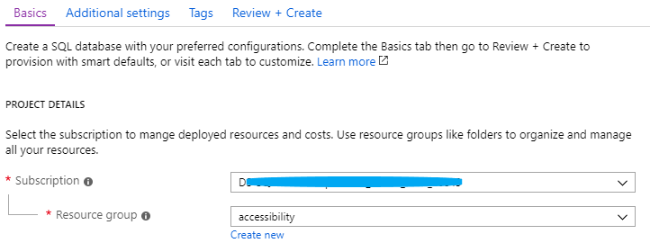
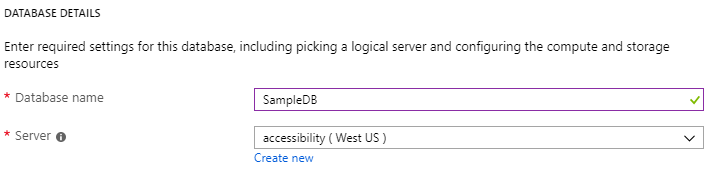
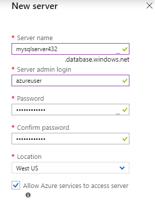
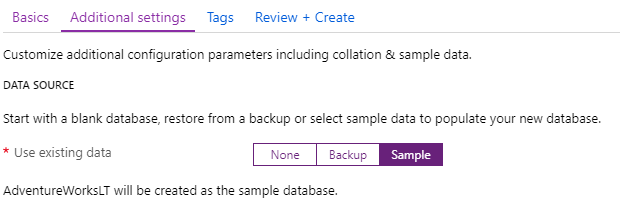

# Quickstart: Create a single database in Azure SQL Database using the Azure portal

Creating a [single database](sql-database-single-database.md) is the quickest and simplest deployment option for creating a database in Azure SQL Database. This quickstart shows you how to create and then query a single database using the Azure portal.

If you don't have an Azure subscription, [create a free account](https://azure.microsoft.com/free/).

For all steps in this quickstart, sign in to the [Azure portal](https://portal.azure.com/).

## Create a single database

A single database has a defined set of compute, memory, IO, and storage resources using one of two [purchasing models](sql-database-purchase-models.md). When you create a single database, you also define a [SQL Database server](sql-database-servers.md) to manage it and place it within [Azure resource group](../azure-resource-manager/resource-group-overview.md) in a specified region.

To create a single database containing the AdventureWorksLT sample data:

1. Select **Create a resource** in the upper left-hand corner of the Azure portal.
2. Select **Databases** and then select **SQL Database**.

   

3. In the **Basics** tab, under **Project details**, make sure the correct subscription is selected and then choose to **Create new** resource group. Type *myResourceGroup* for the name.

   

4. Under **Database details**, enter *mySampleDatabase* for **Database name** and select **Create new** under **Server**. In the **New server** form, enter these following settings then click **Select**.
    - **Server name**: Enter *mysqlserver* plus a few random numbers at the end for uniqueness.
    - **Server admin login**: Type *azureuser*.
    - **Password**: Enter *Azure1234567*.
    - **Confirm Password**: Retype the password.
    - **Location**: Drop down and select any valid location.

    

    

5. You can leave **Compute + Storage** at the default. If you would like to explore the configuration options available, click on **Configure database**.

6. At the top of the form, click the **Additional settings** tab. Under **Select source**, select *Sample*. This selection is important as it give us sample data to query in this database later on.

    

7. Select **Review + create**. Review the pricing details and the list of settings. Click **Create**.

8. On the **SQL Database** form, select **Create** to deploy and provision the resource group, server, and database.


## Query the database

Now that you've created the database, use the built-in query tool in the Azure portal to connect to the database and query the data.

1. On the **SQL Database** page for your database, select **Query editor (preview)** in the left menu.

   

2. Enter your login information, and select **OK**.
3. Enter the following query in the **Query editor** pane.

   ```sql
   SELECT TOP 20 pc.Name as CategoryName, p.name as ProductName
   FROM SalesLT.ProductCategory pc
   JOIN SalesLT.Product p
   ON pc.productcategoryid = p.productcategoryid;
   ```

4. Select **Run**, and then review the query results in the **Results** pane.

   

5. Close the **Query editor** page, and select **OK** when prompted to discard your unsaved edits.

## Clean up resources

Keep this resource group, database server, and single database if you want to go to the [Next steps](#next-steps). The next steps show you how to connect and query your database using different methods.

When you're finished using these resources, you can delete them as follows:

1. From the left menu in the Azure portal, select **Resource groups**, and then select **myResourceGroup**.
2. On your resource group page, select **Delete resource group**.
3. Enter *myResourceGroup* in the field, and then select **Delete**.

## Next steps

- Create a server-level firewall rule to connect to the single database from on-premises or remote tools. For more information, see [Create a server-level firewall rule](sql-database-server-level-firewall-rule.md).
- After you create a server-level firewall rule, [connect and query](sql-database-connect-query.md) your database using several different tools and languages.
  - [Connect and query using SQL Server Management Studio](sql-database-connect-query-ssms.md)
  - [Connect and query using Azure Data Studio](https://docs.microsoft.com/sql/azure-data-studio/quickstart-sql-database?toc=/azure/sql-database/toc.json)
- To create a single databases using Azure CLI, see [Azure CLI samples](sql-database-cli-samples.md).
- To create a single databases using Azure PowerShell, see [Azure PowerShell samples](sql-database-powershell-samples.md).
