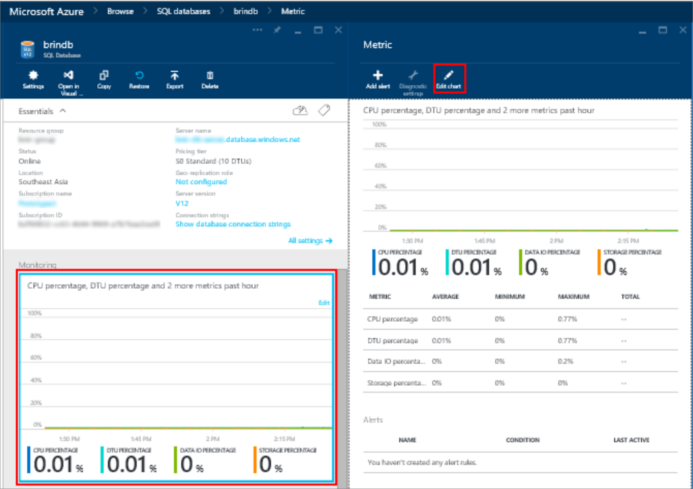

<properties
	pageTitle="Monitoring database performance in Azure SQL Database | Microsoft Azure"
	description="Learn about the options for monitoring your database with Azure tools and dynamic management views."
	keywords="database monitoring, cloud database performance"
	services="sql-database"
	documentationCenter=""
	authors="carlrabeler"
	manager="jhubbard"
	editor=""/>

<tags
	ms.service="sql-database"
	ms.devlang="na"
	ms.topic="get-started-article"
	ms.tgt_pltfrm="na"
	ms.workload="data-management"
	ms.date="07/06/2016"
	ms.author="carlrab"/>

# Monitoring database performance in Azure SQL Database
Monitoring the performance of a SQL database in Azure starts with monitoring the resource utilization relative to the level of database performance you choose. Monitoring helps you  determine whether your database has excess capacity or is having trouble because resources are maxed out, and then decide whether it's time to adjust the performance level and [service tier](sql-database-service-tiers.md) of your database. You can monitor your database using graphical tools in the [Azure portal](https://portal.azure.com) or using SQL [dynamic management views](https://msdn.microsoft.com/library/ms188754.aspx).

## Monitor databases using the Azure portal

In the [Azure portal](https://portal.azure.com/), you can monitor a single database’s utilization by selecting your database and clicking the **Monitoring** chart. This brings up a **Metric** window that you can change by clicking the **Edit chart** button. Add the following metrics:

- CPU percentage
- DTU percentage
- Data IO percentage
- Database size percentage

Once you’ve added these metrics, you can continue to view them in the **Monitoring** chart with more details on the **Metric** window. All four metrics show the average utilization percentage relative to the **DTU** of your database. See the [service tiers](sql-database-service-tiers.md) article for details about DTUs.

You can also configure alerts on the performance metrics. Click the **Add alert** button in the **Metric** window. Follow the wizard to configure your alert. You have the option to alert if the metrics exceed a certain threshold or if the metric falls below a certain threshold.

For example, if you expect the workload on your database to grow, you can choose to configure an email alert whenever your database reaches 80% on any of the performance metrics. You can use this as an early warning to figure out when you might have to switch to the next higher performance level.

The performance metrics can also help you determine if you are able to downgrade to a lower performance level. Assume you are using a Standard S2 database and all performance metrics show that the database on average does not use more than 10% at any given time. It is likely that the database will work well in Standard S1. However, be aware of workloads that spike or fluctuate before making the decision to move to a lower performance level.

## Monitor databases using DMVs

The same metrics that are exposed in the portal are also available through system views: [sys.resource_stats](https://msdn.microsoft.com/library/dn269979.aspx) in the logical **master** database of your server, and [sys.dm_db_resource_stats](https://msdn.microsoft.com/library/dn800981.aspx) in the user database. Use **sys.resource_stats** if you need to monitor less granular data across a longer period of time. Use **sys.dm_db_resource_stats** if you need to monitor more granular data within a smaller time frame. For more information, see [Azure SQL Database Performance Guidance](sql-database-performance-guidance.md#monitoring-resource-use-with-sysresourcestats).

>[AZURE.NOTE] **sys.dm_db_resource_stats** returns an empty result set when used in Web and Business edition databases, which are retired.

For elastic database pools, you can monitor individual databases in the pool with the techniques described in this section. But you can also monitor the pool as a whole. For information, see [Monitor and manage an elastic database pool](sql-database-elastic-pool-manage-portal.md).
