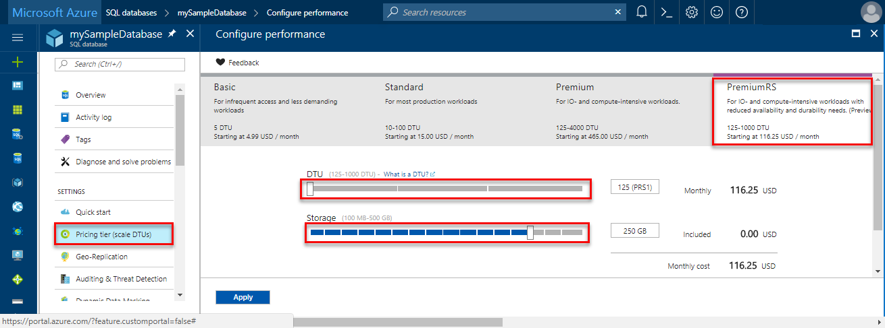

# Manage resources for a single database in Azure SQL Database

With a single database, you determine the amount of resources that the database requires to handle its workload at the service tier, performance level, and amount of storage it requires. 

## Single database service tiers, performance levels, and storage amounts
For single databases, the following tables show the resources available for a single database at each service tier and performance level. You can set the service tier, performance level, and storage amount for a single database using the [Azure portal](#manage-single-database-resources-using-the-azure-portal), [Transact-SQL](sql-database-single-database-resources.md#manage-single-database-resources-using-transact-sql), [PowerShell](#manage-single-database-resources-using-powershell), the [Azure CLI](#manage-single-database-resources-using-the-azure-cli), or the [REST API](#manage-single-database-resources-using-the-rest-api).

The following video shows dynamically changing the performance tier to increase available DTUs for a single database.

[!INCLUDE [SQL DB service tiers table](../../includes/sql-database-service-tiers-table.md)]

## Rescaling DTUs for a single database

After initially picking a service tier, performance level, and storage amount, you can scale a single database up or down dynamically based on actual experience using the [Azure portal](#manage-single-database-resources-using-the-azure-portal), [Transact-SQL](sql-database-single-database-resources.md#manage-single-database-resources-using-transact-sql), [PowerShell](#manage-single-database-resources-using-powershell), the [Azure CLI](#manage-single-database-resources-using-the-azure-cli), or the [REST API](#manage-single-database-resources-using-the-rest-api). 

> [!VIDEO https://channel9.msdn.com/Blogs/Azure/Azure-SQL-Database-dynamically-scale-up-or-scale-down/player]
>

Changing the service tier and/or performance level of a database creates a replica of the original database at the new performance level, and then switches connections over to the replica. No data is lost during this process but during the brief moment when we switch over to the replica, connections to the database are disabled, so some transactions in flight may be rolled back. The length of time for the switch-over varies, but is generally under 4 seconds is less than 30 seconds 99% of the time. If there are large numbers of transactions in flight at the moment connections are disabled, the length of time for the switch-over may be longer. 

The duration of the entire scale-up process depends on both the size and service tier of the database before and after the change. For example, a 250-GB database that is changing to, from, or within a Standard service tier, should complete within 6 hours. For a database the same size that is changing performance levels within the Premium service tier, the scale-up should complete within three hours.

> [!TIP]
> To check on the status of an ongoing SQL database scaling operation, you can use the following query: ```select * from sys.dm_operation_status```.
>

* If you are upgrading to a higher service tier or performance level, the database max size does not increase unless you explicitly specify a larger size (maxsize).
* To downgrade a database, the database used space must be smaller than the maximum allowed size of the target service tier and performance level. 
* When downgrading from **Premium** or **Premium RS** to the **Standard** tier, an extra storage cost applies if both (1) the max size of the database is supported in the target performance level, and (2) the max size exceeds the included storage amount of the target performance level. For example, if a P1 database with a max size of 500 GB is downsized to S3, then an extra storage cost applies since S3 supports a max size of 500 GB and its included storage amount is only 250 GB. So, the extra storage amount is 500 GB – 250 GB = 250 GB. For pricing of extra storage please see [SQL Database pricing](https://azure.microsoft.com/pricing/details/sql-database/). If the actual amount of space used is less than the included storage amount, then this extra cost can be avoided by reducing the database max size to the included amount. 
* When upgrading a database with [geo-replication](sql-database-geo-replication-portal.md) enabled, upgrade its secondary databases to the desired performance tier before upgrading the primary database (general guidance). When upgrading to a different edition ugrading the secondary database first is required.
* When downgrading a database with [geo-replication](sql-database-geo-replication-portal.md) enabled, downgrade its primary databases to the desired performance tier before downgrading the secondary database (general guidance). When downgrading to a different edition, downgrading the primary database first is required.
* The restore service offerings are different for the various service tiers. If you are downgrading to the **Basic** tier, there is a lower backup retention period - see [Azure SQL Database Backups](sql-database-automated-backups.md).
* The new properties for the database are not applied until the changes are complete.

## Current limitations of P11 and P15 databases with a maximum size greater than 1 TB

A maximum size greater than 1 TB for P11 and P15 database is supported in the following regions: US East2, West US, US Gov Virginia, West Europe, Germany Central, South East Asia, Japan East, Australia East, Canada Central, and Canada East. The following considerations and limitations apply to P11 and P15 databases with a maximum size greater than 1 TB:

- If you choose a maximum size greater than 1 TB when creating a database (using a value of 4 TB or 4096 GB), the create command fails with an error if the database is provisioned in an unsupported region.
- For existing P11 and P15 databases located in one of the supported regions, you can increase the maximum storage to beyond 1 TB in increments of 256 GB up to 4 TB. To see if a larger size is supported in your region, use the [DATABASEPROPERTYEX](/t-sql/functions/databasepropertyex-transact-sql) function or inspect the database size in the Azure portal. Upgrading an existing P11 or P15 database can only be performed by a server-level principal login or by members of the dbmanager database role. 
- If an upgrade operation is executed in a supported region the configuration is updated immediately. The database remains online during the upgrade process. However, you cannot utilize the full amount of storage beyond 1 TB of storage until the actual database files have been upgraded to the new maximum size. The length of time required depends upon on the size of the database being upgraded. 
- When creating or updating a P11 or P15 database, you can only choose between 1-TB and 4-TB maximum size in increments of 256 GB. When creating a P11/P15, the default storage option of 1 TB is pre-selected. For databases located in one of the supported regions, you can increase the storage maximum to up to a maximum of 4 TB for a new or existing single database. For all other regions, the maximum size cannot be increased above 1 TB. The price does not change when you select 4 TB of included storage.
- If the maximum size of a database is set to greater than 1 TB, then it cannot be changed to 1 TB even if the actual storage used is below 1 TB. Thus, you cannot downgrade a P11 or P15 with a maximum size larger than 1 TB to a 1 TB P11 or 1 TB P15 or lower performance tier, such as P1-P6). This restriction also applies to the restore and copy scenarios including point-in-time, geo-restore, long-term-backup-retention, and database copy. Once a database is configured with a maximum size greater than 1 TB, all restore operations of this database must be run into a P11/P15 with a maximum size greater than 1 TB.
- For active geo-replication scenarios:
   - Setting up a geo-replication relationship: If the primary database is P11 or P15, the secondary(ies) must also be P11 or P15; lower performance tiers are rejected as secondaries since they are not capable of supporting more than 1 TB.
   - Upgrading the primary database in a geo-replication relationship: Changing the maximum size to more than 1 TB on a primary database triggers the same change on the secondary database. Both upgrades must be successful for the change on the primary to take effect. Region limitations for more than 1 TB option apply. If the secondary is in a region that does not support more than 1 TB, the primary is not upgraded.
- Using the Import/Export service for loading P11/P15 databases with more than 1 TB is not supported. Use SqlPackage.exe to [import](sql-database-import.md) and [export](sql-database-export.md) data.

## Manage single database resources using the Azure portal

To set or change the service tier, performance level, or storage amount for a new or existing Azure SQL database using the Azure portal, open the **Configure performance** window for your database by clicking **Pricing tier (scale DTUs)** - as shown in the following screenshot. 

- Set or change the service tier by selecting the service tier for your workload. 
- Set or change the performance level (**DTUs**) within a service tier using the **DTU** slider.
- Set or change the storage amount for the performance level using the **Storage** slider. 



> [!IMPORTANT]
> Review [Current limitations of P11 and P15 databases with 4-TB maximum size](#current-limitations-of-p11-and-p15-databases-with-a-maximum-size-greater-than-1-tb) when selecting a P11 or P15 service tier.
>

## Manage single database resources using PowerShell

To set or change Azure SQL databases service tiers, performance levels, and storage amount using PowerShell, use these PowerShell cmdlets. If you need to install or upgrade PowerShell, see [Install Azure PowerShell module](/powershell/azure/install-azurerm-ps). 

| Cmdlet | Description |
| --- | --- |
|[New-AzureRmSqlDatabase](/powershell/module/azurerm.sql/new-azurermsqldatabase)|Creates a database |
|[Get-AzureRmSqlDatabase](/powershell/module/azurerm.sql/get-azurermsqldatabase)|Gets one or more databases|
|[Set-​Azure​Rm​Sql​Database](/powershell/module/azurerm.sql/set-azurermsqldatabase)|Sets properties for a database, or moves an existing database into an elastic pool. For example, use the **MaxSizeBytes** property to set the maximum size for a database.|


> [!TIP]
> For a PowerShell example script that monitors the performance metrics of a database, scales it to a higher performance level, and creates an alert rule on one of the performance metrics, see [Monitor and scale a single SQL database using PowerShell](scripts/sql-database-monitor-and-scale-database-powershell.md).

## Manage single database resources using the Azure CLI

To set or change Azure SQL databases service tiers, performance levels, and storage amount using the Azure CLI, use these [Azure CLI SQL Database](/cli/azure/sql/db) commands. Use the [Cloud Shell](/azure/cloud-shell/overview) to run the CLI in your browser, or [install](/cli/azure/install-azure-cli) it on macOS, Linux, or Windows. For creating and managing SQL elastic pools, see [Elastic pools](sql-database-elastic-pool.md).

| Cmdlet | Description |
| --- | --- |
|[az sql db create](/cli/azure/sql/db#create) |Creates a database|
|[az sql db list](/cli/azure/sql/db#list)|Lists all databases and data warehouses in a server, or all databases in an elastic pool|
|[az sql db list-editions](/cli/azure/sql/db#list-editions)|Lists available service objectives and storage limits|
|[az sql db list-usages](/cli/azure/sql/db#list-usages)|Returns database usages|
|[az sql db show](/cli/azure/sql/db#show)|Gets a database or data warehouse|
|[az sql db update](/cli/azure/sql/db#update)|Updates a database|

> [!TIP]
> For an Azure CLI example script that scales a single Azure SQL database to a different performance level after querying the size information of the database, see [Use CLI to monitor and scale a single SQL database](scripts/sql-database-monitor-and-scale-database-cli.md).
>

## Manage single database resources using Transact-SQL

To set or change Azure SQL databases service tiers, performance levels, and storage amount with Transact-SQL, use these T-SQL commands. You can issue these commands using the Azure portal, [SQL Server Management Studio](/sql/ssms/use-sql-server-management-studio), [Visual Studio Code](https://code.visualstudio.com/docs), or any other program that can connect to an Azure SQL Database server and pass Transact-SQL commands. 

| Command | Description |
| --- | --- |
|[CREATE DATABASE (Azure SQL Database)](/sql/t-sql/statements/create-database-azure-sql-database)|Creates a new database. You must be connected to the master database to create a new database.|
| [ALTER DATABASE (Azure SQL Database)](/sql/t-sql/statements/alter-database-azure-sql-database) |Modifies an Azure SQL database. |
|[sys.database_service_objectives (Azure SQL Database)](/sql/relational-databases/system-catalog-views/sys-database-service-objectives-azure-sql-database)|Returns the edition (service tier), service objective (pricing tier), and elastic pool name, if any, for an Azure SQL database or an Azure SQL Data Warehouse. If logged on to the master database in an Azure SQL Database server, returns information on all databases. For Azure SQL Data Warehouse, you must be connected to the master database.|
|[sys.database_usage (Azure SQL Database)](/sql/relational-databases/system-catalog-views/sys-database-usage-azure-sql-database)|Lists the number, type, and duration of databases on an Azure SQL Database server.|

The following example shows the maximum size for a database being changed using the ALTER DATABASE command:

 ```sql
ALTER DATABASE <myDatabaseName> 
   MODIFY (MAXSIZE = 4096 GB);
```

## Manage single database resources using the REST API

To set or change Azure SQL databases service tiers, performance levels, and storage amount using the REST API, see [Azure SQL Database REST API](/rest/api/sql/).


## Next steps

- Learn about service tiers, performance levels, and storage amounts, see [Service tiers](sql-database-service-tiers.md).
- Learn about elastic pools, see [Elastic pools](sql-database-elastic-pool.md).
- Learn about [Azure Subscription and Service Limits, Quotas, and Constraints](../azure-subscription-service-limits.md)
