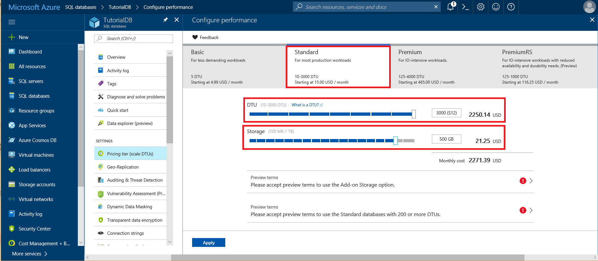

# Manage resources for a single database in Azure SQL Database

With a single database, you determine the amount of resources that the database requires to handle its workload at the service tier, performance level, and amount of storage it requires. 

## Manage single database resources using the Azure portal

To set or change the service tier, performance level, or storage amount for a new or existing Azure SQL database using the Azure portal, open the **Configure performance** window for your database by clicking **Pricing tier (scale DTUs)** - as shown in the following screenshot. 

- Set or change the service tier by selecting the service tier for your workload. 
- Set or change the performance level (**DTUs**) within a service tier using the **DTU** slider.
- Set or change the storage amount for the performance level using the **Storage** slider. 



> [!IMPORTANT]
> Review [Current limitations of P11 and P15 databases with 4-TB maximum size](#single-database-limitations-of-p11-and-p15-when-the-maximum-size-greater-than-1-tb) when selecting a P11 or P15 service tier.
>

## Manage single database resources using PowerShell

To set or change Azure SQL databases service tiers, performance levels, and storage amount using PowerShell, use these PowerShell cmdlets. If you need to install or upgrade PowerShell, see [Install Azure PowerShell module](/powershell/azure/install-azurerm-ps). 

| Cmdlet | Description |
| --- | --- |
|[New-AzureRmSqlDatabase](/powershell/module/azurerm.sql/new-azurermsqldatabase)|Creates a database |
|[Get-AzureRmSqlDatabase](/powershell/module/azurerm.sql/get-azurermsqldatabase)|Gets one or more databases|
|[Set-​Azure​Rm​Sql​Database](/powershell/module/azurerm.sql/set-azurermsqldatabase)|Sets properties for a database, or moves an existing database into an elastic pool. For example, use the **MaxSizeBytes** property to set the maximum size for a database.|


> [!TIP]
> For a PowerShell example script that monitors the performance metrics of a database, scales it to a higher performance level, and creates an alert rule on one of the performance metrics, see [Monitor and scale a single SQL database using PowerShell](scripts/sql-database-monitor-and-scale-database-powershell.md).

## Manage single database resources using the Azure CLI

To set or change Azure SQL databases service tiers, performance levels, and storage amount using the Azure CLI, use these [Azure CLI SQL Database](/cli/azure/sql/db) commands. Use the [Cloud Shell](/azure/cloud-shell/overview) to run the CLI in your browser, or [install](/cli/azure/install-azure-cli) it on macOS, Linux, or Windows. For creating and managing SQL elastic pools, see [Elastic pools](sql-database-elastic-pool.md).

| Cmdlet | Description |
| --- | --- |
|[az sql db create](/cli/azure/sql/db#create) |Creates a database|
|[az sql db list](/cli/azure/sql/db#list)|Lists all databases and data warehouses in a server, or all databases in an elastic pool|
|[az sql db list-editions](/cli/azure/sql/db#list-editions)|Lists available service objectives and storage limits|
|[az sql db list-usages](/cli/azure/sql/db#list-usages)|Returns database usages|
|[az sql db show](/cli/azure/sql/db#show)|Gets a database or data warehouse|
|[az sql db update](/cli/azure/sql/db#update)|Updates a database|

> [!TIP]
> For an Azure CLI example script that scales a single Azure SQL database to a different performance level after querying the size information of the database, see [Use CLI to monitor and scale a single SQL database](scripts/sql-database-monitor-and-scale-database-cli.md).
>

## Manage single database resources using Transact-SQL

To set or change Azure SQL databases service tiers, performance levels, and storage amount with Transact-SQL, use these T-SQL commands. You can issue these commands using the Azure portal, [SQL Server Management Studio](/sql/ssms/use-sql-server-management-studio), [Visual Studio Code](https://code.visualstudio.com/docs), or any other program that can connect to an Azure SQL Database server and pass Transact-SQL commands. 

| Command | Description |
| --- | --- |
|[CREATE DATABASE (Azure SQL Database)](/sql/t-sql/statements/create-database-azure-sql-database)|Creates a new database. You must be connected to the master database to create a new database.|
| [ALTER DATABASE (Azure SQL Database)](/sql/t-sql/statements/alter-database-azure-sql-database) |Modifies an Azure SQL database. |
|[sys.database_service_objectives (Azure SQL Database)](/sql/relational-databases/system-catalog-views/sys-database-service-objectives-azure-sql-database)|Returns the edition (service tier), service objective (pricing tier), and elastic pool name, if any, for an Azure SQL database or an Azure SQL Data Warehouse. If logged on to the master database in an Azure SQL Database server, returns information on all databases. For Azure SQL Data Warehouse, you must be connected to the master database.|
|[sys.database_usage (Azure SQL Database)](/sql/relational-databases/system-catalog-views/sys-database-usage-azure-sql-database)|Lists the number, type, and duration of databases on an Azure SQL Database server.|

The following example shows the maximum size for a database being changed using the ALTER DATABASE command:

 ```sql
ALTER DATABASE <myDatabaseName> 
   MODIFY (MAXSIZE = 4096 GB);
```

## Manage single database resources using the REST API

To set or change Azure SQL databases service tiers, performance levels, and storage amount use these REST API requests.

| Command | Description |
| --- | --- |
|[Databases - Create Or Update](/rest/api/sql/databases/createorupdate)|Creates a new database or updates an existing database.|
|[Databases - Get](/rest/api/sql/databases/get)|Gets a database.|
|[Databases - Get By Elastic Pool](/rest/api/sql/databases/getbyelasticpool)|Gets a database inside of an elastic pool.|
|[Databases - Get By Recommended Elastic Pool](/rest/api/sql/databases/getbyrecommendedelasticpool)|Gets a database inside of a recommented elastic pool.|
|[Databases - List By Elastic Pool](/rest/api/sql/databases/listbyelasticpool)|Returns a list of databases in an elastic pool.|
|[Databases - List By Recommended Elastic Pool](/rest/api/sql/databases/listbyrecommendedelasticpool)|Returns a list of databases inside a recommented elastic pool.|
|[Databases - List By Server](/rest/api/sql/databases/listbyserver)|Returns a list of databases in a server.|
|[Databases - Update](/api/sql/databases/update)|Updates an existing database.|


## Next steps

- Learn about service tiers, performance levels, and storage amounts, see [Service tiers](sql-database-service-tiers.md).
- Learn about elastic pools, see [Elastic pools](sql-database-elastic-pool.md).
- Learn about [Azure Subscription and Service Limits, Quotas, and Constraints](../azure-subscription-service-limits.md)
