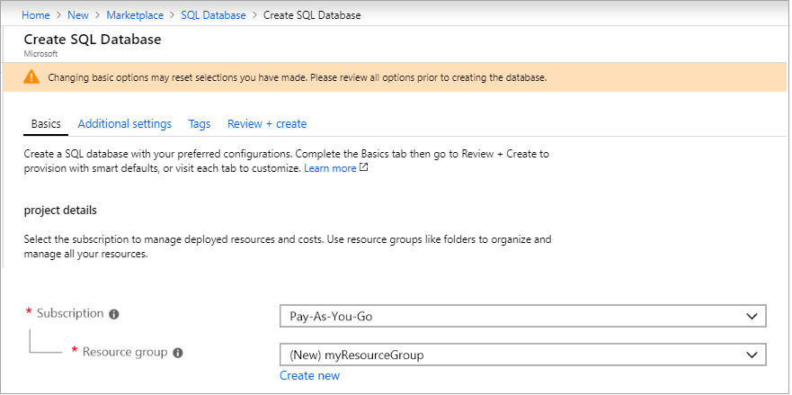
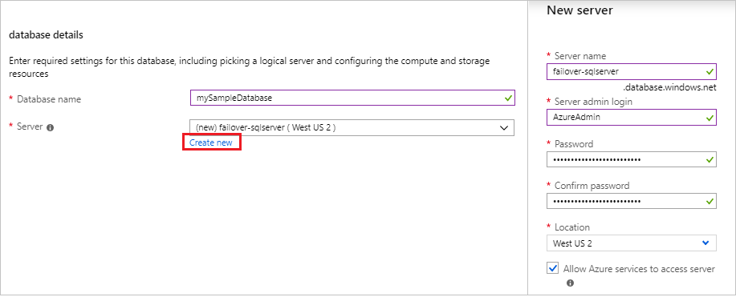
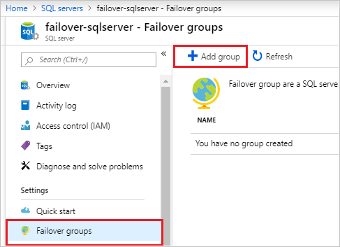
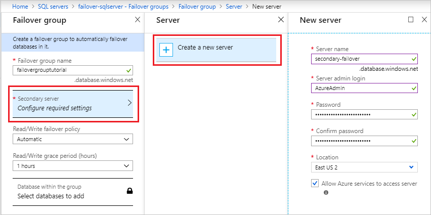
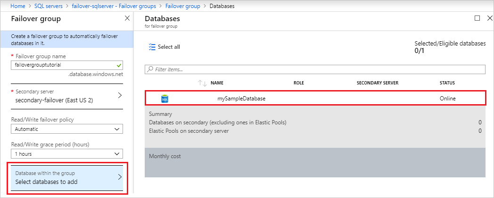
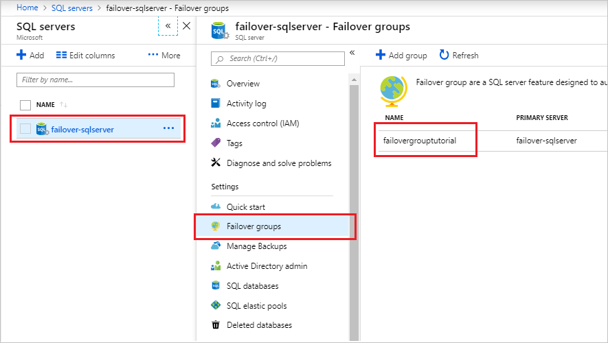
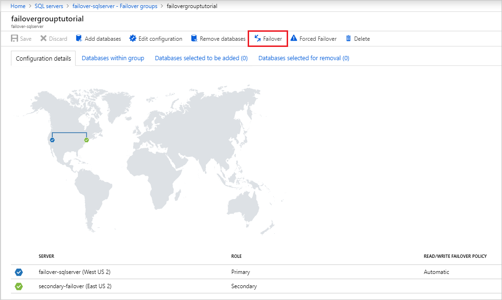

# Tutorial: Add an Azure SQL Database single database to a failover group

Configure a failover group for an Azure SQL Database single database and test failover.  In this tutorial, you will learn how to:

> [!div class="checklist"]
> - Create an Azure SQL Database single database 
> - Create a [failover group](sql-database-auto-failover-group.md) for a single database
> - Test failover

Choose your method:

<!-- 
The following section is for the Azure Portal
-->

## Prerequisites

# [Azure Portal](#tab/azure-portal)


- An Azure subscription. [Create a free account](https://azure.microsoft.com/free/) if you don't already have one.


# [PowerShell](#tab/powershell)
[!INCLUDE [updated-for-az](../../includes/updated-for-az.md)]
> [!IMPORTANT]
> The PowerShell Azure Resource Manager module is still supported by Azure SQL Database, but all future development is for the Az.Sql module. For these cmdlets, see [AzureRM.Sql](https://docs.microsoft.com/powershell/module/AzureRM.Sql/). The arguments for the commands in the Az module and in the AzureRm modules are substantially identical.

To complete the tutorial, make sure you've installed the following items:
- An Azure subscription. [Create a free account](https://azure.microsoft.com/free/) if you don't already have one.
- [Azure PowerShell](/powershell/azureps-cmdlets-docs)

---

## 1 - Create a single database 

# [Azure Portal](#tab/azure-portal)
In this step, you will create your Azure SQL Database single database. 

1. Sign into the [Azure portal](https://portal.azure.com). 
1. Select **Create a resource** in the upper left-hand corner of the Azure portal.
1. Type `sql database` into the search box, and press enter. 
1. Select the **SQL Database** option published by Microsoft. 
1. Select **Create** to create your Azure SQL Database. 
1. On the **Basics** tab, under **Project Details**, make sure the correct subscription is selected and then choose to **Create new** resource group. Type `myResourceGroup` for the name.  

   

1. Under **Database Details**, type or select the following values: 
   - Database name: Enter `mySampleDatabase`
   - Server: Select **Create new** and enter the following values, and then select **Select**. 
       - **Server name**: Choose a unique server name for your logical server, such as `failover-sqlserver`. 
       - **Server admin login**: Type `AzureAdmin`
       - **Password**: Type a complex password that meets password requirements.
       - **Location**: Choose a location from the drop-down, such as West US 2.

    


   > [!IMPORTANT]
   > Remember to record the server admin login and password so you can log in to the server and databases for this and other quickstarts. If you forget your login or password, you can get the login name or reset the password on the SQL server page. To open the SQL server page, select the server name on the database Overview page after database creation.

   - **Want to use SQL elastic pool**: Select the **No** option. 
   - **Compute + storage**: Select **Configure database**. 
       - Select **Looking for basic, standard, premium?**. 
       - Select **Standard** and select **Apply**. 

    

1. Select the **Additional settings** tab. 
1. In the **Data source** section, under **Use existing data**, select `Sample`. 
1. Leave the rest of the values as default and select **Review + Create** at the bottom of the form. 
1. Review the final settings and select **Create**. 
1. On the **SQL Database** form, select **Create** to deploy and provision the resource group, server, and database. 

   

# [PowerShell](#tab/powershell)
Run the following PowerShell script to create your resource group and Azure SQL Database single database. 

   ```powershell
   # Set variables for your server and database
   $SubscriptionId = '<Your Azure subscription ID>'
   $ResourceGroupName = "myResourceGroup"
   $Location = "westus2"
   $AdminLogin = "AzureAdmin"
   $Password = "ChangeYourAdminPassword1"
   $ServerName = "failover-sqlserver"
   $DatabaseName = "mySampleDatabase"
   
   
   # The ip address range that you want to allow to access your server
   $startIp = "0.0.0.0"
   $endIp = "0.0.0.0"
   
   # Set subscription 
   Set-AzContext -SubscriptionId $subscriptionId 
   
   # Create a resource group
   $resourceGroup = New-AzResourceGroup -Name $ResourceGroupName -Location $Location
   
   # Create a server with a system wide unique server name
   $server = New-AzSqlServer -ResourceGroupName $ResourceGroupName `
      -ServerName $ServerName `
      -Location $Location `
      -SqlAdministratorCredentials $(New-Object -TypeName System.Management.Automation.PSCredential -ArgumentList $AdminLogin, $(ConvertTo-SecureString -String $Password -AsPlainText -Force))
   
   # Create a server firewall rule that allows access from the specified IP range
   $serverFirewallRule = New-AzSqlServerFirewallRule -ResourceGroupName $ResourceGroupName `
      -ServerName $ServerName `
      -FirewallRuleName "AllowedIPs" -StartIpAddress $startIp -EndIpAddress $endIp
   
   # Create a database with an S0 performance level
   $database = New-AzSqlDatabase  -ResourceGroupName $ResourceGroupName `
      -ServerName $ServerName `
      -DatabaseName $DatabaseName `
      -RequestedServiceObjectiveName "S0" `
      -SampleName "AdventureWorksLT"
   ```

---

## 2 - Create the failover group 

# [Azure Portal](#tab/azure-portal)
1. Select **All Services** on the upper-left hand corner of the [Azure portal](https://portal.azure.com). 
1. Type `sql servers` in the search box. 
1. (Optional) Select the star icon next to SQL Servers to favorite **SQL servers** and add it to your left-hand navigation pane. 
    
    

1. Select **SQL servers** and choose the server you created in section 1.
1. Select **Failover groups** under the **Settings** pane, and then select **Add group** to create a new failover group. 

    

1. On the **Failover Group** page, enter or select the following values, and then select **Create**:
    - **Failover group name**: Type in a unique failover group name, such as `failovergrouptutorial`. 
    - **Secondary server**: Select the option to *configure required settings* and then choose to **Create a new server**. Alternatively, you can choose an already-existing server as the secondary server. After entering the following values, select **Select**. 
        - **Server name**: Type in a unique name for the secondary server, such as `secondary-failover`. 
        - **Server admin login**: Type `AzureAdmin`
        - **Password**: Type a complex password that meets password requirements.
        - **Location**: Choose a location from the drop-down, such as East US 2. Per best practices, it is recommended to create the secondary server in a different geographic location than the primary server so that you can failover to a different location in the event of a disaster that affects the primary servers location. 
    
       

   - **Databases within the group**: Once a secondary server is selected, this option becomes unlocked. Select it to **Select databases to add** and then choose the database you created in section 1. 
        
    
        

# [PowerShell](#tab/powershell)
Using Azure PowerShell, create a [failover group](sql-database-auto-failover-group.md) between an existing Azure SQL server and a new Azure SQL server in another region. Then add the sample database to the failover group.

> [!IMPORTANT]
> [!INCLUDE [sample-powershell-install](../../includes/sample-powershell-install-no-ssh.md)]

To create a failover group, run the following script:

   ```powershell
   # Set variables for your server and database
   $ResourceGroupName = "myResourceGroup"
   $Location = "westus2"
   $AdminLogin = "AzureAdmin"
   $Password = "ChangeYourAdminPassword1"
   $ServerName = "failover-sqlserver"
   $DatabaseName = "mySampleDatabase"
   $drLocation = "eastus2"
   $drServerName = "secondary-failover"
   $FailoverGroupName = "failovergrouptutorial"
   
   # Create a backup server in the failover region
   New-AzSqlServer -ResourceGroupName $ResourceGroupName `
      -ServerName $drServerName `
      -Location $drLocation `
      -SqlAdministratorCredentials $(New-Object -TypeName System.Management.Automation.PSCredential `
         -ArgumentList $adminlogin, $(ConvertTo-SecureString -String $Password -AsPlainText -Force))
   
   # Create a failover group between the servers
   New-AzSqlDatabaseFailoverGroup `
      –ResourceGroupName $ResourceGroupName `
      -ServerName $ServerName `
      -PartnerServerName $drServerName  `
      –FailoverGroupName $FailoverGroupName `
      –FailoverPolicy Automatic `
      -GracePeriodWithDataLossHours 2
   
   # Add the database to the failover group
   Get-AzSqlDatabase `
      -ResourceGroupName $ResourceGroupName `
      -ServerName $ServerName `
      -DatabaseName $DatabaseName | `
   Add-AzSqlDatabaseToFailoverGroup `
      -ResourceGroupName $ResourceGroupName `
      -ServerName $ServerName `
      -FailoverGroupName $FailoverGroupName
   ```
---

## 3 - Test failover 

# [Azure Portal](#tab/azure-portal)
1. Navigate to your **SQL servers** server within the [Azure portal](https://portal.azure.com). 
1. Select **Failover groups** under the **Settings** pane and then choose the failover group you created in section 2. 
  
   

1. Select **Failover** from the task pane to failover your failover group containing your sample single database. 
1. Select **Yes** on the warning that notifies you that TDS sessions will be disconnected. 

   

# [PowerShell](#tab/powershell)

Check the role of the secondary replica: 

   ```powershell
   $ResourceGroupName = "myResourceGroup"
   $drServerName = "secondary-failover"
   $FailoverGroupName = "failovergrouptutorial"
   
   (Get-AzSqlDatabaseFailoverGroup `
      -FailoverGroupName $FailoverGroupName `
      -ResourceGroupName $ResourceGroupName `
      -ServerName $drServerName).ReplicationRole
   ```


Failover to the secondary server: 

   ```powershell
   $ResourceGroupName = "myResourceGroup"
   $drServerName = "secondary-failover"
   $FailoverGroupName = "failovergrouptutorial"
   
   Switch-AzSqlDatabaseFailoverGroup `
   -ResourceGroupName $ResourceGroupName `
   -ServerName $drServerName `
   -FailoverGroupName $FailoverGroupName
   ```

Revert failover group back to the primary server:

   ```powershell
   $ResourceGroupName = "myResourceGroup"
   $drServerName = "secondary-failover"
   $FailoverGroupName = "failovergrouptutorial"
   
   Switch-AzSqlDatabaseFailoverGroup `
      -ResourceGroupName $ResourceGroupName `
      -ServerName $ServerName `
      -FailoverGroupName $FailoverGroupName
   ```
---

## Clean up resources (#tab/azure-portal)

# [Azure Portal](#tab/azure-portal)

1. Navigate to your resource group in the [Azure portal](https://portal.azure.com).
1. Select to **Delete resource group**. 

# [PowerShell](#tab/powershell)
Clean up resources by removing the deleting the resource group. 

   ```powershell
   $ResourceGroupName = "myResourceGroup"
   # Clean up deployment 
   Remove-AzResourceGroup -ResourceGroupName $ResourceGroupName
   ```

---

## Next steps

In this tutorial, you added an Azure SQL Database single database to a failover group. You learned how to:

> [!div class="checklist"]
> - Create an Azure SQL Database single database 
> - Create a [failover group](sql-database-auto-failover-group.md) for a single database
> - Test failover

Advance to the next tutorial on how to migrate using DMS.

> [!div class="nextstepaction"]
> [Migrate SQL Server to Azure SQL database managed instance using DMS](../dms/tutorial-sql-server-to-managed-instance.md)
