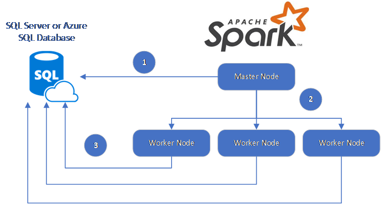

# Accelerate real-time big data analytics with Spark connector for Azure SQL Database and SQL Server

The Spark connector for Azure SQL Database and SQL Server enables SQL databases, including Azure SQL Database and SQL Server, to act as input data source or output data sink for Spark jobs. It allows you to utilize real-time transactional data in big data analytics and persist results for adhoc queries or reporting. Compared to the built-in JDBC connector, this connector provides the ability to bulk insert data into SQL databases. It can outperform row by row insertion with 10x to 20x faster performance. The Spark connector for Azure SQL Database and SQL Server also supports AAD authentication. It allows you securely connecting to your Azure SQL database from Azure Databricks using your AAD account. It provides similar interfaces with the built-in JDBC connector. It is easy to migrate your existing Spark jobs to use this new connector.

## Download
To get started, download the Spark to SQL DB connector from the [azure-sqldb-spark repository](https://github.com/Azure/azure-sqldb-spark) on GitHub.

## Official Supported Versions

| Component	                           |Version                  |
| :----------------------------------- | :---------------------- |
| Apache Spark	                       |2.0.2 or later           |
| Scala	                               |2.10 or later            |
| Microsoft JDBC Driver for SQL Server |6.2 or later             |
| Microsoft SQL Server	               |SQL Server 2008 or later |
| Azure SQL Database	               |Supported                |

The Spark connector for Azure SQL Database and SQL Server utilizes the Microsoft JDBC Driver for SQL Server to move data between Spark worker nodes and SQL databases:
 
The dataflow is as follows:
1. The Spark master node connects to SQL Server or Azure SQL Database and loads data from a specific table or using a specific SQL query
2. The Spark master node distributes data to worker nodes for transformation. 
3. The Worker node connects to SQL Server or Azure SQL Database and writes data to the database. User can choose to use row-by-row insertion or bulk insert.

The following diagram illustrates the data flow.

   

### Build the Spark to SQL DB connector
Currently, the connector project uses maven. To build the connector without dependencies, you can run:

- mvn clean package
- Download the latest versions of the JAR from the release folder
- Include the SQL DB Spark JAR

## Connect Spark to SQL DB using the connector
You can connect to Azure SQL Database or SQL Server from Spark jobs, read or write data. You can also run a DML or DDL query in an Azure SQL database or SQL Server database.

### Read data from Azure SQL Database or SQL Server

```scala
import com.microsoft.azure.sqldb.spark.config.Config
import com.microsoft.azure.sqldb.spark.connect._

val config = Config(Map(
  "url"            -> "mysqlserver.database.windows.net",
  "databaseName"   -> "MyDatabase",
  "dbTable"        -> "dbo.Clients"
  "user"           -> "username",
  "password"       -> "*********",
  "connectTimeout" -> "5", //seconds
  "queryTimeout"   -> "5"  //seconds
))

val collection = sqlContext.read.sqlDB(config)
collection.show()
```
### Reading data from Azure SQL Database or SQL Server with specified SQL query
```scala
import com.microsoft.azure.sqldb.spark.config.Config
import com.microsoft.azure.sqldb.spark.connect._

val config = Config(Map(
  "url"          -> "mysqlserver.database.windows.net",
  "databaseName" -> "MyDatabase",
  "queryCustom"  -> "SELECT TOP 100 * FROM dbo.Clients WHERE PostalCode = 98074" //Sql query
  "user"         -> "username",
  "password"     -> "*********",
))

//Read all data in table dbo.Clients
val collection = sqlContext.read.sqlDb(config)
collection.show()
```

### Write data to Azure SQL Database or SQL Server
```scala
import com.microsoft.azure.sqldb.spark.config.Config
import com.microsoft.azure.sqldb.spark.connect._
 
// Aquire a DataFrame collection (val collection)

val config = Config(Map(
  "url"          -> "mysqlserver.database.windows.net",
  "databaseName" -> "MyDatabase",
  "dbTable"      -> "dbo.Clients"
  "user"         -> "username",
  "password"     -> "*********"
))

import org.apache.spark.sql.SaveMode
collection.write.mode(SaveMode.Append).sqlDB(config)
```

### Run DML or DDL query in Azure SQL Database or SQL Server
```scala
import com.microsoft.azure.sqldb.spark.config.Config
import com.microsoft.azure.sqldb.spark.query._
val query = """
              |UPDATE Customers
              |SET ContactName = 'Alfred Schmidt', City= 'Frankfurt'
              |WHERE CustomerID = 1;
            """.stripMargin

val config = Config(Map(
  "url"          -> "mysqlserver.database.windows.net",
  "databaseName" -> "MyDatabase",
  "user"         -> "username",
  "password"     -> "*********",
  "queryCustom"  -> query
))

sqlContext.SqlDBQuery(config)
```

## Connect Spark to Azure SQL Database using AAD authentication
You can connect to Azure SQL Database using Azure Active Directory (AAD) authentication. Use AAD authentication to centrally manage identities of database users and as an alternative to SQL Server authentication.
### Connecting using ActiveDirectoryPassword Authentication Mode
#### Setup Requirement
If you are using the ActiveDirectoryPassword authentication mode, you need to download [azure-activedirectory-library-for-java](https://github.com/AzureAD/azure-activedirectory-library-for-java) and its dependencies, and include them in the Java build path.

```scala
import com.microsoft.azure.sqldb.spark.config.Config
import com.microsoft.azure.sqldb.spark.connect._

val config = Config(Map(
  "url"            -> "mysqlserver.database.windows.net",
  "databaseName"   -> "MyDatabase",
  "user"           -> "username ",
  "password"       -> "*********",
  "authentication" -> "ActiveDirectoryPassword",
  "encrypt"        -> "true"
))

val collection = sqlContext.read.SqlDB(config)
collection.show()
```

### Connecting using Access Token
#### Setup Requirement
If you are using the access token-based authentication mode, you need to download [azure-activedirectory-library-for-java](https://github.com/AzureAD/azure-activedirectory-library-for-java) and its dependencies, and include them in the Java build path.

See [Use Azure Active Directory Authentication for authentication with SQL Database](https://docs.microsoft.com/azure/sql-database/sql-database-aad-authentication) to learn how to get access token to your Azure SQL database.

```scala
import com.microsoft.azure.sqldb.spark.config.Config
import com.microsoft.azure.sqldb.spark.connect._

val config = Config(Map(
  "url"                   -> "mysqlserver.database.windows.net",
  "databaseName"          -> "MyDatabase",
  "accessToken"           -> "access_token ",
  "hostNameInCertificate" -> "*.database.windows.net",
  "encrypt"               -> "true"
))

val collection = sqlContext.read.SqlDB(config)
collection.show()
```

## Write data to Azure SQL database or SQL Server using Bulk Insert
The traditional jdbc connector writes data into Azure SQL database or SQL Server using row-by-row insertion. You can use Spark to SQL DB connector to write data to SQL database using bulk insert. It significantly improves the write performance when loading large data sets or loading data into tables where a column store index is used.

```scala
import com.microsoft.azure.sqldb.spark.bulkcopy.BulkCopyMetadata
import com.microsoft.azure.sqldb.spark.config.Config
import com.microsoft.azure.sqldb.spark.connect._

/** 
  Add column Metadata.
  If not specified, metadata is automatically added
  from the destination table, which may suffer performance.
*/
var bulkCopyMetadata = new BulkCopyMetadata
bulkCopyMetadata.addColumnMetadata(1, "Title", java.sql.Types.NVARCHAR, 128, 0)
bulkCopyMetadata.addColumnMetadata(2, "FirstName", java.sql.Types.NVARCHAR, 50, 0)
bulkCopyMetadata.addColumnMetadata(3, "LastName", java.sql.Types.NVARCHAR, 50, 0)

val bulkCopyConfig = Config(Map(
  "url"               -> "mysqlserver.database.windows.net",
  "databaseName"      -> "MyDatabase",
  "user"              -> "username",
  "password"          -> "*********",
  "databaseName"      -> "zeqisql",
  "dbTable"           -> "dbo.Clients",
  "bulkCopyBatchSize" -> "2500",
  "bulkCopyTableLock" -> "true",
  "bulkCopyTimeout"   -> "600"
))

df.bulkCopyToSqlDB(bulkCopyConfig, bulkCopyMetadata)
//df.bulkCopyToSqlDB(bulkCopyConfig) if no metadata is specified.
```

## Next steps
If you haven't already, download the Spark connector for Azure SQL Database and SQL Server from [azure-sqldb-spark GitHub repository](https://github.com/Azure/azure-sqldb-spark) and explore the additional resources in the repo:

-	[Sample Azure Databricks notebooks](https://github.com/Azure/azure-sqldb-spark/tree/master/samples/notebooks)
- [Sample scripts (Scala)](https://github.com/Azure/azure-sqldb-spark/tree/master/samples/scripts)

You might also want to review the [Apache Spark SQL, DataFrames, and Datasets Guide](http://spark.apache.org/docs/latest/sql-programming-guide.html) and the [Azure Databricks documentation](https://docs.microsoft.com/azure/azure-databricks/).

