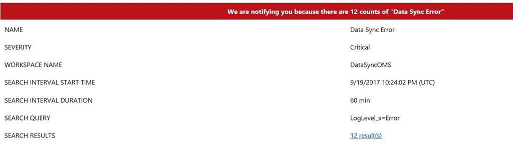

# Monitor Azure SQL Data Sync (Preview) with OMS Log Analytics 

To check the SQL Data Sync activity log and detect errors and warnings, you previously had to check SQL Data Sync manually in the Azure portal, or use PowerShell or the REST API. Follow the steps in this article to configure a custom solution that improves the Data Sync monitoring experience. You can customize this solution to fit your scenario.

For an overview of SQL Data Sync, see [Sync data across multiple cloud and on-premises databases with Azure SQL Data Sync (Preview)](sql-database-sync-data.md).

## Monitoring Dashboard for all your Sync Groups 

You no longer need to look through the logs of each Sync Group individually to look for issues. You can monitor all your Sync Groups from any of your subscriptions in one place by using a custom OMS (Operations Management Suite) view. This view surfaces the information that matters to SQL Data Sync customers.

## Automated Email notifications

You no longer need to check the log manually in the Azure Portal or through PowerShell or the REST API. By leveraging [OMS Log Analytics](https://docs.microsoft.com/azure/log-analytics/log-analytics-overview), you can create alerts that go directly to the email addresses of those that need to see them in the event of an error.

## How do you set this up? 

Implement a custom OMS monitoring solution for SQL Data Sync in less than an hour by doing the following things.

You'll need to configure 3 components:

-   A PowerShell runbook to feed SQL Data Sync log data to OMS.

-   An OMS Log Analytics alert for email notifications.

-   An OMS View for monitoring.

### Samples to download

Download the following two samples:

-   [Data Sync Log PowerShell Runbook](https://github.com/Microsoft/sql-server-samples/blob/master/samples/features/sql-data-sync/DataSyncLogPowerShellRunbook.ps1)

-   [Data Sync Log OMS View](https://github.com/Microsoft/sql-server-samples/blob/master/samples/features/sql-data-sync/DataSyncLogOmsView.omsview)

### Prerequisites

Make sure you have set up the following things:

-   An Azure Automation account

-   Log Analytics linked with OMS Workspace

## PowerShell Runbook to get SQL Data Sync Log 

Use a PowerShell runbook hosted in Azure Automation to pull the SQL Data Sync log data and send it to OMS. A sample script is included. As a prerequisite, you need to have an Azure Automation account. Then you need to create a runbook and schedule it to run. 

### Create a runbook

For more info about creating a runbook, see [My first PowerShell runbook](https://docs.microsoft.com/azure/automation/automation-first-runbook-textual-powershell).

1.  Under your Azure Automation account, select the **Runbooks** tab under Process Automation.

2.  Select **Add a Runbooks** at the top left corner of the Runbooks page.

3.  Select **Import an existing Runbook**.

4.  Under **Runbook file**, use the given `DataSyncLogPowerShellRunbook` file. Set the **Runbook type** as `PowerShell`. Give the runbook a name.

5.  Select **Create**. You now have a runbook.

6.  Under your Azure Automation Account, select the **Variables** tab under Shared Resources.

7.  Select **Add a variable** on the Variables page. We need to create a variable to store the last execution time for the runbook. If you have multiple runbooks, you need one variable for each runbook.

8.  Set the variable name as `DataSyncLogLastUpdatedTime` and set its Type as DateTime.

9.  Select the runbook and click the edit button at the top of the page.

10. Make the changes required for your account and your SQL Data Sync configuration. (See the sample script for more detailed information.)

    1.  Azure information.

    2.  Sync Group information.

    3.  OMS information. Find this information at OMS Portal | Settings | Connected Sources. For more info about sending data to Log Analytics, see [Send data to Log Analytics with the HTTP Data Collector API (public preview)](https://docs.microsoft.com/azure/log-analytics/log-analytics-data-collector-api).

11. Run the runbook in the Test pane. Check to make sure it was successful.

    If you have errors, make sure you have the latest PowerShell module installed. You can do this in the **Modules Gallery** in your Automation Account.

12. Click **Publish**

### Schedule the runbook

To schedule the runbook:

1.  Under the runbook, select the **Schedules** tab under Resources.

2.  Select **Add a Schedule** on the Schedules page.

3.  Select **Link a Schedule to your runbook**.

4.  Select **Create a new schedule.**

5.  Set **Recurrence** to Recurring and set the interval you want. Use the same interval here, in the script, and in OMS.

6.  Select **Create**.

### Check the automation

To monitor whether your automation is running as expected, under **Overview** for your automation account, find the **Job Statistics** view under **Monitoring**. Pin this to your dashboard for easy viewing. Successful runs of the runbook show as "Completed" and Failed runs show as "Failed".

## Create an OMS Log Reader Alert for Email Notifications

To create an alert that uses OMS Log Analytics, do the following things. As a prerequisite, you need to have Log Analytics linked with an OMS Workspace.

1.  In the OMS portal, select **Log Search**.

2.  Create a query to select the errors and warnings by sync group within the interval you selected. For example:

    `Type=DataSyncLog\_CL LogLevel\_s!=Success| measure count() by SyncGroupName\_s interval 60minute`

3.  After running the query, select the bell that says **Alert**.

4.  Under **Generate alert based on**, select **Metric Measurement**.

    1.  Set the Aggregate Value to **Greater than**.

    2.  After **Greater than**, enter the threshold to elapse before you receive notifications. Transient errors are expected in Data Sync. We recommend that you set the threshold to 5 to reduce noise.

5.  Under **Actions**, set **Email notification** to "Yes". Enter the desired email recipients.

6.  Click **Save**. The specified recipients now receive email notifications when errors occur.

## Create an OMS View for Monitoring

This step creates an OMS view to visually monitor all the specified sync groups. The view includes several components:

-   An overview tile, which shows how many errors, successes, and warnings all the sync groups have.

-   A tile for all sync groups, which shows the count of errors and warnings per sync group. Groups with no issues don't appear on this tile.

-   A tile for each Sync Group, which shows the number of errors, successes, and warnings, and the recent error messages.

To configure the OMS view, do the following things:

1.  On the OMS home page, select the plus on the left to open the **view designer**.

2.  Select **Import** on the top bar of the view designer. Then select the "DataSyncLogOMSView" sample file.

3.  The sample view is for managing two sync groups. Edit this view to fit your scenario. Click **edit** and make the following changes:

    1.  Create new "Donut & List" objects from the Gallery as needed.

    2.  In each tile, update the queries with your information.

        1.  On each tile, change the TimeStamp_t interval as desired.

        2.  On the tiles for each Sync Group, update the Sync Group names.

    3.  Onn each tile, update the title as needed.

4.  Click **Save** and the view is ready.

## Cost of this solution

In most cases, this solution is free.

**Azure Automation:** There may be a cost incurred with the Azure Automation account, depending on your usage. The first 500 minutes of job run time per month are free. In most cases, this solution is expected to use less than 500 minutes per month. To avoid charges, schedule the runbook to run at an interval of two hours or more. For more info, see [Automation pricing](https://azure.microsoft.com/pricing/details/automation/).

**OMS Log Analytics:** There may be a cost associated with OMS depending on your usage. The free tier includes 500 MB of ingested data per day. In most cases, this solution is expected to ingest less than 500 MB per day. To decrease the usage, use the failure-only filtering included in the runbook. If you are using more than 500 MB per day, upgrade to the paid tier to avoid the risk of analytics stopping when the limitation is reached. For more info, see [Log Analytics pricing](https://azure.microsoft.com/pricing/details/log-analytics/).

## Code samples

Download the code samples described in this article from the following locations:

-   [Data Sync Log PowerShell Runbook](https://github.com/Microsoft/sql-server-samples/blob/master/samples/features/sql-data-sync/DataSyncLogPowerShellRunbook.ps1)

-   [Data Sync Log OMS View](https://github.com/Microsoft/sql-server-samples/blob/master/samples/features/sql-data-sync/DataSyncLogOmsView.omsview)

## Next steps
or more info about SQL Data Sync, see:

-   [Sync data across multiple cloud and on-premises databases with Azure SQL Data Sync](sql-database-sync-data.md)
-   [Get Started with Azure SQL Data Sync](sql-database-get-started-sql-data-sync.md)
-   [Troubleshoot issues with Azure SQL Data Sync](sql-database-troubleshoot-data-sync.md)

-   Complete PowerShell examples that show how to configure SQL Data Sync:
    -   [Use PowerShell to sync between multiple Azure SQL databases](scripts/sql-database-sync-data-between-sql-databases.md)
    -   [Use PowerShell to sync between an Azure SQL Database and a SQL Server on-premises database](scripts/sql-database-sync-data-between-azure-onprem.md)

-   [Download the SQL Data Sync REST API documentation](https://github.com/Microsoft/sql-server-samples/raw/master/samples/features/sql-data-sync/Data_Sync_Preview_REST_API.pdf?raw=true)

For more info about SQL Database, see:

-   [SQL Database Overview](sql-database-technical-overview.md)
-   [Database Lifecycle Management](https://msdn.microsoft.com/library/jj907294.aspx)
