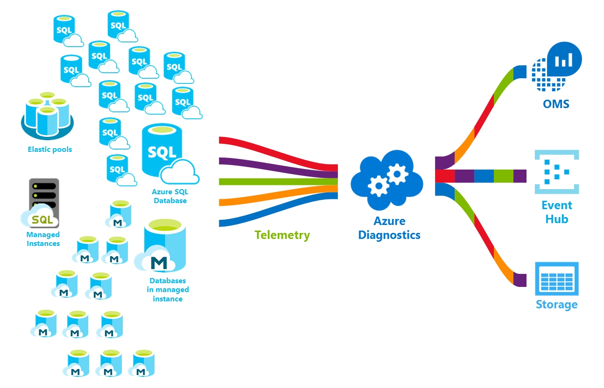

# What is Azure SQL Database service

Azure SQL Database is a general-purpose relational database managed service that enables you to create highly-available and high-performance data storage layer for the applications and solutions in Microsoft Azure cloud. SQL Database can be the right choice for a variety of modern cloud applications because it enables you to use powerful functionalities for processing both relational data and [non-relational structures](sql-database-multi-model-features.md) such as graphs, JSON, spatial, and XML. It is based on the latest stable version of the [Microsoft SQL Server database engine](https://docs.microsoft.com/sql/sql-server/sql-server-technical-documentation?toc=/azure/sql-database/toc.json) and enables you to use rich set of advanced query processing features such as [high performance in-memory technologies](sql-database-in-memory.md) and [Intelligent query processing](https://docs.microsoft.com/sql/relational-databases/performance/intelligent-query-processing?toc=/azure/sql-database/toc.json).
With Microsoft's cloud-first strategy, the newest capabilities of SQL Server are released first to SQL Database, and then to SQL Server itself. This approach provides you with the newest SQL Server capabilities with no overhead for patching or upgrading - and with these new features tested across millions of databases. 
SQL Database enables you to easily define and scale performance within two different purchasing models: a [vCore-based purchasing model](sql-database-service-tiers-vcore.md) and a [DTU-based purchasing model](sql-database-service-tiers-dtu.md). SQL Database is fully-managed service that has built-in high-availablility, backups, and other common maintenance operations. Microsoft handles all patching and updating of the SQL and OS code seamlessly and abstracts away all management of the underlying infrastructure.

> [!NOTE]
> For a glossary of terms in Azure SQL Database, see [SQL Database terms glossary](sql-database-glossary-terms.md)

Azure SQL Database provides the following deployment options for an Azure SQL database:

- [Single database](sql-database-single-database.md) represents fully-managed isolated database that is perfect choice for the modern cloud applications and microservices that need a single reliable data source. A single database is similar to a [contained databases](https://docs.microsoft.com/sql/relational-databases/databases/contained-databases?toc=/azure/sql-database/toc.json) in [Microsoft SQL Server database engine](https://docs.microsoft.com/sql/sql-server/sql-server-technical-documentation?toc=/azure/sql-database/toc.json).
- [Managed instance](sql-database-managed-instance.md) is a fully-managed instance of the [Microsoft SQL Server database engine](https://docs.microsoft.com/sql/sql-server/sql-server-technical-documentation?toc=/azure/sql-database/toc.json) containing a set of databases that can be used together. It is a perfect choice for easy migration of on-premises SQL Server databases to Azure cloud and for applications that need to leverage powerful database features that SQL Server Database Engine provides.
- [Elastic pool](sql-database-elastic-pool.md) is a collection of [Single databases](sql-database-single-database.md) with a shared set of resources such as CPU or memory. Single databases can be moved into and out of an elastic pool.

> [!IMPORTANT]
> To understand the feature differences between SQL Database and SQL Server, as well as the differences between different Azure SQL Database deployment options, see [SQL features](sql-database-features.md).

SQL Database delivers predictable performance with multiple resource types, service tiers, and compute sizes that provides dynamic scalability with no downtime, built-in intelligent optimization, global scalability and availability, and advanced security options — all with near-zero administration. These capabilities allow you to focus on rapid app development and accelerating your time to market, rather than allocating precious time and resources to managing virtual machines and infrastructure. The SQL Database service is currently in 38 data centers around the world, with more data centers coming online regularly, which enables you to run your database in a data center near you.

## Scalable performance and pools

All flavors of SQL Database enable you to define the amount of resources that will be assigned. 
- With single databases, each database is isolated from each other and portable, each with its own guaranteed amount of compute, memory, and storage resources. The amount of the resources that is assigned to the database is dedicated to that database and will not be shared with other databases in Azure cloud. It also gives you the ability to dynamically [scale single database resources](sql-database-single-database-scale.md) up and down. Single Database provides different compute, memory, and storage resources for different needs that vary from 1 to 80 vCores, 32GB to 4 TB, etc. The [hyperscale service tier](sql-database-service-tier-hyperscale.md) for single database enables you to scale to 100 TB, with fast backup and restore capabilities.
- With elastic pools, you can assign resources that will be shared by all databases in the pool. You can create a new database or move the existing single databases into a resource pool to maximize the use of resources and save money - and the ability to dynamically [scale elastic pool resources](sql-database-elastic-pool-scale.md) up and down.
- With managed instances, each managed instance is isolated from other instances with guaranteed resources. Within a managed instance, the instance databases share a set of resources - and the ability to dynamically [scale managed instance resources](sql-database-managed-instance-resource-limits.md) up and down.

You can build your first app on a small, single database at a low cost per month in the general purpose service tier and then change its service tier manually or programmatically at any time to the business critical Service tier to meet the needs of your solution. You can adjust performance without downtime to your app or to your customers. Dynamic scalability enables your database to transparently respond to rapidly changing resource requirements and enables you to only pay for the resources that you need when you need them.

Dynamic scalability is different from autoscale. Autoscale is when a service scales automatically based on criteria, whereas dynamic scalability allows for manual scaling without downtime. A Single database supports manual dynamic scalability, but not autoscale. For a more *automatic* experience, consider using elastic pools, which allow databases to share resources in a pool based on individual database needs. However, there are scripts that can help automate scalability for a single database. For an example, see [Use PowerShell to monitor and scale a single database](scripts/sql-database-monitor-and-scale-database-powershell.md).

### Purchasing models, service tiers, compute sizes, and storage amounts

SQL Database offers two purchasing models:
- The [vCore-based purchasing model](sql-database-service-tiers-vcore.md) lets you choose the number of vCores, the amount or memory, and the amount and speed of storage. The vCore-based purchasing model also allows you to use [Azure Hybrid Benefit for SQL Server](https://azure.microsoft.com/pricing/hybrid-benefit/) to gain cost savings. For more information about the Azure Hybrid Benefit, see [Frequently asked questions](#sql-database-frequently-asked-questions-faq).
- The [DTU-based purchasing model](sql-database-service-tiers-dtu.md) offers a blend of compute, memory, IO resources in three service tiers to support lightweight to heavyweight database workloads. Compute sizes within each tier provide a different mix of these resources, to which you can add additional storage resources.

### Elastic pools to maximize resource utilization

For many businesses and applications, being able to create single databases and dial performance up or down on demand is enough, especially if usage patterns are relatively predictable. But if you have unpredictable usage patterns, it can make it hard to manage costs and your business model. [Elastic pools](sql-database-elastic-pool.md) are designed to solve this problem. The concept is simple. You allocate performance resources to a pool rather than an individual database and pay for the collective performance resources of the pool rather than for single database performance.

   

With elastic pools, you don’t need to focus on dialing database performance up and down as demand for resources fluctuates. The pooled databases consume the performance resources of the elastic pool as needed. Pooled databases consume but don’t exceed the limits of the pool, so your cost remains predictable even if individual database usage doesn’t. What’s more, you can [add and remove databases to the pool](sql-database-elastic-pool-manage-portal.md), scaling your app from a handful of databases to thousands, all within a budget that you control. You can also control the minimum and maximum resources available to databases in the pool to ensure that no database in the pool uses all the pool resources and that every pooled database has a guaranteed minimum amount of resources. To learn more about design patterns for SaaS applications using elastic pools, see [Design Patterns for Multi-tenant SaaS Applications with SQL Database](sql-database-design-patterns-multi-tenancy-saas-applications.md).

Scripts can help with monitoring and scaling elastic pools. For an example, see [Use PowerShell to monitor and scale a SQL elastic pool in Azure SQL Database](scripts/sql-database-monitor-and-scale-pool-powershell.md)

> [!IMPORTANT]
> A managed instance does not support elastic pools. Rather, a managed instance is a collection of instance databases that share managed instance resources.

### Blend single databases with pooled databases

You can blend single databases with elastic pools and change the service tiers of single databases and elastic pools quickly and easily to adapt to your situation. With the power and reach of Azure, you can mix-and-match other Azure services with SQL Database to meet your unique app design needs, drive cost and resource efficiencies, and unlock new business opportunities.

## Extensive monitoring and alerting capabilities

Azure SQL Database provides a set of advanced monitoring and troubleshooting features that can help you to get the full insights into the workload characteristics. The features and tools might be categorized as:
 - The built-in monitoring capabilities provided by the latest version of SQL Server Database Engine that enable you to find real-time performance insights. 
 - PaaS monitoring capabilities provided by Azure platform that enable you to easily monitor a large number of database instances and also provide the troubleshooting advices that can help you to fix performance issues.

The most important built-in database engine monitoring feature that you should leverage is [Query Store](sql-database-operate-query-store.md) component that records the performance of your queries at the real-time and enables you to identify the potential performance issues and the top resource consumers. Automatic tuning and recommendations provide advices regarding the queries with the regressed performance and missing or duplicated indexes. Automatic tuning in Azure SQL Database enables you to either manually apply the scripts that can fix the issues or let Azure SQL Database to apply the fix, test and verify does it provide some benefit, and retain or revert the change depending on the outcome. In addition to Query Store and Automatic tuning capabilities, you can also use standard [DMVs and XEvent](sql-database-monitoring-with-dmvs.md) to monitor the workload performance.

Azure platform provides the [built-in performance monitoring](sql-database-performance.md) and [alerting](sql-database-insights-alerts-portal.md) tools, combined with the performance ratings, that enable you to easily monitor status of thousands of databases. Using these tools, you can quickly assess the impact of scaling up or down based on your current or project performance needs. Additionally, SQL Database can [emit metrics and diagnostic logs](sql-database-metrics-diag-logging.md) for easier monitoring. You can configure SQL Database to store resource usage, workers and sessions, and connectivity into one of these Azure resources:

- **Azure Storage**: For archiving vast amounts of telemetry for a small price
- **Azure Event Hub**: For integrating SQL Database telemetry with your custom monitoring solution or hot pipelines
- **Azure Monitor logs**: For built-in monitoring solution with reporting, alerting, and mitigating capabilities.

    

## Availability capabilities

In a traditional SQL Server environment, you would generally have (at least) 2 machines locally set up with exact (synchronously maintained) copies of the data (using features like AlwaysOn availability groups or Failover Cluster Instances) to protect against a failure of a single machine/component. This provides high availability but does not protect against a natural disaster destroying your data center.

Disaster recovery assumes that a catastrophic event will be geographically localized enough to have another machine/set of machines with a copy of your data far away.  In SQL Server, you could use Always On Availability Groups running in async mode to get this capability.  The speed of light issues usually means that people do not want to wait for replication to happen that far away before committing a transaction, so there is potential for data loss when you do unplanned failovers.

Databases in the premium and business critical service tiers already [do something very similar](sql-database-high-availability.md#premium-and-business-critical-service-tier-availability) to the synchronization of an availability group. Databases in lower service tiers provide redundancy through storage using a [different but equivalent mechanism](sql-database-high-availability.md#basic-standard-and-general-purpose-service-tier-availability). There is logic that protects against a single machine failure.  The active geo-replication feature gives you the ability to protect against disaster where a whole region is destroyed.

Azure Availability Zones is a play on the high availability problem.  It tries to protect against the outage of a single data center building within a single region.  So, it wants to protect against the loss of power or network to a building. In SQL Azure, this will work by placing the different replicas in different availability zones (different buildings, effectively) and otherwise working as before.

In fact, Azure's industry leading 99.99% availability service level agreement [(SLA)](https://azure.microsoft.com/support/legal/sla/), powered by a global network of Microsoft-managed datacenters, helps keep your app running 24/7. The Azure platform fully manages every database and guarantees no data loss and high percentage of data availability. Azure automatically handles patching, backups, replication, failure detection, underlying potential hardware, software or network failures, deploying bug fixes, failovers, database upgrades and other maintenance tasks. Standard availability is achieved by a separation of compute and storage layers. Premium availability is achieved by integrating compute and storage on a single node for performance and then implementing technology similar to Always On Availability Groups under the covers. For a full discussion of the high availability capabilities of Azure SQL Database, see [SQL Database availability](sql-database-high-availability.md). In addition, SQL Database provides built-in [business continuity and global scalability](sql-database-business-continuity.md) features, including:

- **[Automatic backups](sql-database-automated-backups.md)**:

  SQL Database automatically performs full, differential, and transaction log backups of Azure SQL databases to enable you to restore to any point in time. For single databases and pooled databases, you can configure SQL Database to store full database backups to Azure storage for long-term backup retention. For managed instances, you can also perform copy-only backups for long-term backup retention.

- **[Point-in-time restores](sql-database-recovery-using-backups.md)**:

  All SQL Database deployment options support recovery to any point in time within the automatic backup retention period for any Azure SQL database.
- **[Active geo-replication](sql-database-active-geo-replication.md)**:

  Single database and pooled databases allow you to configure up to four readable secondary databases in either the same or globally distributed Azure data centers.  For example, if you have a SaaS application with a catalog database that has a high volume of concurrent read-only transactions, use active geo-replication to enable global read scale and remove bottlenecks on the primary that are due to read workloads. For managed instances, use auto-failover groups.
- **[Auto-failover groups](sql-database-auto-failover-group.md)**:

  All SQL Database deployment options allow you to use failover groups to enable high availability and load balancing at global scale, including transparent geo-replication and failover of large sets of databases, elastic pools, and managed instances. Failover groups enable the creation of globally distributed SaaS applications with minimal administration overhead leaving all the complex monitoring, routing, and failover orchestration to SQL Database.
- **[Zone-redundant databases](sql-database-high-availability.md)**:

  SQL Database allows you to provision premium or business critical databases or elastic pools across multiple availability zones. Because these databases and elastic pools have multiple redundant replicas for high availability, placing these replicas into multiple availability zones provides higher resilience, including the ability to recover automatically from the datacenter scale failures without data loss.

## Built-in intelligence

With SQL Database, you get built-in intelligence that helps you dramatically reduce the costs of running and managing databases and maximizes both performance and security of your application. Running millions of customer workloads around-the-clock, SQL Database collects and processes a massive amount of telemetry data, while also fully respecting customer privacy behind the scenes. Various algorithms are continuously evaluating the telemetry data so that the service can learn and adapt with your application. Based on this analysis, the service comes up with performance improving recommendations tailored to your specific workload.

### Automatic performance monitoring and tuning

SQL Database provides detailed insight into the queries that you need to monitor. SQL Database's learns about your database patterns and enables you to adapt your database schema to your workload. SQL Database provides [performance tuning recommendations](sql-database-advisor.md), where you can review tuning actions and apply them.

However, constantly monitoring database is a hard and tedious task, especially when dealing with many databases. [Intelligent Insights](sql-database-intelligent-insights.md) does this job for you by automatically monitoring SQL Database performance at scale and it informs you of performance degradation issues, it identifies the root cause of the issue and provides performance improvement recommendations when possible.

Managing a huge number of databases might be impossible to do efficiently even with all available tools and reports that SQL Database and Azure portal provide. Instead of monitoring and tuning your database manually, you might consider delegating some of the monitoring and tuning actions to SQL Database using [automatic tuning](sql-database-automatic-tuning.md). SQL Database automatically applies recommendations, tests, and verifies each of its tuning actions to ensure the performance keeps improving. This way, SQL Database automatically adapts to your workload in controlled and safe way. Automatic tuning means that the performance of your database is carefully monitored and compared before and after every tuning action, and if the performance doesn’t improve, the tuning action is reverted.

Today, many of our partners running [SaaS multi-tenant apps](sql-database-design-patterns-multi-tenancy-saas-applications.md) on top of SQL Database are relying on automatic performance tuning to make sure their applications always have stable and predictable performance. For them, this feature tremendously reduces the risk of having a performance incident in the middle of the night. In addition, since part of their customer base also uses SQL Server, they are using the same indexing recommendations provided by SQL Database to help their SQL Server customers.

There are two automatic tuning aspects that are [available in SQL Database](sql-database-automatic-tuning.md):

- **Automatic index management**: Identifies indexes that should be added in your database, and indexes that should be removed.
- **Automatic plan correction**: Identifies problematic plans and fixes SQL plan performance problems (coming soon, already available in SQL Server 2017).

### Adaptive query processing

We are also adding the [adaptive query processing](/sql/relational-databases/performance/intelligent-query-processing) family of features to SQL Database, including interleaved execution for multi-statement table-valued functions, batch mode memory grant feedback, and batch mode adaptive joins. Each of these adaptive query processing features applies similar “learn and adapt” techniques, helping further address performance issues related to historically intractable query optimization problems.

## Advanced security and compliance

SQL Database provides a range of [built-in security and compliance features](sql-database-security-overview.md) to help your application meet various security and compliance requirements.

> [!IMPORTANT]
> Azure SQL Database (all deployment options), has been certified against a number of compliance standards. For more information, see the [Microsoft Azure Trust Center](https://gallery.technet.microsoft.com/Overview-of-Azure-c1be3942) where you can find the most current list of SQL Database compliance certifications.

### Advance Threat Protection

Advanced data security is a unified package for advanced SQL security capabilities. It includes functionality for discovering and classifying sensitive data, managing your database vulnerabilities, and detecting anomalous activities that could indicate a threat to your database. It provides a single go-to location for enabling and managing these capabilities.

- [Data discovery & classification](sql-database-data-discovery-and-classification.md):

  This feature (currently in preview) provides capabilities built into Azure SQL Database for discovering, classifying, labeling & protecting the sensitive data in your databases. It can be used to provide visibility into your database classification state, and to track the access to sensitive data within the database and beyond its borders.
- [Vulnerability assessment](sql-vulnerability-assessment.md):

  This service can discover, track, and help you remediate potential database vulnerabilities. It provides visibility into your security state, and includes actionable steps to resolve security issues, and enhance your database fortifications.
- [Threat detection](sql-database-threat-detection.md):

  This feature detects anomalous activities indicating unusual and potentially harmful attempts to access or exploit your database. It continuously monitors your database for suspicious activities, and provides immediate security alerts on potential vulnerabilities, SQL injection attacks, and anomalous database access patterns. Threat detection alerts provide details of the suspicious activity and recommend action on how to investigate and mitigate the threat.

### Auditing for compliance and security

[Auditing](sql-database-auditing.md) tracks database events and writes them to an audit log in your Azure storage account. Auditing can help you maintain regulatory compliance, understand database activity, and gain insight into discrepancies and anomalies that could indicate business concerns or suspected security violations.

### Data encryption

SQL Database secures your data by providing encryption for data in motion with [transport layer security](https://support.microsoft.com/kb/3135244), for data at rest with [transparent data encryption](https://docs.microsoft.com/sql/relational-databases/security/encryption/transparent-data-encryption-azure-sql), and for data in use with [always encrypted](https://docs.microsoft.com/sql/relational-databases/security/encryption/always-encrypted-database-engine).

### Azure Active Directory integration and multi-factor authentication

SQL Database enables you to centrally manage identities of database user and other Microsoft services with [Azure Active Directory integration](sql-database-aad-authentication.md). This capability simplifies permission management and enhances security. Azure Active Directory supports [multi-factor authentication](sql-database-ssms-mfa-authentication.md) (MFA) to increase data and application security while supporting a single sign-in process.

### Compliance certification

SQL Database participates in regular audits and has been certified against several compliance standards. For more information, see the [Microsoft Azure Trust Center](https://gallery.technet.microsoft.com/Overview-of-Azure-c1be3942) where you can find the most current list of SQL Database compliance certifications.

## Easy-to-use tools

SQL Database makes building and maintaining applications easier and more productive. SQL Database allows you to focus on what you do best: building great apps. You can manage and develop in SQL Database using tools and skills you already have.

- **[The Azure portal](https://portal.azure.com/)**:

  A web-based application for managing all Azure services
- **[SQL Server Management Studio](https://docs.microsoft.com/sql/ssms/download-sql-server-management-studio-ssms)**:

  A free, downloadable client application for managing any SQL infrastructure, from SQL Server to SQL Database
- **[SQL Server Data Tools in Visual Studio](https://docs.microsoft.com/sql/ssdt/download-sql-server-data-tools-ssdt)**:

  A free, downloadable client application for developing SQL Server relational databases, Azure SQL databases, Integration Services packages, Analysis Services data models, and Reporting Services reports.
- **[Visual Studio Code](https://code.visualstudio.com/docs)**:

  A free, downloadable, open-source, code editor for Windows, macOS, and Linux that supports extensions, including the [mssql extension](https://aka.ms/mssql-marketplace) for querying Microsoft SQL Server, Azure SQL Database, and SQL Data Warehouse.

SQL Database supports building applications with Python, Java, Node.js, PHP, Ruby, and .NET on the MacOS, Linux, and Windows. SQL Database supports the same [connection libraries](sql-database-libraries.md) as SQL Server.

## SQL Database frequently asked questions (FAQ)

### What is the current version of SQL Database

The current version of SQL Database is V12. Version V11 has been retired.

### Can I control when patching downtime occurs

No. The impact of patching is generally not noticeable if you [employ retry logic](sql-database-develop-overview.md#resiliency) in your app. For more information about how to prepare for planned maintenance events on your Azure SQL database, see [planning for Azure maintenance events in Azure SQL Database](sql-database-planned-maintenance.md).

### Azure Hybrid Benefit questions

#### Are there dual-use rights with Azure Hybrid Benefit for SQL Server

You have 180 days of dual use rights of the license to ensure migrations are running seamlessly. After that 180-day period, the SQL Server license can only be used in the cloud in SQL Database, and does not have dual use rights on-premises and in the cloud.

#### How does Azure Hybrid Benefit for SQL Server differ from license mobility

Today, we offer license mobility benefits to SQL Server customers with Software Assurance that allows re-assignment of their licenses to third-party shared servers. This benefit can be used on Azure IaaS and AWS EC2.
Azure Hybrid Benefit for SQL Server differs from license mobility in two key areas:

- It provides economic benefits for moving highly virtualized workloads to Azure. SQL EE customers can get 4 cores in Azure in the General Purpose SKU for every core they own on-premises for highly virtualized applications. License mobility does not allow any special cost benefits for moving virtualized workloads to the cloud.
- It provides for a PaaS destination on Azure (SQL Database Managed Instance) that is highly compatible with SQL Server on-premises

#### What are the specific rights of the Azure Hybrid Benefit for SQL Server

SQL Database customers will have the following rights associated with Azure Hybrid Benefit for SQL Server:

|License Footprint|What does Azure Hybrid Benefit for SQL Server Get You?|
|---|---|
|SQL Server Enterprise Edition core customers with SA|<li>Can pay Base Rate on either General Purpose or Business Critical SKU</li> <li>1 core on-premises = 4 cores in General Purpose SKU</li> <li>1 core on-premises = 1 core in Business Critical SKU</li>|
|SQL Server Standard Edition core customers with SA|<li>Can pay Base Rate on General Purpose SKU only</li> <li>1 core on-premises = 1 core in General Purpose SKU</li>|
|||

## Engage with the SQL Server engineering team

- [DBA Stack Exchange](https://dba.stackexchange.com/questions/tagged/sql-server): Ask database administration questions
- [Stack Overflow](https://stackoverflow.com/questions/tagged/sql-server): Ask development questions
- [MSDN Forums](https://social.msdn.microsoft.com/Forums/home?category=sqlserver): Ask technical questions
- [Feedback](https://aka.ms/sqlfeedback): Report bugs and request feature
- [Reddit](https://www.reddit.com/r/SQLServer/): Discuss SQL Server

## Next steps

- See the [pricing page](https://azure.microsoft.com/pricing/details/sql-database/) for single database and elastic pools cost comparisons and calculators.
- See these quickstarts to get you started:

  - [Create a SQL database in the Azure portal](sql-database-single-database-get-started.md)  
  - [Create a SQL database with the Azure CLI](sql-database-get-started-cli.md)
  - [Create a SQL database using PowerShell](sql-database-get-started-powershell.md)

- For a set of Azure CLI and PowerShell samples, see:
  - [Azure CLI samples for SQL Database](sql-database-cli-samples.md)
  - [Azure PowerShell samples for SQL Database](sql-database-powershell-samples.md)

 - For information about new capabilities as they are announced, see 
   - **[Azure Roadmap for SQL Database](https://azure.microsoft.com/roadmap/?category=databases)** - A place to find out what’s new and what’s coming next.
  - **[Azure SQL Database blog](https://azure.microsoft.com/blog/topics/database)** -  A place where SQL Server product team members blog about SQL Database news and features.

