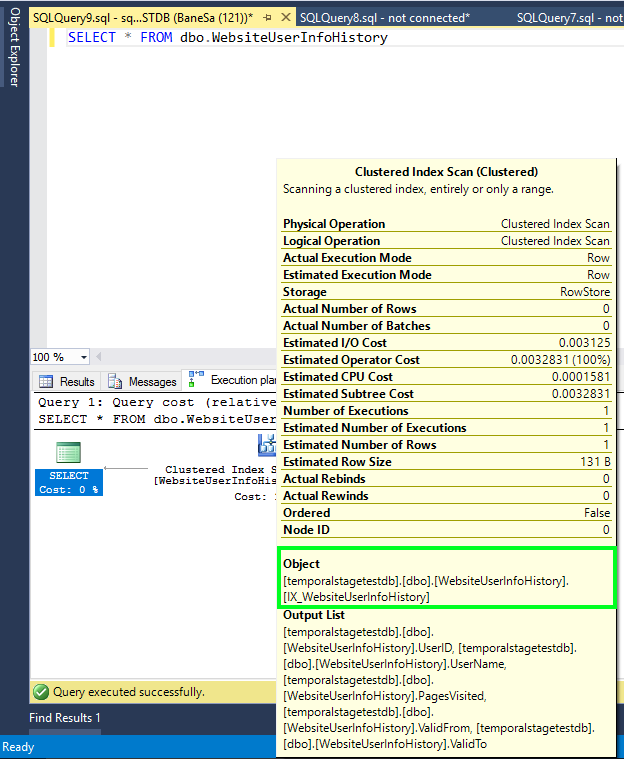

# Manage historical data in Temporal Tables with retention policy
Temporal Tables may increase database size more than regular tables, especially if you retain historical data for a longer period of time. Hence, retention policy for historical data is an important aspect of planning and managing the lifecycle of every temporal table. Temporal Tables in Azure SQL Database come with easy-to-use retention mechanism that helps you accomplish this task.

Temporal history retention can be configured at the individual table level, which allows users to create flexible aging polices. Applying temporal retention is simple: it requires only one parameter to be set during table creation or schema change.

After you define retention policy, Azure SQL Database starts checking regularly if there are historical rows that are eligible for automatic data cleanup. Identification of matching rows and their removal from the history table occur transparently, in the background task that is scheduled and run by the system. Age condition for the history table rows is checked based on the column representing end of SYSTEM_TIME period. If retention period, for example, is set to six months, table rows eligible for cleanup satisfy the following condition:

````
ValidTo < DATEADD (MONTH, -6, SYSUTCDATETIME())
````

In the preceding example, we assumed that **ValidTo** column corresponds to the end of SYSTEM_TIME period.

## How to configure retention policy?
Before you configure retention policy for a temporal table, check first whether temporal historical retention is enabled *at the database level*.

````
SELECT is_temporal_history_retention_enabled, name
FROM sys.databases
````

Database flag **is_temporal_history_retention_enabled** is set to ON by default, but users can change it with ALTER DATABASE statement. It is also automatically set to OFF after [point in time restore](sql-database-recovery-using-backups.md) operation. To enable temporal history retention cleanup for your database, execute the following statement:

````
ALTER DATABASE <myDB>
SET TEMPORAL_HISTORY_RETENTION  ON
````

> [!IMPORTANT]
> You can configure retention for temporal tables even if **is_temporal_history_retention_enabled** is OFF, but automatic cleanup for aged rows is not triggered in that case.
> 
> 

Retention policy is configured during table creation by specifying value for the HISTORY_RETENTION_PERIOD parameter:

````
CREATE TABLE dbo.WebsiteUserInfo
(  
    [UserID] int NOT NULL PRIMARY KEY CLUSTERED
  , [UserName] nvarchar(100) NOT NULL
  , [PagesVisited] int NOT NULL
  , [ValidFrom] datetime2 (0) GENERATED ALWAYS AS ROW START
  , [ValidTo] datetime2 (0) GENERATED ALWAYS AS ROW END
  , PERIOD FOR SYSTEM_TIME (ValidFrom, ValidTo)
 )  
 WITH
 (
     SYSTEM_VERSIONING = ON
     (
        HISTORY_TABLE = dbo.WebsiteUserInfoHistory,
        HISTORY_RETENTION_PERIOD = 6 MONTHS
     )
 );
````

Azure SQL Database allows you to specify retention period by using different time units: DAYS, WEEKS, MONTHS, and YEARS. If HISTORY_RETENTION_PERIOD is omitted, INFINITE retention is assumed. You can also use INFINITE keyword explicitly.

In some scenarios, you may want to configure retention after table creation, or to change previously configured value. In that case use ALTER TABLE statement:

````
ALTER TABLE dbo.WebsiteUserInfo
SET (SYSTEM_VERSIONING = ON (HISTORY_RETENTION_PERIOD = 9 MONTHS));
````

> [!IMPORTANT]
> Setting SYSTEM_VERSIONING to OFF *does not preserve* retention period value. Setting SYSTEM_VERSIONING to ON without HISTORY_RETENTION_PERIOD specified explicitly results in the INFINITE retention period.
> 
> 

To review current state of the retention policy, use the following query that joins temporal retention enablement flag at the database level with retention periods for individual tables:

````
SELECT DB.is_temporal_history_retention_enabled,
SCHEMA_NAME(T1.schema_id) AS TemporalTableSchema,
T1.name as TemporalTableName,  SCHEMA_NAME(T2.schema_id) AS HistoryTableSchema,
T2.name as HistoryTableName,T1.history_retention_period,
T1.history_retention_period_unit_desc
FROM sys.tables T1  
OUTER APPLY (select is_temporal_history_retention_enabled from sys.databases
where name = DB_NAME()) AS DB
LEFT JOIN sys.tables T2   
ON T1.history_table_id = T2.object_id WHERE T1.temporal_type = 2
````


## How SQL Database deletes aged rows?
The cleanup process depends on the index layout of the history table. It is important to notice that *only history tables with a clustered index (B-tree or columnstore) can have finite retention policy configured*. A background task is created to perform aged data cleanup for all temporal tables with finite retention period.
Cleanup logic for the rowstore (B-tree) clustered index deletes aged row in smaller chunks (up to 10K) minimizing pressure on database log and IO subsystem. Although cleanup logic utilizes required B-tree index, order of deletions for the rows older than retention period cannot be firmly guaranteed. Hence, *do not take any dependency on the cleanup order in your applications*.

The cleanup task for the clustered columnstore removes entire [row groups](https://msdn.microsoft.com/library/gg492088.aspx) at once (typically contain 1 million of rows each), which is very efficient, especially when historical data is generated at a high pace.


Excellent data compression and efficient retention cleanup makes clustered columnstore index a perfect choice for scenarios when your workload rapidly generates high amount of historical data. That pattern is typical for intensive [transactional processing workloads that use temporal tables](https://msdn.microsoft.com/library/mt631669.aspx) for change tracking and auditing, trend analysis, or IoT data ingestion.

## Index considerations
The cleanup task for tables with rowstore clustered index requires index to start with the column corresponding the end of SYSTEM_TIME period. If such index doesn't exist, you cannot configure a finite retention period:

*Msg 13765, Level 16, State 1 <br></br>
Setting finite retention period failed on system-versioned temporal table 'temporalstagetestdb.dbo.WebsiteUserInfo' because the history table 'temporalstagetestdb.dbo.WebsiteUserInfoHistory' does not contain required clustered index. Consider creating a clustered columnstore or B-tree index starting with the column that matches end of SYSTEM_TIME period, on the history table.*

It is important to notice that the default history table created by Azure SQL Database already has clustered index, which is compliant for retention policy. If you try to remove that index on a table with finite retention period, operation fails with the following error:

*Msg 13766, Level 16, State 1 <br></br>
Cannot drop the clustered index 'WebsiteUserInfoHistory.IX_WebsiteUserInfoHistory' because it is being used for automatic cleanup of aged data. Consider setting HISTORY_RETENTION_PERIOD to INFINITE on the corresponding system-versioned temporal table if you need to drop this index.*

Cleanup on the clustered columnstore index works optimally if historical rows are inserted in the ascending order (ordered by the end of period column), which is always the case when the history table is populated exclusively by the SYSTEM_VERSIONIOING mechanism. If rows in the history table are not ordered by end of period column (which may be the case if you migrated existing historical data), you should re-create clustered columnstore index on top of B-tree rowstore index that is properly ordered, to achieve optimal performance.

Avoid rebuilding clustered columnstore index on the history table with the finite retention period, because it may change ordering in the row groups naturally imposed by the system-versioning operation. If you need to rebuild clustered columnstore index on the history table, do that by re-creating it on top of compliant B-tree index, preserving ordering in the rowgroups necessary for regular data cleanup. The same approach should be taken if you create temporal table with existing history table that has clustered column index without guaranteed data order:

````
/*Create B-tree ordered by the end of period column*/
CREATE CLUSTERED INDEX IX_WebsiteUserInfoHistory ON WebsiteUserInfoHistory (ValidTo)
WITH (DROP_EXISTING = ON);
GO
/*Re-create clustered columnstore index*/
CREATE CLUSTERED COLUMNSTORE INDEX IX_WebsiteUserInfoHistory ON WebsiteUserInfoHistory
WITH (DROP_EXISTING = ON);
````

When finite retention period is configured for the history table with the clustered columnstore index, you cannot create additional non-clustered B-tree indexes on that table:

````
CREATE NONCLUSTERED INDEX IX_WebHistNCI ON WebsiteUserInfoHistory ([UserName])
````

An attempt to execute above statement fails with the following error:

*Msg 13772, Level 16, State 1 <br></br>
Cannot create non-clustered index on a temporal history table 'WebsiteUserInfoHistory' since it has finite retention period and clustered columnstore index defined.*

## Querying tables with retention policy
All queries on the temporal table automatically filter out historical rows matching finite retention policy, to avoid unpredictable and inconsistent results, since aged rows can be deleted by the cleanup task, *at any point in time and in arbitrary order*.

The following picture shows the query plan for a simple query:

````
SELECT * FROM dbo.WebsiteUserInfo FOR SYSTEM_TIME ALL;
````

The query plan includes additional filter applied to end of period column (ValidTo) in the Clustered Index Scan operator on the history table (highlighted). This example assumes that one MONTH retention period was set on WebsiteUserInfo table.


However, if you query history table directly, you may see rows that are older than specified retention period, but without any guarantee for repeatable query results. The following picture shows query execution plan for the query on the history table without additional filters applied:



Do not rely your business logic on reading history table beyond retention period as you may get inconsistent or unexpected results. We recommend that you use temporal queries with FOR SYSTEM_TIME clause for analyzing data in temporal tables.

## Point in time restore considerations
When you create new database by [restoring existing database to a specific point in time](sql-database-recovery-using-backups.md), it has temporal retention disabled at the database level. (**is_temporal_history_retention_enabled** flag set to OFF). This functionality allows you to examine all historical rows upon restore, without worrying that aged rows are removed before you get to query them. You can use it to *inspect historical data beyond configured retention period*.

Say that a temporal table has one MONTH retention period specified. If your database was created in Premium Service tier, you would be able to create database copy with the database state up to 35 days back in the past. That effectively would allow you to analyze historical rows that are up to 65 days old by querying the history table directly.

If you want to activate temporal retention cleanup, run the following Transact-SQL statement after point in time restore:

````
ALTER DATABASE <myDB>
SET TEMPORAL_HISTORY_RETENTION  ON
````

## Next steps
To learn how to use Temporal Tables in your applications, check out [Getting Started with Temporal Tables in Azure SQL Database](sql-database-temporal-tables.md).

Visit Channel 9 to hear a [real customer temporal implementation success story](https://channel9.msdn.com/Blogs/jsturtevant/Azure-SQL-Temporal-Tables-with-RockStep-Solutions) and watch a [live temporal demonstration](https://channel9.msdn.com/Shows/Data-Exposed/Temporal-in-SQL-Server-2016).

For detailed information about Temporal Tables, review [MSDN documentation](https://msdn.microsoft.com/library/dn935015.aspx).

