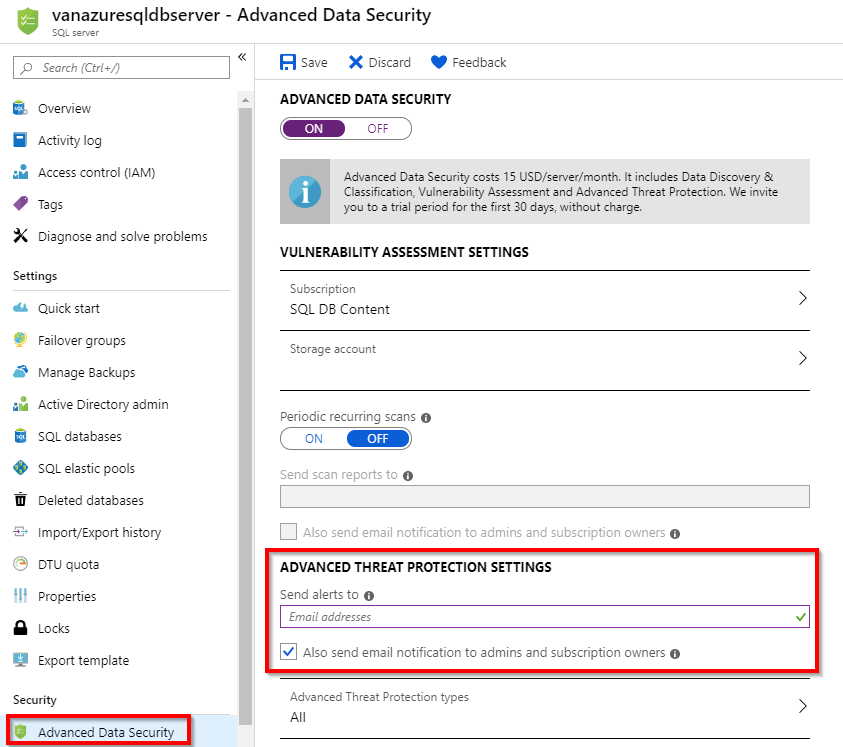
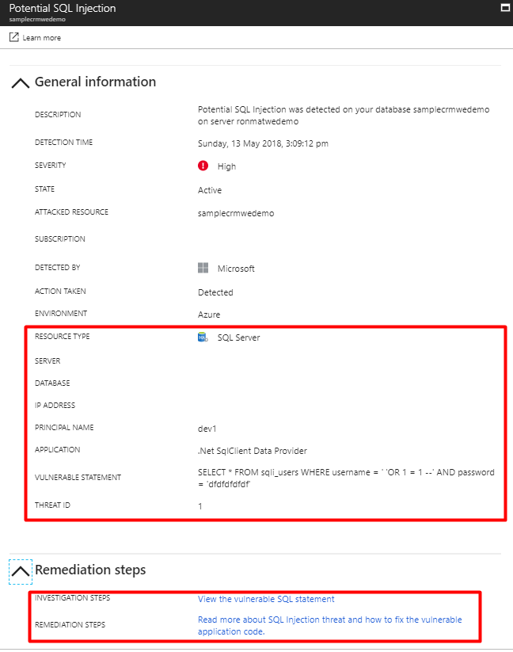
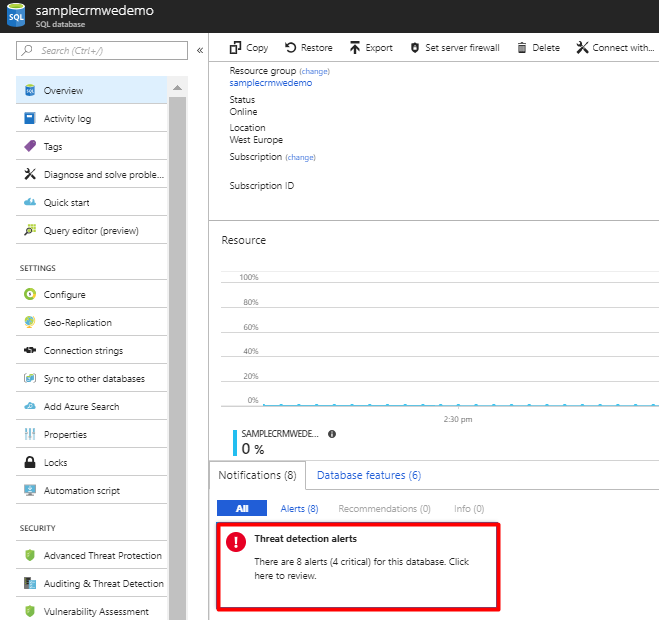
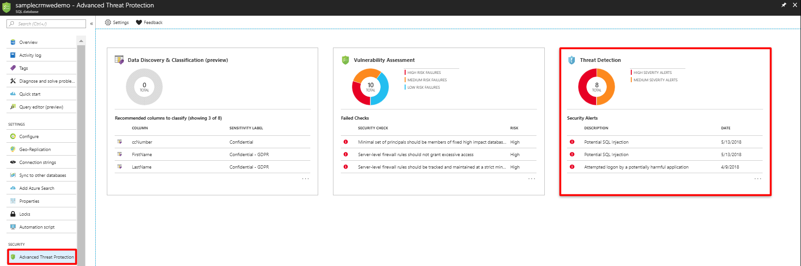

# Azure SQL Database Threat Detection

Azure SQL Database Threat Detection detects anomalous activities indicating unusual and potentially harmful attempts to access or exploit databases.

Threat Detection is part of the [SQL Advanced Threat Protection](sql-advanced-threat-protection.md) (ATP) offering, which is a unified package for advanced SQL security capabilities. Threat Detection can be accessed and managed via the central SQL ATP portal.

## What is Threat Detection?

SQL Threat Detection provides a new layer of security, which enables customers to detect and respond to potential threats as they occur by providing security alerts on anomalous activities. Users receive an alert upon suspicious database activities, potential vulnerabilities, and SQL injection attacks, as well as anomalous database access and queries patterns. SQL Threat Detection integrates alerts with [Azure Security Center](https://azure.microsoft.com/services/security-center/), which includes details of suspicious activity and recommend action on how to investigate and mitigate the threat. SQL Threat Detection makes it simple to address potential threats to the database without the need to be a security expert or manage advanced security monitoring systems. 

For a full investigation experience, it is recommended to enable [SQL Database Auditing](sql-database-auditing.md), which writes database events to an audit log in your Azure storage account.  

## Set up threat detection for your database in the Azure portal
1. Launch the Azure portal at [https://portal.azure.com](https://portal.azure.com).
2. Navigate to the configuration page of the Azure SQL Database server you want to protect. In the security settings, select **Advanced Threat Protection**.
3. On the **Advanced Threat Protection** configuration page:

   - Enable Advanced Threat Protection on the server.
   - In **Threat Detection Settings**, in the **Send alerts to** text box, provide the list of emails to receive security alerts upon detection of anomalous database activities.
  
   

## Set up threat detection using PowerShell

For a script example, see [Configure auditing and threat detection using PowerShell](scripts/sql-database-auditing-and-threat-detection-powershell.md).

## Explore anomalous database activities upon detection of a suspicious event

You receive an email notification upon detection of anomalous database activities. The email provides information on the suspicious security event including the nature of the anomalous activities, database name, server name, application name, and the event time. In addition, the email provides information on possible causes and recommended actions to investigate and mitigate the potential threat to the database.

     
1. Click the **View recent SQL alerts** link in the email to launch the Azure portal and show the Azure Security Center alerts page, which provides an overview of active threats detected on the SQL database.

   

2. Click a specific alert to get additional details and actions for investigating this threat and remediating future threats.

   For example, SQL injection is one of the most common Web application security issues on the Internet that is used to attack data-driven applications. Attackers take advantage of application vulnerabilities to inject malicious SQL statements into application entry fields, breaching or modifying data in the database. For SQL Injection alerts, the alert’s details include the vulnerable SQL statement that was exploited.

   

## Explore threat detection alerts for your database in the Azure portal

SQL Database Threat Detection integrates its alerts with [Azure Security Center](https://azure.microsoft.com/services/security-center/). A live SQL threat detection tiles within the database and SQL ATP blades in the Azure portal tracks the status of active threats.

Click **Threat detection alert** to launch the Azure Security Center alerts page and get an overview of active SQL threats detected on the database.

   
   
   

## Azure SQL Database Threat Detection alerts 
Threat Detection for Azure SQL Database detects anomalous activities indicating unusual and potentially harmful attempts to access or exploit databases and it can trigger the following alerts:
- **Vulnerability to SQL Injection**: This alert is triggered when an application generates a faulty SQL statement in the database. This may indicate a possible vulnerability to SQL injection attacks. There are two possible reasons for the generation of a faulty statement:
   - A defect in application code that constructs the faulty SQL statement
   - Application code or stored procedures don't sanitize user input when constructing the faulty SQL statement, which may be exploited for SQL Injection
- **Potential SQL injection**: This alert is triggered when an active exploit happens against an identified application vulnerability to SQL injection. This means the attacker is trying to inject malicious SQL statements using the vulnerable application code or stored procedures.
- **Access from unusual location**: This alert is triggered when there is a change in the access pattern to SQL server, where someone has logged on to the SQL server from an unusual geographical location. In some cases, the alert detects a legitimate action (a new application or developer maintenance). In other cases, the alert detects a malicious action (former employee, external attacker).
- **Access from unusual Azure data center**: This alert is triggered when there is a change in the access pattern to SQL server, where someone has logged on to the SQL server from an unusual Azure data center that was seen on this server during the recent period. In some cases, the alert detects a legitimate action (your new application in Azure, Power BI, Azure SQL Query Editor). In other cases, the alert detects a malicious action from an Azure resource/service (former employee, external attacker).
- **Access from unfamiliar principal**: This alert is triggered when there is a change in the access pattern to SQL server, where someone has logged on to the SQL server using an unusual principal (SQL user). In some cases, the alert detects a legitimate action (new application, developer maintenance). In other cases, the alert detects a malicious action (former employee, external attacker).
- **Access from a potentially harmful application**: This alert is triggered when a potentially harmful application is used to access the database. In some cases, the alert detects penetration testing in action. In other cases, the alert detects an attack using common attack tools.
- **Brute force SQL credentials**: This alert is triggered when there is an abnormal high number of failed logins with different credentials. In some cases, the alert detects penetration testing in action. In other cases, the alert detects brute force attack.

## Next steps

* Learn more about [SQL Advanced Threat Protection](sql-advanced-threat-protection.md). 
* Learn more about [Azure SQL Database Auditing](sql-database-auditing.md)
* Learn more about [Azure Security Center](https://docs.microsoft.com/azure/security-center/security-center-intro)
* For more information on pricing, see the [SQL Database Pricing page](https://azure.microsoft.com/pricing/details/sql-database/)  
