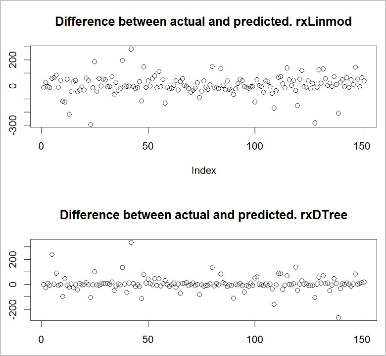

# Tutorial: Create a predictive model in R with Azure SQL Database Machine Learning Services (preview)

In this tutorial, you'll learn how to train two predictive models in R with Azure SQL Database Machine Learning Services (preview), and then choose the most accurate model to deploy.

This tutorial is **part two of a three-part tutorial series**.

In part two, you learn how to:

> [!div class="checklist"]
> * Train two machine learning models
> * Make predictions from both models
> * Compare the results to choose the most accurate model

In [part one](sql-database-tutorial-build-deploy-model-1.md), you learned how how to import a sample database into an Azure SQL database, and then prepare the data to be used for training a predictive model in R.

In [part three](sql-database-tutorial-build-deploy-model-2.md), you'll learn how to store the model in a database, and then create a stored procedure that can make predictions based on new data.

[!INCLUDE[ml-preview-note](../../includes/sql-database-ml-preview-note.md)]

## Prerequisites

* Part two of this tutorial assumes you have completed [part one](sql-database-tutorial-build-deploy-model-1.md) and its prerequisites.

## Train two models

In the *model training phase*, you find a function (*model*) that best describes the dependency between the variables in the dataset. This is typically done by using a subset of the entire dataset as training data. It's also common to train and compare multiple models in order to find the one that fits the data best.

To find the best model for the ski rental data, create two different models and see which one is predicting more accurately.

```r
#First, split the dataset into 2 different sets:
# one for training the model and the other for validating it
train_data = rentaldata[rentaldata$Year < 2015,];
test_data  = rentaldata[rentaldata$Year == 2015,];

#Use the RentalCount column to check the quality of the prediction against actual values
actual_counts <- test_data$RentalCount;

#Model 1: Use rxLinMod to create a linear regression model, trained with the training data set
model_linmod <- rxLinMod(RentalCount ~  Month + Day + WeekDay + Snow + Holiday, data = train_data);

#Model 2: Use rxDTree to create a decision tree model, trained with the training data set
model_dtree  <- rxDTree(RentalCount ~ Month + Day + WeekDay + Snow + Holiday, data = train_data);
```

## Make predictions from both models

Now use a predict function to predict the Rental Counts using the two trained models.
Later, you'll compare actual values of RentalCount with the predictions made by the two models and see which model is more accurate.

> [!TIP]
> Finding the right type of model for a specific problem requires some experimentation. The [Machine Learning Algorithm Cheat Sheet](https://azure.microsoft.com/en-us/documentation/articles/machine-learning-algorithm-choice/#the-machine-learning-algorithm-cheat-sheet) can be nice to have as a guide.

```r
#Use both models to make predictions using the test data set.
predict_linmod <- rxPredict(model_linmod, test_data, writeModelVars = TRUE, extraVarsToWrite = c("Year"));

predict_dtree  <- rxPredict(model_dtree,  test_data, writeModelVars = TRUE, extraVarsToWrite = c("Year"));

#To verify it worked, look at the top rows of the two prediction data sets.
head(predict_linmod);
head(predict_dtree);
```

```results
    RentalCount_Pred  RentalCount  Month  Day  WeekDay  Snow  Holiday
1         27.45858          42       2     11     4      0       0
2        387.29344         360       3     29     1      0       0
3         16.37349          20       4     22     4      0       0
4         31.07058          42       3      6     6      0       0
5        463.97263         405       2     28     7      1       0
6        102.21695          38       1     12     2      1       0
    RentalCount_Pred  RentalCount  Month  Day  WeekDay  Snow  Holiday
1          40.0000          42       2     11     4      0       0
2         332.5714         360       3     29     1      0       0
3          27.7500          20       4     22     4      0       0
4          34.2500          42       3      6     6      0       0
5         645.7059         405       2     28     7      1       0
6          40.0000          38       1     12     2      1       0
```

## Compare the results

Now you want to see which of the models gives the best predictions. To find out, plot the difference between the predicted and actual values. R is a great language for quickly and easily visualizing data. You're going to use a basic plotting function to plot 2 graphs.

```r
#Use the plotting functionality in R to visualize the results from the predictions
par(mfrow = c(2, 1));
plot(predict_linmod$RentalCount_Pred - predict_linmod$RentalCount, main = "Difference between actual and predicted. rxLinmod");
plot(predict_dtree$RentalCount_Pred  - predict_dtree$RentalCount,  main = "Difference between actual and predicted. rxDTree");
```



It looks like the decision tree model is the more accurate of the two models. You can feel confident to use it to predict what's going to happen on a given situation in the future.

## Next Steps

In part two of this tutorial series, you completed these steps:

* Train two machine learning models
* Make predictions from both models
* Compare the results to choose the most accurate model

To deploy the machine learning model you've created, follow part three of this tutorial series:

> [!div class="nextstepaction"]
> [Tutorial: Deploy a predictive model in R with Azure SQL Database Machine Learning Services (preview)](sql-database-tutorial-build-deploy-model-3.md)
