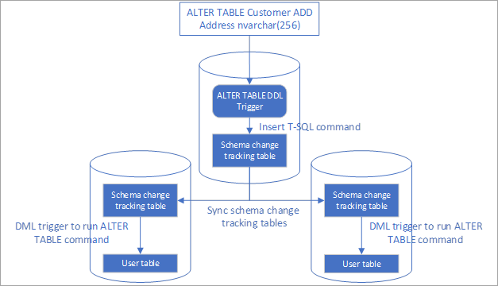

# Automate the replication of schema changes in Azure SQL Data Sync

SQL Data Sync allows users to synchronize data between Azure SQL Databases and on premises SQL Server in one direction or bi-direction. One of current limitations of SQL Data Sync is lack of support of schema changes replication. Every time the table schema is changed, you need to manually apply the changes in all endpoints, including hub and all members, and then update the sync schema. In this article, we are going to introduce a solution to automatically replicate schema changes to all endpoints using SQL Data Sync.

This solution uses a DDL trigger to track schema changes, inserts the schema change commands to a tracking table. This table is synced to all endpoints using Data Sync service. DML triggers after insertion are used to apply the schema changes in other endpoints. This article uses ALTER TABLE as an example, but it also works for other types of schema changes.

> [!IMPORTANT]
> We recommend that you read this article carefully, especially the sections about [Troubleshooting](#troubleshooting) and [Other considerations](#other), before you start to implement automated schema change replication in your sync environment. We also recommend that you read [Sync data across multiple cloud and on-premises databases with SQL Data Sync](sql-database-sync-data.md). Some database operations may break the solution described in this article. Additional domain knowledge of SQL Server and Transact-SQL may be required to troubleshoot those issues.



## Set up automated schema change replication

### Create a table to track schema changes

Create a table to track schema changes in all databases in the sync group:

```sql
CREATE TABLE SchemaChanges (
ID bigint IDENTITY(1,1) PRIMARY KEY,
SqlStmt nvarchar(max),
[Description] nvarchar(max)
)
```

This table has an identity column to track the order of schema changes. You can add more fields to log more information if needed.

### Create a table to track schema changes history

In all endpoints, create table to track id of the last applied schema change command

```sql
CREATE TABLE SchemaChangeHistory (
LastAppliedId bigint PRIMARY KEY
)
GO

INSERT INTO SchemaChangeHistory VALUES (0)
```

### Create an ALTER TABLE DDL trigger in database where schema changes are applied

Create DDL trigger for ALTER TABLE operations. This trigger only needs to be created in the database where the schema changes are made. To avoid conflict, only allow schema change in one database in a sync group.

```sql
CREATE TRIGGER AlterTableDDLTrigger
ON DATABASE
FOR ALTER_TABLE
AS

-- You can add your own logic to filter ALTER TABLE commands instead of replicate all of them

IF NOT (EVENTDATA().value('(/EVENT_INSTANCE/SchemaName)[1]', 'nvarchar(512)') like 'DataSync')

INSERT INTO SchemaChanges (SqlStmt, Description)
    VALUES (EVENTDATA().value('(/EVENT_INSTANCE/TSQLCommand/CommandText)[1]', 'nvarchar(max)'), 'From DDL trigger')
```

The trigger inserts a record in the schema change tracking table for each ALTER TABLE command. I added a filter here to avoid replication of schema changes made under schema 'DataSync', because most likely it is made by the data sync service. You can add more filters if you only want to replicate certain types of schema changes.

You can also add more triggers to replicate other types of schema changes. For example, create CREATE_PROCEDURE, ALTER_PROCEDURE and DROP_PROCEDURE triggers to replicate stored procedure changes.

### Create trigger in other endpoints to apply schema changes during insertion

This trigger executes the schema change command when it is synced to other endpoints. The trigger needs to be created in all the endpoint, except the one where schema change is made in (the database where DDL trigger AlterTableDDLTrigger is created in step 3).

```sql
CREATE TRIGGER SchemaChangesTrigger
ON SchemaChanges
AFTER INSERT
AS
DECLARE \@lastAppliedId bigint
DECLARE \@id bigint
DECLARE \@sqlStmt nvarchar(max)
SELECT TOP 1 \@lastAppliedId=LastAppliedId FROM SchemaChangeHistory
SELECT TOP 1 \@id = id, \@SqlStmt = SqlStmt FROM SchemaChanges WHERE id \> \@lastAppliedId ORDER BY id
IF (\@id = \@lastAppliedId + 1)
BEGIN
    EXEC sp_executesql \@SqlStmt
        UPDATE SchemaChangeHistory SET LastAppliedId = \@id
    WHILE (1 = 1)
    BEGIN
        SET \@id = \@id + 1
        IF exists (SELECT id FROM SchemaChanges WHERE ID = \@id)
            BEGIN
                SELECT \@sqlStmt = SqlStmt FROM SchemaChanges WHERE ID = \@id
                EXEC sp_executesql \@SqlStmt
                UPDATE SchemaChangeHistory SET LastAppliedId = \@id
            END
        ELSE
            BREAK;
    END
END
```

This trigger runs after the insertion and check if the current command should run next. The code logic ensures no schema change statement is skipped, and all changes are applied even if the insertion is out of order.

### Sync the schema change tracking table to all endpoints

You can sync the schema change tracking table to all endpoints using existing sync group or a new sync group. You need to make sure the changes in the tracking table can be synced to all endpoint, in case one direction sync is used.

Don't sync the schema change history table since they should maintain different state in different endpoints

### Apply schema changes in a sync group

Only schema changes made in the database where the DDL trigger is created is replicated. Schema change made in other databases are not replicated.

After the schema changes are replicated to all endpoints, you also need to take extra steps to update the sync schema to start or stop syncing the new columns.

#### Adding new columns

1.  Make the schema change.

2.  Avoid any data change where the new columns are involved until step 3 is     completed.

3.  Wait until the schema changes applied to all endpoints

4.  Refresh database schema and add the new column to sync schema

5.  Data in the new column is synced during next sync operation.

#### Removing columns

1.  Remove the columns from sync schema. Data Sync stops syncing data these columns.

2.  Make the schema change

3.  Refresh database schema

#### Update data types

1.  Make the schema change

2.  Wait until the schema changes applied to all endpoint

3.  Refresh database schema

4.  If the new and old data types are not fully compatible (for example, update from int to bigint), sync may fail before step 3 finished. Sync succeeds after retry.

#### Rename columns or tables

Renaming columns or tables makes data sync stop working. You can create new table/column, backfill data and delete old table/column instead of renaming.

#### Other types of schema changes

For other types of schema changes (for example, create stored procedures or drop index), update sync schema is not required.

## <a name="troubleshoot"></a> Troubleshoot automated schema change replication

This replication logic stops working in some situations, for example, you made a schema change in the on premises database which is not supported in Azure SQL databases. In that case, sync of schema change tracking table fails. You need fix it manually:

1.  Disable the DDL trigger and avoid any further schema change before the issue is fixed.

2.  In the endpoint database where the issue is happening, Disable the AFTER INSERT trigger on the endpoint where schema change can't be made. It allows the schema change command being synced.

3.  Trigger sync to sync the schema change tracking table.

4.  In the endpoint database where the issue is happening, query the schema change history table to get the id of last applied schema change command, let's say it's 12.

5.  Query the schema change tracking table to list all the commands with id \> 12.

    a.  For those commands can't not be executed in the endpoint database, ignore it. You need to deal with the schema inconsistency. Revert the original schema changes if the inconsistency impact your application.

    b.  For those commands which should be applied, manually apply it.

6.  Update the schema change history table and set the last applied id to the correct value.

7.  Double check if the schema is up to date

8.  Re-enable AFTER INSERT trigger

9.  Re-enable DDL trigger

If you want to clean up the records in schema change tracking table, use DELETE instead of TRUNCATE. Never reseed the identity column in schema change tracking table using DBCC CHECKIDENT. You can create new schema change tracking tables and update the table name in DDL trigger if reseeding is required.

## <a name="other"></a> Other Considerations

-   Database users used to configure the hub and member databases need to have enough permission to execute the schema change commands.

-   You can add more filters in the DDL trigger to only replicate schema change in selected tables or operations.

-   You can only make schema change in the database where DDL trigger is created.

-   If you are making change in an on premises SQL Server database, make sure the schema change is supported in Azure SQL Database.

-   If schema changes are made in the databases other than the one where DDL trigger is created, the changes are not replicated. To avoid this, you can create DDL triggers to block changes in other endpoints.

-   If you need to change schema of the schema change tracking table, disable the DDL trigger before you make the change and manually apply the change to all endpoints. Update schema in an AFTER INSERT trigger on the same table does not work.

-   Don't reseed the identity column (DBCC CHECKIDENT).

-   Don't use TRUNCATE to clean up data in schema change tracking table.
