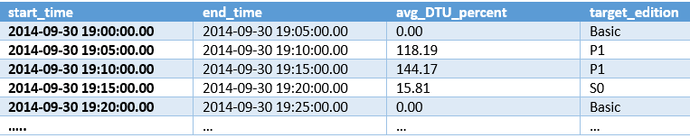
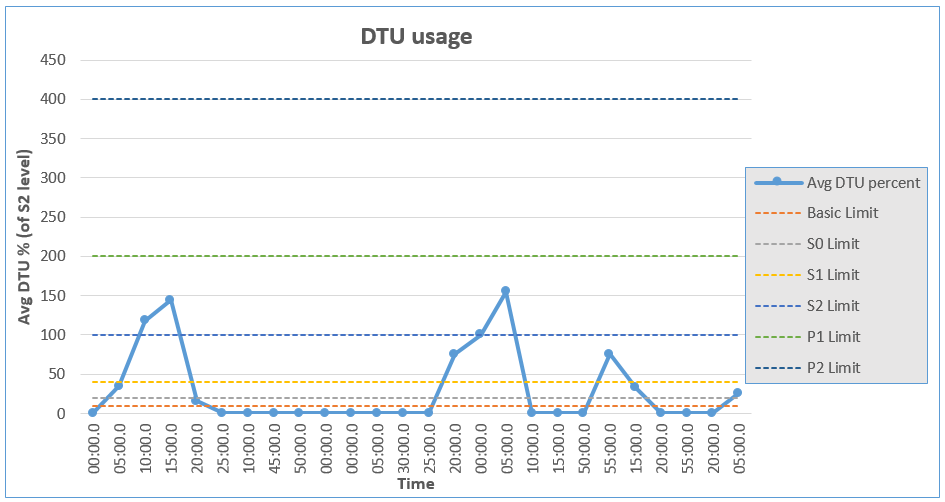

<properties 
	pageTitle="Upgrade SQL Database Web or Business Databases to New Service Tiers" 
	description="Upgrade Azure SQL Database Web or Business databases to the new Azure SQL Database Basic, Standard, and Premium service tiers and performance levels." 
	services="sql-database" 
	documentationCenter="" 
	authors="stevestein" 
	manager="jeffreyg" 
	editor=""/>

<tags 
	ms.service="sql-database"
	ms.devlang="NA"
	ms.date="10/08/2015" 
	ms.author="sstein" 
	ms.workload="data-management" 
	ms.topic="article" 
	ms.tgt_pltfrm="NA"/>

# Upgrade SQL Database Web or Business Databases to New Service Tiers

Azure SQL [Web and Business databases are retiring](sql-database-web-business-sunset-faq.md) so it's time to upgrade existing Web or Business databases to the [Basic, Standard, Premium, or Elastic service tiers](sql-database-service-tiers.md).

> [AZURE.IMPORTANT] Upgrading Web or Business databases to a new service tier does not take the database offline. The database will remain online and available throughout the upgrade operation. 

To assist you with upgrading, the SQL Database service recommends an appropriate service tier and performance level (pricing tier) for each database. By analyzing the historical usage for each database, the service recommends a tier that is best suited for running your existing database’s workload. 

The recommended pricing tier for each database is provided during the process of changing a Web or Business databases service tier, or while upgrading to SQL Database V12.

Depending on your specific environment the service may recommend upgrading some or all of your databases into an [elastic database pool](sql-database-elastic-pool.md).

To see the recommended service tiers for your retired databases, you can use the [Azure preview portal](https://portal.azure.com) or PowerShell. For step-by-step directions see:

- [Upgrade to SQL Database V12 (Azure Preview Portal)](sql-database-v12-upgrade.md)
- [Upgrade to SQL Database V12 (PowerShell)](sql-database-upgrade-server.md)

What is important to note, is that your SQL database is not locked into any specific service tier or performance level, so as the requirements of your database change you can easily change between the available service tiers and performance levels. In fact, Basic, Standard, and Premium SQL Databases are billed by the hour, and you have the ability to scale each database up or down 4 times within a 24 hour period. This means you can adjust the service tier and performance level to maximize your database’s performance needs, feature set, and cost, based on your application’s requirements and varying workload. This also means that evaluating and changing the service tier and performance level of your database (scaling up and down) is an ongoing process that should be part of your scheduled maintenance and performance tuning routine.
 
For more information about the differences between Web/Business and the new service tiers, and for additional migration details, download the [Web and Business Database Migration Guidance Cookbook](http://download.microsoft.com/download/3/C/9/3C9FF3D8-E702-4F5D-A38C-5EFA1DBA73E6/Azure_SQL_Database_Migration_Cookbook.pdf).

## Overview

 Azure Web and Business SQL databases run in a shared, multi-tenant environment without any reserved resource capacity for the database. The activity of other databases within this shared resource environment can impact your performance. Resource availability at any given point depends heavily on other concurrent workloads running in the system. This can result in highly varying and unpredictable database application performance. Customer feedback is that this unpredictable performance is difficult to manage, and more predictable performance is preferred. 

To address this feedback, Azure SQL Database service introduced new database service tiers [(Basic, Standard and Premium)](sql-database-service-tiers.md), which offer predictable performance and a wealth of new features for business continuity and security. These new service tiers are designed to provide a specified level of resources for a database workload, regardless of other customer workloads running in that environment. This results in highly predictable performance behavior. 

With these changes come questions about how to evaluate and decide which new service tier is the best fit for current Web and Business (W/B) databases and about the actual upgrade process.

Ultimately, the best choice is the service tier and performance level combination that provides you the optimum balance between features, performance, and cost, yet one which completely satisfies the business needs and requirements of your application.

This paper provides a guided methodology for upgrading a Web or Business database to one of the new service tiers/performance levels.

## Upgrading Web and Business Databases

Upgrading Web or Business databases to a new service tier/performance level does not take the database offline. The database will continue to work through the upgrade operation. At the time of the actual transition to the new performance level temporary dropping of the connections to the database can happen for a very small duration (typically measured in seconds). If an application has transient fault handling for connection terminations then it is sufficient to protect against dropped connections at the end of the upgrade. 

Upgrading a Web or Business database to a new service tier involves the following steps:

1. Determine service tier based on feature capability
2. Determine an acceptable performance level based on historical resource usage
3. Why does existing performance for my Web or Business database map to the higher Premium levels?
4. Tuning your workload to fit a lower performance level
5. *Upgrade to the new service tier/performance level*
6. Monitor the upgrade to the new service tier/performance level
7. Monitor the database after the upgrade

## 1. Determine service tier based on feature capability

The Basic, Standard, and Premium service tiers offer differing feature sets, so the first step in selecting an appropriate tier is to determine the service tier that provides the minimum level of feature capabilities required for your application and business. 

For example, consider how long backups need to be retained, or if [Standard or Active Geo-Replication](sql-database-business-continuity.md) features are needed, or the overall maximum database size needed, etc. These requirements determine your minimum service tier choice.

The ‘Basic’ tier is primarily used for very small, low activity databases. So, for an upgrade you should usually start with the ‘Standard’ or ‘Premium’ tier based on the minimum level of required features.

The new service tier's features and performance levels are summarized and compared in the following table:

[AZURE.INCLUDE [SQL DB service tiers table](../../includes/sql-database-service-tiers-table.md)]

**Additional resources for comparing service tiers and performance levels:**

| Article | Description |
|:--|:--|
|[Azure SQL Database Service Tiers and Performance Levels](sql-database-service-tiers.md)| Overview, metrics, and capabilities for each service tier (and how to monitor database utilization in the management portal and by using DMVs). |
|[Azure SQL Database Business Continuity](sql-database-business-continuity.md)|Details of the business continuity and disaster recovery features (point-in-time restore, geo-restore, geo-replication) available for the different service tiers.|
|[SQL Database Pricing](http://azure.microsoft.com/pricing/details/sql-database/)|Detailed pricing information for the different service tiers and performance levels.|

 

After selecting an appropriate service tier that satisfies the requirements for your database, the next step is to select a performance level that is acceptable for your actual database workloads. 

## 2. Determine an acceptable performance level based on historical resource usage

The Azure SQL Database service exposes information in the management portal, and in System Views, to provide you the suggested comparable new service tier and performance level for your existing Web or Business database.

Since Web and Business databases do not have any guaranteed DTUs/resource limits associated with them, we normalize the percentage values in terms of the amount of resources available to an S2 performance level database. The average DTU percentage consumption of a database at any specific interval can be calculated as the highest percentage value among CPU, IO and Log usage at that interval.

Use the Azure preview portal for a high-level overview of DTU percentage usage, and then drill into the details using system views. 

You can also use the Azure preview portal to view the recommended service tier for your Web or Business database when you upgrade a server to Azure SQL Database V12.

### How to view the recommended service tier in the Azure Preview Portal
The Azure portal recommends the appropriate service tier for your Web or Business database during the process of upgrading a server to SQL Database V12. The recommendation is based on a historical analysis of the resource consumption of the database.

**New Management Portal**

1. Log on to the [Azure preview portal](https://portal.azure.com) and browse to a server containing a Web or Business database.
2. Click the **Latest Update** part in the server blade.
3. Click **Upgrade this server**.

The **Upgrade this server** blade now shows a list of Web or Business databases on the server along with the recommended service tier.

### How to view DTU consumption in the Management Portal
The management portal provides insight into the DTU consumption for an existing Web or Business database.
DTU information is available in the current Azure Portal.

**Management Portal**

1. Log on to the [management portal](https://manage.windowsazure.com) and navigate to an existing Web or Business database.
2. Click the **MONITOR** tab.
3. Click **ADD METRICS**.
4. Select **DTU percentage** and click the checkmark at bottom to confirm.

After confirming you should see the **DTU percentage** data in the table. Remember, this is percentage as compared to DTUs in a Standard(S2) level database, which is 50 DTUs.

Also worth noting is that this data is the average of samples that are taken every 5 minutes, so there can be short bursts of activity between samples that are not reflected in these metrics.

![DTU percentage data][2]

Notice the data in the example above shows an average usage of approximately 10 DTUs (19.23% of 50) and a max DTU percentage of ~28 DTUs (55.83% x 50). 
Assuming this data represented my typical workload I would likely select Standard(S1) for my initial upgrade. Standard(S0) provides 10 DTUs which is my average usage but that would mean my database would on average be running 100% capacity, which is never a good plan. While S1 would likely be a good choice for my average usage, what about the times I'm hitting the MAX? Maybe I know the spikes are from some overnight maintenance process, and actual customer usage is not impacted, I might be okay with reduced performance during that timeframe. But maybe I don't know when the MAX is being hit so the DTU percentage consumption may require further analysis.

To drill into the details of a database's resource consumption you can use the provided System Views.

### System Views

Web and Business database resource consumption data is accessed through the [sys.resource_stats](http://msdn.microsoft.com/library/azure/dn269979.aspx) view in the master database of the logical server where your current database is located. It displays resource consumption data in percentages of the limit of the performance level. This view provides data for up to the last 14 days, at 5 minute intervals.  

> [AZURE.NOTE] You can now use the [sys.dm_db_resource_stats](https://msdn.microsoft.com/library/dn800981.aspx) view in Web and Business databases for a higher granularity view (every 15 seconds) of resource consumption data. Because sys.dm_db_resource_stats only retains historical data for one hour you can query this DMV every hour and store the data for additional analysis.

Run the following query on the master database to retrieve the average DTU consumption for a database:

 
                   
     SELECT start_time, end_time
	 ,(SELECT Max(v)
         FROM (VALUES (avg_cpu_percent)
                    , (avg_physical_data_read_percent)
                    , (avg_log_write_percent)
    	   ) AS value(v)) AS [avg_DTU_percent]
    FROM sys.resource_stats
    WHERE database_name = '<your db name>'
    ORDER BY end_time DESC;

The data returned by [sys.resource_stats](https://msdn.microsoft.com/library/dn269979.aspx) and [sys.dm_db_resource_stats](https://msdn.microsoft.com/library/dn800981.aspx) for Web and Business tiers indicate the percentages in terms of the Standard S2 performance tier. For example, when executing against a Web or Business database, if values return 70%, that indicates 70% of the S2 tier limit. In addition, for Web and Business, the percentages may reflect numbers in excess of 100%, which is also based on the S2 tier limit.

DTU consumption information in terms of an S2 database level allows you to normalize the current consumption of your Web and Business databases in terms of new tier databases and see where they fit better. For example, if your average DTU percentage consumption shows a value of 80%, it indicates that the database is consuming DTU at the rate of 80% of the limit of a database at S2 performance level. If you see values greater than 100% in the **sys.resource_stats** view, it means that you need a performance tier larger than S2. As an example, let’s say you see a peak DTU percentage value of 300%.  This tells you that you are using three times more resources than would be available in an S2. To determine a reasonable starting size, compare the DTUs available in an S2 (50 DTUs) with the next higher sizes (S3/P1 = 100 DTUs, or 200% of S2, P2 = 200 DTUs or 400% of S2). Because you are at 300% of S2 you may want to start with a P2 and re-test. 

Based on the DTU usage percent and the largest edition that was required to fit your workload, you can determine which service tier  and performance level is best suited for your database workload (as indicated through DTU percentage and relative DTU powers of various [performance levels)](sql-database-service-tiers.md). Here is a table that provides a mapping of the Web/Business resource consumption percentage to equivalent new tier performance levels: 

![Resource consumption][4]

> **Note:**
> Relative DTU numbers between various performance levels are based on the [Azure SQL Database Benchmark](http://msdn.microsoft.com/library/azure/dn741327.aspx) workload. Since your database’s workload is likely to be different from the benchmark, you should use the above calculations as the guideline for an initial fit for your Web/Business database in the new tiers. Once you have moved the database to the new tier, use the process outlined in the previous section to validate/fine tune the right service tier that fits your workload needs.
> 
> While the suggested new edition tier/performance level takes into consideration your database activity over the last 14 days, this data is based on resource consumption data samples averaged over 5 minutes. As such it can miss short term bursts of activity that are shorter than 5 minutes in duration. So, this guidance should be used as a starting point to upgrade your database to. Once you upgrade the database to the suggested tier, more monitoring, testing and validations are needed and the database can be moved Up/down to a different tier/performance level as needed.

Here is a query on the master database that performs the calculation for your Web/Business tier database and suggests which edition is likely to fit your workload for each of these 5 minute data sample intervals.

> **Note:** This query is useful only for Web/Business databases and will **not** give correct results for databases in the new tiers.

    WITH DTU_mapping AS
    ( SELECT *
        FROM ( VALUES (1, 10,'Basic'), (2, 20,'S0'), (3, 40,'S1'), (4, 100, 'S2')
                    , (5, 200, 'S3/P1'), (6, 1600,'Premium')
           ) AS t(id, percent_of_S2, target_edition)
    ), rc as
    ( SELECT start_time, end_time
           , (SELECT Max(v)
                FROM (VALUES (avg_cpu_percent)
                       		, (avg_physical_data_read_percent)
                       		, (avg_log_write_percent)
                   ) AS value(v)) as [avg_DTU_percent]
        FROM sys.resource_stats	
       WHERE database_name = 'WebDB'
    )
    SELECT rc.*
         , (SELECT TOP(1) t.target_edition
              FROM DTU_mapping AS t
             WHERE t.percent_of_S2 > CAST(1.2*rc.avg_DTU_percent as int)
             ORDER BY t.percent_of_S2) as target_edition
    FROM rc;

**Sample result:**

Graphed you can see the trend of average DTU percentage consumption over time. Here is an example graph for a database that is in within an S2 level most of the time, with some peak activity shooting up to a P1 database level.  DTU consumption over time varies from ‘Basic’ limits up to ‘P1’ limits. To fully fit this database in the new tier, you will need a Premium service tier database with ‘P1’ performance level. On the other hand, an S2 level database can work  if these occasional bursts to P1 level are rare.

**Memory impact on performance:** Although memory is one of the resource dimensions that contributes to the DTU rating, SQL Database is designed to use all available memory for database operations. For this reason memory consumption is not included in the average DTU consumption in the above query. On the other hand, if you are downsizing to a lower performance level, then available memory for the database is reduced. This can result in higher IO consumption affecting DTU consumed. So, when downsizing to a lower performance level, make sure that you have enough headroom in the IO percentage. Use [sys.dm_ db_ resource_stats](http://msdn.microsoft.com/library/azure/dn800981.aspx) DMV mentioned above to monitor this.

## 3. Why does existing performance for my Web or Business database map to the higher Premium levels?

Web and Business databases have no specific amount of resource capacity reserved for any individual database. Additionally, there is no mechanism in place for customers to scale performance up or down for a Web or Business database. This results in Web and Business database performance ranging anywhere from agonizingly slow up to Premium levels. This varying range of performance is *unfairly* dependent on the overall level of resource consumption at any point in time by other databases within the multi-tenant environment that share resources.  

Of course the Azure SQL Database services' goal is to have all Web and Business databases run as close to 100% optimal as possible. And they’ve done a great job of keeping average performance levels of Web and Business databases upwards of Premium levels. This is why your existing database's performance might map to current Premium levels. Unfortunately this has resulted in somewhat unrealistic expectations when comparing Web and Business databases to the new service tiers/performance levels when assessing what service tier to upgrade to.

To more clearly understand the differences between Web/Business and the Basic, Standard, and Premium service tiers, lets look at the picture below. Consider 9 SQL Databases running in the shared-resource Web/Business model compared to 9 SQL Databases running in the Basic, Standard, and Premium service tier model. In the Web/Business model you can clearly see the effects that 'noisy neighbors' have on the other databases that are participating in this shared-resource pool. When 1 database is running a resource intensive workload, all the other databases in the pool are affected and the available resources start to diminish. In the Basic, Standard, and Premium service tiers a specific amount of resources ***are*** allocated for each database so other databases within the shared environment are essentially isolated from the noisy neighbor issue and bound by the performance level selected for the database. 

![Predictable performance of the new service tiers][3]

If your overall DTU percentage is extremely high, you should start looking into the detailed metrics that the DTUs are comprised of; specifically drilling into the finer details of the database’s Log I/O and memory usage. It may uncover potential areas where you can optimize and reduce DTU consumption.

## 4.	Tuning your database workload to fit a lower performance level
If the analysis of your database's historical resource usage indicates that you should upgrade to a performance level that is more costly than you would like, you can look into areas where additional performance tuning may help. 

Considering your knowledge regarding the details of your application, if the resource usage seems extremely high compared to what you expect the typical workload should be, then perhaps you have some opportunities where performance tuning can benefit your application.

In reality, all databases can benefit from another round of performance tuning.

In addition to the typical tuning maintenance such as analyzing indexes, execution plans, etc., you should optimize your data access routines to target Azure SQL Database. 

| Article | Description |
|:--|:--|
| [Azure SQL Database Performance Guidance](http://msdn.microsoft.com/library/dn369873.aspx) | The 'Tuning Your Application' section provides detailed recommendations and techniques for performance tuning an Azure SQL Database.|
|[Performance Monitoring and Tuning Tools](https://msdn.microsoft.com/library/ms179428.aspx)| Links and descriptions of the available tools for monitoring events in SQL Server and for tuning the physical database design.|
|[Monitor and Tune for Performance](https://msdn.microsoft.com/library/ms189081.aspx)|SQL Server 2014 performance tuning section on MSDN.|
| [Troubleshooting Performance Problems in SQL Server 2008](https://msdn.microsoft.com/library/dd672789.aspx) | Older but still relevant whitepaper providing guidance for troubleshooting common performance problems, including great information on troubleshooting memory and cpu bottlenecks.|
|[Troubleshoot and Optimize Queries with Azure SQL Database](http://social.technet.microsoft.com/wiki/contents/articles/1104.troubleshoot-and-optimize-queries-with-azure-sql-database.aspx)|Older but still relevant topic on Dynamic Management Views and how they can be used for troubleshooting purposes.|

## 5. Upgrade to the new service tier/performance level
After you determine the appropriate service tier and performance level for your Web or Business database, there are multiple ways to upgrade the database to the new tier:

| Management Tool | To change the service tier and performance level of a database|
| :---| :---|
| [Azure Management Portal](https://manage.windowsazure.com) | click the **SCALE** tab on your database's dashboard page. |
| [Azure PowerShell](http://msdn.microsoft.com/library/azure/dn546726.aspx) | use the [Set-AzureRMSqlDatabase](https://msdn.microsoft.com/library/azure/mt619433.aspx) cmdlet. |
| [REST API](https://msdn.microsoft.com/library/azure/mt163571.aspx) | use the [Create or Update Database](https://msdn.microsoft.com/library/azure/mt163685.aspx) command.|
| [Transact-SQL](http://msdn.microsoft.com/library/azure/bb510741.aspx) | use the [ALTER DATABASE (Transact-SQL)](http://msdn.microsoft.com/library/azure/ms174269.aspx) statement. |

For details, see [Changing Database Service Tiers and Performance Levels](sql-database-scale-up.md)

## 6.	Monitor the upgrade to the new service tier/performance level
Azure SQL Database provides progress information on management operations (like CREATE, ALTER, DROP) performed on a database in the sys.dm_operation_status dynamic management view in the master database of the logical server where your current database is located [see sys.dm _operation _status documentation.](http://msdn.microsoft.com/library/azure/dn270022.aspx) Use the operation status DMV to determine progress of the upgrade operation for a database. This sample query shows all of the management operations performed on a database:

    SELECT o.operation, o.state_desc, o.percent_complete
    , o.error_code, o.error_desc, o.error_severity, o.error_state
    , o.start_time, o.last_modify_time
    FROM sys.dm_operation_status AS o
    WHERE o.resource_type_desc = 'DATABASE'
    and o.major_resource_id = '<database_name>'
    ORDER BY o.last_modify_time DESC;

If you used the management portal for the upgrade, a notification is also available from within the portal for the operation.

## 7.	Monitor the database after the upgrade
After upgrade of the Web/Business database into the new tier, it is recommended to monitor the database actively to ensure applications are running at the desired performance and optimize usage as needed. The following additional steps are recommended for monitoring the database.

**Resource consumption data:** For Basic, Standard, and Premium databases more granular resource consumption data is available through a new DMV called [sys.dm_ db_ resource_stats](http://msdn.microsoft.com/library/azure/dn800981.aspx) in the user database. This DMV provides near real time resource consumption information at 15 second granularity for the previous hour of operation. The DTU percentage consumption for an interval is computed as the maximum percentage consumption of the CPU, IO & log dimensions. Here is a query to compute the average DTU percentage consumption over the last hour:

    SELECT end_time
    	 , (SELECT Max(v)
             FROM (VALUES (avg_cpu_percent)
                         , (avg_data_io_percent)
                         , (avg_log_write_percent)
    	   ) AS value(v)) AS [avg_DTU_percent]
    FROM sys.dm_db_resource_stats
    ORDER BY end_time DESC;

 
Additional [documentation](http://msdn.microsoft.com/library/dn800981.aspx) contains details of how to use this DMV.  [Azure SQL Database Performance Guidance](http://msdn.microsoft.com/library/azure/dn369873.aspx) covers how to monitor and tune your application.

- **Alerts:** Set up 'Alerts' in the Azure Management Portal to notify you when the DTU consumption for an upgraded database approaches certain high level. Database alerts can be setup in the Azure Management Portal for various performance metrics like DTU, CPU, IO, and Log. 

	For example, you can set up an email alert on “DTU Percentage” if the average DTU percentage value exceeds 75% over the last 5 minutes. Refer to [Receive alert notifications](insights-receive-alert-notifications.md) to learn more about how to configure alert notifications.

- **Scheduled performance level upgrade/downgrade:** If your application has specific scenarios that require more performance only at certain times of the day/week, you can use [Azure Automation](https://azure.microsoft.com/documentation/services/automation/) to upsize/downsize your database to a higher/lower performance level as a planned operation.

	For example, upgrade the database to a higher performance level for the duration of a weekly batch/maintenance job and downsize it after the job completes. This kind of scheduling is also useful for any large resource-intensive operations like data loading, index rebuilding etc.  Note that the Azure SQL Database billing model is based on hourly usage of a service tier/performance level. This flexibility allows you to plan for scheduled or planned upgrades more cost efficiently.

## Summary
Azure SQL Database service provides telemetry data and tools to evaluate your Web/Business database workloads and determine the best service tier to upgrade to. The upgrade process is quite simple and can be done without taking the database offline and with no data loss. Upgraded databases benefit from the predictable performance and additional features provided by the new service tiers.

<!--Image references-->
[2]: ./media/sql-database-upgrade-new-service-tiers/portal-dtus.JPG
[3]: ./media/sql-database-upgrade-new-service-tiers/web-business-noisy-neighbor.png
[4]: ./media/sql-database-upgrade-new-service-tiers/resource_consumption.png

 