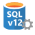

<properties 
	pageTitle="What's new in SQL Database V12 | Microsoft Azure" 
	description="Describes why business systems that are using Azure SQL Database in the cloud will benefit by upgrading to version V12 now." 
	services="sql-database" 
	documentationCenter="" 
	authors="MightyPen" 
	manager="jeffreyg" 
	editor=""/>

<tags 
	ms.service="sql-database" 
	ms.workload="data-management" 
	ms.tgt_pltfrm="na" 
	ms.devlang="na" 
	ms.topic="get-started-article" 
	ms.date="08/10/2015" 
	ms.author="genemi"/>

# What's new in SQL Database V12

This topic describes the many advantages that the new V12 version of Azure SQL Database has over version V11.

We continue to add features to V12. So we encourage you to visit our Service Updates webpage for Azure, and to use its filters:

- Filtered to the [SQL Database service](http://azure.microsoft.com/updates/?service=sql-database).
- Filtered to General Availability [(GA) announcements](http://azure.microsoft.com/updates/?service=sql-database&update-type=general-availability) for SQL Database features.

The latest information about resource limits for SQL Database is documented at: [Azure SQL Database Resource Limits](sql-database-resource-limits.md).

## Increased application compatibility with SQL Server

A key goal for SQL Database V12 was to improve the compatibility with Microsoft SQL Server 2014. Among other areas, V12 achieves parity with SQL Server in the important area of programmability. For instance:

- [Common Language Runtime (CLR) assemblies](http://msdn.microsoft.com/library/ms189524.aspx)
- [Window functions](https://msdn.microsoft.com/library/bb934097.aspx), with [OVER](http://msdn.microsoft.com/library/ms189461.aspx) 
- [XML indexes](https://msdn.microsoft.com/library/bb934097.aspx) and [selective XML indexes](http://msdn.microsoft.com/library/jj670104.aspx)
- [Change tracking](http://msdn.microsoft.com/library/bb933875.aspx)
- [SELECT...INTO](http://msdn.microsoft.com/library/ms188029.aspx)
- [Full-text search](http://msdn.microsoft.com/library/ms142571.aspx)

Please see [here](http://msdn.microsoft.com/library/azure/ee336281.aspx) for the small set of features not yet supported in SQL Database.

## More premium performance, new performance levels

In V12, we increased the database throughput units (DTUs) allocated to all Premium performance levels by 25% at no additional cost. Even greater performance gains can be achieved with new features like:

- Support for in-memory [columnstore indexes](http://msdn.microsoft.com/library/gg492153.aspx).
- [Table partitioning by rows](http://msdn.microsoft.com/library/ms187802.aspx) with related enhancements to [TRUNCATE TABLE](http://msdn.microsoft.com/library/ms177570.aspx).
- The availability of dynamic management views [(DMVs)](http://msdn.microsoft.com/library/ms188754.aspx) and Extended Events[(XEvents)](https://msdn.microsoft.com/library/bb630282.aspx) to help monitor and tune performance.

## Better support for cloud SaaS vendors

Only in V12, we released the new Standard performance level S3 and the public preview of [elastic database pools](sql-database-elastic-pool.md).
This is a solution specifically designed for cloud SaaS vendors.  With elastic database pools, you can:

- Share DTUs amongst databases to reduce costs for large numbers of databases.
- Execute [elastic database jobs](sql-database-elastic-jobs-overview.md) to manage databases at scale.

## Security enhancements

Security is a primary concern for anyone who runs their business in the cloud. The latest security features released in V12 include:

- [Row-level security](http://msdn.microsoft.com/library/dn765131.aspx) (RLS)
- [Dynamic Data Masking](sql-database-dynamic-data-masking-get-started.md)
- [Contained databases](http://msdn.microsoft.com/library/azure/ff394108.aspx)
- [Application roles](http://msdn.microsoft.com/library/ms190998.aspx) managed with GRANT, DENY, REVOKE
- [Transparent Data Encryption](http://msdn.microsoft.com/library/0bf7e8ff-1416-4923-9c4c-49341e208c62.aspx) (TDE)

## Increased business continuity when recovery is needed

V12 offers significantly improved recovery point objectives (RPOs) and estimated recovery times (ERTs):

| Business continuity feature | Earlier version | V12 |
| :-- | :-- | :-- |
| Geo-restore | • RPO < 24 hours. • ERT <  12 hours. | • RPO < 1 hour. • ERT < 12 hours. |
| Standard geo-replication | • RPO < 30 minutes. • ERT < 2 hours. | • RPO < 5 seconds. • ERT < 30 seconds. |
| Active geo-replication | • RPO < 5 minutes. • ERT < 1 hour. | • RPO < 5 seconds. • ERT < 30 seconds. |

See [SQL Database business continuity](https://msdn.microsoft.com/library/azure/hh852669.aspx) for more information.

## More reasons to upgrade now

There are many good reasons why customers should upgrade now to Azure SQL Database V12 from V11:

- SQL Database V12 has a long list of features beyond those of V11.
- We continue to add new features to V12, but no new features will be added to V11.
- Most new features are released on SQL Database V12 before they being released for Microsoft SQL Server.

## Are you using V12 already?

One easy way to see if you have a database or logical server running on an earlier version of the SQL Database service is to do the following:

1. Go to the [Azure preview portal](http://portal.azure.com/).
2. Click **Browse**.
3. Click **SQL Servers**.
4. The icon next to your server or database tells the story:
 -  **V12 logical server**
 -  **Earlier version logical server**

Another technique to ascertain the version is to run the `SELECT @@version;` statement in your database, and view the results similar to:

- **12**.0.2000.10 &nbsp; *(version V12)*
- **11**.0.9228.18 &nbsp; *(version V11)*

A V12 database can be hosted only on a V12 logical server. And a V12 server can host only V12 databases.

If you are not yet running on V12, you can upgrade your logical server by following the steps in [Upgrade to SQL Database V12 in place](sql-database-v12-upgrade.md).

##  General Availability regions

- By July 31, 2015, all regions had been promoted to General Availability (GA).
- V12 was released in December 2014, but only at the status of Preview.

[Supplemental Terms of Use for Microsoft Azure Previews](http://azure.microsoft.com/support/legal/preview-supplemental-terms/).
