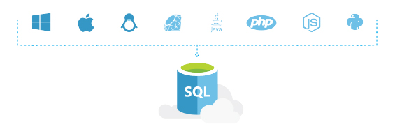

<properties
   pageTitle="Azure SQL Database Works in Your Environment"
   description="Learn how SQL Database helps, secures and protects"
   keywords=""
   services="sql-database"
   documentationCenter=""
   authors="CarlRabeler"
   manager="jhubbard"
   editor=""/>

<tags
   ms.service="sql-database"
   ms.devlang="NA"
   ms.topic="article"
   ms.tgt_pltfrm="NA"
   ms.workload="data-management"
   ms.date="07/19/2016"
   ms.author="carlrab"/>

# Azure SQL Database Works in your Environment

## Connect with what you already know

The last thing you want to do is learn something new just to connect with a database. Azure SQL Database makes it easy with a variety of languages and platforms you’re used to working with.

When choosing a database, you shouldn't have to move to a new platform, or learn a new language. SQL Database has code samples to help you get started, wherever you are.  

[Learn more about SQL Database Development](sql-database-develop-overview.md) 

## The right tools for the job

You don't have to learn a whole new set of tools to get started with SQL Database. You can leverage open source tools like [cheetah](https://github.com/wunderlist/cheetah), [sql-cli](https://www.npmjs.com/package/sql-cli), [VS Code](https://code.visualstudio.com/). Additionally, Azure SQL Database works with Microsoft tools like [Visual Studio](https://www.visualstudio.com/visual-studio-homepage-vs.aspx) and  [SQL Server Management Studio](https://msdn.microsoft.com/library/ms174173.aspx).  You can also use the Azure Management Portal, PowerShell, and REST APIs help you gain additional productivity.

## Get started quickly

The right anwers to your SQL Database questions are never too far away, with tutorials on creating your first SQL Database, troubleshooting queries, and quick-start code samples.

[Learn more about SQL Database](sql-database-technical-overview.md)

## Next steps

Get a [free Azure subscription](https://azure.microsoft.com/get-started/) and [create your first Azure SQL Database](sql-database-get-started.md).

## Additional resources

* Explore all the [capabilities of SQL Database](https://azure.microsoft.com/services/sql-database/).
* Review the [technical overview of SQL Database](sql-database-technical-overview.md).
* [SQL Database Development Overview](sql-database-develop-overview.md)
