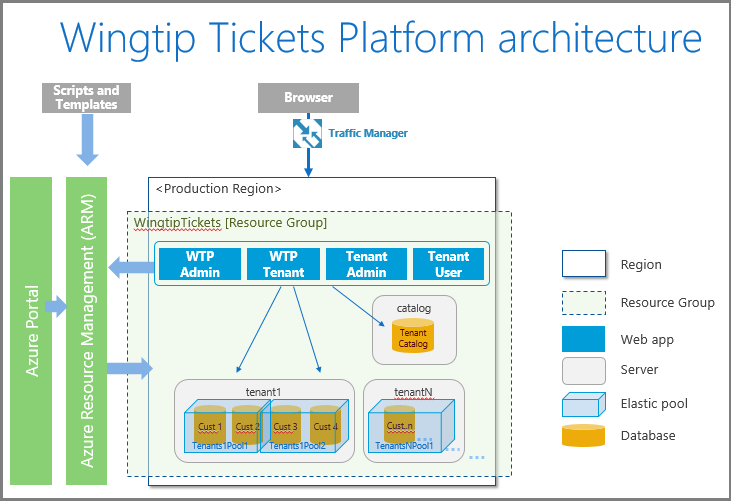

# Introduction to the Wingtip Tickets Platform (WTP) sample SaaS application

The Wingtip Tickets Platform (WTP) SaaS application is a sample multi-tenant app that demonstrates the unique advantages of SQL Database. The app uses a database-per-tenant, SaaS application pattern, to service multiple tenants. The WTP app is designed to showcase features of Azure SQL Database that enable SaaS scenarios, including SaaS design and management patterns. To quickly get up and running, [the WTP app deploys in less than five minutes](sql-database-saas-tutorial.md)!

After deploying the WTP app, explore the [collection of tutorials](#sql-database-saas-tutorials) that build upon the initial deployment. Each tutorial focuses on typical tasks that are implemented in SaaS applications. Tasks are implemented following SaaS patterns that take advantage of built-in features of SQL Database. Patterns described include, provisioning new tenants, restoring tenant databases, running distributed queries across all tenants, and rolling out schema changes across all tenant databases. Each tutorial includes reusable scripts, with detailed explanations that greatly simplify understanding, and implementing the same SaaS management patterns in your applications.

While the WTP application is somewhat complete and compelling as a sample application, it is important to focus on the core SaaS patterns as they relate to the data tier. In other words, focus on the data tier, and don't over analyze the app itself. Understanding the implementation of these core SaaS patterns is key to implementing these patterns in your applications, while considering any necessary modifications for your specific business requirements.

## Application architecture

The WTP app uses the database-per-tenant model, and uses SQL elastic pools to maximize efficiency.
Use of a tenant catalog for provisioning management and connectivity.
Integrated app, pool, and database monitoring, and alerting (OMS).
Cross-tenant schema and reference data management (elastic database jobs).
Cross-tenant query, operational analytics (elastic query).
Using geo-distributed data for expanded reach.
Business continuity
    Single-tenant recovery (PITR)
    DR at scale (geo-restore, geo-replication, auto-DR)
Tenant self-service management (via management APIs)
    PITR to recover from self-inflicted oops.

The core Wingtip application, uses a pool with three sample tenants, plus a catalog database.

## SQL Database WTP SaaS tutorials

The following tutorials build upon the initial deployment of the [Wingtip Tickets Platform SaaS application sample](sql-database-saas-tutorial.md):

| Area | Description | Script location |
|:--|:--|:--|
|[Provision and catalog tenants tutorial](sql-database-saas-tutorial-provision-and-catalog.md)| Provision new tenants and register them in the catalog | [Scripts on github](https://github.com/Microsoft/WingtipSaaS/tree/master/Learning%20Modules/Provision%20and%20Catalog) |
|[Monitor and manage performance tutorial](sql-database-saas-tutorial-performance-monitoring.md)| Monitor and manage database and pool performance | [Scripts on github](https://github.com/Microsoft/WingtipSaaS/tree/master/Learning%20Modules/Performance%20Monitoring%20and%20Management) |
|[Restore a single tenant tutorial](sql-database-saas-tutorial-restore-single-tenant.md)| Restore tenant databases | [Scripts on github](https://github.com/Microsoft/WingtipSaaS/tree/master/Learning%20Modules/Business%20Continuity%20and%20Disaster%20Recovery/RestoreTenant) |
|[Manage tenant schema tutorial](sql-database-saas-tutorial-schema-management.md)| Execute queries across all tenants  | [Scripts on github](https://github.com/Microsoft/WingtipSaaS/tree/master/Learning%20Modules/Schema%20Management) |
|[Run ad-hoc analytics tutorial](sql-database-saas-tutorial-adhoc-analytics.md) | Create an ad-hoc analytics database and run queries across all tenants  | [Scripts on github](https://github.com/Microsoft/WingtipSaaS/tree/master/Learning%20Modules/Operational%20Analytics/Adhoc%20Analytics) |
|[Manage with Log Analytics (OMS) tutorial](sql-database-saas-tutorial-log-analytics.md) | Configure and explore Log Analytics | [Scripts on github](https://github.com/Microsoft/WingtipSaaS/tree/master/Learning%20Modules/Performance%20Monitoring%20and%20Management/LogAnalytics) |
|[Run tenant analytics tutorial](sql-database-saas-tutorial-tenant-analytics.md) | Setup and run tenant analytics queries | [Scripts on github](https://github.com/Microsoft/WingtipSaaS/tree/master/Learning%20Modules/Operational%20Analytics/Tenant%20Analytics) |

## Get the Wingtip application scripts

The Wingtip Tickets scripts and application source code are available in the [WingtipSaaS](https://github.com/Microsoft/WingtipSaaS) github repo. Script files are located in the [Learning Modules folder](https://github.com/Microsoft/WingtipSaaS/tree/master/Learning%20Modules). Download the **Learning Modules** folder to your local computer, maintaining its folder structure.

## Working with the WTP PowerShell Scripts

The benefits of working with the WTP application comes from diving into the provided scripts and examining how the different SaaS patterns are implemented.

To view the provided scripts and modules, and to facilitate stepping through them for a better understanding, use the [Windows PowerShell ISE](https://msdn.microsoft.com/powershell/scripting/core-powershell/ise/introducing-the-windows-powershell-ise). Because most of the scripts prefixed with *Demo-* contain variables that you can modify before execution, using the PowerShell ISE simplifies working with these scripts.

For each WTP app deployment, there is a **UserConfig.psm1** file containing two parameters for setting the resource group and user name values that you defined during deployment. After deployment is complete, edit the **UserConfig.psm1** module setting the _ResourceGroupName_ and _Name_  parameters. These values are used by other scripts to successfully run, so setting them when the deployment completes is recommended!

### Execute Scripts by pressing F5

Several scripts use *$PSScriptRoot* to allow navigating folders, and this variable is only evaluated when the script is executed by pressing **F5**.  Highlighting and running a selection (**F8**) can result in errors, so press **F5** when running WTP scripts.

### Step through the scripts to examine the implementation

The real value in exploring the scripts comes from stepping through them to see what they do. Check out the first-level _Demo-_ scripts that provide an easy to read high-level workflow showing the steps required to accomplish each task. Drill deeper into the individual calls to see implementation details for the different SaaS patterns.

Tips for working with and [debugging PowerShell scripts](https://msdn.microsoft.com/powershell/scripting/core-powershell/ise/how-to-debug-scripts-in-windows-powershell-ise):

* Open and configure demo- scripts in the PowerShell ISE.
* Execute or continue with **F5**. Using **F8** is not advised because *$PSScriptRoot* is not evaluated when running selections of a script.
* Place breakpoints by clicking or selecting a line and pressing **F9**.
* Step over a function or script call using **F10**.
* Step into a function or script call using **F11**.
* Step out of the current function or script call using **Shift + F11**.

## Explore database schema and execute SQL queries using SSMS

Use [SQL Server Management Studio (SSMS)](https://docs.microsoft.com/sql/ssms/download-sql-server-management-studio-ssms) to connect and browse the WTP servers and databases.

The WTP sample app initially has two SQL Database servers to connect to - the *tenants1* server, and the *catalog* server:

1. Open *SSMS* and connect to the *tenants1-&lt;User&gt;.database.windows.net* server.
2. Click **Connect** > **Database Engine...**:

   

1. Demo credentials are: Login = *developer*, Password = *P@ssword1*

   

1. Repeat steps 2-3 and connect to the *catalog-&lt;User&gt;.database.windows.net* server.

After successfully connecting you should see both servers. You might see more or less databases depending on how many tenants you provisioned:

## Next steps

[Deploy the Wingtip Tickets SaaS application sample](sql-database-saas-tutorial.md)