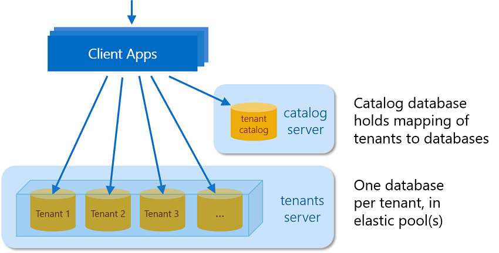
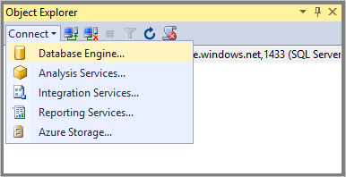
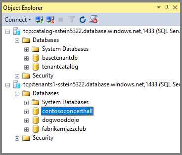

# Introduction to the Wingtip SaaS application

The *Wingtip SaaS* application is a sample multi-tenant app, that demonstrates the unique advantages of SQL Database. The app uses a database-per-tenant, SaaS application pattern, to service multiple tenants. The app is designed to showcase features of Azure SQL Database that enable SaaS scenarios, including several SaaS design and management patterns. To quickly get up and running, the Wingtip SaaS app deploys in less than five minutes!

Application source code and management scripts are available in the [WingtipSaaS](https://github.com/Microsoft/WingtipSaaS) github repo. To run the scripts, [download the Learning Modules folder](#download-and-unblock-the-wingtip-saas-scripts) to your local computer.

## SQL Database Wingtip SaaS tutorials

After deploying the app, explore the following tutorials that build upon the initial deployment. These tutorials explore common SaaS patterns that take advantage of built-in features of SQL Database, SQL Data Warehouse, and other Azure services. Tutorials include PowerShell scripts, with detailed explanations that greatly simplify understanding, and implementing the same SaaS management patterns in your applications.

| Tutorial | Description |
|:--|:--|
|[Deploy and explore the Wingtip SaaS application](sql-database-saas-tutorial.md)| **START HERE!** Deploy and explore the Wingtip SaaS application to your Azure subscription. |
|[Provision and catalog tenants](sql-database-saas-tutorial-provision-and-catalog.md)| Learn how the application connects to tenants using a catalog database, and how the catalog maps tenants to their data. |
|[Monitor and manage performance](sql-database-saas-tutorial-performance-monitoring.md)| Learn how to use monitoring features of SQL Database, and how to set alerts when performance thresholds are exceeded. |
|[Monitor with Log Analytics (OMS)](sql-database-saas-tutorial-log-analytics.md) | Learn about using [Log Analytics](../log-analytics/log-analytics-overview.md) to monitor large amounts of resources, across multiple pools. |
|[Restore a single tenant](sql-database-saas-tutorial-restore-single-tenant.md)| Learn how to restore a tenant database to a prior point in time. Steps to restore to a parallel database, leaving the existing tenant database online, are also included. |
|[Manage tenant schema](sql-database-saas-tutorial-schema-management.md)| Learn how to update schema, and update reference data, across all Wingtip SaaS tenants. |
|[Run ad-hoc analytics](sql-database-saas-tutorial-adhoc-analytics.md) | Create an ad-hoc analytics database and run real-time distributed queries across all tenants.  |
|[Run tenant analytics](sql-database-saas-tutorial-tenant-analytics.md) | Extract tenant data into an analytics database or data warehouse for running offline analytic queries. |

## Application architecture

The Wingtip SaaS app uses the database-per-tenant model, and uses SQL elastic pools to maximize efficiency. For provisioning and mapping tenants to their data, a catalog database is used. The core Wingtip SaaS application, uses a pool with three sample tenants, plus the catalog database. Completing many of the Wingtip SaaS tutorials result in add-ons to the intial deployment, by introducing analytic databases, cross-database schema management, etc.

While going through the tutorials and working with the app, it is important to focus on the SaaS patterns as they relate to the data tier. In other words, focus on the data tier, and don't over analyze the app itself. Understanding the implementation of these SaaS patterns is key to implementing these patterns in your applications, while considering any necessary modifications for your specific business requirements.

## Download and unblock the Wingtip SaaS scripts

Executable contents (scripts, dlls) may be blocked by Windows when zip files are downloaded from an external source and extracted. When extracting the scripts from a zip file, ***follow the steps below to unblock the .zip file before extracting***. This ensures the scripts are allowed to run.

1. Browse to [the Wingtip SaaS github repo](https://github.com/Microsoft/WingtipSaaS).
1. Click **Clone or download**.
1. Click **Download ZIP** and save the file.
1. Right-click the **WingtipSaaS-master.zip** file, and select **Properties**.
1. On the **General** tab, select **Unblock**.
1. Click **OK**.
1. Extract the files.

Scripts are located in the *..\\WingtipSaaS-master\\Learning Modules* folder.

## Working with the Wingtip SaaS PowerShell Scripts

To get the most out of the sample you need to dive into the provided scripts. Use breakpoints and step through the scripts, examining the details of how the different SaaS patterns are implemented. To easily step through the provided scripts and modules for the best understanding, we recommend using the [PowerShell ISE](https://msdn.microsoft.com/powershell/scripting/core-powershell/ise/introducing-the-windows-powershell-ise).

### Update the configuration file for your deployment

Edit the **UserConfig.psm1** file with the resource group and user value that you set during deployment:

1. Open the *PowerShell ISE* and load ...\\Learning Modules\\*UserConfig.psm1* 
1. Update *ResourceGroupName* and *Name* with the specific values for your deployment (on lines 10 and 11 only).
1. Save the changes!

Setting these values here simply keeps you from having to update these deployment-specific values in every script.

### Execute Scripts by pressing F5

Several scripts use *$PSScriptRoot* to navigate folders, and *$PSScriptRoot* is only evaluated when scripts are executed by pressing **F5**.  Highlighting and running a selection (**F8**) can result in errors, so press **F5** when running scripts.

### Step through the scripts to examine the implementation

The best way to understand the scripts is by stepping through them to see what they do. Check out the included **Demo-** scripts that present an easy to follow high-level workflow. The **Demo-** scripts show the steps required to accomplish each task, so set breakpoints and drill deeper into the individual calls to see implementation details for the different SaaS patterns.

Tips for exploring and stepping through PowerShell scripts:

* Open **Demo-** scripts in the PowerShell ISE.
* Execute or continue with **F5** (using **F8** is not advised because *$PSScriptRoot* is not evaluated when running selections of a script).
* Place breakpoints by clicking or selecting a line and pressing **F9**.
* Step over a function or script call using **F10**.
* Step into a function or script call using **F11**.
* Step out of the current function or script call using **Shift + F11**.

## Explore database schema and execute SQL queries using SSMS

Use [SQL Server Management Studio (SSMS)](https://docs.microsoft.com/sql/ssms/download-sql-server-management-studio-ssms) to connect and browse the application servers and databases.

The deployment initially has two SQL Database servers to connect to - the *tenants1-&lt;User&gt;* server, and the *catalog-&lt;User&gt;* server. To ensure a successful demo connection, both servers have a [firewall rule](sql-database-firewall-configure.md) allowing all IPs through.

1. Open *SSMS* and connect to the *tenants1-&lt;User&gt;.database.windows.net* server.
1. Click **Connect** > **Database Engine...**:

   

1. Demo credentials are: Login = *developer*, Password = *P@ssword1*

   

1. Repeat steps 2-3 and connect to the *catalog-&lt;User&gt;.database.windows.net* server.

After successfully connecting you should see both servers. Your list of databases might be different, depending on the tenants you've provisioned:

## Next steps

[Deploy the Wingtip SaaS application](sql-database-saas-tutorial.md)