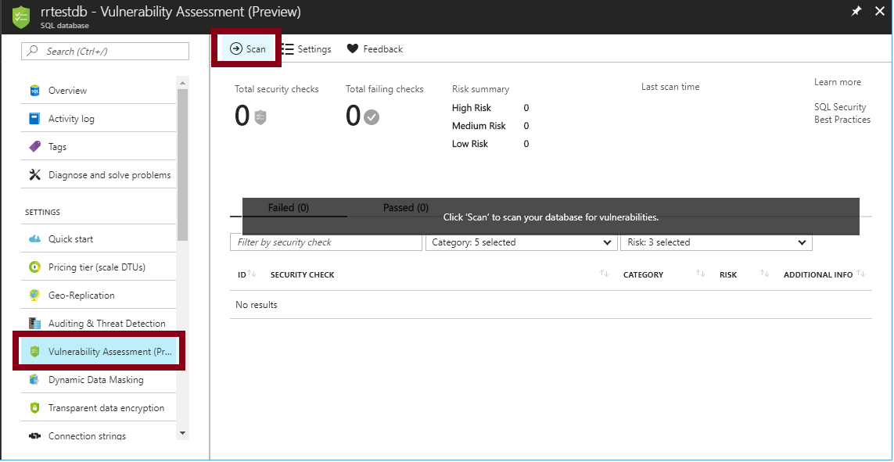
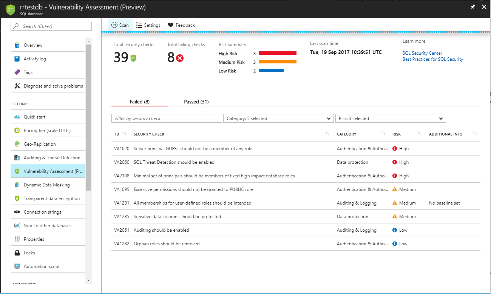
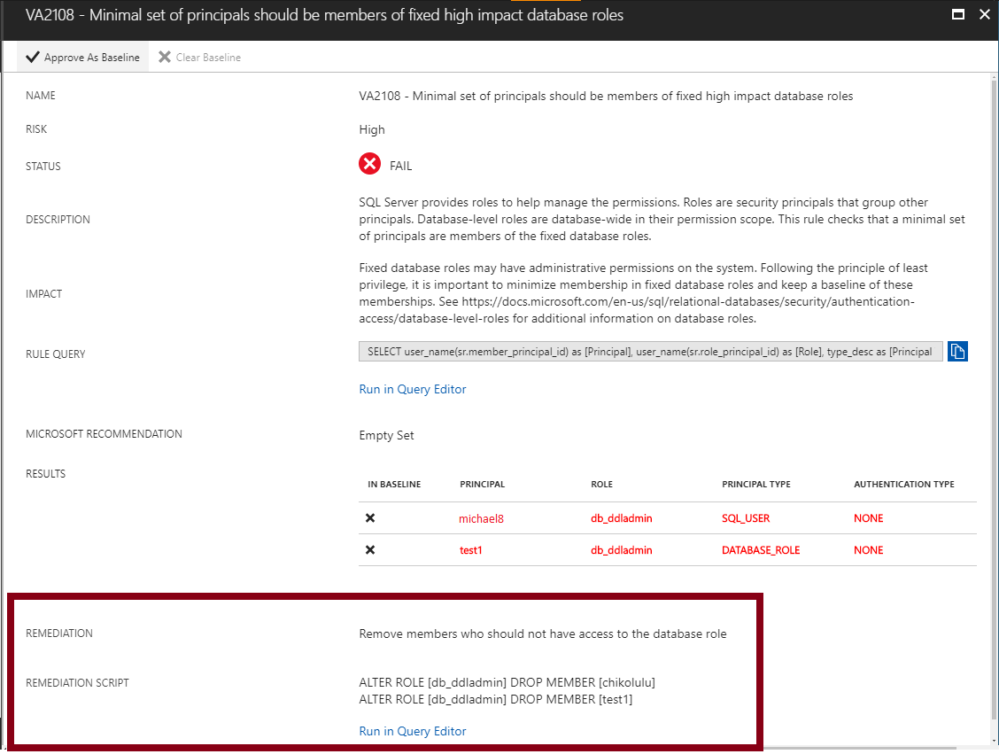
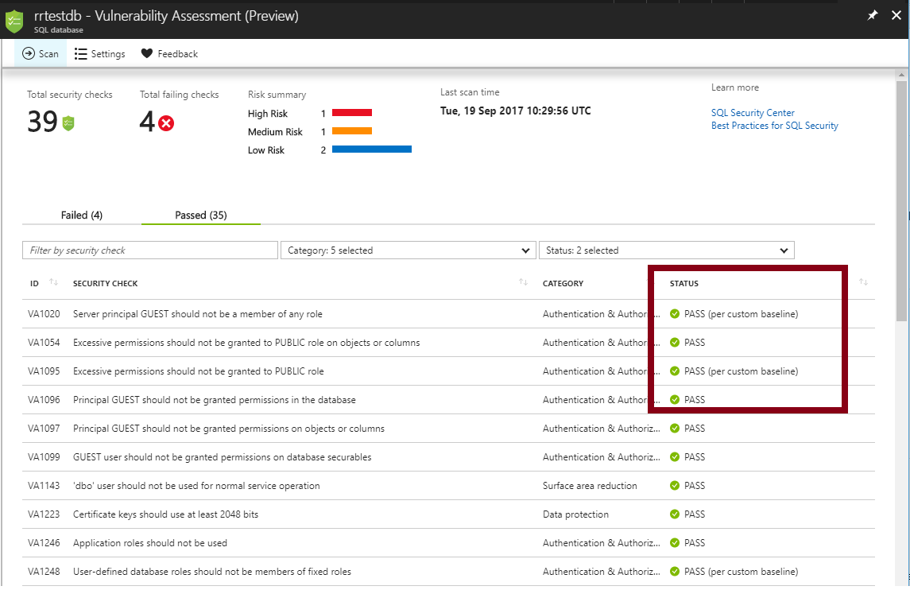

# SQL Vulnerability Assessment service helps you identify database vulnerabilities

SQL Vulnerability Assessment is an easy to configure service that can discover, track, and help you remediate potential database vulnerabilities. Use it to proactively improve your database security.

Vulnerability Assessment is part of the [advanced data security](sql-database-advanced-data-security.md) (ADS) offering, which is a unified package for advanced SQL security capabilities. Vulnerability Assessment can be accessed and managed via the central SQL ADS portal.

> [!NOTE]
> Vulnerability Assessment is supported for Azure SQL Database, Azure SQL Managed Instance and Azure SQL Data Warehouse. For simplicity, SQL Database is used in this article when referring to any of these managed database services.

## The Vulnerability Assessment service

SQL Vulnerability Assessment (VA) is a service that provides visibility into your security state, and includes actionable steps to resolve security issues, and enhance your database security. It can help you:  

- Meet compliance requirements that require database scan reports.  
- Meet data privacy standards.  
- Monitor a dynamic database environment where changes are difficult to track.  

Vulnerability Assessment is a scanning service built into the Azure SQL Database service. The service employs a knowledge base of rules that flag security vulnerabilities and highlight deviations from best practices, such as misconfigurations, excessive permissions, and unprotected sensitive data. The rules are based on Microsoft’s best practices and focus on the security issues that present the biggest risks to your database and its valuable data. They cover both database-level issues as well as server-level security issues, like server firewall settings and server-level permissions. These rules also represent many of the requirements from various regulatory bodies to meet their compliance standards.  

Results of the scan include actionable steps to resolve each issue and provide customized remediation scripts where applicable. An assessment report can be customized for your environment by setting an acceptable baseline for permission configurations, feature configurations, and database settings.

## Implementing Vulnerability Assessment

The following steps implement VA on SQL Database.  

### 1. Run a scan  

Get started with VA by navigating to **Advanced Data Security** under the Security heading in your Azure SQL Database pane. Click to enable advanced data security, and then click on **Select Storage** or on the **Vulnerability Assessment** card, which automatically opens the Vulnerability Assessment settings card for the entire SQL server.

Start by configuring a storage account where your scan results for all databases on the server will be stored. For information about storage accounts, see [About Azure storage accounts](../storage/common/storage-create-storage-account.md). Once storage is configured, click **Scan** to scan your database for vulnerabilities.
  
  

  > [!NOTE]
  > The scan is lightweight and safe. It takes a few seconds to run, and is entirely read-only. It does not make any changes to your database.  

### 2. View the report

When your scan is complete, your scan report is automatically displayed in the Azure portal. The report presents an overview of your security state: how many issues were found and their respective severities. Results include warnings on deviations from best practices and a snapshot of your security-related settings, such as database principals and roles and their associated permissions.The scan report also provides a map of sensitive data discovered in your database, and includes recommendations to classify that data using [data discovery & classification](sql-database-data-discovery-and-classification.md).

  

### 3. Analyze the results and resolve issues

Review your results and determine the findings in the report that are true security issues in your environment. Drill down to each failed result to understand the impact of the finding and why each security check failed. Use the actionable remediation information provided by the report to resolve the issue.  

### 4. Set your baseline

As you review your assessment results, you can mark specific results as being an acceptable *Baseline* in your environment. The baseline is essentially a customization of how the results are reported. Results that match the baseline are considered as passing in subsequent scans. Once you have established your baseline security state, VA only reports on deviations from the baseline and you can focus your attention on the relevant issues.  

  

### 5. Run a new scan to see your customized tracking report

After you complete setting up your **Rule Baselines**, run a new scan to view the customized report. VA now reports only the security issues that deviate from your approved baseline state.

  

Vulnerability Assessment can now be used to monitor that your database maintains a high level of security at all times, and that your organizational policies are met. If compliance reports are required, VA reports can be helpful to facilitate the compliance process.  

### 6. Set up periodic recurring scans

Navigate to the Vulnerability Assessment settings to turn on **Periodic recurring scans**. This configures Vulnerability Assessment to automatically run a scan on your database once per week. A scan result summary will be sent to the email address(es) you provide.

### 7. Export an assessment report

Click **Export Scan Results** to create a downloadable Excel report of your scan result. This report contains a summary tab that displays a summary of the assessment, including all failed checks. It also includes a **Results** tab containing the full set of results from the scan, including all checks that were run and the result details for each.

### 8. View scan history

Click **Scan History** in the VA pane to view a history of all scans previously run on this database. Select a particular scan in the list to view the detailed results of that scan.

Vulnerability Assessment can now be used to monitor that your database maintains a high level of security at all times, and that your organizational policies are met. If compliance reports are required, VA reports can be helpful to facilitate the compliance process.

## Manage Vulnerability Assessments using Azure PowerShell

[!INCLUDE [updated-for-az](../../includes/updated-for-az.md)]
> [!IMPORTANT]
> The PowerShell Azure Resource Manager module is still supported by Azure SQL Database, but all future development is for the Az.Sql module. For these cmdlets, see [AzureRM.Sql](https://docs.microsoft.com/powershell/module/AzureRM.Sql/). The arguments for the commands in the Az module and in the AzureRm modules are substantially identical.

You can use Azure PowerShell cmdlets to programmatically manage your vulnerability assessments. The supported cmdlets are:

- [Update-AzSqlDatabaseVulnerabilityAssessmentSetting](https://docs.microsoft.com/powershell/module/az.sql/Update-azSqlDatabaseVulnerabilityAssessmentSetting)

  Updates the vulnerability assessment settings of a database
- [Get-AzSqlDatabaseVulnerabilityAssessmentSetting](https://docs.microsoft.com/powershell/module/az.sql/Get-azSqlDatabaseVulnerabilityAssessmentSetting)

  Returns the vulnerability assessment settings of a database
- [Clear-AzSqlDatabaseVulnerabilityAssessmentSetting](https://docs.microsoft.com/powershell/module/az.sql/Clear-azSqlDatabaseVulnerabilityAssessmentSetting)

  Clears the vulnerability assessment settings of a database
- [Set-AzSqlDatabaseVulnerabilityAssessmentRuleBaseline](https://docs.microsoft.com/powershell/module/az.sql/Set-azSqlDatabaseVulnerabilityAssessmentRuleBaseline)

  Sets the vulnerability assessment rule baseline.
- [Get-AzSqlDatabaseVulnerabilityAssessmentRuleBaseline](https://docs.microsoft.com/powershell/module/az.sql/Get-azSqlDatabaseVulnerabilityAssessmentRuleBaseline)

  Gets the vulnerability assessment rule baseline for a given rule.
- [Clear-AzSqlDatabaseVulnerabilityAssessmentRuleBaseline](https://docs.microsoft.com/powershell/module/az.sql/Clear-azSqlDatabaseVulnerabilityAssessmentRuleBaseline)

  Clears the vulnerability assessment rule baseline. First set the baseline before using this cmdlet to clear it.
- [Start-AzSqlDatabaseVulnerabilityAssessmentScan](https://docs.microsoft.com/powershell/module/az.sql/Start-azSqlDatabaseVulnerabilityAssessmentScan)

  Triggers the start of a vulnerability assessment scan
- [Get-AzSqlDatabaseVulnerabilityAssessmentScanRecord](https://docs.microsoft.com/powershell/module/az.sql/Get-azSqlDatabaseVulnerabilityAssessmentScanRecord)

   Gets all vulnerability assessment scan record(s) associated with a given database.
- [Convert-AzSqlDatabaseVulnerabilityAssessmentScan](https://docs.microsoft.com/powershell/module/az.sql/Convert-azSqlDatabaseVulnerabilityAssessmentScan)

  Converts vulnerability assessment scan results to an Excel file

For a script example, see [Azure SQL Vulnerability Assessment PowerShell support](https://blogs.msdn.microsoft.com/sqlsecurity/20../../azure-sql-vulnerability-assessment-now-with-powershell-support/).

## Next steps  

- Learn more about [advanced data security](sql-database-advanced-data-security.md)
- Learn more about [data discovery & classification](sql-database-data-discovery-and-classification.md)
