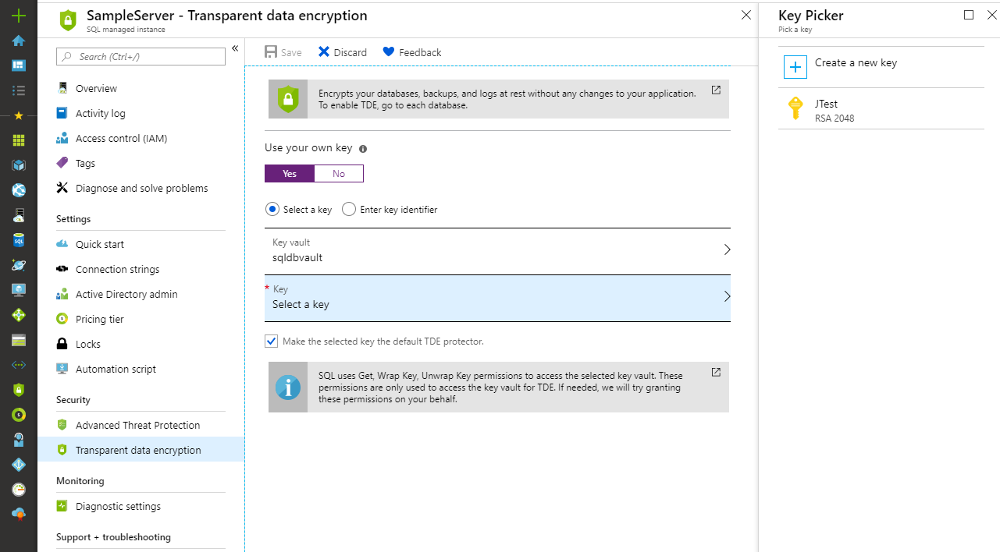

# Transparent data encryption for SQL Database and Data Warehouse

Transparent data encryption (TDE) helps protect Azure SQL Database, Azure SQL Managed Instance, and Azure Data Warehouse against the threat of malicious activity. It performs real-time encryption and decryption of the database, associated backups, and transaction log files at rest without requiring changes to the application. By default, TDE is enabled for all newly deployed Azure SQL databases. TDE cannot be used to encrypt the logical **master** database in SQL Database.  The **master** database contains objects that are needed to perform the TDE operations on the user databases.

TDE needs to be manually enabled for Azure SQL Managed Instance, older databases of Azure SQL Database, or Azure SQL Data Warehouse.  

Transparent data encryption encrypts the storage of an entire database by using a symmetric key called the database encryption key. This database encryption key is protected by the transparent data encryption protector. The protector is either a service-managed certificate (service-managed transparent data encryption) or an asymmetric key stored in Azure Key Vault (Bring Your Own Key). You set the transparent data encryption protector at the server level for Azure SQL Database and Data Warehouse, and instance level for Azure SQL Managed Instance. The term *server* refers both to server and instance throughout this document, unless stated differently.

On database startup, the encrypted database encryption key is decrypted and then used for decryption and re-encryption of the database files in the SQL Server Database Engine process. Transparent data encryption performs real-time I/O encryption and decryption of the data at the page level. Each page is decrypted when it's read into memory and then encrypted before being written to disk. For a general description of transparent data encryption, see [Transparent data encryption](https://docs.microsoft.com/sql/relational-databases/security/encryption/transparent-data-encryption).

SQL Server running on an Azure virtual machine also can use an asymmetric key from Key Vault. The configuration steps are different from using an asymmetric key in SQL Database and SQL Managed Instance. For more information, see [Extensible key management by using Azure Key Vault (SQL Server)](https://docs.microsoft.com/sql/relational-databases/security/encryption/extensible-key-management-using-azure-key-vault-sql-server).

## Service-managed transparent data encryption

In Azure, the default setting for transparent data encryption is that the database encryption key is protected by a built-in server certificate. The built-in server certificate is unique for each server. If a database is in a geo-replication relationship, both the primary and geo-secondary database are protected by the primary database's parent server key. If two databases are connected to the same server, they also share the same built-in certificate. Microsoft automatically rotates these certificates at least every 90 days.

Microsoft also seamlessly moves and manages the keys as needed for geo-replication and restores.

> [!IMPORTANT]
> All newly created SQL databases are encrypted by default by using service-managed transparent data encryption. Azure SQL Managed Instance databases, existing SQL databases created before May 2017 and SQL databases created through restore, geo-replication, and database copy are not encrypted by default.

## Bring Your Own Key

With Bring Your Own Key support, you can take control over your transparent data encryption keys and control who can access them and when. Key Vault, which is the Azure cloud-based external key management system, is the first key management service that transparent data encryption has integrated with for Bring Your Own Key support. With Bring Your Own Key support, the database encryption key is protected by an asymmetric key stored in Key Vault. The asymmetric key never leaves Key Vault. After the server has permissions to a Key Vault, the server sends basic key operation requests to it through Key Vault. You set the asymmetric key at the server level, and all *encrypted* databases under that server inherit it.

With Bring Your Own Key support, you control key management tasks such as key rotations and key vault permissions. You also can delete keys and enable auditing/reporting on all encryption keys. Key Vault provides central key management and uses tightly monitored hardware security modules. Key Vault promotes separation of management of keys and data to help meet regulatory compliance. To learn more about Key Vault, see the [Key Vault documentation page](https://docs.microsoft.com/azure/key-vault/key-vault-secure-your-key-vault).

To learn more about transparent data encryption with Bring Your Own Key support for Azure SQL Database, SQL Managed Instance, and Data Warehouse, see [Transparent data encryption with Bring Your Own Key support](transparent-data-encryption-byok-azure-sql.md).

To start using transparent data encryption with Bring Your Own Key support, see the how-to guide [Turn on transparent data encryption by using your own key from Key Vault by using PowerShell](transparent-data-encryption-byok-azure-sql-configure.md).

## Move a transparent data encryption-protected database

You don't need to decrypt databases for operations within Azure. The transparent data encryption settings on the source database or primary database are transparently inherited on the target. Operations that are included involve:

- Geo-restore
- Self-service point-in-time restore
- Restoration of a deleted database
- Active geo-replication
- Creation of a database copy
- Restore of backup file to Azure SQL Managed Instance

When you export a transparent data encryption-protected database, the exported content of the database isn't encrypted. This exported content is stored in un-encrypted BACPAC files. Be sure to protect the BACPAC files appropriately and enable transparent data encryption after import of the new database is finished.

For example, if the BACPAC file is exported from an on-premises SQL Server instance, the imported content of the new database isn't automatically encrypted. Likewise, if the BACPAC file is exported to an on-premises SQL Server instance, the new database also isn't automatically encrypted.

The one exception is when you export to and from a SQL database. Transparent data encryption is enabled in the new database, but the BACPAC file itself still isn't encrypted.

## Manage transparent data encryption in the Azure portal

To configure transparent data encryption through the Azure portal, you must be connected as the Azure Owner, Contributor, or SQL Security Manager.

You turn transparent data encryption on and off on the database level. To enable transparent data encryption on a database, go to the [Azure portal](https://portal.azure.com) and sign in with your Azure Administrator or Contributor account. Find the transparent data encryption settings under your user database. By default, service-managed transparent data encryption is used. A transparent data encryption certificate is automatically generated for the server that contains the database. For Azure SQL Managed Instance use T-SQL to turn transparent data encryption on and off on a database.

  

You set the transparent data encryption master key, also known as the transparent data encryption protector, on the server level. To use transparent data encryption with Bring Your Own Key support and protect your databases with a key from Key Vault, open the transparent data encryption settings under your server.

## Manage transparent data encryption by using PowerShell

To configure transparent data encryption through PowerShell, you must be connected as the Azure Owner, Contributor, or SQL Security Manager.

### Cmdlets for Azure SQL Database and Data Warehouse

Use the following cmdlets for Azure SQL Database and Data Warehouse:

| Cmdlet | Description |
| --- | --- |
| [Set-AzureRmSqlDatabaseTransparentDataEncryption](https://docs.microsoft.com/powershell/module/azurerm.sql/set-azurermsqldatabasetransparentdataencryption) |Enables or disables transparent data encryption for a database|
| [Get-AzureRmSqlDatabaseTransparentDataEncryption](https://docs.microsoft.com/powershell/module/azurerm.sql/get-azurermsqldatabasetransparentdataencryption) |Gets the transparent data encryption state for a database |
| [Get-AzureRmSqlDatabaseTransparentDataEncryptionActivity](https://docs.microsoft.com/powershell/module/azurerm.sql/get-azurermsqldatabasetransparentdataencryptionactivity) |Checks the encryption progress for a database |
| [Add-AzureRmSqlServerKeyVaultKey](https://docs.microsoft.com/powershell/module/azurerm.sql/add-azurermsqlserverkeyvaultkey) |Adds a Key Vault key to a SQL Server instance |
| [Get-AzureRmSqlServerKeyVaultKey](https://docs.microsoft.com/powershell/module/azurerm.sql/get-azurermsqlserverkeyvaultkey) |Gets the Key Vault keys for an Azure SQL database server  |
| [Set-AzureRmSqlServerTransparentDataEncryptionProtector](https://docs.microsoft.com/powershell/module/azurerm.sql/set-azurermsqlservertransparentdataencryptionprotector) |Sets the transparent data encryption protector for a SQL Server instance |
| [Get-AzureRmSqlServerTransparentDataEncryptionProtector](https://docs.microsoft.com/powershell/module/azurerm.sql/get-azurermsqlservertransparentdataencryptionprotector) |Gets the transparent data encryption protector |
| [Remove-AzureRmSqlServerKeyVaultKey](https://docs.microsoft.com/powershell/module/azurerm.sql/remove-azurermsqlserverkeyvaultkey) |Removes a Key Vault key from a SQL Server instance |
|  | |

> [!IMPORTANT]
> For Azure SQL Managed Instance, use the T-SQL [ALTER DATABASE](https://docs.microsoft.com/sql/t-sql/statements/alter-database-azure-sql-database) command to turn transparent data encryption on and off on a database level, and check [sample PowerShell script](sql-database/transparent-data-encryption-byok-azure-sql-configure.md) to manage transparent data encryption on an instance level.

## Manage transparent data encryption by using Transact-SQL

Connect to the database by using a login that is an administrator or member of the **dbmanager** role in the master database.

| Command | Description |
| --- | --- |
| [ALTER DATABASE (Azure SQL Database)](https://docs.microsoft.com/sql/t-sql/statements/alter-database-azure-sql-database) | SET ENCRYPTION ON/OFF encrypts or decrypts a database |
| [sys.dm_database_encryption_keys](https://docs.microsoft.com/sql/relational-databases/system-dynamic-management-views/sys-dm-database-encryption-keys-transact-sql) |Returns information about the encryption state of a database and its associated database encryption keys |
| [sys.dm_pdw_nodes_database_encryption_keys](https://docs.microsoft.com/sql/relational-databases/system-dynamic-management-views/sys-dm-pdw-nodes-database-encryption-keys-transact-sql) |Returns information about the encryption state of each data warehouse node and its associated database encryption keys |
|  | |

You can't switch the transparent data encryption protector to a key from Key Vault by using Transact-SQL. Use PowerShell or the Azure portal.

## Manage transparent data encryption by using the REST API

To configure transparent data encryption through the REST API, you must be connected as the Azure Owner, Contributor, or SQL Security Manager.
Use the following set of commands for Azure SQL Database and Data Warehouse:

| Command | Description |
| --- | --- |
|[Create Or Update Server](https://docs.microsoft.com/rest/api/sql/servers/createorupdate)|Adds an Azure Active Directory identity to a SQL Server instance (used to grant access to Key Vault)|
|[Create Or Update Server Key](https://docs.microsoft.com/rest/api/sql/serverkeys/createorupdate)|Adds a Key Vault key to a SQL Server instance|
|[Delete Server Key](https://docs.microsoft.com/rest/api/sql/serverkeys/delete)|Removes a Key Vault key from a SQL Server instance|
|[Get Server Keys](https://docs.microsoft.com/rest/api/sql/serverkeys/get)|Gets a specific Key Vault key from a SQL Server instance|
|[List Server Keys By Server](https://docs.microsoft.com/rest/api/sql/serverkeys/listbyserver)|Gets the Key Vault keys for a SQL Server instance |
|[Create Or Update Encryption Protector](https://docs.microsoft.com/rest/api/sql/encryptionprotectors/createorupdate)|Sets the transparent data encryption protector for a SQL Server instance|
|[Get Encryption Protector](https://docs.microsoft.com/rest/api/sql/encryptionprotectors/get)|Gets the transparent data encryption protector for a SQL Server instance|
|[List Encryption Protectors By Server](https://docs.microsoft.com/rest/api/sql/encryptionprotectors/listbyserver)|Gets the transparent data encryption protectors for a SQL Server instance |
|[Create Or Update Transparent Data Encryption Configuration](https://docs.microsoft.com/rest/api/sql/transparentdataencryptions/createorupdate)|Enables or disables transparent data encryption for a database|
|[Get Transparent Data Encryption Configuration](https://docs.microsoft.com/rest/api/sql/transparentdataencryptions/get)|Gets the transparent data encryption configuration for a database|
|[List Transparent Data Encryption Configuration Results](https://docs.microsoft.com/rest/api/sql/transparentdataencryptionactivities/listbyconfiguration)|Gets the encryption result for a database|

## Next steps

- For a general description of transparent data encryption, see [Transparent data encryption](https://docs.microsoft.com/sql/relational-databases/security/encryption/transparent-data-encryption).
- To learn more about transparent data encryption with Bring Your Own Key support for Azure SQL Database, Azure SQL Managed Instance and Data Warehouse, see [Transparent data encryption with Bring Your Own Key support](transparent-data-encryption-byok-azure-sql.md).
- To start using transparent data encryption with Bring Your Own Key support, see the how-to guide [Turn on transparent data encryption by using your own key from Key Vault by using PowerShell](transparent-data-encryption-byok-azure-sql-configure.md).
- For more information about Key Vault, see the [Key Vault documentation page](https://docs.microsoft.com/azure/key-vault/key-vault-secure-your-key-vault).
