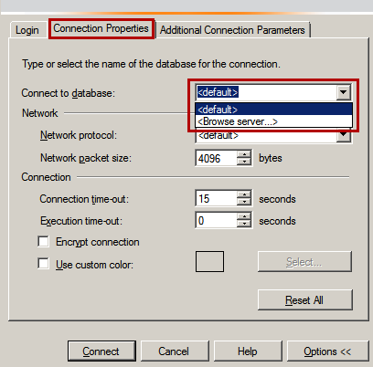

# Troubleshooting connectivity issues and other errors with Microsoft Azure SQL Database

You receive error messages when the connection to Azure SQL Database fails. These connection problems can be caused by Azure SQL Database reconfiguration, firewall settings, a connection timeout, incorrect login information or failure to apply best practices and design guidelines during the [application design] (sql-database-develop-overview.md) process. Additionally, if the maximum limit on some Azure SQL Database resources is reached, you can't connect to Azure SQL Database.

## Transient fault error messages (40197, 40613 and others)

The Azure infrastructure has the ability to dynamically reconfigure servers when heavy workloads arise in the SQL Database service.  This dynamic behavior might cause your client program to lose its connection to SQL Database. This kind of error condition is called a *transient fault*. Database reconfiguration events occur because of a planned event (for example, a software upgrade) or an unplanned event (for example, a process crash, or load balancing). Most reconfiguration events are generally short-lived and should be completed in less than 60 seconds at most. However, these events can occasionally take longer to finish, such as when a large transaction causes a long-running recovery. The following table lists various transient errors that applications can receive when connecting to SQL Database

### List of transient fault error codes


| Error code | Severity | Description |
| ---:| ---:|:--- |
| 4060 |16 |Cannot open database "%.&#x2a;ls" requested by the login. The login failed. For more information, see [Errors 4000 to 4999](https://docs.microsoft.com/sql/relational-databases/errors-events/database-engine-events-and-errors#errors-4000-to-4999)|
| 40197 |17 |The service has encountered an error processing your request. Please try again. Error code %d.<br/><br/>You receive this error when the service is down due to software or hardware upgrades, hardware failures, or any other failover problems. The error code (%d) embedded within the message of error 40197] provides additional information about the kind of failure or failover that occurred. Some examples of the error codes are embedded within the message of error 40197 are 40020, 40143, 40166, and 40540.<br/><br/>Reconnecting to your SQL Database server automatically connects you to a healthy copy of your database. Your application must catch error 40197, log the embedded error code (%d) within the message for troubleshooting, and try reconnecting to SQL Database until the resources are available, and your connection is established again. For more information, see [Transient errors](sql-database-connectivity-issues.md#transient-errors-transient-faults).|
| 40501 |20 |The service is currently busy. Retry the request after 10 seconds. Incident ID: %ls. Code: %d. For more information, see: <br/>&bull; &nbsp;[Database server resource limits](sql-database-resource-limits-database-server.md)<br/>&bull; &nbsp;[DTU-based limits for single databases](sql-database-service-tiers-dtu.md)<br/>&bull; &nbsp;[DTU-based limits for elastic pools](sql-database-dtu-resource-limits-elastic-pools.md)<br/>&bull; &nbsp;[vCore-based limits for single databases](sql-database-vcore-resource-limits-single-databases.md)<br/>&bull; &nbsp;[vCore-based limits for elastic pools](sql-database-vcore-resource-limits-elastic-pools.md)<br/>&bull; &nbsp;[Managed instance resource limits](sql-database-managed-instance-resource-limits.md).|
| 40613 |17 |Database '%.&#x2a;ls' on server '%.&#x2a;ls' is not currently available. Please retry the connection later. If the problem persists, contact customer support, and provide them the session tracing ID of '%.&#x2a;ls'.<br/><br/> This error may occur if there is already an existing dedicated administrator connection (DAC) established to the database. For more information, see [Transient errors](sql-database-connectivity-issues.md#transient-errors-transient-faults).|
| 49918 |16 |Cannot process request. Not enough resources to process request.<br/><br/>The service is currently busy. Please retry the request later. For more information, see: <br/>&bull; &nbsp;[Database server resource limits](sql-database-resource-limits-database-server.md)<br/>&bull; &nbsp;[DTU-based limits for single databases](sql-database-service-tiers-dtu.md)<br/>&bull; &nbsp;[DTU-based limits for elastic pools](sql-database-dtu-resource-limits-elastic-pools.md)<br/>&bull; &nbsp;[vCore-based limits for single databases](sql-database-vcore-resource-limits-single-databases.md)<br/>&bull; &nbsp;[vCore-based limits for elastic pools](sql-database-vcore-resource-limits-elastic-pools.md)<br/>&bull; &nbsp;[Managed instance resource limits](sql-database-managed-instance-resource-limits.md). |
| 49919 |16 |Cannot process create or update request. Too many create or update operations in progress for subscription "%ld".<br/><br/>The service is busy processing multiple create or update requests for your subscription or server. Requests are currently blocked for resource optimization. Query [sys.dm_operation_status](https://msdn.microsoft.com/library/dn270022.aspx) for pending operations. Wait until pending create or update requests are complete or delete one of your pending requests and retry your request later. For more information, see: <br/>&bull; &nbsp;[Database server resource limits](sql-database-resource-limits-database-server.md)<br/>&bull; &nbsp;[DTU-based limits for single databases](sql-database-service-tiers-dtu.md)<br/>&bull; &nbsp;[DTU-based limits for elastic pools](sql-database-dtu-resource-limits-elastic-pools.md)<br/>&bull; &nbsp;[vCore-based limits for single databases](sql-database-vcore-resource-limits-single-databases.md)<br/>&bull; &nbsp;[vCore-based limits for elastic pools](sql-database-vcore-resource-limits-elastic-pools.md)<br/>&bull; &nbsp;[Managed instance resource limits](sql-database-managed-instance-resource-limits.md). |
| 49920 |16 |Cannot process request. Too many operations in progress for subscription "%ld".<br/><br/>The service is busy processing multiple requests for this subscription. Requests are currently blocked for resource optimization. Query [sys.dm_operation_status](https://msdn.microsoft.com/library/dn270022.aspx) for operation status. Wait until pending requests are complete or delete one of your pending requests and retry your request later. For more information, see: <br/>&bull; &nbsp;[Database server resource limits](sql-database-resource-limits-database-server.md)<br/>&bull; &nbsp;[DTU-based limits for single databases](sql-database-service-tiers-dtu.md)<br/>&bull; &nbsp;[DTU-based limits for elastic pools](sql-database-dtu-resource-limits-elastic-pools.md)<br/>&bull; &nbsp;[vCore-based limits for single databases](sql-database-vcore-resource-limits-single-databases.md)<br/>&bull; &nbsp;[vCore-based limits for elastic pools](sql-database-vcore-resource-limits-elastic-pools.md)<br/>&bull; &nbsp;[Managed instance resource limits](sql-database-managed-instance-resource-limits.md). |
| 4221 |16 |Login to read-secondary failed due to long wait on 'HADR_DATABASE_WAIT_FOR_TRANSITION_TO_VERSIONING'. The replica is not available for login because row versions are missing for transactions that were in-flight when the replica was recycled. The issue can be resolved by rolling back or committing the active transactions on the primary replica. Occurrences of this condition can be minimized by avoiding long write transactions on the primary. |


### Steps to resolve transient connectivity issues

1. Check the [Microsoft Azure Service Dashboard](https://azure.microsoft.com/status) for any known outages that occurred during the time during which the errors were reported by the application.
2. Applications that connect to a cloud service such as Azure SQL Database should expect periodic reconfiguration events and implement retry logic to handle these errors instead of surfacing these as application errors to users. 
3. As a database approaches its resource limits, it can seem to be a transient connectivity issue. See [Resource limits](sql-database-resource-limits-database-server.md#what-happens-when-database-resource-limits-are-reached).
4. If connectivity problems continue, or if the duration for which your application encounters the error exceeds 60 seconds or if you see multiple occurrences of the error in a given day, file an Azure support request by selecting **Get Support** on the [Azure Support](https://azure.microsoft.com/support/options) site.

#### Implementing Retry Logic
It is strongly recommended that your client program has retry logic so that it could reestablish a connection after giving the transient fault time to correct itself.  We recommend that you delay for 5 seconds before your first retry. Retrying after a delay shorter than 5 seconds risks overwhelming the cloud service. For each subsequent retry the delay should grow exponentially, up to a maximum of 60 seconds.

For code examples of retry logic, see:
- [Connect resiliently to SQL with ADO.NET](https://docs.microsoft.com/sql/connect/ado-net/step-4-connect-resiliently-sql-ado-net)
- [Connect resiliently to SQL with PHP](https://docs.microsoft.com/sql/connect/php/step-4-connect-resiliently-to-sql-with-php)

For additional information on handling transient errors in your application review
* [Troubleshooting transient connection errors to SQL Database](sql-database-connectivity-issues.md)

A discussion of the *blocking period* for clients that use ADO.NET is available in [SQL Server Connection Pooling (ADO.NET)](https://msdn.microsoft.com/library/8xx3tyca.aspx).

## A network-related or instance-specific error occurred while establishing a connection to SQL Database server

The issue occurs if the application can't connect to the server.

To resolve this issue, try the steps (in the order presented) in the [Steps to fix common connection issues](#steps-to-fix-common-connection-issues) section.

## The server/instance was not found or was not accessible (errors 26, 40, 10053)

#### Error 26: Error Locating server specified

``System.Data.SqlClient.SqlException: A network-related or instance-specific error occurred while establishing a connection to SQL Server. The server was not found or was not accessible. Verify that the instance name is correct and that SQL Server is configured to allow remote connections.(provider: SQL Network Interfaces, error: 26 – Error Locating Server/Instance Specified)``

#### Error 40: Could not open a connection to the server

``A network-related or instance-specific error occurred while establishing a connection to SQL Server. The server was not found or was not accessible. Verify that the instance name is correct and that SQL Server is configured to allow remote connections. (provider: Named Pipes Provider, error: 40 - Could not open a connection to SQL Server)``

#### Error 10053: A transport-level error has occurred when receiving results from the server

``10053: A transport-level error has occurred when receiving results from the server. (Provider: TCP Provider, error: 0 - An established connection was aborted by the software in your host machine)``

These issues occur if the application can't connect to the server.

To resolve these issues, try the steps (in the order presented) in the [Steps to fix common connection issues](#steps-to-fix-common-connection-issues) section.

## Cannot connect to server due to firewall issues

### Error 40615: Cannot connect to < servername >

To resolve this issue, [configure firewall settings on SQL Database through the Azure portal.](https://docs.microsoft.com/azure/sql-database/sql-database-firewall-configure)

### Error 5: Cannot connect to < servername >

To resolve this issue, make sure that port 1433 is open for outbound connections on all firewalls between the client and the internet.

For more information, see [Configure the Windows Firewall to allow SQL Server access](https://docs.microsoft.com/azure/sql-database/sql-database-firewall-configure).

## Unable to log in to the server (errors 18456, 40531)

### Login failed for user '< User name >'

``Login failed for user '<User name>'.This session has been assigned a tracing ID of '<Tracing ID>'. Provide this tracing ID to customer support when you need assistance. (Microsoft SQL Server, Error: 18456)``

To resolve this issue, contact your service administrator to provide you with a valid SQL Server user name and password.

Typically, the service administrator can use the following steps to add the login credentials:

1. Log in to the server by using SQL Server Management Studio (SSMS).
2. Run the following SQL query to check whether the login name is disabled:

   ```sql
   SELECT name, is_disabled FROM sys.sql_logins
   ```

3. If the corresponding name is disabled, enable it by using the following statement:

   ```sql
   Alter login <User name> enable
   ```

4. If the SQL login user name doesn't exist, create it by following these steps:

   1. In SSMS, double-click **Security** to expand it.
   2. Right-click **Logins**, and then select **New login**.
   3. In the generated script with placeholders, edit and run the following SQL query:

   ```sql
   CREATE LOGIN <SQL_login_name, sysname, login_name>
   WITH PASSWORD = ‘<password, sysname, Change_Password>’
   GO
   ```

5. Double-click **Database**.
6. Select the database that you want to grant the user permission to.
7. Double-click **Security**.
8. Right-click **Users**, and then select **New User**.
9. In the generated script with placeholders, edit and run the following SQL query:

   ```sql
   CREATE USER <user_name, sysname, user_name>
   FOR LOGIN <login_name, sysname, login_name>
   WITH DEFAULT_SCHEMA = <default_schema, sysname, dbo>
   GO
   -- Add user to the database owner role

   EXEC sp_addrolemember N’db_owner’, N’<user_name, sysname, user_name>’
   GO
   ```

   > [!NOTE]
   > You can also use `sp_addrolemember` to map specific users to specific database roles.

For more information, see [Managing databases and logins in Azure SQL Database](https://docs.microsoft.com/azure/sql-database/sql-database-manage-logins).

## Connection timeout expired errors

### System.Data.SqlClient.SqlException (0x80131904): Connection Timeout Expired

``System.Data.SqlClient.SqlException (0x80131904): Connection Timeout Expired. The timeout period elapsed while attempting to consume the pre-login handshake acknowledgement. This could be because the pre-login handshake failed or the server was unable to respond back in time. The duration spent while attempting to connect to this server was - [Pre-Login] initialization=3; handshake=29995;``

### System.Data.SqlClient.SqlException (0x80131904): Timeout expired

``System.Data.SqlClient.SqlException (0x80131904): Timeout expired. The timeout period elapsed prior to completion of the operation or the server is not responding.``

### System.Data.Entity.Core.EntityException: The underlying provider failed on Open

``System.Data.Entity.Core.EntityException: The underlying provider failed on Open. -> System.Data.SqlClient.SqlException: Timeout expired. The timeout period elapsed prior to completion of the operation or the server is not responding. -> System.ComponentModel.Win32Exception: The wait operation timed out``

### Cannot connect to < server name >

``Cannot connect to <server name>.ADDITIONAL INFORMATION:Connection Timeout Expired. The timeout period elapsed during the post-login phase. The connection could have timed out while waiting for server to complete the login process and respond; Or it could have timed out while attempting to create multiple active connections. The duration spent while attempting to connect to this server was - [Pre-Login] initialization=231; handshake=983; [Login] initialization=0; authentication=0; [Post-Login] complete=13000; (Microsoft SQL Server, Error: -2) For help, click: http://go.microsoft.com/fwlink?ProdName=Microsoft%20SQL%20Server&EvtSrc=MSSQLServer&EvtID=-2&LinkId=20476 The wait operation timed out``

These exceptions can occur either because of connection or query issues. To confirm that this error is caused by connectivity issues, see [Confirm whether an error is caused by a connectivity issue](#confirm-whether-an-error-is-caused-by-a-connectivity-issue).

Connection timeouts occur because the application can't connect to the server. To resolve this issue, try the steps (in the order presented) in the [Steps to fix common connection issues](#steps-to-fix-common-connection-issues) section.

## Resource governance errors

### Error 10928: Resource ID: %d

``10928: Resource ID: %d. The %s limit for the database is %d and has been reached. See http://go.microsoft.com/fwlink/?LinkId=267637 for assistance. The Resource ID value in error message indicates the resource for which limit has been reached. For sessions, Resource ID = 2.``

To work around this issue, try one of the following methods:

* Verify whether there are long-running queries.

  > [!NOTE]
  > This is a minimalist approach that might not resolve the issue.

1. Run the following SQL query to check the [sys.dm_exec_requests](https://docs.microsoft.com/sql/relational-databases/system-dynamic-management-views/sys-dm-exec-requests-transact-sql) view to see any blocking requests:

   ```sql
   SELECT * FROM dm_exec_requests
   ```

2. Determine the **input buffer** for the head blocker.
3. Tune the head blocker query.

   For an in-depth troubleshooting procedure, see [Is my query running fine in the cloud?](https://blogs.msdn.com/b/sqlblog/archive/2013/11/01/is-my-query-running-fine-in-the-cloud.aspx).

If the database consistently reaches its limit despite addressing blocking and long-running queries, consider upgrading to an edition with more resources [Editions](https://azure.microsoft.com/pricing/details/sql-database/)).

For more information about dynamic management views, see [System dynamic management views](https://docs.microsoft.com/sql/relational-databases/system-dynamic-management-views/system-dynamic-management-views).

For more information about database limits, see  [SQL Database resource limits for Azure SQL Database server](https://docs.microsoft.com/azure/sql-database/sql-database-resource-limits-database-server).

### Error 10929: Resource ID: 1

``10929: Resource ID: 1. The %s minimum guarantee is %d, maximum limit is %d and the current usage for the database is %d. However, the server is currently too busy to support requests greater than %d for this database. See http://go.microsoft.com/fwlink/?LinkId=267637 for assistance. Otherwise, please try again later.``

### Error 40501: The service is currently busy

``40501: The service is currently busy. Retry the request after 10 seconds. Incident ID: %ls. Code: %d.``

This is an engine throttling error, an indication that resource limits are being exceeded.

For more information about resource limits, see [Database server resource limits](https://docs.microsoft.com/azure/sql-database/sql-database-resource-limits-database-server).

### Error 40544: The database has reached its size quota

``40544: The database has reached its size quota. Partition or delete data, drop indexes, or consult the documentation for possible resolutions. Incident ID: <ID>. Code: <code>.``

This error occurs when the database has reached its size quota.

The following steps can either help you work around the problem or provide you with additional options:

1. Check the current size of the database by using the dashboard in the Azure portal.

   > [!NOTE]
   > To identify which tables are consuming the most space and are therefore potential candidates for cleanup, run the following SQL query:

   ```sql
   SELECT o.name,
    a.SUM(p.row_count) AS 'Row Count',
    b.SUM(p.reserved_page_count) * 8.0 / 1024 AS 'Table Size (MB)'
   FROM sys.objects o
   JOIN sys.dm_db_partition_stats p on p.object_id = o.object_id
   GROUP BY o.name
   ORDER BY [Table Size (MB)] DESC
   ```

2. If the current size does not exceed the maximum size supported for your edition, you can use ALTER DATABASE to increase the MAXSIZE setting.
3. If the database is already past the maximum supported size for your edition, try one or more of the following steps:

   * Perform normal database cleanup activities. For example, clean up the unwanted data by using truncate/delete, or move data out by using SQL Server Integration Services (SSIS) or the bulk copy program (bcp) utility.
   * Partition or delete data, drop indexes, or consult the documentation for possible resolutions.
   * For database scaling, see [Scale single database resources](https://docs.microsoft.com/azure/sql-database/sql-database-single-database-scale) and [Scale elastic pool resources](https://docs.microsoft.com/azure/sql-database/sql-database-elastic-pool-scale).

### Error 40549: Session is terminated because you have a long-running transaction

``40549: Session is terminated because you have a long-running transaction. Try shortening your transaction.``

If you repeatedly encounter this error, try to resolve the issue by following these steps:

1. Check the sys.dm_exec_requests view to see any open sessions that have a high value for the total_elapsed_time column. Perform this check by running the following SQL script:

   ```sql
   SELECT * FROM dm_exec_requests
   ```

2. Determine the input buffer for the long-running query.
3. Tune the query.

Also consider batching your queries. For information on batching, see [How to use batching to improve SQL Database application performance](https://docs.microsoft.com/azure/sql-database/sql-database-use-batching-to-improve-performance).

For an in-depth troubleshooting procedure, see [Is my query running fine in the cloud?](https://blogs.msdn.com/b/sqlblog/archive/2013/11/01/is-my-query-running-fine-in-the-cloud.aspx).

### Error 40551: The session has been terminated because of excessive TEMPDB usage

``40551: The session has been terminated because of excessive TEMPDB usage. Try modifying your query to reduce the temporary table space usage.``

To work around this issue, follow these steps:

1. Change the queries to reduce temporary table space usage.
2. Drop temporary objects after they're no longer needed.
3. Truncate tables or remove unused tables.

### Error 40552: The session has been terminated because of excessive transaction log space usage

``40552: The session has been terminated because of excessive transaction log space usage. Try modifying fewer rows in a single transaction.``

To resolve this issue, try the following methods:

* The issue can occur because of insert, update, or delete operations.
Try to reduce the number of rows that are operated on immediately by implementing batching or splitting into multiple smaller transactions.
* The issue can occur because of index rebuild operations. To work around this issue, make sure the number of rows that are affected in the table * (average size of field that's updated in bytes + 80) < 2 gigabytes (GB).

  > [!NOTE]
  > For an index rebuild, the average size of the field that's updated should be substituted by the average index size.

### Error 40553: The session has been terminated because of excessive memory usage

``40553 : The session has been terminated because of excessive memory usage. Try modifying your query to process fewer rows.``

To work around this issue, try to optimize the query.

For an in-depth troubleshooting procedure, see [Is my query running fine in the cloud?](https://blogs.msdn.com/b/sqlblog/archive/2013/11/01/is-my-query-running-fine-in-the-cloud.aspx).

### Table of additional resource governance error messages

| Error code | Severity | Description |
| ---:| ---:|:--- |
| 10928 |20 |Resource ID: %d. The %s limit for the database is %d and has been reached. For more information, see [SQL Database resource limits for single and pooled databases](sql-database-resource-limits-database-server.md).<br/><br/>The Resource ID indicates the resource that has reached the limit. For worker threads, the Resource ID = 1. For sessions, the Resource ID = 2.<br/><br/>For more information about this error and how to resolve it, see: <br/>&bull; &nbsp;[Database server resource limits](sql-database-resource-limits-database-server.md)<br/>&bull; &nbsp;[DTU-based limits for single databases](sql-database-service-tiers-dtu.md)<br/>&bull; &nbsp;[DTU-based limits for elastic pools](sql-database-dtu-resource-limits-elastic-pools.md)<br/>&bull; &nbsp;[vCore-based limits for single databases](sql-database-vcore-resource-limits-single-databases.md)<br/>&bull; &nbsp;[vCore-based limits for elastic pools](sql-database-vcore-resource-limits-elastic-pools.md)<br/>&bull; &nbsp;[Managed instance resource limits](sql-database-managed-instance-resource-limits.md). |
| 10929 |20 |Resource ID: %d. The %s minimum guarantee is %d, maximum limit is %d, and the current usage for the database is %d. However, the server is currently too busy to support requests greater than %d for this database. The Resource ID indicates the resource that has reached the limit. For worker threads, the Resource ID = 1. For sessions, the Resource ID = 2. For more information, see: <br/>&bull; &nbsp;[Database server resource limits](sql-database-resource-limits-database-server.md)<br/>&bull; &nbsp;[DTU-based limits for single databases](sql-database-service-tiers-dtu.md)<br/>&bull; &nbsp;[DTU-based limits for elastic pools](sql-database-dtu-resource-limits-elastic-pools.md)<br/>&bull; &nbsp;[vCore-based limits for single databases](sql-database-vcore-resource-limits-single-databases.md)<br/>&bull; &nbsp;[vCore-based limits for elastic pools](sql-database-vcore-resource-limits-elastic-pools.md)<br/>&bull; &nbsp;[Managed instance resource limits](sql-database-managed-instance-resource-limits.md). <br/>Otherwise, please try again later. |
| 40544 |20 |The database has reached its size quota. Partition or delete data, drop indexes, or consult the documentation for possible resolutions. For database scaling, see [Scale single database resources](sql-database-single-database-scale.md) and [Scale elastic pool resources](sql-database-elastic-pool-scale.md).|
| 40549 |16 |Session is terminated because you have a long-running transaction. Try shortening your transaction. For information on batching, see [How to use batching to improve SQL Database application performance](sql-database-use-batching-to-improve-performance.md).|
| 40550 |16 |The session has been terminated because it has acquired too many locks. Try reading or modifying fewer rows in a single transaction. For information on batching, see [How to use batching to improve SQL Database application performance](sql-database-use-batching-to-improve-performance.md).|
| 40551 |16 |The session has been terminated because of excessive `TEMPDB` usage. Try modifying your query to reduce the temporary table space usage.<br/><br/>If you are using temporary objects, conserve space in the `TEMPDB` database by dropping temporary objects after they are no longer needed by the session. For more information on tempdb usage in SQL Database, see [Tempdb database in SQL Database](https://docs.microsoft.com/sql/relational-databases/databases/tempdb-database#tempdb-database-in-sql-database).|
| 40552 |16 |The session has been terminated because of excessive transaction log space usage. Try modifying fewer rows in a single transaction. For information on batching, see [How to use batching to improve SQL Database application performance](sql-database-use-batching-to-improve-performance.md).<br/><br/>If you perform bulk inserts using the `bcp.exe` utility or the `System.Data.SqlClient.SqlBulkCopy` class, try using the `-b batchsize` or `BatchSize` options to limit the number of rows copied to the server in each transaction. If you are rebuilding an index with the `ALTER INDEX` statement, try using the `REBUILD WITH ONLINE = ON` option. For information on transaction log sizes for the vCore purchasing model, see: <br/>&bull; &nbsp;[vCore-based limits for single databases](sql-database-vcore-resource-limits-single-databases.md)<br/>&bull; &nbsp;[vCore-based limits for elastic pools](sql-database-vcore-resource-limits-elastic-pools.md)<br/>&bull; &nbsp;[Managed instance resource limits](sql-database-managed-instance-resource-limits.md).|
| 40553 |16 |The session has been terminated because of excessive memory usage. Try modifying your query to process fewer rows.<br/><br/>Reducing the number of `ORDER BY` and `GROUP BY` operations in your Transact-SQL code reduces the memory requirements of your query. For database scaling, see [Scale single database resources](sql-database-single-database-scale.md) and [Scale elastic pool resources](sql-database-elastic-pool-scale.md).|

## Elastic pool errors

The following errors are related to creating and using elastic pools:

| Error code | Severity | Description | Corrective action |
|:--- |:--- |:--- |:--- |
| 1132 | 17 |The elastic pool has reached its storage limit. The storage usage for the elastic pool cannot exceed (%d) MBs. Attempting to write data to a database when the storage limit of the elastic pool has been reached. For information on resource limits, see: <br/>&bull; &nbsp;[DTU-based limits for elastic pools](sql-database-dtu-resource-limits-elastic-pools.md)<br/>&bull; &nbsp;[vCore-based limits for elastic pools](sql-database-vcore-resource-limits-elastic-pools.md). <br/> |Consider increasing the DTUs of and/or adding storage to the elastic pool if possible in order to increase its storage limit, reduce the storage used by individual databases within the elastic pool, or remove databases from the elastic pool. For elastic pool scaling, see [Scale elastic pool resources](sql-database-elastic-pool-scale.md).|
| 10929 | 16 |The %s minimum guarantee is %d, maximum limit is %d, and the current usage for the database is %d. However, the server is currently too busy to support requests greater than %d for this database. For information on resource limits, see: <br/>&bull; &nbsp;[DTU-based limits for elastic pools](sql-database-dtu-resource-limits-elastic-pools.md)<br/>&bull; &nbsp;[vCore-based limits for elastic pools](sql-database-vcore-resource-limits-elastic-pools.md). <br/> Otherwise, please try again later. DTU / vCore min per database; DTU / vCore max per database. The total number of concurrent workers (requests) across all databases in the elastic pool attempted to exceed the pool limit. |Consider increasing the DTUs or vCores of the elastic pool if possible in order to increase its worker limit, or remove databases from the elastic pool. |
| 40844 | 16 |Database '%ls' on Server '%ls' is a '%ls' edition database in an elastic pool and cannot have a continuous copy relationship.  |N/A |
| 40857 | 16 |Elastic pool not found for server: '%ls', elastic pool name: '%ls'. Specified elastic pool does not exist in the specified server. | Provide a valid elastic pool name. |
| 40858 | 16 |Elastic pool '%ls' already exists in server: '%ls'. Specified elastic pool already exists in the specified SQL Database server. | Provide new elastic pool name. |
| 40859 | 16 |Elastic pool does not support service tier '%ls'. Specified service tier is not supported for elastic pool provisioning. |Provide the correct edition or leave service tier blank to use the default service tier. |
| 40860 | 16 |Elastic pool '%ls' and service objective '%ls' combination is invalid. Elastic pool and service tier can be specified together only if resource type is specified as 'ElasticPool'. |Specify correct combination of elastic pool and service tier. |
| 40861 | 16 |The database edition '%.*ls' cannot be different than the elastic pool service tier which is '%.*ls'. The database edition is different than the elastic pool service tier. |Do not specify a database edition which is different than the elastic pool service tier.  Note that the database edition does not need to be specified. |
| 40862 | 16 |Elastic pool name must be specified if the elastic pool service objective is specified. Elastic pool service objective does not uniquely identify an elastic pool. |Specify the elastic pool name if using the elastic pool service objective. |
| 40864 | 16 |The DTUs for the elastic pool must be at least (%d) DTUs for service tier '%.*ls'. Attempting to set the DTUs for the elastic pool below the minimum limit. |Retry setting the DTUs for the elastic pool to at least the minimum limit. |
| 40865 | 16 |The DTUs for the elastic pool cannot exceed (%d) DTUs for service tier '%.*ls'. Attempting to set the DTUs for the elastic pool above the maximum limit. |Retry setting the DTUs for the elastic pool to no greater than the maximum limit. |
| 40867 | 16 |The DTU max per database must be at least (%d) for service tier '%.*ls'. Attempting to set the DTU max per database below the supported limit. | Consider using the elastic pool service tier that supports the desired setting. |
| 40868 | 16 |The DTU max per database cannot exceed (%d) for service tier '%.*ls'. Attempting to set the DTU max per database beyond the supported limit. | Consider using the elastic pool service tier that supports the desired setting. |
| 40870 | 16 |The DTU min per database cannot exceed (%d) for service tier '%.*ls'. Attempting to set the DTU min per database beyond the supported limit. | Consider using the elastic pool service tier that supports the desired setting. |
| 40873 | 16 |The number of databases (%d) and DTU min per database (%d) cannot exceed the DTUs of the elastic pool (%d). Attempting to specify DTU min for databases in the elastic pool that exceeds the DTUs of the elastic pool. | Consider increasing the DTUs of the elastic pool, or decrease the DTU min per database, or decrease the number of databases in the elastic pool. |
| 40877 | 16 |An elastic pool cannot be deleted unless it does not contain any databases. The elastic pool contains one or more databases and therefore cannot be deleted. |Remove databases from the elastic pool in order to delete it. |
| 40881 | 16 |The elastic pool '%.*ls' has reached its database count limit.  The database count limit for the elastic pool cannot exceed (%d) for an elastic pool with (%d) DTUs. Attempting to create or add database to elastic pool when the database count limit of the elastic pool has been reached. | Consider increasing the DTUs of the elastic pool if possible in order to increase its database limit, or remove databases from the elastic pool. |
| 40889 | 16 |The DTUs or storage limit for the elastic pool '%.*ls' cannot be decreased since that would not provide sufficient storage space for its databases. Attempting to decrease the storage limit of the elastic pool below its storage usage. | Consider reducing the storage usage of individual databases in the elastic pool or remove databases from the pool in order to reduce its DTUs or storage limit. |
| 40891 | 16 |The DTU min per database (%d) cannot exceed the DTU max per database (%d). Attempting to set the DTU min per database higher than the DTU max per database. |Ensure the DTU min per databases does not exceed the DTU max per database. |
| TBD | 16 |The storage size for an individual database in an elastic pool cannot exceed the max size allowed by '%.*ls' service tier elastic pool. The max size for the database exceeds the max size allowed by the elastic pool service tier. |Set the max size of the database within the limits of the max size allowed by the elastic pool service tier. |

## Cannot open database "master" requested by the login. The login failed

This issue occurs because the account doesn't have permission to access the master database. But by default, SQL Server Management Studio (SSMS) tries to connect to the master database.

To resolve this issue, follow these steps:

1. On the login screen of SSMS, select **Options**, and then select **Connection Properties**.
2. In the **Connect to database** field, enter the user’s default database name as the default login database, and then select **Connect**.

   

## Confirm whether an error is caused by a connectivity issue

To confirm whether an error is caused by a connectivity issue, review the stack trace for frames that show calls to open a connection like the following ones (note the reference to the **SqlConnection** class):

```
System.Data.SqlClient.SqlConnection.TryOpen(TaskCompletionSource`1 retry)
 at System.Data.SqlClient.SqlConnection.Open()
 at AzureConnectionTest.Program.Main(String[] args)
ClientConnectionId:<Client connection ID>
```

When the exception is triggered by query issues, you'll notice a call stack that's similar to the following (note the reference to the **SqlCommand** class). In this situation, [tune your queries](https://blogs.msdn.com/b/sqlblog/archive/2013/11/01/is-my-query-running-fine-in-the-cloud.aspx).

```
  at System.Data.SqlClient.SqlCommand.ExecuteReader()
  at AzureConnectionTest.Program.Main(String[] args)
  ClientConnectionId:<Client ID>
```

For additional guidance on fine-tuning performance, see the following resources:

* [How to maintain Azure SQL indexes and statistics](https://techcommunity.microsoft.com/t5/Azure-Database-Support-Blog/How-to-maintain-Azure-SQL-Indexes-and-Statistics/ba-p/368787)
* [Manual tune query performance in Azure SQL Database](https://docs.microsoft.com/azure/sql-database/sql-database-performance-guidance)
* [Monitoring performance Azure SQL Database by using dynamic management views](https://docs.microsoft.com/azure/sql-database/sql-database-monitoring-with-dmvs)
* [Operating the Query Store in Azure SQL Database](https://docs.microsoft.com/azure/sql-database/sql-database-operate-query-store)

## Steps to fix common connection issues

1. Make sure that TCP/IP is enabled as a client protocol on the application server. For more information, see [Configure client protocols](https://docs.microsoft.com/sql/database-engine/configure-windows/configure-client-protocols). On application servers where you don't have SQL Server tools installed, verify that TCP/IP is enabled by running **cliconfg.exe** (SQL Server Client Network utility).
2. Check the application’s connection string to make sure it's configured correctly. For example, make sure that the connection string specifies the correct port (1433) and fully qualified server name.
See [Get SQL Server connection information](https://docs.microsoft.com/azure/sql-database/sql-database-connect-query-ssms#get-sql-server-connection-information).
3. Try increasing the connection timeout value. We recommend using a connection timeout of at least 30 seconds.
4. Test the connectivity between the application server and the Azure SQL database by using [SQL Server management Studio (SSMS)](https://docs.microsoft.com/azure/sql-database/sql-database-connect-query-ssms), a UDL file, ping, or telnet. For more information, see [Troubleshooting SQL Server connectivity issues](https://support.microsoft.com/help/4009936/solving-connectivity-errors-to-sql-server) and [Diagnostics for connectivity issues](https://docs.microsoft.com/azure/sql-database/sql-database-connectivity-issues#diagnostics).

   > [!NOTE]
   > As a troubleshooting step, you can also test connectivity on a different client computer.

5. As a best practice, make sure that the retry logic is in place. For more information about retry logic, see [Troubleshoot transient faults and connection errors to SQL Database](https://docs.microsoft.com/azure/sql-database/sql-database-connectivity-issues).

If these steps don't resolve your problem, try to collect more data and then contact support. If your application is a cloud service, enable logging. This step returns a UTC time stamp of the failure. Additionally, SQL Azure returns the tracing ID. [Microsoft Customer Support Services](https://azure.microsoft.com/support/options/) can use this information.

For more information about how to enable logging, see [Enable diagnostics logging for apps in Azure App Service](https://azure.microsoft.com/documentation/articles/web-sites-enable-diagnostic-log/).

## Next steps

* [Azure SQL connectivity architecture](https://docs.microsoft.com/azure/sql-database/sql-database-connectivity-architecture)
* [Azure SQL Database and Data Warehouse network access controls](https://docs.microsoft.com/azure/sql-database/sql-database-networkaccess-overview)
