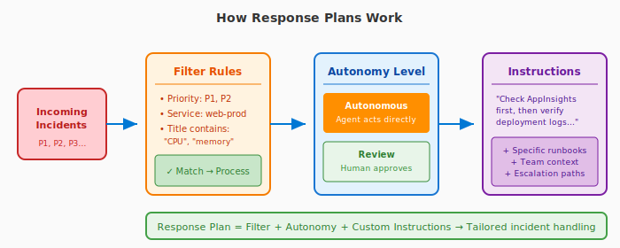
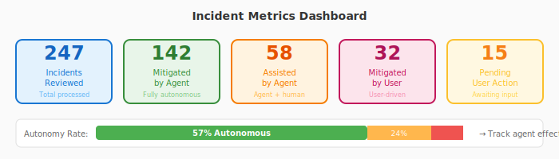

# Incident platforms in Azure SRE Agent

An incident platform is the system that tells your agent when something goes wrong. By connecting your incident platform, your agent can receive alerts, investigate issues, and take action automatically, without waiting for someone to start a chat.

:::image type="content" source="media/incident-platforms/incident-platform-flow.svg" alt-text="Flow chart showing incident platform sending alerts through response plans to agent investigation and actions.":::

Without an incident platform, your agent is reactive: users ask questions and it investigates on demand. With one connected, your agent becomes proactive: it picks up incidents the moment they fire and starts working immediately.

## Supported platforms

| Platform | What it provides |
|--|--|
| [Azure Monitor](azure-monitor-alerts.md) | No credentials needed. Connect in the wizard, and alerts from your managed resource groups flow automatically with recurring alerts merged into one thread. |
| [PagerDuty](pagerduty-incidents.md) | Incident alerting and on-call management with API-based integration |
| [ServiceNow](servicenow-incidents.md) | Enterprise IT service management integration |

Only one incident platform can be active at a time. Switching to a different platform disconnects the current one.

## What connecting an incident platform enables

Once connected, your agent gains these capabilities:

### Automatic incident reception

Incidents flow to your agent the moment they're created in your platform. No one needs to copy and paste alerts or manually start an investigation. The agent picks up incidents automatically.

### Rich incident cards

Incoming incidents from all supported platforms, including PagerDuty, ServiceNow, and Azure Monitor, display as **rich cards** in the chat interface. Each card shows:

| Field | Details |
|-------|---------|
| **Severity badge** | Color-coded by priority (for example, P1/Sev0 = red, P2/Sev1 = orange) |
| **Timestamp** | When the incident fired |
| **Title** | Incident title with platform prefix |
| **Status** | Current status (for example, Triggered, Acknowledged) |
| **Description** | Incident summary |
| **Response plan** | Link to the response plan handling the incident (if configured) |
| **View Details** | Link to the incident in its source platform |

Rich cards replace the plain-text incident notifications used previously, making it easier to scan incident details at a glance.

### Incident interaction

Your agent can read and write back to the incident. These tools are available automatically when the corresponding platform is connected, with no additional setup needed.

| Platform | Read capabilities | Write capabilities |
|--|--|--|
| **Azure Monitor** | Alert details, severity, affected resources | Acknowledge alerts, close alerts |
| [PagerDuty](pagerduty-incidents.md) | Incident details, diagnostics | Acknowledge, resolve, add notes |
| [ServiceNow](servicenow-incidents.md) | Incident details | Post discussion entries, acknowledge, resolve |

### Response plans

Response plans define *what your agent does* when specific types of incidents arrive. You configure rules based on incident severity, title patterns, or other criteria, and the agent follows the plan automatically.

Learn more: [Incident response plans](incident-response-plans.md)

A response plan can:
- Run specific investigation steps
- Use particular connectors and tools
- Operate at a defined autonomy level (from "gather info only" to "take corrective action")
- Retry investigation automatically (up to a configurable limit) before escalating to a human

Response plans turn your agent from a general-purpose assistant into an incident responder with defined procedures for known incident types.

#### Quickstart response plan

When you connect an incident platform, you can enable **Quickstart response plan** to automatically create a default response plan. This gets you started immediately:

| Platform | Default plan handles | Autonomy level |
|----------|---------------------|----------------|
| **Azure Monitor** | Sev0, Sev1, Sev2 alerts | Autonomous |
| **PagerDuty** | P1 incidents | Autonomous |

Azure Monitor supports all severity levels from Sev0 to Sev4. The quickstart plan targets the highest-priority alerts by default. You can customize it to include additional severities or create separate plans for lower-priority alerts.

The quickstart plan creates a response plan named `quickstart_handler` that:
- Matches incidents by priority/severity
- Covers all impacted services
- Runs in fully autonomous mode
- Can be customized or disabled later

You can customize this default or create additional response plans with different filters and autonomy levels.

### Track incident value

The **Monitor → Incident metrics** section shows how your agent handles incidents over time.

Learn more: [Track incident value](track-incident-value.md)

| Metric | What it shows |
|--------|--------------|
| **Incidents reviewed** | Total incidents the agent processes |
| **Mitigated by agent** | Incidents the agent resolves on its own |
| **Assisted by agent** | Incidents where the agent helps and the user finishes the resolution |
| **Mitigated by user** | Incidents the user resolves with information the agent provides |
| **Pending user action** | Incidents waiting for human input |

Use these metrics to understand your agent's effectiveness and identify response plans that might need tuning.

## Incident platforms vs. connectors

These concepts work together:

| | Incident platforms | Connectors |
|---|---|---|
| **Purpose** | Where alerts come from | Data and actions agent can use |
| **Configured in** | Builder → Incident Platform | Builder → Connectors |
| **Direction** | Inbound (incidents flow to agent) | Outbound (agent reaches out to systems) |
| **Example** | PagerDuty sends an alert → agent investigates | Agent queries Kusto → finds root cause |

Your agent uses both: the incident platform *triggers* the investigation, and connectors provide the *tools* to investigate.

## Related

| Resource | Why it matters |
|----------|-------------------|
| [Tutorial: Set up response plans](response-plan.md) | Step-by-step guide to create your first response plan |
| [Incident response plans](incident-response-plans.md) | How response plans route incidents to custom agents |
| [Automate incident response](incident-response.md) | End-to-end incident automation capabilities |
| [Track incident value](track-incident-value.md) | Measure your agent's incident resolution impact |
| [Monitor agent usage](monitor-agent-usage.md) | Track usage, session insights, and agent activity |
| [PagerDuty](pagerduty-incidents.md) | PagerDuty-specific setup and capabilities |
| [ServiceNow](servicenow-incidents.md) | ServiceNow-specific setup and capabilities |
| [Azure Monitor alerts](azure-monitor-alerts.md) | Azure Monitor alerting, recurring alert merge, and severity mapping |
| [Connectors](connectors.md) | How connectors provide tools for investigation |
