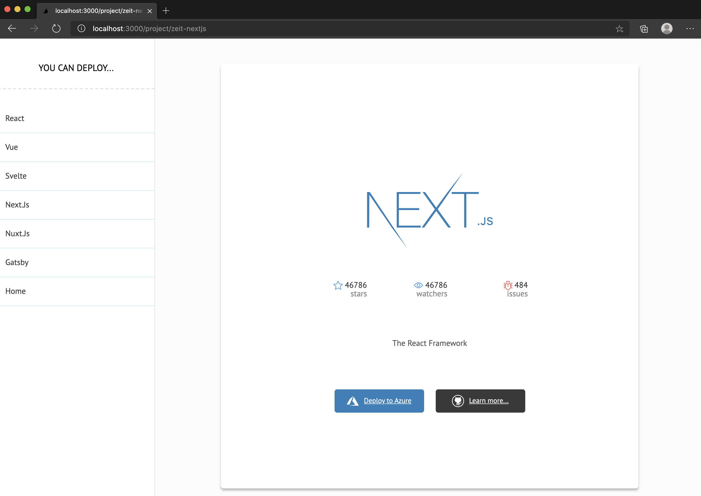
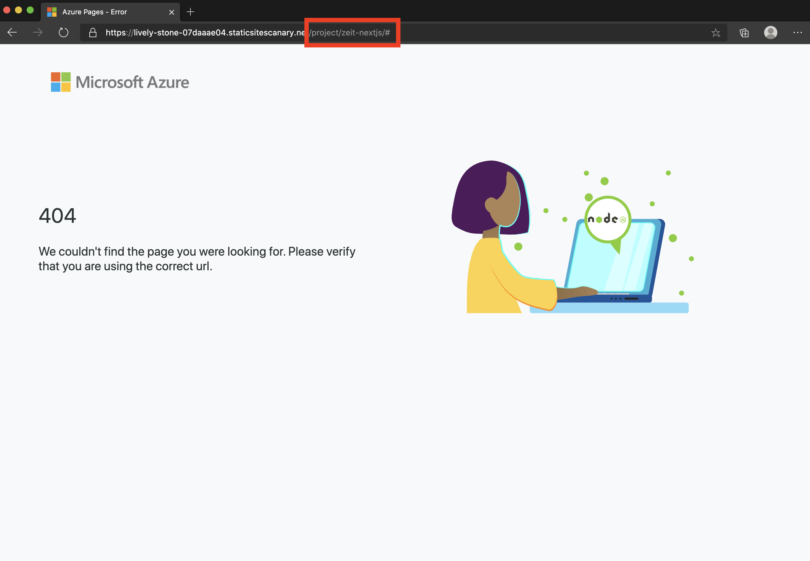
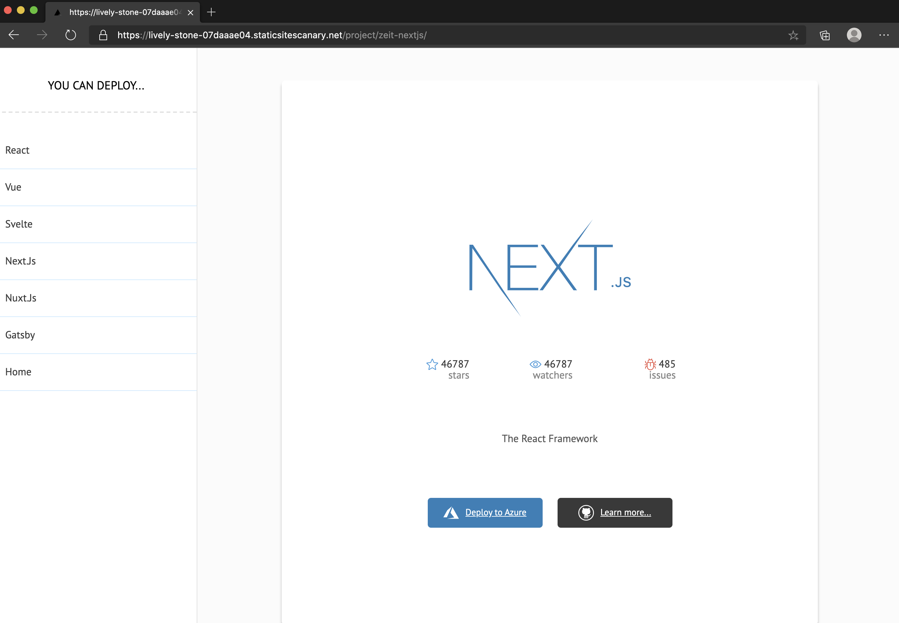

# Deploy server-rendered Next.js websites on App Service Static Apps

In this tutorial, you will learn how to deploy a [Next.js](https://nextjs.org) generated static website to [Azure App Service Static Apps](overview.md). In the end, you will learn how to set up, configure, and deploy a Next.js app while putting into consideration one of the most prominent challenges encountered when generating static pages with Next.js

## Prerequisites

- An Azure account with an active subscription. [Create an account for free](https://azure.microsoft.com/free/).
- A GitHub account. [Create an account for free](https://github.com/join).
- [Node.js](https://nodejs.org) installed.

## Setup a Next.js App

You can set up a new Next.js project using `create-next-app`. Instead of a new project, let's clone a repository that is set up to demonstrate an edge case when deploying a Next.js app with dynamic routes as a static site.

1. Clone starter repository:

   ```bash
   git clone https://github.com/christiannwamba/nextjs-static-websites-starter
   ```

1. Navigate to the newly cloned Next.js app:

   ```bash
   cd nextjs-static-websites-starter
   ```

1. Install dependencies:

    ```bash
    npm install
    ```

1. Start Next.js app in development:

    ```bash
    npm run dev
    ```

You should see the following website open in your preferred browser:


When you click on a framework/library, you should see a details page about the selected item:



## Generate a static website from Next.js build

When you build a Next.js site using `npm run build`, it only builds the app to be served like a regular web app, not a static site. Here is how to generate a static site from the build:

1. Configure static routes -- create a _next.config.js_ file at the root of your project and add the following route config:

    ```javascript
    module.exports = {
      exportTrailingSlash: true,
      exportPathMap: function() {
        return {
          '/': { page: '/' }
        };
      }
    };
    ```
    
  This configuration will map `/` to the Next.js page that is served for `/`, and that is the _pages/index.js_ page file.

1. Update the _package.json_'s build script to also generate a static site after building, using the `next export` command:

    ```json
    "scripts": {
      "dev": "next dev",
      "build": "next build && next export",
    },
    ```

    App Service Static Apps will run the `build` script every time you push a commit.

1. Generate a static site:

    ```bash
    npm run build
    ```

    The static site will be generated and copied into an _out_ folder at the root of your working directory.

    > [!NOTE]
    > This folder is ignored in _.gitignore_ because it should be generated by CI/CD when you deploy.

## Push your static website to Github

App Service Static Apps will deploy your app from a Github repository and it will keep doing so for every pushed commit. Set up a repository:

1. Initialize a git repo

    ```bash
    # Remove existing .git
    rm -rf .git
    # Initialize git
    git init
    # Add all files
    git add .
    # Commit changes
    git commit -m "initial commit"
    ```

1. Create a blank GitHub repo (don't create a README) from [https://github.com/new](https://github.com/new) and name it whatever you like eg **nextjs-static-website**.

1. Add the GitHub repo as a remote to your local repo.
    
    ```bash
    git remote add origin https://github.com/<YOUR_USER_NAME>/<YOUR_REPO_NAME>
    ```

1. Push your local repo up to GitHub.

    ```bash
    git push --upstream origin master
    ```

## Deploy your static website

The following steps show how to create a new static site app and deploy it to a production environment.

### Create Azure App Service Static App

1. Navigate to the [Azure Portal](https://portal.azure.com).
1. Click **Create a Resource** then search for **Static App** and select it.

  [Image of Static App]

1. Select a subscription from the *Subscription* dropdown list or use the default one.
1. Click the **New** link below the *Resource group* dropdown. In *New resource group name*, type **nextjsstaticsite** and click **OK**
1. Provide a globally unique name for your app in the **Name** text box. Valid characters include `a-z`, `A-Z`, `0-9` and `-`. This value is used as the URL prefix for your static app in the format of `https://<APP_NAME>.....`
1. In the *Region* dropdown, choose a region closest to you.
1. Select **Basic** from the SKU dropdown.

  [Image of static app create form]

### Add a Github repository

Azure App Service Static App needs access to the repository where your Next.js app lives. It will automatically deploy every commit if it has access:

1. Click the **Sign in with Github button**
1. Select the **Organization** under which you created the repo for your Next.js project. It can also be your Github username.
1. Find the name of the repository you created earlier and select it.
1. Choose **master** as the branch from the *Branch* dropdown.

  [Image of new repo form]

### Configure the build process

There are few things that Azure App Service Static App can assume -- things like automatically installing npm modules and running `npm run build`. There are also few you have to be explicit about, like what folder will the static app be copied to after build so the static site can be served from there.

1. Click on the **Build** tab to configure the static output folder.

  [Image highlighting the Build tab]

1. Type **out** in the *App artifact location* text box.

### Review and create

1. Click the **Review + Create** button to verify the details are all correct.
1. Click **Create** to start the creation of the resource and also provision a Github Action for deployment.
1. Once the deployment is completed, click **Go to resource**
1. On the resource screen, click the *URL* link to open your deployed application. 

## How to handle dynamic routes

Head to your newly deployed site and click on one of the frameworks/libraries. Instead of getting a details page, this time, you get a 404 error page:



The reason for this is, when we generated a static site with Next.js, we only did so for the home page:

```javascript
module.exports = {
  exportTrailingSlash: true,
  exportPathMap: function() {
  return {
    '/': { page: '/' }
  };
  }
};
```

## Generate static pages from dynamic routes

1. Update the _next.config.js_ file so that Next.js uses a list of all available data to generate static pages for each framework/library:

  ```javascript
  const data = require('./utils/projectsData');

  module.exports = {
    exportTrailingSlash: true,
    exportPathMap: async function () {
    const { projects } = data;
    const paths = {
      '/': { page: '/' },
    };

    projects.forEach((project) => {
      paths[`/project/${project.slug}`] = {
      page: '/project/[path]',
      query: { path: project.slug },
      };
    });

    return paths;
    },
  };
  ```

  > [!NOTE]
  > `exportPathMap` is an async function, so you can make a request to an API in this function and use the returned list to generate the paths.

1. Push the new changes to your GitHub repository and wait for a few minutes while GitHub Actions builds your site again. After the build, the 404 error will be gone:

  

## Summary

In this *how to*, you created a Next.js static website with dynamic routes and deployed it to App Service Static Site using Github Actions.

## Next Steps
> [!div class="nextstepaction"]
> [Set up a custom domain in app service static apps](custom-domain.md)