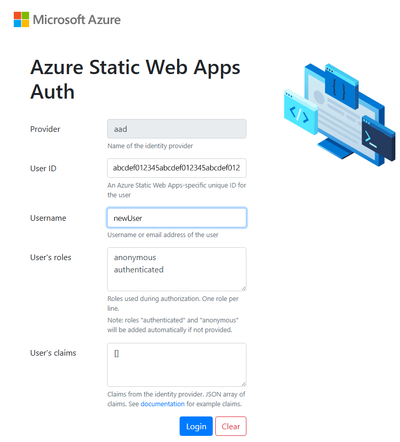
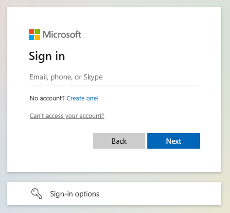

# Add authentication to your static site in Azure Static Web Apps

This article is part two in a series that show you how to deploy your first site to Azure Static Web Apps. Previously, you created and deployed a static site with the [web framework](./deploy-web-framework.md) of your choice.

In this article, you add authentication to your site and run the site locally before deploying to the cloud.

## Prerequisites

This tutorial continues from the previous tutorial, and has the same [prerequisites](deploy-web-framework.md#prerequisites).

## Authentication and authorization

Azure Static Web Apps makes it easy to use common authentication providers like Microsoft Entra and Google without writing security-related code.

> [!NOTE]
> You can optionally [register a custom provider and assign custom roles](./authentication-custom.md) for more fine-grained control when using backend APIs.

In this article, you configure your site to use Microsoft Entra ID for authentication.

## Add authentication

In the last article, you created a `staticwebapp.config.json` file. This file [controls many features](./configuration.md) for Azure Static Web Apps, including authentication.

1. Update the `staticwebapp.config.json` to match the following configuration.

    ```json
    {
      "navigationFallback": {
        "rewrite": "/index.html"
      },
      "routes": [
        {
          "route": "/*",
          "allowedRoles": [ "authenticated" ]
        }
      ],
      "responseOverrides": {
        "401": {
          "statusCode": 302,
          "redirect": "/.auth/login/aad"
        }
      }
    }
    ```

    The `routes` section allows you to restrict access to named roles. There are two predefined roles: `authenticated` and `anonymous`. If the connected user doesn't have an allowed role, the server returns a "401 Unauthorized" response.

    The values in the `responseOverrides` section configure your site so that instead of an unauthenticated user seeing a server error, their browser is redirected to the sign-in page instead.

1. Run the site locally.

    To launch the site locally, run the [Static Web Apps CLI](https://azure.github.io/static-web-apps-cli) `start` command.

    ```bash
    npx swa start
    ```

    This command starts the Azure Static Web Apps emulator on `http://localhost:4280`.

    This URL is shown in your terminal window after the service starts up.

1. Select the URL to go to the site.

    Once you open the site in your browser, the local authentication sign in page is displayed.

    

    The local authentication sign in page provides an emulation of the real authentication experience without the need for external services. You can create a user ID and select which roles you'd like to apply to the user from this screen.

1. Enter a username, then select **Login**.

    Once you authenticate, your site is displayed.

## Deploy the site to Azure

Deploy your site in the same way as you did in the last tutorial.

1. Build your site:

    ```bash
    npx swa build
    ```

1. Deploy your site to the static web app:

    ```bash
    npx swa deploy --app-name swa-demo-site
    ```

    The URL for your site is displayed once the deployment is finished. Select the site URL to open the site in the browser. The standard Microsoft Entra ID sign in page is displayed:

    

    Sign in with your Microsoft account.

[!INCLUDE [Clean up resources](../../includes/static-web-apps/quickstart-direct-deploy-clean-up-resources.md)]

## Related content

* [Authentication and authorization](./authentication-authorization.yml)
* [Custom authentication](./authentication-custom.md)
