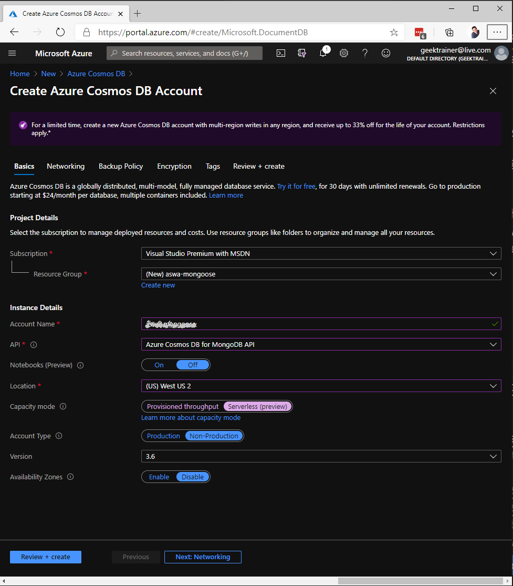
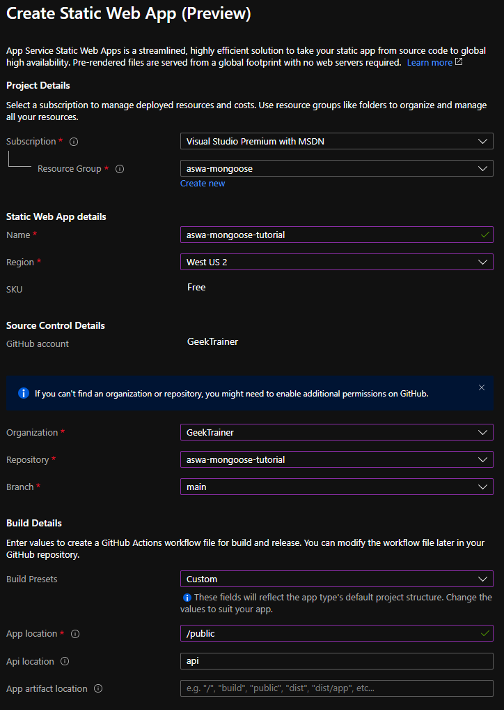

# Tutorial: Access Cosmos DB's API for MongoDB with Mongoose and Azure Static Web Apps

[Mongoose](https://mongoosejs.com/) is the most popular ODM (Object Document Mapping) client for Node.js. Mongoose allows you to design your data structure and enforce validation, and provides all the tooling necessary to interact with any database which supports the Mongoose API. [Cosmos DB](https://docs.microsoft.com/azure/cosmos-db/mongodb-introduction?WT.mc_id=javascript-11262-chrhar) can be used as a back-end server for Mongoose as it supports the necessary APIs, and the Azure Functions running in Azure Static Web Apps can run Mongoose. Let's explore how to bring these services together.

In this tutorial, you learn how to:

> [!div class="checklist"]
> - Create a Cosmos DB serverless account
> - Create Azure Static Web Apps
> - Update application settings to store the connection string

If you don’t have an Azure subscription, create a [free trial account](https://azure.microsoft.com/free/).

## Prerequisites

- An [Azure account](https://azure.microsoft.com/free/)
- A [GitHub account](https://github.com/join)

## Sign in to Azure

Sign in to the [Azure portal](https://portal.azure.com).

## Create a Cosmos DB serverless database

We are going to start by creating a [Cosmos DB serverless](https://docs.microsoft.com/azure/cosmos-db/serverless) account. By using a serverless account we only pay for the resources we use, and avoid needing to create a full infrastructure.

1. Navigate to [https://portal.azure.com](https://portal.azure.com)
2. Click **Create a resource**
3. Enter **Azure Cosmos DB** in the search dialog
4. Click **Azure Cosmos DB**
5. Click **Create**
6. Configure your Azure Cosmos DB Account with the following information
    - Subscription: Choose the subscription you wish to use
    - Resource: Click **Create new**, and set the name to **aswa-mongoose**
    - Account name: A unique value is required
    - API: **Azure Cosmos DB for MongoDB API**
    - Notebooks (Preview): **Off**
    - Location: **West US 2**
    - Capacity mode: **Serverless (preview)**
    - Version: **3.6**
    - Availability Zones: **Disable**
    
7. Click **Review + create**
8. Click **Create**

The creation process will take a few minutes. We're going to focus on creating our Azure Static Web App, and return to the database in a little while.

## Create Azure Static Web App

With our database being created, let's create our Azure Static Web App. We will generate a new repository from a template, and create an Azure Static Web App to use the repository for deployment.

1. Navigate to the [starter template](https://github.com/login?return_to=/GeekTrainer/aswa-mongoose/generate)
2. Choose the **owner** (if using an organization other than your main account)
3. Name your repository **aswa-mongoose-tutorial**
4. Click **Create repository from template**
5. Return to the [Azure portal](https://portal.azure.com)
6. Click **Create a resource**
7. Type **static web apps** in the search box
8. Select **Static Web App (preview)**
9. Click **Create**
10. Configure your Azure Static Web App with the following information
    - Subscription: Choose the same subscription as before
    - Resource group: Select **aswa-mongoose**
    - Name: **aswa-mongoose-tutorial**
    - Region: **West US 2**
    - Click **Sign in with GitHub**
    - Click **Authorize** if prompted to allow Azure Static Web Apps to create the GitHub Action to enable deployment
    - Organization: Your account name
    - Repository: **aswa-mongoose-tutorial**
    - Branch: **main**
    - Build presets: Choose **Custom**
    - App location: **/public**
    - Api location: **api**
    - App artifact location: *leave blank*
    
11. Click **Review and create**
12. Click **Create**
13. In a few moments your web resource will be created

## Configure database connection string

In order to allow our application to communicate with our database we need to set the connection string. We do this by creating an Application Setting, which is then accessed in code like an environmental variable using `process.env` in Node.js.

1. Click **Home** in the upper left corner of the Azure portal (or navigate back to [https://portal.azure.com](https://portal.azure.com))
2. Click **Resource groups**
3. Click **aswa-mongoose**
4. Click the name of your database account - it will have a type of **Azure Cosmos DB Account**
5. Under **Settings** click **Connection String**
6. Copy the connection string listed under **PRIMARY CONNECTION STRING**
7. In the breadcrumbs, click **aswa-mongoose**
8. Click **aswa-mongoose-tutorial** to return to the website we created
9. Under **Settings** click **Configuration**
10. Click **Add** and create a new Application setting with the following values
    - Name: **CONNECTION_STRING**
    - Value: Paste the connection string you copied earlier
11. Click **OK**
12. Click **Save**

## Navigate to your site

With our database created, our website deployed and created, we can now explore the site!

1. Click **Overview**
2. Click the URL displayed in the upper right (it will look similar to **https://calm-pond-05cb73a1e.azurestaticapps.net/**)
3. Your website is displayed!
4. Create a new task by typing in a title and clicking **Add task**
5. Confirm the task is displayed (it may take a moment)
6. Mark the task as complete by clicking the checkbox
7. Refresh the page to confirm a database is being used

## Clean up resources

If you're not going to continue to use this application, delete
the resource group with the following steps:

1. Return to the [Azure portal](https://portal.azure.com)
2. Click **Resource groups**
3. Click **aswa-mongoose**
4. Click **Delete resource group**
5. Type **aswa-mongoose** into the textbox
6. Click **Delete**

## Next steps

Advance to the next article to learn how to configure local development...
> [!div class="nextstepaction"]
> [Setup local development](https://docs.microsoft.com/azure/static-web-apps/local-development?WT.mc_id=javascript-11262-chrhar)
