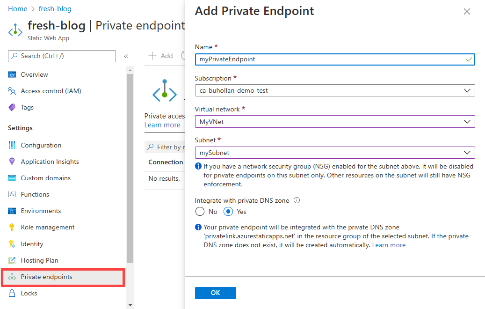

# Configure private endpoint in Azure Static Web Apps

You can use a private endpoint (also called private endpoint) to restrict access to your static web app so that it is only accessible from your private network. private endpoints are enabled by using an address from your Azure VNet address space. Network traffic from your private network travels exclusively to your static app over the VNet, so your application is never exposed to the public internet.

## How it works

You'll need an Azure VNet in order to put your application behind a private endpoint.

Azure VNet's are a network just like you might have in a traditional data center, but resources within the VNet talk to each other securely on the Microsoft backbone network.

You then create a private endpoint within that VNet and assign it to your static app. The private endpoint uses a private IP address from your VNet, effectively bringing your application into your VNet. Your application is then no longer available from the public internet, and is only accessible from machines within your Azure VNet.

> [!WARNING]
> Placing your application behind a private endpoint means your app is only available in the region where your VNet is located. As a result, your application is no longer available across multiple points of presence.

## Prerequisites

- An Azure account with an active subscription.
  - [Create an account for free](https://azure.microsoft.com/free/?WT.mc_id=A261C142F).
- An application deployed with [Azure Static Web Apps](https://docs.microsoft.com/azure/static-web-apps/get-started-portal?tabs=vanilla-javascript) that uses the Standard hosting plan.

## Create a virtual network and bastion host

In this section, you create a virtual network, subnet, and bastion host.

The bastion host is used to connect securely to virtual machines within a virtual network. You'll have the chance to create a virtual machine later in this article to test your private endpoint.

1. Open the [Azure portal](https://portal.azure.com).

1. Search for **Virtual network** in the search box.

1. Select **Virtual Network** from the search results.

1. Select the "Create" button.

1. In **Create virtual network**, enter or select this information in the **Basics** tab:

   | **Setting**          | **Value**                            |
   | -------------------- | ------------------------------------ |
   | **Project Details**  |                                      |
   | Subscription         | Select your Azure subscription       |
   | Resource Group       | Enter **CreatePrivateEndpointQS-rg** |
   | **Instance details** |                                      |
   | Name                 | Enter **myVNet**                     |
   | Region               | Select **West Europe**.              |

1. Select the **IP Addresses** tab or select the **Next: IP Addresses** button at the bottom of the page.

1. In the **IP Addresses** tab, enter this information:

   | Setting            | Value                 |
   | ------------------ | --------------------- |
   | IPv4 address space | Enter **10.1.0.0/16** |

1. Under **Subnet name**, select the word **default**.

1. In **Edit subnet**, enter this information:

   | Setting              | Value                 |
   | -------------------- | --------------------- |
   | Subnet name          | Enter **mySubnet**    |
   | Subnet address range | Enter **10.1.0.0/24** |

1. Select **Save**.

1. Select the **Security** tab.

1. Under **BastionHost**, select **Enable**. Enter this information:

   | Setting                          | Value                                                                                  |
   | -------------------------------- | -------------------------------------------------------------------------------------- |
   | Bastion name                     | Enter **myBastionHost**                                                                |
   | AzureBastionSubnet address space | Enter **10.1.1.0/24**                                                                  |
   | Public IP Address                | Select **Create new**.   For **Name**, enter **myBastionIP**.   Select **OK**. |

1. Select the **Review + create** tab or select the **Review + create** button.

1. Select **Create**.

## Create a private endpoint

In this section, you create a private endpoint for your static web app.

> [!IMPORTANT]
> Your static web app must be deployed on the Standard hosting plan to use Private endpoints. You can change the hosting plan from the "Hosting Plan" option in the side menu.

1. In the portal, open your static web app.

1. Select the "Private Endpoint" from the side menu.

1. In the "Add Private Endpoint" dialog, enter this information:

   | Setting                         | Value                         |
   | ------------------------------- | ----------------------------- |
   | Name                            | Enter **myPrivateEndpoint**.  |
   | Subscription                    | Select your subscription.     |
   | Virtual Network                 | Select **MyVNet**.            |
   | Subnet                          | Select **MySubnet**.          |
   | Integrate with private DNS zone | Leave the default of **Yes**. |

   

1. Select **Ok**.

## Testing your private endpoint

Since your application is no longer publicly available, the only way to access it is from inside of your virtual network. For testing, you can setup a virtual machine inside of your virtual network.

1. [Create a virtual machine in your virtual network](../private-link/create-private-endpoint-portal.md#create-a-virtual-machine)
1. [Test connectivity to your private endpoint](../private-link/create-private-endpoint-portal.md#test-connectivity-to-private-endpoint)

## Next steps

> [!div class="nextstepaction"]
> [Networking options](./networking-options.md)
