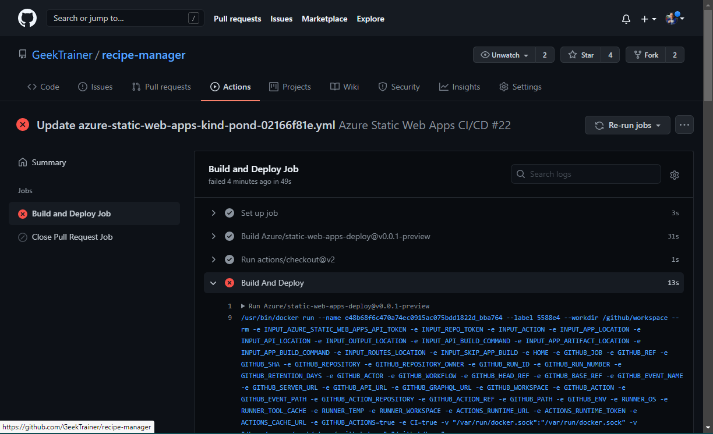
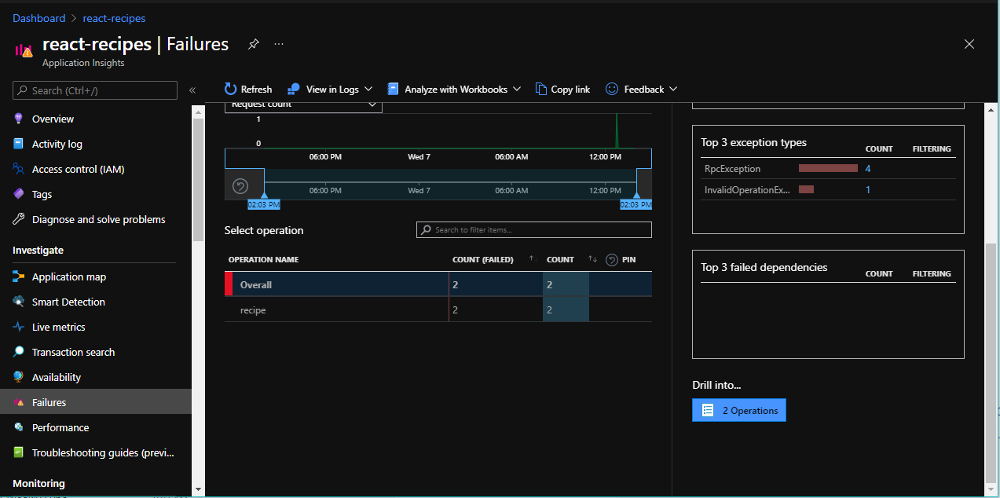
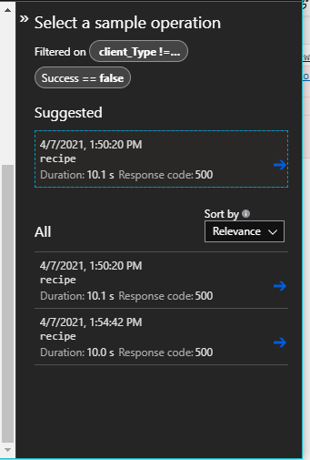
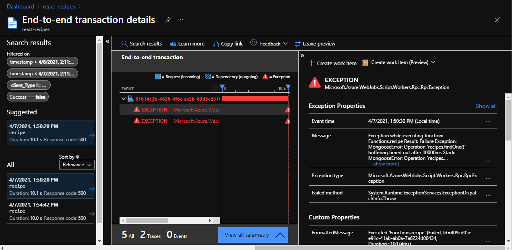

# Troubleshooting deployment and runtime errors

This article features step-by-step guides to troubleshooting deployment and other issues for your static web app.

## Retrieve deployment error messages

The Azure Static Web Apps deployment workflow uses the Node.js [Oryx build process](https://github.com/microsoft/Oryx/blob/master/doc/runtimes/nodejs.md#build) that automatically runs the following commands:

```bash
npm install
npm run build # if specified in package.json
npm run build:azure # if specified in package.json
```

Any errors raised by this process are logged in the GitHub workflow run.

1. Go to the GitHub repository for your static web app.
1. Select **Actions**.

    > [!NOTE]
    > Any failed workflow runs display with a red *X* rather than a green check mark.

2. Select the link for the workflow run you wish to validate.
3. Select **Build and Deploy Job** to open the details of the deployment
4. Select **Build And Deploy** to display the log

    

5. Review the logs and any error messages.

    > [!NOTE]
    > Some warning error messages may display in red, such as notes about *.oryx_prod_node_modules* and *workspace*. These are part of the normal deployment process.

If any packages fail to install or other issues are raised you'll see the original error messages here, as if you ran the `npm` commands locally.

### Confirm folder configuration

Azure Static Web Apps needs to know which folders to use to host your application. This configuration is confirmed by the build process at the end of the workflow. Any errors are logged during the validation steps.

If you see one of the following error messages in the error log, it's an indication the folder configuration for your workflow is incorrect.

| Error message | Description |
| --- | --- |
|App Directory Location: '/*folder*' is invalid. Could not detect this directory. | Verify your workflow reflects your repository structure. |
| The app build failed to produce artifact folder: '*folder*'. | Ensure the `folder` property is configured correctly in your workflow file. |
| Either no Api directory was specified, or the specified directory was not found. | Azure Functions isn't created, as the workflow doesn't define a value for the `api` folder. |

There are three folder locations specified in the workflow. Ensure these settings match both your project and any tools that transform your source code before deployment.

| Configuration setting | Description |
| --- | --- |
| `app_location` | The root location of the source code to be deployed. This setting is typically */* or the location of the JavaScript and HTML for your project. |
| `output_location` | Name of the folder created by any build process from a bundler such as webpack. This folder both needs to be created by the build process, and a subdirectory under the `app_location` |
| `api_location` |The root location of your Azure Functions application hosted by Azure Static Web Apps. This points to the root folder of all Azure Functions for your project, typically *api*. |

> [!NOTE]
> Error messages generated by an incorrect `api_location` configuration may still build successfully, as Azure Static Web Apps does not require serverless code.

## Review server errors

Use [Application Insights](../azure-monitor/app/app-insights-overview.md) to find runtime error messages. If you do not already have an instance created, refer to [Monitoring Azure Static Web Apps](monitor.md). Application Insights logs the full error message and stack trace generated by each error.

> [!NOTE]
> You can only view error messages that are generated after Application Insights is installed.

1. Inside the Azure portal, open the **Resource Group** associated with your static web app.
1. Select the Application Insights instance, which has the same name as your static web app (if created using the steps above).
1. Under *Investigate*, select **Failures**.
1. Scroll down to *Drill into* on the right.
2. In the lower right corner, under *Drill into*, a button displays the number of recently failed operations.

    

3. Select **x Operations** to open a panel displaying the recent failed operations.

    

4. Explore an error by selecting one from the list.

    

## Environment variables

Many web applications use environment variables for storing sensitive or environment-specific settings. Azure Static Web Apps supports environment variables through Application Settings.

Application Settings are key/value pairs that set environment variables for your application. Variables are available to your application using the same syntax typical for accessing environment variables.

When deploying, double check any environment variables are set as Application Settings.

1. Open your static web app in the Azure portal.
1. Select **Configuration**. The *Configuration* screen displays the list of all Application Settings.

    

Use the following steps to add a new variable.

1. Select **Add**.
1. Set the **Name**.
1. Set the **Value**.
1. Select **OK**.
1. Select **Save**.
